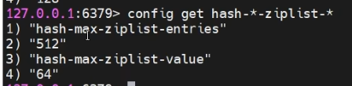
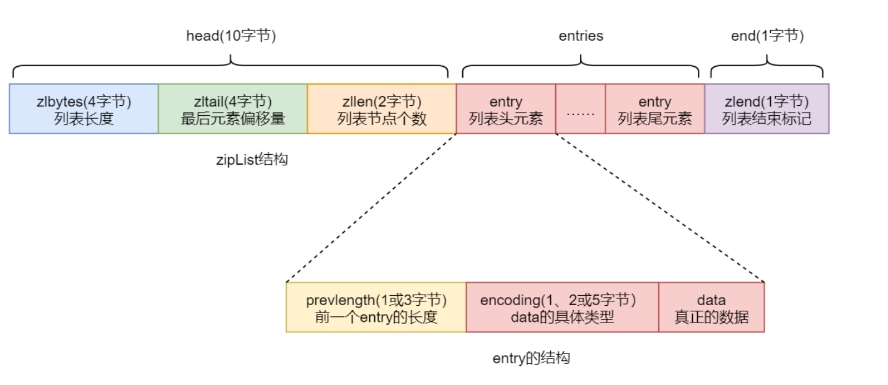
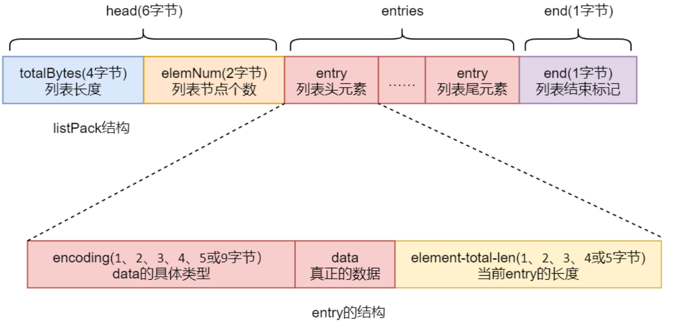
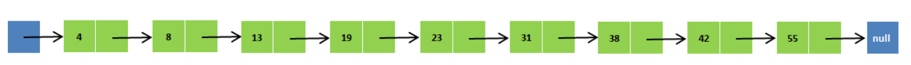
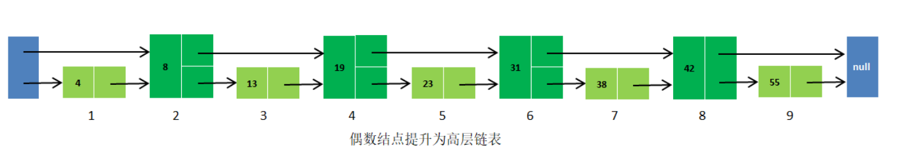
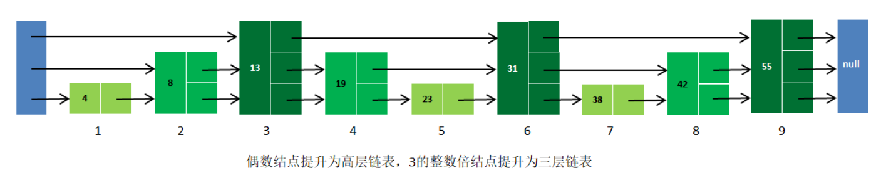
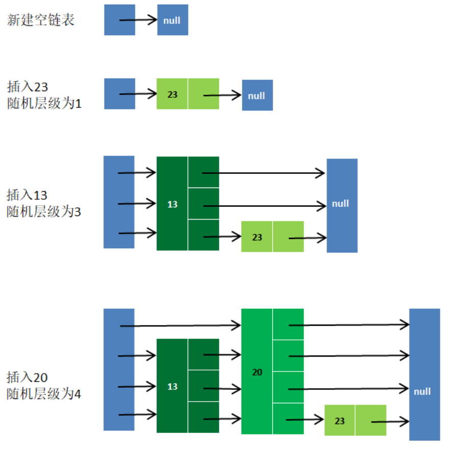
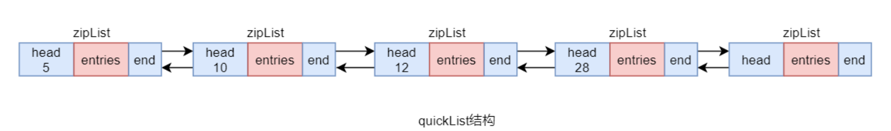

## 一、概述

​	**Redis 中对于 Set 类型的底层实现，直接采用了 hashTable**。但对于 **Hash、ZSet、List 集合的底层实现进行了特殊的设计**，使其保证了 Redis 的高性能。

## 二、两种实现的选择

​	对于**Hash与ZSet集合**，其底层的**实现实际有两种：压缩列表zipList，与跳跃列表skipList**。这两种实现对于用户来说是透明的，但**用户写入不同的数据，系统会自动使用不同的实现**。只有**同时满足**以配置文件 redis.conf 中**相关集合元素数量阈值**与**元素大小阈值**两个条件，**使用的就是压缩列表 zipList**，只要有**一个条件不满足使用的就是跳跃列表 skipList**。例如，对于**ZSet 集合**中这两个条件如下：

- 集合元素个数小于 redis.conf 中 zset-max-ziplist-entries 属性的值，其默认值为 128
- 每个集合元素大小都小于 redis.conf 中 zset-max-ziplist-value 属性的值，其默认值为 64字节

而对于Hash集合这两个条件如下：

## 三、zipList

### 3.1 什么是 zipList

​	zipList，通常称为压缩列表，是一个经过**特殊编码**的用于**存储字符串或整数**的**顺序型数据结构**。其底层数据结构由三部分构成：head、entries 与 end。这三部分在内存上是连续存放的。

### 3.2  head

head 又由三部分构成：

- zlbytes：占 4 个字节，用于存放 **zipList 列表整体数据结构所占的字节数**，包括 zlbytes本身的长度。
- zltail：占 4 个字节，用于存放 **zipList 中最后一个 entry 在整个数据结构中的偏移量（字节）**。该数据的存在可以快速定位列表的尾 entry 位置，以方便操作。
- zllen：占 2 字节，用于**存放列表包含的 entry 个数**。由于其只有 16 位，所以 zipList 最多可以含有的 entry 个数为 2^16 -1 = 65535 个。

### 3.3 entries

​	entries 是真正的列表，由**很多的列表元素 entry 构成**。由于不同的元素类型、数值的不同，从而导致**每个 entry 的长度不同**。

​	每个 entry 由三部分构成：

- prevlength：该部分用于**记录上一个 entry 的长度**，以实现逆序遍历。**默认长度为 1 字节**，只要**上一个 entry 的长度<254 (255意味着全为1，与zlend冲突)字节，prevlength 就占 1 字节，否则其会自动扩展为 3 字节长度。**
- encoding：该部分用于**标志后面的 data 的具体类型**。如果 data 为整数类型，encoding固定长度为 1 字节。如果 data 为字符串类型，则 encoding 长度可能会是 1 字节、2 字节或 5 字节。data 字符串不同的长度，对应着不同的 encoding 长度。
- data：真正存储的数据。数据类型只能是整数类型或字符串类型。不同的数据占用的字节长度不同。

### 3.4 end

​	end 只包含一部分，称为 zlend。占 1 个字节，**值固定为 255，即二进制位为全 1**，表示一个 zipList 列表的结束。

## 四、listPack

​	对于 **ziplist**，实现复杂，为了逆序遍历，每个 entry 中包含前一个 entry 的长度，这样会**导致在 ziplist 中间修改或者插入 entry 时需要进行级联更新**。在高并发的写操作场景下会极度降低 Redis 的性能。为了实现更紧凑、更快的解析，更简单的实现，重写实现了 ziplist，并命名为 listPack。 

​	在 **Redis 7.0** 中，已经将 **zipList 全部替换为了 listPack**，但为了兼容性，在配置中也保留了 zipList 的相关属性

### 4.1 什么是 listPack

​	listPack 也是一个经过**特殊编码**的用于存储**字符串或整数**的**顺序型数据结构**。其底层数据结构也由三部分构成：head、entries 与 end，且这三部分在内存上也是连续存放的。

​	listPack与zipList的**重大区别在head与每个entry的结构上**，表示列表结束的end与zipList的 zlend 是相同的，占一个字节，且 8 位全为 1。

### 4.2  head

​	head 由两部分构成：

- totalBytes：占 4 个字节，用于存放 listPack **列表整体数据结构所占的字节数**，包括totalBytes 本身的长度。

- elemNum：占 2 字节，用于存放**列表包含的 entry 个数**。其意义与 zipList 中 zllen 的相同。

  

与 zipList 的 head 相比，**没有了记录最后一个 entry 偏移量的 zltail**。 

### 4.3  entries

​	entries 也是 listPack 中真正的列表，由很多的列表元素 entry 构成。由于不同的元素类型、数值的不同，从而导致每个 entry 的长度不同。但与 zipList 的 entry 结构相比，listPack的 entry 结构发生了较大变化。

​	其中**最大的变化就是没有了记录前一个 entry 长度的 prevlength**，而**增加了记录当前entry 长度的 element-total-len**。而这个改变仍然可以实现逆序遍历，但却避免了由于在列表中间修改或插入 entry 时引发的级联更新。

​	每个 entry 仍由三部分构成：

- encoding：该部分用于标志后面的 data 的具体类型。如果 data 为整数类型，encoding长度可能会是 1、2、3、4、5 或 9 字节。不同的字节长度，其标识位不同。如果 data为字符串类型，则 encoding 长度可能会是 1、2 或 5 字节。data 字符串不同的长度，对应着不同的 encoding 长度。
- data：真正存储的数据。数据类型只能是整数类型或字符串类型。不同的数据占用的字节长度不同。
- element-total-len：该部分用于记录当前 entry 的长度，用于实现逆序遍历。由于其特殊的记录方式，使其本身占有的字节数据可能会是 1、2、3、4 或 5 字节。

## 五、skipList

### 5.1 什么是 skipList

​	skipList，跳跃列表，简称跳表，是一种**随机化**的数据结构，**基于并联的链表**，实现简单，查找效率较高。简单来说跳表也是链表的一种，只不过它在链表的基础上增加了跳跃功能。也正是这个跳跃功能，使得在查找元素时，能够提供较高的效率。 

### 5.2  skipList 原理

#### 5.2.1 并联链表的原理

​	假设有一个带头尾结点的有序链表。

​	在该链表中，如果**要查找某个数据，需要从头开始逐个进行比较**，直到找到包含数据的那个节点，或者找到第一个比给定数据大的节点，或者找到最后尾结点，后两种都属于没有找到的情况。同样，当我们要插入新数据的时候，也要经历同样的查找过程，从而确定插入位置。

​	为了**提升查找效率**，**在偶数结点上增加一个指针，让其指向下一个偶数结点**。

​	这样**所有偶数结点就连成了一个新的链表（简称高层链表）**，当然，高层链表**包含的节点个数只是原来链表的一半**。此时**再想查找某个数据时，先沿着高层链表进行查找**。当**遇到第一个比待查数据大的节点**时，**立即从该大节点的前一个节点回到原链表中进行查找**。例如，若想插入一个数据 20，则先在（8，19，31，42）的链表中查找，找到第一个比 20 大的节点 31，然后再在高层链表中找到 31 节点的前一个节点 19，然后再在原链表中获取到其下一个节点值为 23。比 20 大，则将 20 插入到 19 节点与 23 节点之间。若插入的是 25，比节点23 大，则插入到 23 节点与 31 节点之间。

​	该方式明显可以减少比较次数，提高查找效率。如果链表元素较多，为了进一步提升查找效率，可以将原链表构建为三层链表，或再高层级链表。

​	**层级越高，查找效率就会越高。** 

#### 5.2.2 存在的问题

​	这种对链表分层级的方式从原理上看确实提升了查找效率，但在实际操作时就出现了问题：由于**固定序号的元素拥有固定层级**，所以**列表元素出现增加或删除的情况下，会导致列表整体元素层级大调整**，但这样势必会大大降低系统性能。例如，对于划分两级的链表，可以规定奇数结点为高层级链表，偶数结点为低层级链表。对于划分三级的链表，可以按照节点序号与 3 取模结果进行划分。**但如果插入了新的节点，或删除的原来的某些节点，那么定会按照原来的层级划分规则进行重新层级划分**，那么势必会大大降低系统性能。

**如果每个按照每个节点的序号进行固定的层级划分，那么在进行插入和删除操作的时候，从插入或删除的位置向后的所有后续节点都需要重新分配层级，大大降低系统性能。**

#### 5.2.3  算法优化

​	为了避免前面的问题，skipList 采用了**随机分配层级**方式。即在**确定了总层级后**，**每添加一个新的元素时会自动为其随机分配一个层级**。这种随机性就解决了节点序号与层级间的固定关系问题。

​	上图演示了**列表在生成过程中为每个元素随机分配层级的过程**。从这个 skiplist 的创建和插入过程可以看出，**每一个节点的层级数都是随机分配的**，而且**新插入一个节点不会影响到其它节点的层级数**。只需要修改插入节点前后的指针，而不需对很多节点都进行调整。这就降低了插入操作的复杂度。

​	skipList 指的就是除了最下面第 1 层链表之外，它会产生若干层稀疏的链表，这些链表里面的指针跳过了一些节点，并且越高层级的链表跳过的节点越多。**在查找数据的时先在高层级链表中进行查找，然后逐层降低，最终可能会降到第 1 层链表来精确地确定数据位置**。在这个过程中由于跳过了一些节点，从而加快了查找速度。

**跳表的增删改查，时间复杂度都是 Log(N)**

## 六、quickList

### 6.1 什么是 quickList

​	quickList，快速列表，**quickList 本身是一个双向无循环链表**，它的每一个节点都是一个zipList。**从Redis3.2版本开始，对于List的底层实现，使用quickList替代了zipList 和 linkedList**。zipList 与 linkedList 都存在有明显不足，而 quickList 则对它们进行了改进：吸取了 zipList 和 linkedList 的优点，避开了它们的不足。**quickList 本质上是 zipList 和 linkedList 的混合体**。其**将 linkedList 按段切分，每一段使用 zipList 来紧凑存储若干真正的数据元素，多个 zipList 之间使用双向指针串接起来**。当然，对于每个 zipList 中最多可存放多大容量的数据元素，在配置文件中通过 list-max-ziplist-size属性可以指定。

### 6.2 检索操作

​	为了更深入的理解 quickList 的工作原理，通过对检索、插入、删除等操作的实现分析来加深理解。

​	对于 List 元素的检索，都是以其索引 index 为依据的。**quickList 由一个个的 zipList 构成**，**每个 zipList 的 zllen 中记录的就是当前 zipList 中包含的 entry 的个数**，即包含的真正数据元素的个数。**根据要检索元素的 index，从 quickList 的头节点开始，逐个对 zipList 的 zllen 做 sum求和，直到找到第一个求和后 sum 大于 index 的 zipList，那么要检索的这个元素就在这个zipList 中。**

### 6.3 插入操作

​	由于 **zipList 是有大小限制的**，所以在 quickList 中插入一个元素在逻辑上相对就比较复杂一些。**假设要插入的元素的大小为 insertBytes**，而**查找到的插入位置所在的 zipList 当前的大小为 zlBytes**，那么具体可分为下面几种情况：

- 情况一：当 insertBytes + zlBytes <= list-max-ziplist-size 时，直接插入到 zipList 中相应位置即可

- 情况二：当 insertBytes + zlBytes > list-max-ziplist-size，且插入的位置位于该 zipList 的**首部位置**，此时需要查看该 zipList 的前一个 zipList 的大小 prev_zlBytes。 

  1. ​	若 insertBytes + prev_zlBytes<= list-max-ziplist-size 时，直接将元素插入到**前一个zipList 的尾部位置**即可

  2. ​	若 insertBytes + prev_zlBytes> list-max-ziplist-size 时，直接**将元素自己构建为一个新的 zipList，并连入 quickList 中** 

- 情况三：当 insertBytes + zlBytes > list-max-ziplist-size，且插入的位置位于该 zipList 的**尾部位置**，此时需要查看该 zipList 的后一个 zipList 的大小 next_zlBytes。 

  1. ​	若 insertBytes + next_zlBytes<= list-max-ziplist-size 时，直接将元素插入到**后一个zipList 的头部位置**即可

  2. ​	若 insertBytes + next_zlBytes> list-max-ziplist-size 时，直接**将元素自己构建为一个新的 zipList，并连入 quickList 中** 

- 情况四：当 insertBytes + zlBytes > list-max-ziplist-size，且插入的位置位于该 zipList 的**中间位置**，则将**当前 zipList 分割为两个 zipList 连接入 quickList 中**，然后将元素插入到分割后的**前面 zipList 的尾部位置**

### 6.4 删除操作

​	对于删除操作，只需要注意一点，在相应的 zipList 中删除元素后，该 zipList 中是否还有元素。**如果没有其它元素了，则将该 zipList 删除，将其前后两个 zipList 相连接。**

## 七、key 与 value 中元素的数量

​	前面讲述的 Redis 的各种特殊数据结构的设计，不仅极大提升了 Redis 的性能，并且还使得 Redis 可以支持的 key 的数量、集合 value 中可以支持的元素数量可以非常庞大。

- Redis 最多可以处理 2^32个 key（约 42 亿），并且在实践中经过测试，每个 Redis 实例至少可以处理 2.5 亿个 key。 
- 每个 Hash、List、Set、ZSet 集合都可以包含 2^32 个元素。