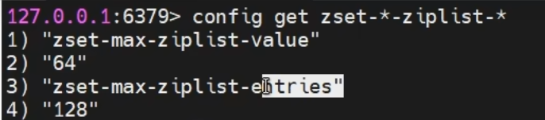

## 一、概述

​	**Redis 中对于 Set 类型的底层实现，直接采用了 hashTable**。但对于 **Hash、ZSet、List 集合的底层实现进行了特殊的设计**，使其保证了 Redis 的高性能。

## 二、两种实现的选择

​	对于**Hash与ZSet集合**，其底层的**实现实际有两种：压缩列表zipList，与跳跃列表skipList**。这两种实现对于用户来说是透明的，但**用户写入不同的数据，系统会自动使用不同的实现**。只有**同时满足**以配置文件 redis.conf 中**相关集合元素数量阈值**与**元素大小阈值**两个条件，**使用的就是压缩列表 zipList**，只要有**一个条件不满足使用的就是跳跃列表 skipList**。例如，对于**ZSet 集合**中这两个条件如下：

- 集合元素个数小于 redis.conf 中 zset-max-ziplist-entries 属性的值，其默认值为 128
- 每个集合元素大小都小于 redis.conf 中 zset-max-ziplist-value 属性的值，其默认值为 64字节

而对于Hash集合这两个条件如下：

## 三、zipList

### 3.1 什么是 zipList

​	zipList，通常称为压缩列表，是一个经过**特殊编码**的用于**存储字符串或整数**的**双向链表**。其底层数据结构由三部分构成：head、entries 与 end。这三部分在内存上是连续存放的。

### 3.2  head

head 又由三部分构成：

- zlbytes：占 4 个字节，用于存放 **zipList 列表整体数据结构所占的字节数**，包括 zlbytes本身的长度。
- zltail：占 4 个字节，用于存放 **zipList 中最后一个 entry 在整个数据结构中的偏移量（字节）**。该数据的存在可以快速定位列表的尾 entry 位置，以方便操作。
- zllen：占 2 字节，用于**存放列表包含的 entry 个数**。由于其只有 16 位，所以 zipList 最多可以含有的 entry 个数为 2^16 -1 = 65535 个。

### 3.3 entries

​	entries 是真正的列表，由**很多的列表元素 entry 构成**。由于不同的元素类型、数值的不同，从而导致**每个 entry 的长度不同**。

​	每个 entry 由三部分构成：

- prevlength：该部分用于**记录上一个 entry 的长度**，以实现逆序遍历。**默认长度为 1 字节**，只要**上一个 entry 的长度<254 (255意味着全为1，与zlend冲突)字节，prevlength 就占 1 字节，否则其会自动扩展为 3 字节长度。**
- encoding：该部分用于**标志后面的 data 的具体类型**。如果 data 为整数类型，encoding固定长度为 1 字节。如果 data 为字符串类型，则 encoding 长度可能会是 1 字节、2 字节或 5 字节。data 字符串不同的长度，对应着不同的 encoding 长度。
- data：真正存储的数据。数据类型只能是整数类型或字符串类型。不同的数据占用的字节长度不同。

### 3.4 end

​	end 只包含一部分，称为 zlend。占 1 个字节，**值固定为 255，即二进制位为全 1**，表示一个 zipList 列表的结束。

## 四、listPack

​	对于 **ziplist**，实现复杂，为了逆序遍历，每个 entry 中包含前一个 entry 的长度，这样会**导致在 ziplist 中间修改或者插入 entry 时需要进行级联更新**。在高并发的写操作场景下会极度降低 Redis 的性能。为了实现更紧凑、更快的解析，更简单的实现，重写实现了 ziplist，并命名为 listPack。 

​	在 **Redis 7.0** 中，已经将 **zipList 全部替换为了 listPack**，但为了兼容性，在配置中也保留了 zipList 的相关属性

### 4.1 什么是 listPack

​	listPack 也是一个经过**特殊编码**的用于存储**字符串或整数**的**双向链表**。其底层数据结构也由三部分构成：head、entries 与 end，且这三部分在内存上也是连续存放的。

​	listPack与zipList的**重大区别在head与每个entry的结构上**，表示列表结束的end与zipList的 zlend 是相同的，占一个字节，且 8 位全为 1。

### 4.2  head

​	head 由两部分构成：

- totalBytes：占 4 个字节，用于存放 listPack **列表整体数据结构所占的字节数**，包括totalBytes 本身的长度。

- elemNum：占 2 字节，用于存放**列表包含的 entry 个数**。其意义与 zipList 中 zllen 的相同。

  

与 zipList 的 head 相比，**没有了记录最后一个 entry 偏移量的 zltail**。 

### 4.3  entries

​	entries 也是 listPack 中真正的列表，由很多的列表元素 entry 构成。由于不同的元素类型、数值的不同，从而导致每个 entry 的长度不同。但与 zipList 的 entry 结构相比，listPack的 entry 结构发生了较大变化。

​	其中**最大的变化就是没有了记录前一个 entry 长度的 prevlength**，而**增加了记录当前entry 长度的 element-total-len**。而这个改变仍然可以实现逆序遍历，但却避免了由于在列表中间修改或插入 entry 时引发的级联更新。

​	每个 entry 仍由三部分构成：

- encoding：该部分用于标志后面的 data 的具体类型。如果 data 为整数类型，encoding长度可能会是 1、2、3、4、5 或 9 字节。不同的字节长度，其标识位不同。如果 data为字符串类型，则 encoding 长度可能会是 1、2 或 5 字节。data 字符串不同的长度，对应着不同的 encoding 长度。
- data：真正存储的数据。数据类型只能是整数类型或字符串类型。不同的数据占用的字节长度不同。
- element-total-len：该部分用于记录当前 entry 的长度，用于实现逆序遍历。由于其特殊的记录方式，使其本身占有的字节数据可能会是 1、2、3、4 或 5 字节。

## 五、skipList