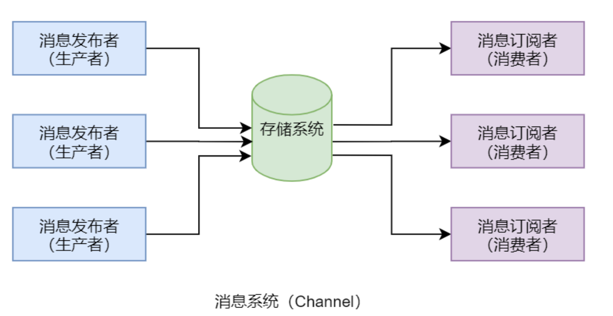

## 一、消息系统

​	发布/订阅，即 pub/sub，是一种消息通信模式：发布者也称为消息生产者，生产和发送消息到存储系统；订阅者也称为消息消费者，从存储系统接收和消费消息。这个存储系统可以是文件系统 FS、消息中间件 MQ、数据管理系统 DBMS，也可以是 Redis。**整个消息发布者、订阅者与存储系统称为消息系统。**

​	**消息系统中的订阅者订阅了某类消息后，只要存储系统中存在该类消息，其就可不断的接收并消费这些消息**。当**存储系统中没有该消息后，订阅者的接收、消费阻塞**。而当发布者将消息写入到存储系统后，会立即唤醒订阅者。当**存储系统放满时，不同的发布者具有不同的处理方式：有的会阻塞发布者的发布，等待可用的存储空间；有的则会将多余的消息丢失**。当然，不同的消息系统消息的发布/订阅方式也是不同的。例如 RocketMQ、Kafka 等消息中间件构成的消息系统中，发布/订阅的消息都是以主题 Topic 分类的。而 **Redis 构成的消息系统中，发布/订阅的消息都是以频道 Channel 分类的。**

## 二、发布订阅命令

### 2.1 subscribe

- 格式：`SUBSCRIBE channel (channel …)`
- 功能：Redis 客户端通过一个 subscribe 命令可以**同时订阅任意数量的频道**。在输出了订阅了主题后，**命令处于阻塞状态，等待相关频道的消息**。

### 2.2 psubscribe

- 格式：`PSUBSCRIBE pattern (pattern …)`
- 功能：订阅一个或**多个**符合**给定模式的频道**。
- 说明：这里的模式**只能使用通配符 ***。例如，**it * 可以匹配所有以 it 开头的频道**，像 it.news、it.blog、it.tweets 等；news.*可以匹配所有以 news.开头的频道，像 news.global.today、news.it 等。

### 2.3 publish

- 格式：`PUBLISH channel message`
- 功能：Redis 客户端通过一条 publish 命令可以**发布一个频道的消息**。返回值为接收到**该消息的订阅者数量**。

### 2.4 unsubscribe

- 格式：`UNSUBSCRIBE channel (channel …)`
- 功能：Redis 客户端**退订指定的频道**。
- 说明：如果**没有频道被指定**，也就是**一个无参数的 UNSUBSCRIBE 命令被执行**，那么客户端**使用 SUBSCRIBE 命令订阅的所有频道都会被退订**。在这种情况下，命令会返回一个信息，告知客户端所有被退订的频道。

### 2.5 punsubscribe

- 格式：`PUNSUBSCRIBE pattern (pattern …)`
- 功能：退订一个或**多个**符合**给定模式的频道**。
- 说明：这里的模式**只能使用通配符 ***。如果**没有频道被指定**，其效果与 SUBSCRIBE 命令相同，**客户端将退订所有订阅的频道**。

### 2.6 pubsub

- 格式：`PUBSUB <subcommand> (argument …))`
- 功能：PUBSUB 是一个查看订阅与发布系统状态的**内省命令集**，它由数个不同格式的子命令组成，下面分别介绍这些子命令的用法。 

#### 2.6.1  pubsub channels

- 格式：`PUBSUB CHANNELS [pattern]`
- 功能：列出当前**所有的活跃频道**。活跃频道**指的是那些至少有一个订阅者的频道**。 
- 说明：pattern 参数是可选的。**如果不给出 pattern 参数，将会列出订阅/发布系统中的所有活跃频道**。如果**给出 pattern 参数，那么只列出和给定模式 pattern 相匹配的那些活跃频道**。pattern 中**只能使用通配符***。

#### 2.6.2  pubsub numsub

- 格式：`PUBSUB NUMSUB [channel-1 … channel-N]`
- 功能：返回**给定频道的订阅者数量**。不给定任何频道则返回一个空列表。

#### 2.6.3 pubsub numpat

- 格式：`PUBSUB NUMPAT`
- 功能：查询当前 Redis 所有客户端订阅的所有**频道模式**的数量总和