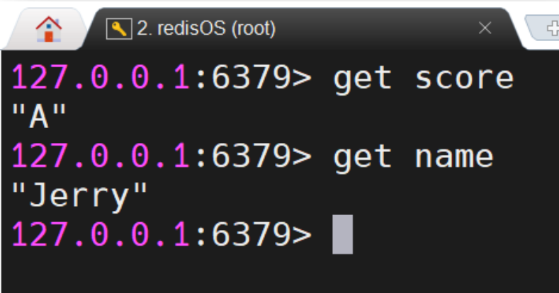

## 一、`Redis`事务

​	`Redis` 的事务的**本质是一组命令的批处理**。这组命令在执行过程中会被**顺序地、一次性全部执行完毕**，只要没有出现语法错误，这组命令**在执行期间是不会被中断**。

## 二、`Redis` 事务特性

​	`Redis` 的事务**仅保证了数据的一致性**，不具有像 DBMS 一样的 ACID 特性。

- 这组命令中的某些命令的**执行失败**不会影响其它命令的执行，**不会引发回滚**。即**不具备原子性**。
- 这组命令**通过乐观锁机制实现了简单的隔离性**。没有复杂的隔离级别。
- 这组命令的**执行结果是被写入到内存的**，是否**持久取决于 Redis 的持久化策略**，与事务无关。

## 三、`Redis` 事务实现

###  3.1 三个命令 

`Redis` 事务通过三个命令进行控制。

- multi：开启事务
- exec：执行事务
- discard：取消事务

### 3.2 基本使用

下面是定义并执行事务的用法：

事务执行后，再访问事务中定义的变量，其值是修改过后。

下面是定义但取消事务的举例：

事务取消后，事务中的命令是没有执行的。

## 四、`Redis` 事务异常处理

### 4.1 语法错误

当事务中的命令**出现语法错误时**，整个**事务在 exec 执行时会被取消**。

exec 的提示是 **exec 被忽略，事务被取消，因为之前的错误**。此时访问 age 的值，发现其仍为 19，并没有变为事务中设置的 20。

### 4.2 执行异常

​	如果事务中的命令**没有语法错误**，**但在执行过程中出现异常**，该异常**不会影响其它命令的执行**。

​	以上事务中**第 2 条命令在执行时出现异常。因为 score 并非是整型，无法被增加 20 的操**作。但**该异常并不会影响其前后命令的正确执行**。查看 **score 与 name 的值，发现是执行成功的结果**。

## 五、`Redis` 事务隔离机制

### 5.1 为什么需要隔离机制

​	在**并发场景下可能会出现多个客户端对同一个数据进行修改的情况**

​	例如：有两个客户端 C 左与 C 右，C 左需要申请 40 个资源，C 右需要申请 30 个资源。它们首先查看了当前拥有的资源数量，即 resources 的值。它们**查看到的都是 50，都感觉资源数量可以满足自己的需求，于是修改资源数量，以占有资源**。但结果却是**资源出现了“超卖”情况**。

​	为了解决这种情况，Redis 事务通过**乐观锁机制**实现了**多线程下的执行隔离**。

### 5.2 隔离的实现

​	`Redis` 通过 **watch 命令**再**配合事务**实现了多线程下的执行隔离

​	以上两个客户端执行的时间顺序为：

### 5.3  实现原理

​	其内部的执行过程如下：

1. 当某一客户端**对 key 执行了 watch** 后，系统就会**为该 key 添加一个 version 乐观锁**，并初始化 version。例如初值为 1.0。
2. 此后**客户端 C 左将对该 key 的修改语句写入到了事务命令队列中**，虽未执行，但其**将该key 的 value 值与 version 进行了读取并保存到了当前客户端缓存**。此时读取并**保存的是version 的初值 1.0。**
3. 此后**客户端 C 右对该 key 的值进行了修改**，这个修改**不仅修改了 key 的 value 本身，同时也增加了 version 的值**，例如**使其 version 变为了 2.0**，并将该 version 记录到了该 key信息中。
4. 此后**客户端 C 左执行 exec，开始执行事务中的命令**。不过，其在执行到对该 key 进行修改的命令时，该命令首先**对当前客户端缓存中保存的 version 值与当前 key 信息中的version 值**。如果**缓存 version 小于 key 的 version**，则说明**客户端缓存的 key 的 value 已经过时**，该写操作如果执行可能会破坏数据的一致性。所以**该写操作不执行**。