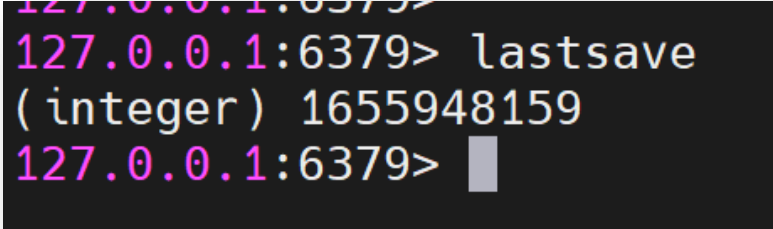
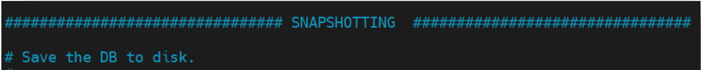

## 一、Redis持久化介绍

​	Redis 是一个内存数据库，所以其运行效率非常高。但也存在一个问题：内存中的数据是不持久的，若**主机宕机或 Redis 关机重启，则内存中的数据全部丢失**。当然，这是不允许的。Redis 具有持久化功能，其会按照设置以**快照**或**操作日志**的形式将数据持久化到磁盘。根据持久化使用技术的不同，**Redis 的持久化分为两种：RDB 与 AOF。**

## 二、持久化基本原理


​	Redis **持久化**也称为**钝化**，是指**将内存中数据库的状态描述信息保存到磁盘中**。只不过是不同的持久化技术，对数据的状态描述信息是不同的，生成的持久化文件也是不同的。但它们的作用都是相同的：避免数据意外丢失。

​	通过**手动方式**，或**自动定时方式**，或**自动条件触发方式**，将内存中数据库的状态描述信息写入到**指定的持久化文件**中。当**系统重新启动时，自动加载持久化文件，并根据文件中数据库状态描述信息将数据恢复到内存中**，这个数据恢复过程也称为**激活**。这个钝化与激活的过程就是 Redis 持久化的基本原理。

​	不过从以上分析可知，对于 Redis 单机状态下，无论是手动方式，还是定时方式或条件触发方式，都存在数据丢失问题：**在尚未手动/自动保存时发生了 Redis 宕机状况，那么从上次保存到宕机期间产生的数据就会丢失**。不同的持久化方式，其数据的丢失率也是不同的。


​	需要注意的是，**RDB 是默认持久化方式**，但 Redis **允许 RDB 与 AOF 两种持久化技术同时开启**，**此时系统会使用 AOF 方式做持久化**，即 AOF 持久化技术的优先级要更高。同样的道理，**两种技术同时开启状态下**，系统启动时若两种持久化文件同时存在，则**优先加载 AOF持久化文件**。

## 三、`RDB`持久化

​	RDB，Redis DataBase，是指**将内存中某一时刻的数据快照全量写入到指定的 rdb 文件的持久化技术**。RDB 持久化默认是开启的。当 **Redis 启动时会自动读取 RDB 快照文件**，将数据从硬盘载入到内存，以恢复 Redis 关机前的数据库状态。

### 3.1 持久化的执行

​	RDB 持久化的执行有三种方式：手动 save 命令、手动 bgsave 命令，与自动条件触发。

#### 3.1.1 手动 `save` 命令


​	通过在 `redis-cli` 客户端中执行 save 命令可立即进行一次持久化保存。**save 命令在执行期间会阻塞 redis-server 进程，直至持久化过程完毕**。而在 `redis-server` **进程阻塞期间，Redis不能处理任何读写请求**，无法对外提供服务。

​	因此**此命令不推荐使用。**

#### 3.1.2 手动 `bgsave` 命令


​	通过在 `redis-cli` 客户端中执行 `bgsave` 命令可立即进行一次持久化保存。**不同于` save` 命令**的是，正**如该命令的名称一样，background save，后台运行 `save`**。`bgsave` 命令会使服务器进程 `redis-server` **生成一个子进程，由该子进程负责完成保存过程**。在子进程进行保存过程中，**不会阻塞 `redis-server` 进程对客户端读写请求的处理。**

#### 3.1.3  自动条件触发

​	自动条件触发的**本质仍是 bgsave 命令的执行**。只不过是用户**通过在配置文件中做相应的设置**后，Redis 会根据设置信息自动调用 bgsave 命令执行。具体配置方式，后面会详解。

#### 3.1.4 查看持久化时间

​	通过 `lastsave` 命令可以查看**最近一次执行持久化的时间**，其返回的是一个 **Unix 时间戳**。



### 3.2 RDB 优化配置

​	RDB 相关的配置在 redis.conf 文件的 SNAPSHOTTING 部分。



#### 3.2.1  save


​	该配置用于**设置快照的自动保存触发条件**，即**` save point`，保存点**。该触发条件是**在指定时间段内发生了指定次数的写操作**。除非另有规定，**默认情况下持久化条件为 `save 3600 1 300 100 60 10000`**。其等价于以下三条： 

- save 3600 1 # 在 3600 秒(1 小时)内发生 1 次写操作
- save 300 100 # 在 300 秒(5 分钟)内发生 100 次写操作
- save 60 10000 # 在 60 秒(1 分钟)内发生 1 万次写操作

​	而且这个是递进的，**先查看是否满足了在60 秒(1 分钟)内发生 1 万次写操作，如果有则进行一次持久化保存，如果没有继续查看是否满足在 300 秒(5 分钟)内发生 100 次写操作，如果有则进行一次持久化保存，如果没有……**

​	如果**不启用 RDB 持久化**，只需设置 **save 的参数为空串即可：save “”**。

#### 3.2.2  stop-write-on-bgsave-error


​	默认情况下，如果 RDB 快照已启用（至少一个保存点），且**最近的 bgsave 命令失败，Redis将停止接受写入**。这样设置是**为了让用户意识到数据没有正确地保存到磁盘上**，否则很可能没有人会注意到，并会发生一些灾难。当然，**如果 bgsave 命令后来可以正常工作了，Redis将自动允许再次写入**。

#### 3.2.3  rdbcompression


​	当进行持久化时**启用 LZF 压缩字符串对象**。虽然**压缩 RDB 文件会消耗系统资源，降低性能，但可大幅降低文件的大小**，方便保存到磁盘，加速主从集群中从节点的数据同步。

#### 3.2.4  rdbchecksum


​	从 RDB5 开始，RDB 文件的 CRC64 校验和就被放置在了文件末尾。这种格式更能**抵抗 RDB文件的损坏**，但在保存和加载 RDB 文件时，**性能会受到影响（约 10%）**，因此可以设置为 `no`禁用校验和以获得最大性能。在禁用校验和的情况下创建的 RDB 文件的校验和为零，这将告诉加载代码跳过校验检查。默认为 yes，开启了校验功能。

#### 3.2.5  sanitize-dump-payload


​	该配置用于设置在加载 RDB 文件或进行持久化时是否**开启对 zipList、listPack 等数据的全面安全检测**。该检测可以**降低命令处理时发生系统崩溃的可能**。其可设置的值有三种选择：

- no：不检测
- yes：总是检测
- clients：只有当客户端连接时检测。排除了加载 RDB 文件与进行持久化时的检测。默认值本应该是 clients，但其会影响 Redis 集群的工作，所以**默认值为 no，不检测**。

#### 3.2.6  dbfilename


指定 RDB 文件的默认名称，**默认为 dump.rdb**。 

#### 3.2.7  rdb-del-sync-files


​	**主从复制时，是否删除用于同步的从机上的 RDB 文件**。默认是 no，不删除。不过需要注意，**只有当从机的 RDB 和 AOF 持久化功能都未开启时才生效**。

#### 3.2.8  dir


指定 **RDB 与 AOF 文件的生成目录**。**默认为 Redis 安装根目录**。


### 3.3 `RDB`文件结构

​	RDB 持久化文件 `dump.rdb` 整体上有五部分构成：


#### 3.3.1  `SOF`

​	**SOF 是一个常量**，一个**字符串 REDIS**，仅包含这五个字符，其长度为 5。用于**标识 RDB文件的开始**，以便在加载 RDB 文件时可以迅速判断出文件是否是 RDB 文件。

#### 3.3.2  `rdb_version`

​	这是一个整数，长度为 4 字节，表示 RDB 文件的版本号。

#### 3.3.3  `EOF`

​	EOF 是一个常量，占 1 个字节，用于标识 **RDB 数据的结束**，**校验和的开始**。

#### 3.3.4 `check_sum`

​	校验和 check_sum 用于**判断 RDB 文件中的内容是否出现数据异常**。其采用的是 CRC 校验算法。

​	CRC 校验算法：

​	在持久化时，先将 SOF、rdb_version 及内存数据库中的数据快照这三者的二进制数据拼接起来，形成一个二进制数（假设称为数 a），然后再使用这个 a 除以校验和 check_sum，此时可获取到一个余数 b，然后再将这个 b 拼接到 a 的后面，形成 databases。

​	在加载时，需要先使用 check_sum 对 RDB 文件进行数据损坏验证。验证过程：只需将RDB 文件中除 EOF 与 check_sum 外的数据除以 check_sum。只要**除得的余数不是 0，就说明文件发生损坏**。当然，**如果余数是 0，也不能肯定文件没有损坏**。

​	这种验证算法，**是数据损坏校验，而不是数据没有损坏的校验。**

#### 3.3.5 `databases`

​	databases 部分是 RDB 文件中最重要的数据部分，其可以包含任意多个**非空数据库**。而每个 database 又是由三部分构成：


- SODB：是一个常量，占 1 个字节，用于标识**一个数据库的开始**。
- db_number：数据库编号。
- key_value_pairs：当前数据库中的键值对数据。

每个 key_value_pairs 又由很多个用于描述键值对的数据构成。

- VALUE_TYPE：是一个常量，占 1 个字节，用于标识该键值对中 **value 的类型**。
- EXPIRETIME_UNIT：是一个常量，占 1 个字节，用于标识**过期时间的单位是秒还是毫秒**。
- time：当前 key-value 的过期时间。


### 3.4 RDB 持久化过程


​	对于 Redis 默认的 RDB 持久化，在进行 bgsave 持久化时，**redis-server 进程会 fork 出一个 bgsave 子进程**，由该子进程**以异步方式负责完成持久化**。而在持久化过程中，**redis-server进程不会阻塞，其会继续接收并处理用户的读写请求**。

​	bgsave 子进程的详细工作原理如下：

​	由于**子进程可以继承父进程的所有资源，且父进程不能拒绝子进程的继承权**。所以，bgsave **子进程有权读取到 redis-server 进程写入到内存中的用户数据**，使得将内存数据持久化到 dump.rdb 成为可能。

​	bgsave **子进程**在持久化时首先会**将内存中的全量数据 copy 到磁盘中的一个 RDB 临时文件**，copy **结束后，再将该文件 rename 为 dump.rdb**，替换掉原来的同名文件。


​	不过，在进行持久化过程中，如果 **redis-server 进程接收到了用户写请求**，则系统**会将内存中发生数据修改的物理块 copy 出一个副本**。**等内存中的全量数据 copy 结束后，会再将副本中的数据 copy 到 RDB 临时文件**。这个副本的生成是由于 Linux 系统的**写时复制技术（Copy-On-Write）**实现的。

### 3.5 写时复制技术

​	写时复制技术是 Linux 系统的一种进程管理技术。

​	原本在 **Unix 系统**中，当一个**主进程通过 fork()系统调用创建子进程**后，**内核进程会复制主进程的整个内存空间中的数据，然后分配给子进程**。这种方式存在的问题有以下几点：

- 这个过程非常耗时
- 这个过程降低了系统性能
- 如果**主进程修改了其内存数据，子进程副本中的数据是没有修改的**。即出现了数据冗余，而冗余数据最大的问题是**数据一致性无法保证**。

​	现代的 **Linux** 则采用了更为有效的方式：写时复制。**子进程会继承父进程的所有资源，其中就包括主进程的内存空间**。即子进程与父进程共享内存。**只要内存被共享，那么该内存就是只读的（写保护的）**。而写时复制则是在**任何一方需要写入数据到共享内存时都会出现异常，此时内核进程就会将需要写入的数据 copy 出一个副本写入到另外一块非共享内存区域**。


## 四、`AOF`持久化

​	AOF，Append Only File，是指 Redis 将**每一次的写操作都以日志的形式记录到一个 AOF文件中**的持久化技术。当**需要恢复内存数据时**，将这些**写操作**重新**执行一次**，便会恢复到之前的内存数据状态。

### 4.1 `AOF` 基础配置

#### 4.1.1 `AOF` 的开启


​	**默认情况**下 AOF 持久化是**没有开启**的，通过修改配置文件中的 `appendonly` 属性为 yes可以开启。

注：除了直接收到修改`redis.conf`配置文件之外，我们还可以使用下述两个命令来获取和修改配置：

```
config get appendonly   // 读取配置

config set appendonly yes  // 修改配置,仅在内存中
rewrite    // 将内存中的配置覆写到硬盘上的redis.conf中
```

#### 4.1.2 文件名配置


​	Redis 7 在这里发生了重大变化。**原来只有一个 `appendonly.aof` 文件**，现在具有了三类多个文件：

- 基本文件：可以是 `RDF` 格式也可以是 `AOF` 格式。其存放的内容是**由 `RDB` 转为 `AOF` 之前内存的快照数据**。该文件可以有多个。
- 增量文件：以操作日志形式记录**转为 `AOF` 后的写入操作**。该文件可以有多个。
- 清单文件：用于**维护 `AOF` 文件的创建顺序**，保障激活时的应用顺序。该文件只有一个。

#### 4.1.3 混合式持久化开启


​	对于**基本文件可以是 `RDF` 格式也可以是 `AOF` 格式**。通过 `aof-use-rdb-preamble` 属性可以选择。其默认值为 yes，即**默认** `AOF` 持久化的**基本文件为 `rdb` 格式文件**，也就是**默认采用混合式持久化**。

#### 4.1.4  `AOF` 文件目录配置


​	为了方便管理，可以专门**为 `AOF` 持久化文件指定存放目录**。目录名由 `appenddirname`属性指定，存放在 `redis.conf` 配置文件的 `dir` 属性指定的目录，**默认为 `Redis` 安装目录**。

### 4.2 `AOF` 文件格式

​	`AOF` 文件包含三类文件：**基本文件、增量文件与清单文件**。其中基本文件一般为 `rdb` 格式，在前面已经研究过了。下面就来看一下增量文件与清单文件的内容格式。

#### 4.2.1 `Redis` 协议

​	**增量文件扩展名为.aof**，采用 AOF 格式。**AOF 格式其实就是 Redis 通讯协议格式**，AOF持久化文件的本质就是基于 Redis 通讯协议的文本，**将命令以纯文本的方式写入到文件中**。

​	Redis 协议规定，**Redis 文本是以行来划分，每行以\r\n 行结束**。**每一行都有一个消息头，以表示消息类型**。消息头由六种不同的符号表示，其意义如下： 

1. (+) 表示一个正确的状态信息
2. (-) 表示一个错误信息
3. (*) 表示消息体总共有多少行，不包括当前行
4. ($) 表示下一行消息数据的长度，不包括换行符长度\r\n 
5. (空) 表示一个消息数据
6. (:) 表示返回一个数值

#### 4.2.2 查看 `AOF` 文件

​	打开 `appendonly.aof.1.incr.aof` 文件，可以看到如下格式内容。


​	以上内容中**框起来的是三条命令**。**一条数据库切换命令 SELECT 0**，**两条 set 命令**。它们的意义如下：

```
*2 -- 表示当前命令包含 2 个参数
$6 -- 表示第 1 个参数包含 6 个字符
SELECT -- 第 1 个参数
$1 -- 表示第 2 个参数包含 1 个字符
0 -- 第 2 个参数
*3 --表示当前命令包含 3 个参数
$3 -- 表示第 1 个参数包含 3 个字符
set -- 第 1 个参数
$3 -- 表示第 2 个参数包含 3 个字符
k11 -- 第 2 个参数
$3 -- 表示第 3 个参数包含 2 个字符
v11 -- 第 3 个参数
*3
```

#### 4.2.3 清单文件

打开清单文件 `appendonly.aof.manifest`，查看其内容如下：


​	该文件首先会按照 seq 序号列举出所有基本文件，基本文件 type 类型为 b，然后再按照seq 序号再列举出所有增量文件，增量文件 type 类型为 i。**对于 Redis 启动时的数据恢复，也会按照该文件由上到下依次加载它们中的数据**。

## 五、Rewrite 机制

​	随着使用时间的推移，**AOF 文件会越来越大**。为了**防止 AOF 文件由于太大而占用大量的磁盘空间**，降低性能，Redis **引入了 Rewrite 机制来对 AOF 文件进行压缩**。

### 5.1  何为 rewrite 

​	**所谓 Rewrite 其实就是对 AOF 文件进行重写整理**。当 Rewrite 开启后，主进程 redis-server**创建出一个子进程 bgrewriteaof**，由该**子进程完成 rewrite 过程**。其首先**对现有 aof 文件进行rewrite 计算，将计算结果写入到一个临时文件**，写入**完毕后，再 rename 该临时文件为原 aof文件名，覆盖原有文件**。

### 5.2  rewrite 计算

​	rewrite 计算也称为 rewrite 策略。rewrite 计算遵循以下策略：

- 读操作命令不写入文件
- 无效命令不写入文件
- 过期数据不写入文件
- 多条命令合并写入文件

### 5.3 手动开启 rewrite

​	Rewrite 过程的执行有两种方式。一种是通过 **bgrewriteaof 命令手动开启**，一种是通过**设置条件自动开启**。

​	以下是手动开启方式：


​	该命令会使主进程 redis-server 创建出一个子进程 bgrewriteaof，由该**子进程完成 rewrite过程**。而**在 rewrite 期间，redis-server 仍是可以对外提供读写服务的。**

### 5.4  自动开启 rewrite

​	手动方式需要人办干预，所以一般采用自动方式。由于 Rewrite 过程是一个计算过程，需要消耗大量系统资源，会降低系统性能。所以，Rewrite 过程并不是随时随地任意开启的，而是通过设置一些条件，当满足条件后才会启动，以降低对性能的影响。下面是配置文件中对于 Rewrite 自动启动条件的设置。


- auto-aof-rewrite-percentage：开启 rewrite 的增大比例（如果当前AOF文件大小超过了上一次rewrite后AOF文件大小的指定百分比），默认 100%。**指定为 0，表示禁用自动 rewrite**。 
- auto-aof-rewrite-min-size：**开启 rewrite 的 AOF 文件最小值**，默认 64M。该值的设置主要是**为了防止过小的 AOF 文件被 rewrite**，从而导致性能下降。

​	自动重写 AOF 文件。**当 AOF 日志文件大小增长到指定的百分比时，Redis 主进程redis-server 会 fork 出一个子进程 bgrewriteaof 来完成 rewrite 过程。**

​	其工作原理如下：Redis 会**记住最新 rewrite 后的 AOF 文件大小作为基本大小**，如果从**主机启动后就没有发生过重写，则基本大小就使用启动时 AOF 的大小**。

​	如果当前 AOF 文件大于基本大小的配置文件中指定的百分比阈值，且当前 AOF 文件大于配置文件中指定的最小阈值，则会触发 rewrite。