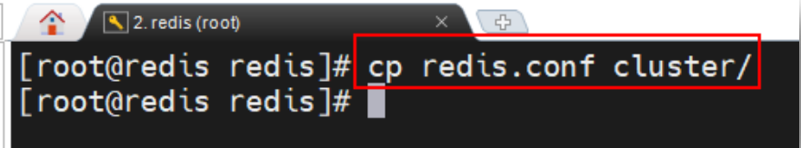

## 一、`Redis`主从集群

​	为了避免` Redis` 的单点故障问题，我们可以搭建一个 `Redis` 集群，将数据备份到集群中的其它节点上。若一个 `Redis` 节点宕机，则由集群中的其它节点顶上。

​	`Redis` 的主从集群是一个“一主多从”的读写分离集群。集群中的 **`Master` 节点负责处理客户端的读写请求**，而 **`Slave` 节点仅能处理客户端的读请求**。只所以要将集群搭建为读写分离模式，主要原因是，对于数据库集群，**写操作压力一般都较小，压力大多数来自于读操作请求**。所以，**只有一个节点负责处理写操作请求即可**。

## 二、伪集群搭建与配置

​	在采用单线程 IO 模型时，为了提高处理器的利用率，一般会在一个主机中安装多台 `Redis`，构建一个 `Redis` 主从**伪集群**。当然，搭建伪集群的另一个场景是，在学习 `Redis`，而学习用主机内存不足以创建多个虚拟机。下面要搭建的读写分离伪集群包含**一个 Master 与两个 Slave**。它们的**端口号分别是：6380、6381、6382**。 

### 2.1  复制 `redis.conf`

​	在 `redis` 安装目录中 `mkdir` 一个目录，名称随意。这里命名为 `cluster`。然后将 **`redis.conf`文件**复制到 `cluster` 目录中。该文件后面会**被其它配置文件包含**，所以该文件中需要设置**每个 `Redis` 节点相同的公共的属性**。

### 2.2 修改 `redis.conf`

​	在 `redis.conf` 中做如下几项修改：

#### 2.2.1 `masterauth`

​	因为我们要搭建主从集群，且每个主机都有可能会是 `Master`，所以最好不要设置密码验证属性 `requirepass`。如果真**需要设置，一定要每个主机的密码都设置为相同的**。此时**每个配置文件中都要设置两个完全相同的属性：`requirepass` 与 `masterauth`**。其中 `requirepass` 用于指定当前主机的访问密码，而 **`masterauth` 用于指定当前 `slave` 访问 `master `时向 `master` 提交的访问密码**，用于让 `master` 验证自己身份是否合法

​	如果每个主机的`requirepass`都设置为同一个，好处就是他们的`masterauth`都是一样的，任何成为`master`的主机都可以使用相同的`masterauth`去访问。

#### 2.2.2 `repl-disable-tcp-nodelay`

​	该属性用于设置是否禁用 `TCP` 特性 `tcp-nodelay`。**设置为 `yes` 则禁用 `tcp-nodelay`(意味着会使用`Nagle` 算法)，此时`master `与 `slave` 间的通信会产生延迟，但使用的 `TCP` 包数量会较少**，占用的网络带宽会较小。相反，如果**设置为 `no`，则网络延迟会变小，但使用的 `TCP` 包数量会较多**，相应占用的网络带宽会大。

​	`tcp-nodelay`：为了充分复用网络带宽，`TCP` 总是希望发送尽可能大的数据块。为了达到该目的，`TCP` 中使用了一个名为 `Nagle` 的算法。**`Nagle` 算法的工作原理是，网络在接收到要发送的数据后，并不直接发送，而是等待着数据量足够大（由 `TCP` 网络特性决定）时再一次性发送出去**。这样，网络上传输的有效数据比例就得到了大大提升，无效数据传递量极大减少，于是就节省了网络带宽，缓解了网络压力。

​	**默认情况下`tcp-nodelay`设置为`no`，但如果遇到高流量或者`master`与`slave`之间存在多跳时设置为`yes`会更好。**

### 2.3 新建 `redis6380.conf`

​	新建一个 `redis` 配置文件 `redis6380.conf`，该配置文件中的 `Redis` 端口号为 `6380`。

**`replica-priority` 用于设置当前节点的一个优先级，优先级越低的，当`master`发生故障时越容易被选举为新的`master`。但如果`replica-priority`被设置为0，意味着该节点将永远不会被选举为`master`。**

#### 2.3.1  再复制出两个 `conf` 文件

再使用 `redis6380.conf` 复制出两个 `conf` 文件：`redis6381.conf` 与 `redis6382.conf`。然后修改其中的内容

修改 `redis6381.conf` 的内容如下：

修改 `redis6382.conf` 的内容如下：

### 2.4 启动三台 `Redis`

​	分别使用`redis6380.conf`、`redis6381.conf`与`redis6382.conf` 三个配置文件启动三台`Redis`。 

### 2.5 设置主从关系

​	再打开三个会话框，分别**使用客户端连接三台 `Redis`**。然后**通过 `slaveof` 命令，指定 `6380`的 `Redis` 为 `Master`**。

### 2.6 查看状态信息

​	通过 **`info replication` 命令**可查看当前连接的 `Redis` 的状态信息。

### 2.7 读写分离

​	**此时只有`master`可以进行写操作，而且它的写操作结果会被同步到所有的`slave`上。所有的节点(包括`master`和所有`slave`）都可以进行读操作，而且读取的结果也是一样的。**

## 三、分级管理

若 `Redis`主从集群中的 **`Slave` 较多时，它们的数据同步过程会对` Master` 形成较大的性能压力**。此时可以对这些 `Slave` 进行分级管理。

​	设置方式很简单，只需要让**低级别 Slave 指定其 `slaveof` 的主机为其上一级 Slave 即可**。不过，**上一级 Slave 的状态仍为 Slave**，只不过，其是更上一级的 Slave。

​	例如，**指定 6382 主机为 6381 主机的 Slave，而 6381 主机仍为真正的 Master(6380) 的 Slave。**

此时会发现，Master 的 Slave 只有 6381 一个主机。

## 四、容灾冷处理

​	在 `Master/Slave` 的 `Redis` 集群中，若 **`Master` 出现宕机怎么办**呢？有两种处理方式，一种是**通过手工角色调整，使 `Slave` 晋升为 `Master` 的冷处理**；一种是**使用哨兵模式，实现 `Redis` 集群的高可用 HA，即热处理**。

​	**无论 `Master` 是否宕机**，`Slave` 都可**通过 `slaveof no one` 将自己由 `Slave` 晋升为 `Master`**。如果其原本就有下一级的 `Slave`，那么，其就直接变为了这些 `Slave` 的真正的 `Master` 了。而**原来的 `Master` 也会失去这个原来的 `Slave`**。

**6381不再是6382的`Slave`，而是成为了一个新的`Master`，其下隶属的6382依旧是自己的`Slave`**