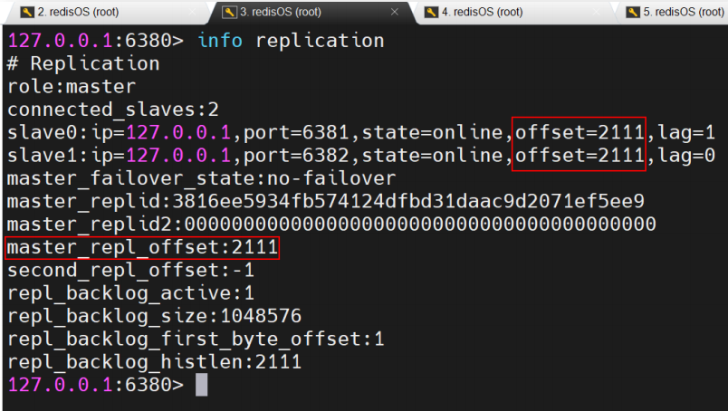
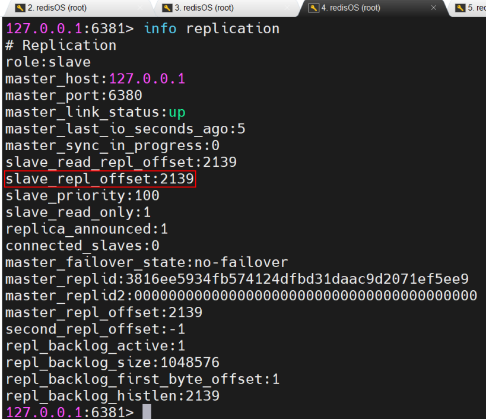
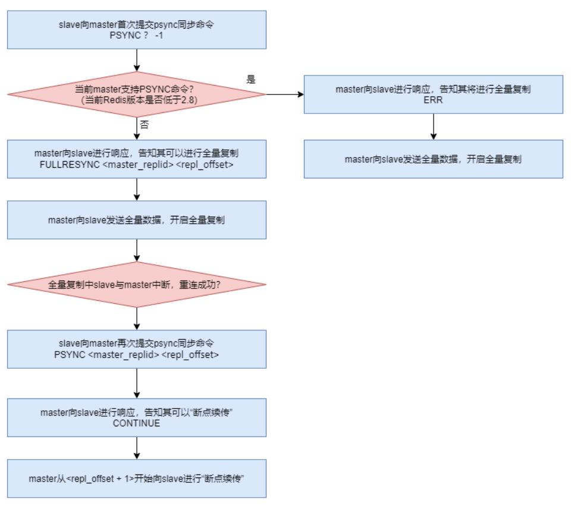

## 一、主从复制过程

​	当一个 `Redis` 节点（`slave` 节点）接收到类似 `slaveof 127.0.0.1 6380` 的指令后直至其可以从 `master` 持续复制数据，大体经历了如下几个过程：

### 1.1  保存 master 地址

​	当 `slave` 接收到 `slaveof` 指令后，`slave` 会立即将新的 `master` 的地址保存下来。

### 1.2  建立连接

​	`slave` 中维护着一个**定时任务**，该定时任务会**尝试着与该 `master` 建立 `socket` 连接**。如果连接无法建立，则其会不断定时重试，**直到连接成功或接收到 `slaveof no one` 指令**。

### 1.3  slave 发送 ping 命令

​	**连接建立成功后，`slave` 会发送 `ping` 命令进行首次通信**。如果 `slave` **没有收到 `master` 的回复**，则 **`slave` 会主动断开连接**，下次的定时任务会重新尝试连接。

### 1.4  对 slave 身份验证

​	如果**`master` 收到了 `slave` 的 `ping` 命令** ，并不会立即对其进行回复，而是**会先进行身份验证**。如果验证失败，则会发送消息拒绝连接；如果验证成功，则向 `slave` 发送连接成功响应

### 1.5  master 持久化

​	**首次通信成功后，`slave` 会向 `master` 发送数据同步请求**。当 `master` 接收到请求后，会 `fork`出一个子进程，让**子进程**以**异步方式**立即进行**持久化**。

### 1.6 数据发送

​	**持久化完毕后 `master` 会再 `fork` 出一个子进程，让该子进程以异步方式将数据发送给`slave`**。`slave` 会将接收到的数据不断写入到本地的持久化文件中。在 `slave` 数据**同步过程中**，**`master` 的主进程仍在不断地接受着客户端的写操作，且不仅将新的数据写入到了 `master` 内存，同时也写入到了同步缓存**。当 `master` 的**持久化文件中的数据发送完毕**后，`master` 会**再将同步缓存中新的数据发送给 `slave`**，由`slave` 将其写入到本地持久化文件中。数据同步完成。

### 1.7 slave 恢复内存数据

​	当 `slave` 与 `master` 的数据同步完成后，`slave` 就会读取本地的持久化文件，将其恢复到本地内存，然后就可以对外提供读服务了。

### 1.8 持续增量复制

​	在 `slave` 对外提供服务过程中，**`master` 会持续不断的将新的数据以增量方式发送给 `slave`**，以保证主从数据的一致性。

## 二、`Redis`数据同步方式演变过程

### 2.1  `sync` 同步方式

​	**`Redis 2.8` 版本之前**，首次通信成功后，`slave` 会向 `master` 发送 `sync` 数据同步请求。然后**`master` 就会将其所有数据全部发送给 `slave`**，由 slave 保存到其本地的持久化文件中。这个过程称为**全量复制**。

​	但这里存在一个问题：在**全量复制过程中可能会出现由于网络抖动而导致复制过程中断**。当网络恢复后，`slave` 与 `master` **重新连接**成功，此时 `slave` 会重新发送 `sync` 请求，然后**会从头开始全量复制**。

​	由于**全量复制过程非常耗时，所以期间出现网络抖动的概率很高**。而中断后的从头开始不仅需要消耗大量的系统资源、网络带宽，而且可能会出现长时间无法完成全量复制的情况。

### 2.2  `psync` 同步方式

​	**`Redis 2.8` 版本之后**，全量复制**采用了 `psync`（`Partial Sync`，不完全同步）同步策略**。当全量复制过程出现由于网络抖动而导致复制过程中断时，当**重新连接成功后，复制过程可以“断点续传”**。即**从断开位置开始继续复制，而不用从头再来**。这就大大提升了性能。

​	为了实现 `psync`，整个系统做了三个大的变化：

#### 2.2.1 复制偏移量

​	系统为**每个要传送数据进行了编号**，该编号从 0 开始，**每个字节一个编号**。**该编号称为复制偏移量**。参与复制的主从节点都会维护该复制偏移量。

​	**`master` 每发送过一个字节数据后就会进行累计**。统计信息**通过 `info replication` 的`master_repl_offset` 可查看到**。同时，**`slave` 会定时向 `master` 上报其自身已完成的复制偏移量给 `master`**，所以 **`master` 也会保存 `slave` 的复制偏移量 `offset`**。

​	**`slave`在接收到`master`的数据后，也会累计接收到的偏移量**。统计信息通过`info replication`的 `slave_repl_offset` 可查看到。

`slave_repl_offset`的值一般总是大于`master_repl_offset`，因为只有这样`slave`才会向`master`请求数据同步。

#### 2.2.2 主节点复制 ID

​	当 **`master` 启动后**就会**动态生成**一个长度为 `40` 位的 `16` 进制字符串作为**当前 `master` 的复制 `ID`**，该 `ID` **是在进行数据同步时 `slave `识别 `master` 使用的**。通过 `info replication` 的`master_replid` 属性可查看到该 `ID`。 

​	**这个复制ID的作用是：由于每次`master`启动后生成的ID不一样，因此`slave`可以通过查看`master`的ID来判断其是否断开过连接，如果`master`确实断开过连接（复制ID不一样）则会发送断点续传请求，向`master`请求从中断处开始重新获取同步数据。**

#### 2.2.3 复制积压缓冲区

​	当 `master` **有连接的 `slave`** (**如果没有slave就不会产生积压缓冲区**)时，在 **`master` 中就会创建并维护一个队列 `backlog`，默认大小为 `1MB`，该队列称为复制积压缓冲区**。`master` 接收到了**写操作数据**不仅会写入到 `master` 主存，写入到 `master` 中为每个 `slave` 配置的发送缓存，而且**还会写入到复制积压缓冲区**。其作用就是用于**保存最近操作的数据，以备“断点续传”时做数据补偿**，防止数据丢失。

​	复制积压缓冲区只要是为了解决：**`slave`发生临时中断（意味着该`slave`对应的发送缓存也被关闭了），`master`此时又产生了新的写操作，为了保证该`slave`重新连接以后能够获取中断期间产生的这部分数据，需要将其保存起来等到连接回复后进行数据补偿。**

#### 2.2.4 `psync` 同步详细过程

​	**`psync` 是一个由 `slave` 提交的命令**，其**格式为 `psync <master_replid> <repl_offset>`**，表示**当前 slave 要从指定的 master 中的`repl_offset+1` 处开始复制**。`repl_offset` 表示当前 `slave` 已经完成复制的数据的 `offset`。该命令保证了“断点续传”的实现。

​	在**第一次开始复制**时，**`slave` 并不知道 `master` 的动态 `ID`，并且一定是从头开始复制(进行全量复制)**，所以其**提交的 `psync` 命令为 `PSYNC ? -1`**。即 `master_replid` 为问号(?)，`repl_offset` 为-1。

​	如果复制过程**中断后 `slave` 与 `master` 成功连接，则 `slave` 再次提交 `psyn` 命令**。此时的 `psyn`命令的 **`repl_offset` 参数为其前面已经完成复制的数据的偏移量**。

​	其实，并不是`slave`提交了`psyn`命令后就可以立即从`master`处开始复制，而是**需要`master`给出响应结果后，根据响应结果来执行**。**`master` 根据 `slave` 提交的请求及 `master` 自身情况**会给出**不同的响应结果**。响应结果有三种可能：

- `FULLRESYNC <master_replid> <repl_offset>`：告知 slave **当前 master 的动态 ID** 及可以开始全量复制了，**这里的 `repl_offset `一般为 0** 
- `CONTINUE`：告知 slave 可以按照你提交的 `repl_offset` 后面位置开始“续传”了
- `ERR`：告知 slave，当前 master 的版本低于 `Redis 2.8`，**不支持 `psyn`**，你可以**开始全量复制**了

### 2.3 `psync`同步方式存在的问题与改进

#### 2.3.1 存在问题

- 在 `psync` 数据同步过程中，若 **`slave` 重启**，在 **`slave` 内存中保存的 `master` 的动态 `ID` 与续传 `offset` 都会消失**，“断点续传”将无法进行，从而只能进行全量复制，导致资源浪费。
- 在 `psync` 数据同步过程中，**`master` 宕机**后 `slave` 会发生“易主”，从而导致 **`slave` 需要从新 `master` 进行全量复制(原因是新的`master`并不认识旧`master`的动态ID)**，形成资源浪费。

#### 2.3.2 改进

`	Redis 4.0` 对 `psync` 进行了改进，提出了“同源增量同步”策略。

- **解决 slave 重启问题**

​	针对“slave 重启时 master 动态 ID 丢失问题”，改进后的 `psync` **将 master 的动态 ID 直接写入到了 slave 的持久化文件**中。

​	**slave 重启后直接从本地持久化文件中读取 master 的动态 ID**，然后**向 master 提交获取复制偏移量的请求**。master 会根据提交请求的 slave 地址，查找到保存在 master 中的复制偏移量，然后向 slave 回复 `FULLRESYNC <master_replid> <repl_offset>`，以告知 slave 其马上要开始发送的位置。然后 master 开始“断点续传”。

- **解决 slave 易主问题**

​	slave 易主后需要和新 master 进行全量复制，本质原因是**新 master 不认识 slave 提交的`psync` 请求中“原 master 的动态 ID”**。如果 slave 发送 `PSYNC <原 master_replid> <repl_offset>`命令，新master能够识别出该slave要从原master复制数据，而自己的数据也都是从该master复制来的。那么新 master 就会明白，其与该 slave“师出同门”，应该接收其“断点续传”同步请求。

​	而**新 master 中恰好保存的有“原 master 的动态 ID”**。由于**改进后的 `psync` 中每个 slave都在本地保存了当前 master 的动态 ID，所以当 slave 晋升为新的 master 后，其本地仍保存有之前 master 的动态 ID**。而这一点也恰恰为解决“slave 易主”问题提供了条件。**通过 master的 `info replicaton` 中的 `master_replid2` 可查看到**。如果尚**未发生过易主，则该值为 40 个 0**。 
