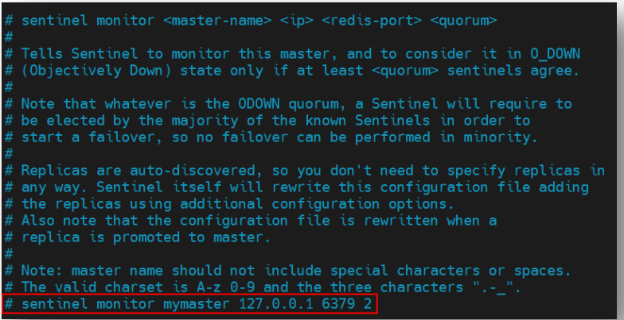
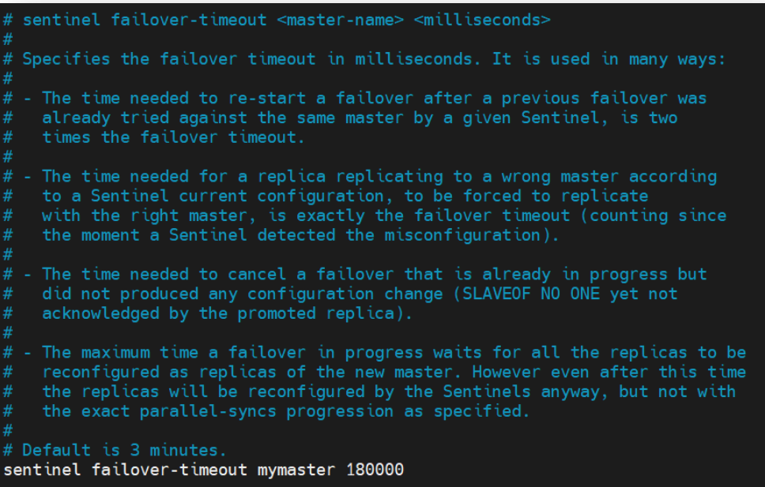

## 一、哨兵机制简介

​	对于 Master 宕机后的冷处理方式是无法实现高可用的。`Redis` 从 2.6 版本开始提供了高可用的解决方案—— `Sentinel` 哨兵机制。**在集群中再引入一个节点，该节点充当 Sentinel 哨兵，用于监视 Master 的运行状态，并在 Master 宕机后自动指定一个 Slave 作为新的 Master**。整个过程无需人工参与，完全由哨兵自动完成。

​	不过，此时的 Sentinel 哨兵又成为了一个**单点故障**点：**若哨兵发生宕机，整个集群将瘫痪**。所以为了解决 Sentinel 的单点问题，又要**为 Sentinel 创建一个集群，即 Sentinel 哨兵集群**。一个哨兵的宕机，将不会影响到 `Redis` 集群的运行。

​	那么这些 Sentinel 哨兵是如何工作的呢？Sentinel 是如何知道其监视的 Master 状态的呢？**每个 Sentinel 都会定时会向 Master 发送心跳，如果 Master 在有效时间内向它们都进行了响应，则说明 Master 是“活着的”**。如果 Sentinel 中有 **quorum 个哨兵**没有收到响应，那么就**认为 Master 已经宕机**，然后**会有一个 Sentinel 做 `Failover` 故障转移**。即将原来的某一个 Slave晋升为 Master

## 二、`Redis` 高可用集群搭建

​	在“不差钱”的情况下，可以让 Sentinel 占用独立的主机，即在 `Redis` 主机上只启动 `Redis`进程，在 Sentinel 主机上只启动 Sentinel 进程。下面要搭建一个“**一主二从三哨兵**”的高可用伪集群，即这些角色全部安装运行在一台主机上。“一主二从”使用前面的主从集群，**下面仅搭建一个 Sentinel 伪集群**。

### 2.1 复制 `sentinel.conf`

​	将 `Redis` 安装目录中的 `sentinel.conf` 文件复制到 `cluster` 目录中。该配置文件中用于存放一些 **`sentinel` 集群**中的一些**公共配置**。

### 2.2 修改 `sentinel.conf`

​	修改 `cluster/sentinel.conf` 配置文件。

#### 2.2.1 `sentinel monitor`

​	该配置用于**指定 Sentinel 要监控的 master 是谁< `ip` >< `redis-port` >**，并**为 master 起了一个名字< `master-name` >**。该名字在后面很多配置中都会使用。

​	同时指定 Sentinel 集群中决定该master“客观下线状态”判断的法定 sentinel 数量<quorum>。**只要有超过`quorum`个`sentinal`认为当前`master`是`S_DOWN(Subjectively Down)`，那么整个sentinel集群就会认为当前`master`是`O_DOWN(Objectively Down)`**

​	<quorum>的另一个用途与sentinel 的 Leader 选举有关。要求中**至少要有 `sentinelNum/2+1`（超过半数）个 sentinel 参与，选举才能进行**。Leader被选举出来之后，如果此时的sentinel集群认为当前`master`是`O_DOWN`的，那么将会由`Leader`发起一次`failover`，进行`master`节点的更换。

​	所以说**`quorum`的值需要大于`sentinelNum/2+1`才会起到实际的作用**。

#### 2.2.2 `sentinel auth-pass`

如果 `Redis` 主从集群中的主机设置了访问密码，那么该属性就需要指定 `master` 的主机名与访问密码。以方便 `sentinel` 监控 `master`。

需要注意：

1. 这里必须要保证`redis`中的`master`跟其他`slave`的访问密码是一样的，否则哨兵机制会失效。

2. 允许`redis`中存在混合型实例（有访问密码和没有访问密码的实例的混合），对于哪些没有访问密码的`redis`实例，哨兵对其进行访问也是可以通过的。

### 2.3 新建 `sentinel26380.conf`

​	在 `Redis` 安装目录下的 cluster 目录中新建 `sentinel26380.conf` 文件作为 `Sentinel` 的配置文件，并在其中键入如下内容：

​	`sentinel monitor` 属性用于指定当前监控的 `master` 的 `IP` 与 `Port`，同时为集群中 `master` 指定一个名称 `mymaster`，以方便其它属性使用。

### 2.4  再复制两个 `conf` 文件

再使用`sentinel26380.conf` 复制出两个`conf`文件：`sentinel26381.conf`与`sentinel26382.conf`。然后修改其中的内容。

修改 `sentinel26381.conf`。

修改 `sentinel26382.conf`。

## 三、`Redis` 高可用集群的启动

### 3.1 启动并关联 `Redis` 集群

​	首先要启动三台 `Redis`，然后再**通过 `slaveof` 关联它们**。

### 3.2 启动 Sentinel 集群

#### 3.2.1 启动命令

​	**在`/usr/local/bin` 目录下有一个命令 `redis-sentinel` 用于启动 `Sentinel`**。不过，我们发现一个奇怪的现象：`/usr/local/bin` 目录中的 `redis-sentinel` 命令是 `redis-server` 命令的软链接，这是为什么呢？

​	查看 `Redis` 安装目录中的 `src` 目录中的 **`redis-server` 与 `redis-sentinel`** 命令，我们发现这两个命令的大小一模一样。其实，**这两个命令本质上是同一个命令**。

​	之所以可以启动不同的进程，主要是因为在**启动时所加载的配置文件的不同**。所以**在启动 Sentinel 时，需要指定 `sentinel.conf` 配置文件**。

#### 3.2.2 两种启动方式

由于 `redis-server` 与 `redis-sentinel` 命令本质上是同一个命令，所以使用这两个命令均可启动 Sentinel。

- 方式一，使用 `redis-sentinel` 命令：**`redis-sentinel sentinel26380.conf`**
- 方式二，使用 `redis-server` 命令：**`redis-server sentinel26380.conf --sentinel`**

#### 3.2.3 启动三台 Sentinel

### 3.3 查看 `Sentinel` 信息

​	运行中的 `Sentinel` 就是一个特殊 `Redis`，其**也可以通过客户端连接**，然后通过 **`info sentinel`来查看当前连接的 `Sentinel` 的信息**。

### 3.4 查看 `sentinel` 配置文件

打开任意 `sentinel` 的配置文件，发现其配置内容中新增加了很多配置。

## 四、`Sentinel` 优化配置

​	在公共的 `sentinel.conf` 文件中，还可以通过修改一些其它属性的值来达到对 Sentinel 的配置优化。

### 4.1  `sentinel down-after-milliseconds`

​	每个 Sentinel 会通过**定期发送 ping 命令**来判断 master、slave 及其它 Sentinel (**任何可到达的连接节点**)是否存活。**如果 Sentinel 在该属性指定的时间内没有收到它们的响应，那么该 Sentinel 就会主观认为该主机宕机**。默认为 30 秒。

### 4.2  `sentinel parallel-syncs`

​	该属性用于指定，在故障转移期间，即老的 master 出现问题，新的 master 刚晋升后，**允许多少个 slave 同时从新 master 进行数据同步**。默认值为 1 表示所有 slave 逐个从新 master进行数据同步。

​	需要注意：**在数据同步期间的`slave`是不能进行读操作的（slave本身也不能进行写操作），因此如果在读操作比较多的运行环境下，不应该将默认值设置的很大。**

### 4.3  `sentinel failover-timeout`

指定**故障转移的超时时间**，**默认时间为 3 分钟**。该超时时间的用途很多：

- 如果**第一次故障转移失败**，那么在**同一个 master** 上进行**第二次故障转移尝试的时间**会被设置为当前已设置的`failover-timeout` 的两倍
- 新 master 晋升完毕，slave 从老 master 强制转到与新 master 进行数据同步的时间阈值（**在完成数据同步对象之前，`slave`还会尝试与旧`master`进行数据同步，尽管会失败**）。
- 取消正在进行的故障转换所需的时间阈值，在这个时间阈值范围内**`sentinel`可以撤销自己选择新`master`的决策**，因为相关配置还没有写入到新`master`的配置文件汇总。
- 新 `master` 晋升完毕，所有 `replicas`（所有`sentinel`和`slave`） 的配置文件更新新 `master` 的时间阈值。

### 4.4  `sentinel deny-scripts-reconfig`

​	指定**是否可以通过命令 `sentinel set` 动态修改 `notification-script` 与 `client-reconfig-script` 两个脚本**。**默认是不能的**。这两个脚本如果允许动态修改，可能会引发安全问题

### 4.5 动态修改配置

​	通过 `redis-cli` 连接上 `Sentinel` 后，**通过 `sentinel set` 命令可动态修改配置信息**。例如，下面的命令动态修改了 `sentinel monitor` 中的 `quorum` 的值。

​	**下表是 sentinel set 命令支持的参数：**

