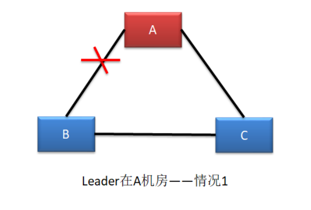
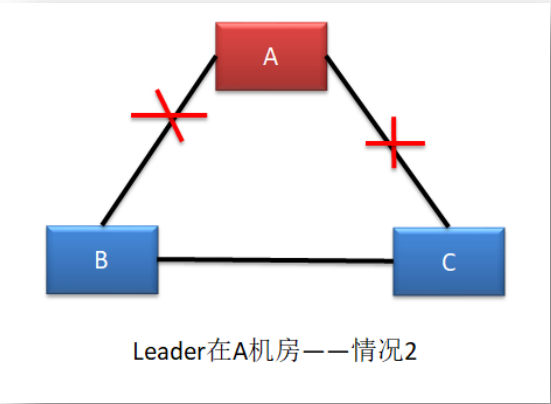
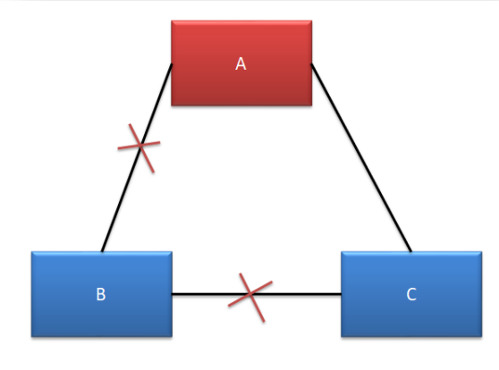
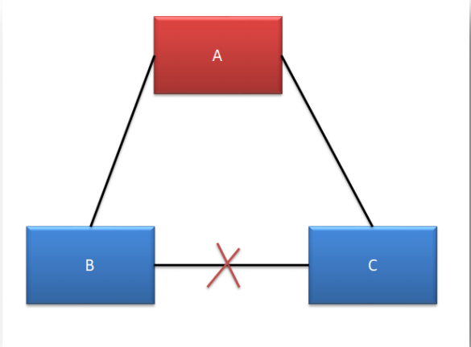
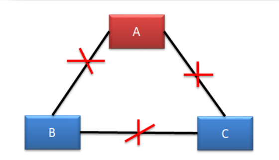

## 一、Raft基础

​	Raft 算法是一种通过对日志复制管理来达到集群节点一致性的算法。这个日志复制管理发生在集群节点中的 Leader 与 Followers 之间。**Raft 通过选举出的 Leader 节点负责管理日志复制过程，以实现各个节点间数据的一致性**。

### 1.1 角色、任期及角色转变

在 Raft 中，节点有三种角色：

- Leader：**唯一负责**处理客户端**写请求**的节点；也**可以处理**客户端**读请求**；同时负责日志复制工作
- Candidate：Leader 选举的候选人，其可能会成为 Leader。**是一个选举中的过程角色。**
- Follower：可以处理客户端读请求；负责同步来自于 Leader 的日志；当**接收到其它Cadidate 的投票请求后可以进行投票**；当**发现 Leader 挂了，其会转变为 Candidate 发起Leader 选举**

## 二、leader 选举

​	通过 Raft 算法首先要实现集群中 Leader 的选举。

### 2.1 我要选举

​	若 **follower** 在**心跳超时范围（其实就是超出了`randomized election timeouts`）内**没有接收到来自于 **leader 的心跳**，则**认为 leader 挂了**。在等待`randomized election timeouts`  时长后，开启选举：此时其首先会使其**本地 term 增一**。然后 follower 会完成以下步骤：

1. 此时若接收到了其它 candidate 的投票请求，则会将选票投给这个 candidate（**在成为candidate之前，且每个节点只会有一票**）, **一旦完成投票，则`randomized election timeouts`计时器会重新归零（收到来自Leader的心跳包也会使计时器重新归零），开始新一轮计时**。
2. 由 follower 转变为 candidate
3. 若**之前尚未投票**，则**向自己投一票**
4. 向其它节点发出投票请求，然后等待响应（**无论是否投票给自己，都会请求其他节点为自己投票**）

### 2.2 我要投票

​	follower 在接收到投票请求后，其会根据以下情况来**判断是否投票**：

- 发来投票请求的 candidate 的 term 不能小于我的 term
- 在我当前 term 内，我的选票还没有投出去
- 若接收到多个 candidate 的请求，我将采取 first-come-first-served 方式投票

### 2.3 等待响应

​	当一个 Candidate **发出投票请求后会等待其它节点的响应结果**。这个响应结果可能有三种情况：

- 收到过半选票，成为新的 leader。然后会将消息广播给所有其它节点，以告诉大家我是新的 Leader 了。**在此之后便会持续不断地向其他节点发送心跳包。**
- 接收到别的 candidate 发来的新 leader 通知，比较了**新 leader 的 term 并不比自己的 term小**，则**自己转变为 follower**
- 经过一段时间后，没有收到过半选票，也没有收到新 leader 通知，则重新发出选举

### 2.4 选举时机

​	在很多时候，当 Leader 真的挂了，Follower 几乎同时会感知到，所以它们几乎同时会变为 candidate 发起新的选举。此时就**可能会出现较多 candidate 票数相同的情况，即无法选举出 Leader**。

​	为了防止这种情况的发生，**Raft 算法采用了 randomized election timeouts 策略**来解决这个问题。其会**为这些 Follower 随机分配一个选举发起时间 election timeout，这个 timeout在 150-300ms 范围内**。只有**到达了 election timeout 时间的 Follower 才能转变为 candidate，否则等待**。那么 election timeout 较小的 Follower 则会转变为 candidate 然后先发起选举，一般情况下其会优先获取到过半选票成为新的 leader。

## 三、数据同步（日志复制）

​	在 Leader 选举出来的情况下，通过**日志复制**管理**实现集群中各节点数据的同步**。

### 3.1  状态机

​	Raft 算法一致性的实现，是基于日志复制状态机的。状态机的最大特征是，不同 Server（Leader+Follower）中的状态机若**当前状态相同**，然后**接受了相同的输入**，则**一定会得到相同的输出**。

### 3.2 处理流程

### 3.3 支持AP(保证可用性，牺牲一致性)

​	如上图所示，**每个节点的Log 由 term index（可以认为是版本号）、log index 及 command（每个节点一个） 构成**。为了保证可用性，**各个节点中的日志可以不完全相同**，但 **leader 会不断给 follower 发送 box，以使各个节点的 log 最终达到相同**。即 raft 算法不是强一致性的，而是最终一致的（或者说是弱一致性的）。 

## 四、脑裂

​	Raft 集群存在脑裂问题。在多机房部署中，由于网络连接问题，很容易形成多个分区。而多分区的形成，很容易产生脑裂，从而导致数据不一致。由于**三机房部署（将服务器部署到三个分区中，要求任何两个分区中服务器的数量必须大于服务器总数的一半）的容灾能力最强，所以生产环境下，三机房部署是最为常见的**。下面以三机房部署为例进行分析，根据机房断网情况，可以分为五种情况：

### 4.1 情况一 （不确定）

​	这种情况下，**B 机房中的主机是感知不到 Leader 的存在的，所以 B 机房中的主机会发起新一轮的 Leader 选举**。由于 B 机房与 C 机房是相连的，虽然 **C 机房**中的 Follower 能够感知到 A 机房中的 Leader，但由于其**接收到了更大 term 的投票请求**，所以 C 机房的 Follower也就放弃了 A 机房中的 Leader，**参与了新 Leader 的选举**。

​	若新 Leader 出现在 B 机房，A 机房是感知不到新 Leader 的诞生的，其不会自动下课，所以**会形成脑裂**。但由于 **A 机房 Leader 处理的写操作请求无法获取到过半响应，所以无法完成写操作**。但 **B 机房 Leader 的写操作处理是可以获取到过半响应的，所以可以完成写操作**。故，A 机房与 B、C 机房中出现脑裂，且形成了数据的不一致。

​	若**新 Leader 出现在 C 机房（一般不会出现这种情况，因为C机房能感知到A机房，因此不会因为感知不到Leader而发起选举）**，A 机房中的 Leader 则会自动下课，所以**不会形成脑裂**。

### 4.2  情况二 （形成脑裂）

​	这种情况与情况一基本是一样的。不同的是，**一定会形成脑裂**，无论新 Leader 在 B 还是 C 机房。此时A机房只能读不能写，而B/C集群可以对外提供正常服务。

### 4.3  情况三（无脑裂）

​	A、C 可以正常对外提供服务，但 B 无法选举出新的 Leader。由于 **B 中的主机全部变为了选举状态（因为感知不到Leader的存在，而变成选举状态），所以无法提供任何服务**，没有形成脑裂。

### 4.4  情况四（无脑裂）

​	A、B、C 均可以对外提供服务，不受影响。

### 4.5 情况五（无脑裂）

**A 机房无法处理写操作请求，但可以对外提供读服务。**

**B、C 机房**由于失去了 Leader，均会发起选举，但由于均无法获取过半支持，所以均无法选举出新的 Leader，因此会**一直处于选举态无法提供任何服务**

## 五、Leader 宕机处理

### 5.1  Client 请求到达前 Leader 挂了

​	client 发送写操作请求到达 Leader 之前 Leader 就挂了，因为**请求还没有到达集群，所以这个请求对于集群来说就没有存在过**，对集群数据的一致性没有任何影响。Leader 挂了之后，会选举产生新的 Leader。

​	由于 Stale Leader 并未向 client 发送成功处理响应，所以 client 会重新发送该写操作请求。

### 5.2 未开始同步数据前 Leader 挂了

​	client 发送写操作请求给 Leader，请求到达 Leader 后，**Leader 还没有开始向 Followers发出同步数据 Leader 就挂了**。这时集群会选举产生新的 Leader。Stale Leader 重启后会作为Follower 重新加入集群，并同步新 Leader 中的数据以保证数据一致性。**之前接收到 client 的数据被丢弃**。

​	由于 Stale Leader 并未向 client 发送成功处理响应，所以 client 会重新发送该写操作请求。

### 5.3 同步完部分后 Leader 挂了

​	client 发送写操作请求给 Leader，Leader 接收完数据后向所有 Follower 发送数据。在**部分 Follower 接收到同步数据后 Leader 挂了**。由于 Leader 挂了，就会发起新的 Leader 选举。

- **若 Leader 产生于已完成数据接收的 Follower**，其会**继续将前面接收到的写操作请求转换为日志**，并写入到本地状态机，并向所有 Flollower 发出询问。在**获取过半同意响应后会向所有 Followers 发送 commit 指令，同时向 client 进行响应。**
- **若 Leader 产生于尚未完成数据接收的 Follower**，那么**原来已完成接收的 Follower 则会放弃曾接收到的数据**。由于 client 没有接收到响应，所以 client 会重新发送该写操作请求。

### 5.4  commit 通知发出后 Leader 挂了

client 发送写操作请求给 Leader，Leader 也成功向所有 Followers 发出的 commit 指令，并**向 client 发出响应后，Leader 挂了**。

由于 Stale Leader 已经向 client 发送成功接收响应，且 **commit 通知已经发出，说明这个写操作请求已经被 server 成功处理**。

## 六、Raft 算法动画演示

​	在网络上有一个关于 Raft 算法的动画，其非常清晰全面地演示了 Raft 算法的工作原理。该动画的地址为：http://thesecretlivesofdata.com/raft/

## 七、Raft和PBFT各自的适用场景

PBFT (Practical Byzantine Fault Tolerance)算法和Raft算法都是用于解决分布式系统中的一致性问题的算法，但它们适用于不同的分布式场景。

**PBFT算法适用于高安全性和高吞吐量的分布式系统，例如金融交易系统、区块链等**。PBFT算法的主要目标是在有限的节点中实现拜占庭容错，即当节点之间发生通信故障、消息丢失或者节点本身被攻击等问题时，依然能够保证数据一致性和正确性。PBFT算法具有高效性、安全性和容错性等特点，但它要求节点数量不宜太多，一般适用于三到数十个节点的小规模系统。

**Raft算法则适用于一般分布式系统，例如分布式数据库、分布式存储系统等**。Raft算法的目标是实现分布式系统中的一致性，它将分布式系统中的角色分为Leader、Follower和Candidate三种，并通过Leader选举、日志复制等机制保证系统的一致性。Raft算法相对于PBFT算法来说，实现和理解都更容易，适用于节点数量较多的分布式系统。

总之，**PBFT算法适用于要求高安全性和高吞吐量的小规模分布式系统，而Raft算法适用于一般规模的分布式系统**。