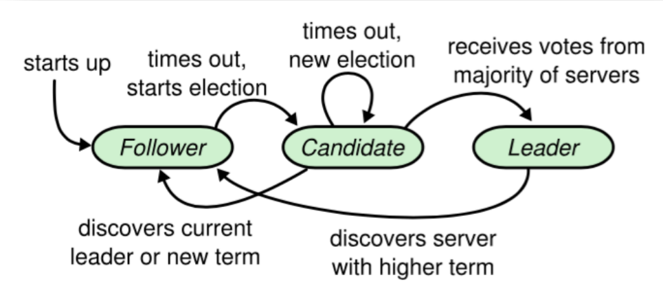
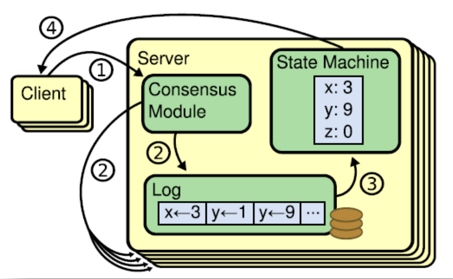
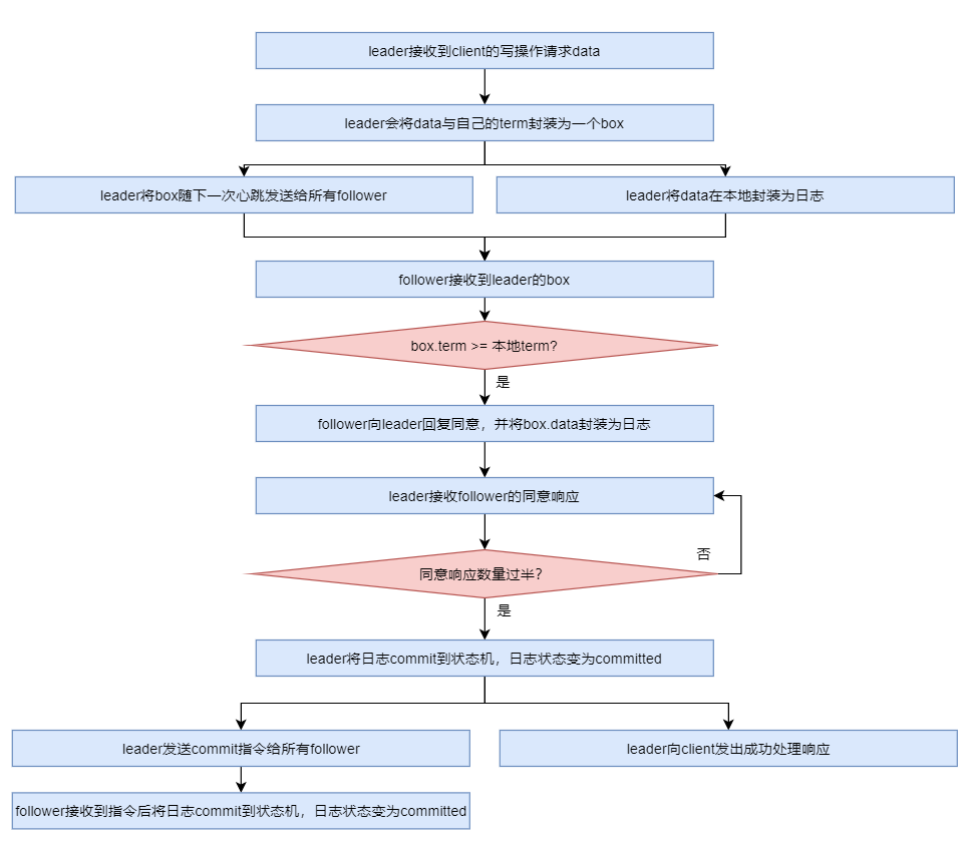
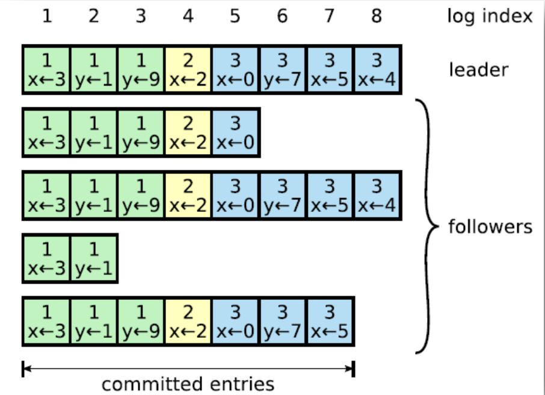

## 一、Raft基础

​	Raft 算法是一种通过对日志复制管理来达到集群节点一致性的算法。这个日志复制管理发生在集群节点中的 Leader 与 Followers 之间。**Raft 通过选举出的 Leader 节点负责管理日志复制过程，以实现各个节点间数据的一致性**。

### 1.1 角色、任期及角色转变

在 Raft 中，节点有三种角色：

- Leader：**唯一负责**处理客户端**写请求**的节点；也**可以处理**客户端**读请求**；同时负责日志复制工作
- Candidate：Leader 选举的候选人，其可能会成为 Leader。**是一个选举中的过程角色。**
- Follower：可以处理客户端读请求；负责同步来自于 Leader 的日志；当**接收到其它Cadidate 的投票请求后可以进行投票**；当**发现 Leader 挂了，其会转变为 Candidate 发起Leader 选举**

## 二、leader 选举

​	通过 Raft 算法首先要实现集群中 Leader 的选举。

### 2.1 我要选举

​	若 **follower** 在**心跳超时范围内**没有接收到来自于 **leader 的心跳**，则**认为 leader 挂了**。此时其首先会使其**本地 term 增一**。然后 follower 会完成以下步骤：

1. 此时若接收到了其它 candidate 的投票请求，则会将选票投给这个 candidate（**在成为candidate之前，且每个节点只会有一票**）
2. 由 follower 转变为 candidate
3. 若**之前尚未投票**，则**向自己投一票**
4. 向其它节点发出投票请求，然后等待响应（**无论是否投票给自己，都会请求其他节点为自己投票**）

### 2.2 我要投票

​	follower 在接收到投票请求后，其会根据以下情况来**判断是否投票**：

- 发来投票请求的 candidate 的 term 不能小于我的 term
- 在我当前 term 内，我的选票还没有投出去
- 若接收到多个 candidate 的请求，我将采取 first-come-first-served 方式投票

### 2.3 等待响应

​	当一个 Candidate **发出投票请求后会等待其它节点的响应结果**。这个响应结果可能有三种情况：

- 收到过半选票，成为新的 leader。然后会将消息广播给所有其它节点，以告诉大家我是新的 Leader 了
- 接收到别的 candidate 发来的新 leader 通知，比较了**新 leader 的 term 并不比自己的 term小**，则**自己转变为 follower**
- 经过一段时间后，没有收到过半选票，也没有收到新 leader 通知，则重新发出选举

### 2.4 选举时机

​	在很多时候，当 Leader 真的挂了，Follower 几乎同时会感知到，所以它们几乎同时会变为 candidate 发起新的选举。此时就**可能会出现较多 candidate 票数相同的情况，即无法选举出 Leader**。

​	为了防止这种情况的发生，**Raft 算法采用了 randomized election timeouts 策略**来解决这个问题。其会**为这些 Follower 随机分配一个选举发起时间 election timeout，这个 timeout在 150-300ms 范围内**。只有**到达了 election timeout 时间的 Follower 才能转变为 candidate，否则等待**。那么 election timeout 较小的 Follower 则会转变为 candidate 然后先发起选举，一般情况下其会优先获取到过半选票成为新的 leader。

## 三、数据同步

​	在 Leader 选举出来的情况下，通过日志复制管理实现集群中各节点数据的同步。

### 3.1  状态机

​	Raft 算法一致性的实现，是基于日志复制状态机的。状态机的最大特征是，不同 Server（Leader+Follower）中的状态机若**当前状态相同**，然后**接受了相同的输入**，则**一定会得到相同的输出**。

### 3.2 处理流程

### 3.3 支持AP(保证可用性，牺牲一致性)

​	如上图所示，**每个节点的Log 由 term index（可以认为是版本号）、log index 及 command（每个节点一个） 构成**。为了保证可用性，**各个节点中的日志可以不完全相同**，但 **leader 会不断给 follower 发送 box，以使各个节点的 log 最终达到相同**。即 raft 算法不是强一致性的，而是最终一致的（或者说是弱一致性的）。