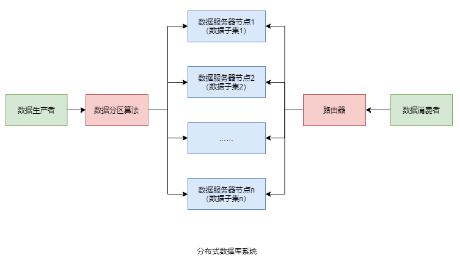
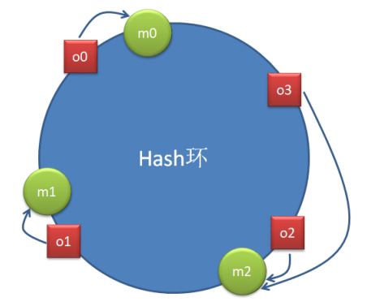
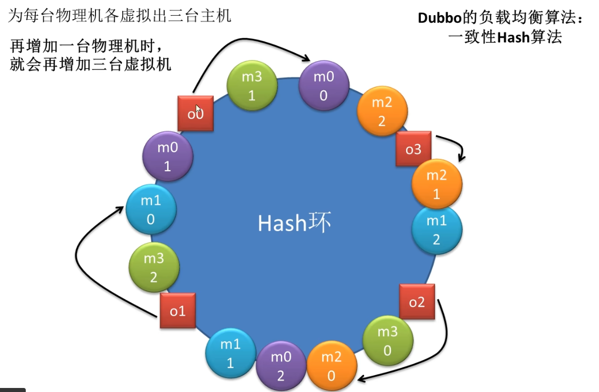
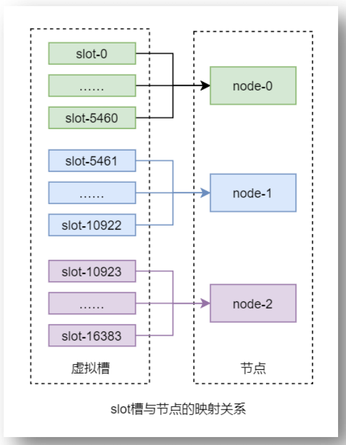

## 一、Redis分布式系统

​	Redis 分布式系统，官方称为 Redis Cluster，Redis 集群，其是 Redis 3.0 开始推出的分布式解决方案。其可以很好地解决**不同 Redis 节点存放不同数据**，并**将用户请求方便地路由到不同 Redis** 的问题。

## 二、数据分区算法

​	分布式数据库系统会根据不同的数据分区算法，将**数据分散存储到不同的数据库服务器节点**上，**每个节点管理着整个数据集合中的一个子集**。

​	常见的数据分区规则有两大类：**顺序分区**与**哈希分区**。

### 2.1 顺序分区

​	顺序分区规则可以将数据**按照某种顺序平均分配到不同的节点**。不同的顺序方式，产生了不同的分区算法。例如，轮询分区算法、时间片轮转分区算法、数据块分区算法、业务主题分区算法等。

#### 2.1.1  轮询分区算法

​	**每产生一个数据，就依次分配到不同的节点**。该算法**适合于数据问题不确定的场景**。其分配的结果是，在数据总量非常庞大的情况下，**每个节点中数据是很平均的**。但**生产者与数据节点间的连接要长时间保持**。

#### 2.1.2 时间片轮转分区算法

​	在某个**固定长度的时间片内的数据都会分配到一个节点**。**时间片结束，再产生的数据就会被分配到下一个节点**。这些节点会被依次轮转分配数据。该算法**可能会出现节点数据不平均的情况**（因为每个时间片内产生的数据量可能是不同的）。但生产者与节点间的连接只需占用当前正在使用的这个就可以，其它**连接使用完毕后就立即释放**。

#### 2.1.3 数据块分区算法

​	在整体**数据总量确定的情况**下，根据各个节点的存储能力，可以将连接的**某一整块数据分配到某一节点**。

#### 2.1.4 业务主题分区算法

​	数据可根据不同的业务主题，分配到不同的节点。

### 2.2 哈希分区

​	哈希分区规则是充分**利用数据的哈希值来完成分配**，对数据哈希值的不同使用方式产生了不同的哈希分区算法。哈希分区算法相对较复杂，这里详细介绍几种常见的哈希分区算法。

#### 2.2.1 节点取模分区算法

​	该算法的前提是，**每个节点都已分配好了一个唯一序号，对于 N 个节点的分布式系统，其序号范围为[0, N-1]**。然后选取数据本身或可以代表数据特征的数据的一部分作为 key，**计算 hash(key)与节点数量 N 的模，该计算结果即为该数据的存储节点的序号**。

​	该算法最大的优点是简单，但其也存在较严重的不足。**如果分布式系统扩容或缩容，已经存储过的数据需要根据新的节点数量 N 进行数据迁移，否则用户根据 key 是无法再找到原来的数据的**。生产中扩容**一般采用翻倍扩容（或者减半缩容）方式**，以减少扩容时数据迁移的比例（翻倍扩容可以避免数据的映射全部被打乱导致全量迁移的情况，减半缩容会使每个剩余节点继承保存其偶数倍节点的数据）。

#### 2.2.2  一致性哈希分区算法

​	一致性 hash 算法通过一个叫作**一致性 hash 环**的数据结构实现。这个**环的起点是 0，终点是 2^32 - 1，并且起点与终点重合**。环中间的整数按逆/顺时针分布，故这个环的整数分布范围是[0, 2^32 -1]。

​	上图中存在四个对象 o1、o2、o3、o4，分别代表四个待分配的数据，**红色方块是这四个数据的 hash(o?)在 Hash 环中的落点**。同时，图上还存在三个节点 m0、m1、m2，**绿色圆圈是这三节点的 hash(m?)在 Hash 环中的落点**。

​	现在要为数据分配其要存储的节点。**该数据对象的 hash(o?) 按照逆/顺时针方向距离哪个节点的 hash(m?)最近，就将该数据存储在哪个节点**。这样就会形成上图所示的分配结果。

​	该算法的最大优点是，从**数据迁移**的角度上考虑：**节点的扩容与缩容，仅对按照逆/顺时针方向(上图为顺时针方向)距离该节点最近的节点有影响，对其它节点无影响**；但如果从**负载均衡**的角度上考虑：**新添加的节点只能缓解距离它最近的节点的存储压力**，因此这就变成了一个缺点，为了解决这一问题，通常**将一致性哈希分区算法和虚拟槽分区算法结合**（**每一个主机节点虚拟化为多个虚拟节点**，也是类似于槽的概念，每一个虚拟节点也会随机的落在一致性hash环上，这样一来通过添加一个节点通常就可以缓解多个已有主机节点的存储压力）。

​	当**节点数量较少时，非常容易形成数据倾斜（大量数据集中存储于同一个节点）问题**，且节点变化影响的节点数量占比较大，即影响的数据量较大。所以，**该方式不适合数据节点较少的场景**。

下面给出一致性哈希分区算法和虚拟槽分区算法结合来解决负载均衡问题：

m3的添加同时缓解了m0、m1、m2的压力

#### 2.2.3 虚拟槽分区算法

​	该算法首先**虚拟出一个固定数量的整数集合**，该**集合中的每个整数称为一个 slot 槽**。这个**槽的数量一般是远远大于节点数量**的。然后再**将所有 slot 槽平均映射到各个节点之上**。例如，Redis 分布式系统中共虚拟了 16384 个 slot 槽，其范围为[0, 16383]。假设共有 3 个节点，那么 slot 槽与节点间的映射关系如下图所示：

​	而数据只与 slot 槽有关系，与节点没有直接关系。**数据只通过其 key 的 hash(key)映射到slot 槽：slot = hash(key) % slotNums**。这也是该算法的一个优点，解耦了数据与节点，客户端无需维护节点，只需维护与 slot 槽的关系即可。

​	**Redis 数据分区采用的就是该算法**。其**计算槽点的公式为：slot = CRC16(key) % 16384**。CRC16()是一种带有校验功能的、具有良好分散功能的、特殊的 hash 算法函数。其实 Redis中计算槽点的公式不是上面的那个，而是：**slot = CRC16(key) &16383。**

​	**若要计算 a % b，如果 b 是 2 的整数次幂，那么 a % b = a & (b-1)。**