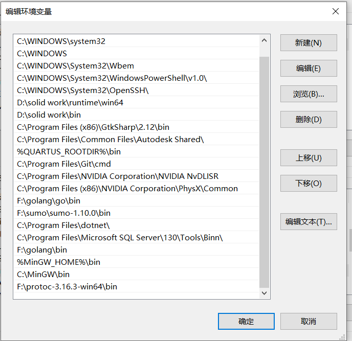
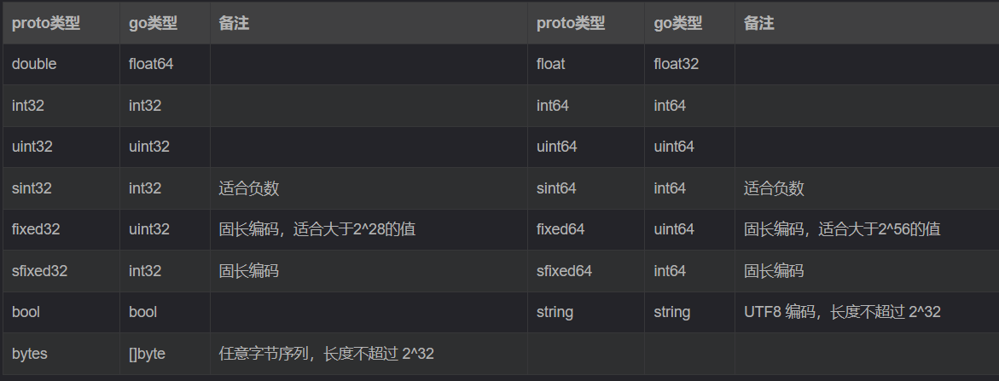
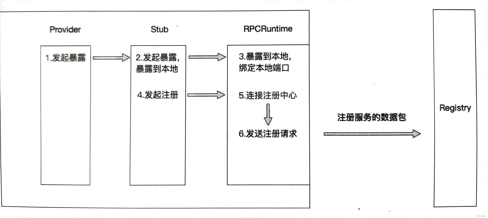
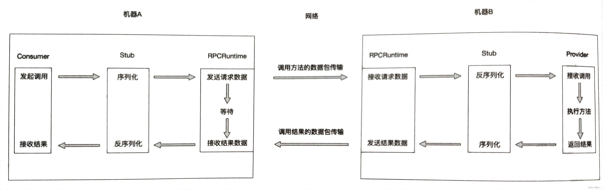
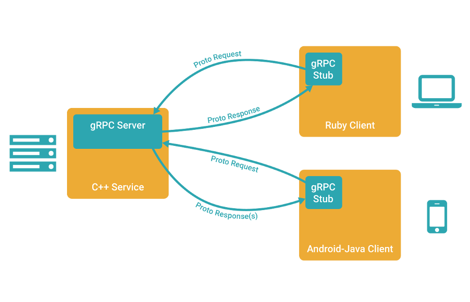

 -

### 一、protobuff

Protobuf是Protocol  Buffers的简称，它是Google公司开发的一种数据描述语言，并于2008年对外开源。Protobuf刚开源时的定位类似于XML、JSON等数据描述语言，通过附带工具生成代码并实现将**结构化数据序列化的功能**。但是我们更关注的是Protobuf作为接口规范的描述语言，可以作为设计安全的跨语言PRC接口的基础工具。

下载网址:

```go
https://github.com/protocolbuffers/protobuf/releases
```

#### 1. 将protobuf配置到环境变量

将protobuf的bin目录加载到Path环境变量中



#### 2. 安装go专属的protoc生成器

```go
go install google.golang.org/protobuf/cmd/protoc-gen-go@latest
```

安装成功后将在GOPATH/bin路径下生成protobuf的编译器插件 protoc-gen-go.exe , 执行protoc命令时会调用这个插件。


#### 3. 如何使用protobuff

1.定义一种源文件类型 .proto , 使用这种源文件按照特定格式存放我们的消息

2.使用对应语言的protoc编译器(go语言就是protoc-gen-go.exe)，它可以将 .proto 类型的源文件编译转化为对应语言的源文件(比如说转化为 .go文件)

#### 4. 举例

##### 1.首先需要在IDE中安装相应的protocal buffers插件，这样IDE就能识别.proto文件的语法格式

##### 2.编写proto文件

```protobuf
//指定当前proto语法版本(V2 or V3)
syntax = "proto3";

//指定生成后的go packet的存放目录
//路径格式为: "path:name","path"就是存放路径目录文件(如果没有会自行创建该目录),"name"为go文件所属包名
option go_package = "./service";  //在当前目录下的service目录中创建go文件

//指定go文件所属包名
package service;

//要转换的消息实体
message User{
  string username = 1;
  int32 age = 2;
}
```

##### 3.使用protoc编译器转化为go源文件

```protobuf
protoc --go_out=.  .\pb.proto  //--go_out=. 不能存在任何空格
```

--go_out=./ 与 option go_package 共同指定编译后生成的go文件存放的位置：首先切换到路径go_out指定的目录，依次为基础切换到option go_package指定路径下创建对应目录和go源文件

##### 4.使用新产生的go文件转化后的User消息

```go
package main
import (
	"fmt"
	"google.golang.org/protobuf/proto"
	"pbMyself/service"
)
func main() {
	//新的go文件中的消息结构体
	user := &service.User{
		Username: "Tom",
		Age:      18,
	}
	//进行序列化
	marshal, err := proto.Marshal(user)
	if err != nil {
		panic(err)
	}
	//进行反序列化
	newUser := new(service.User)
	err = proto.Unmarshal(marshal, newUser)
	if err != nil {
		panic(err)
	}
	fmt.Println(newUser)
}

```

#### 5. proto文件说明

##### 5.1 message关键字

用来定义一种类型的消息

##### 5.2 指定字段规则

protobuffer中字段规则包括一下三种：

- required：实例中必须包含的字段(在protobuffer3中,字段的默认类型即为required)
- optional：实例中可以选择性包含的字段，若实例没有指定，则为默认值，若没有设置该字段的默认值，其值是该类型的默认值。如string默认值为""，bool默认值为false,整数默认值为0。
- repeated: 可以有多个值的字段，这类变量类似于vector，可以存储此类型的多个值，在go中表现为切片类型

##### 5.3 变量标识号

在proto[数据结构](https://so.csdn.net/so/search?q=数据结构&spm=1001.2101.3001.7020)中，每一个变量都有唯一的数字标识(例如：string username = 1, int32 age = 2)。这些标识符的作用是在二进制格式中识别各个字段的，一旦开始使用就不可再改变。

```go
此处需要注意的是1-15之内的标号在存储的时候只占一个字节，而大于15到162047之间的需要占两个字符，所以我们尽量为频繁使用的字段分配1-15内的标识号。另外19000-19999之内的标识号已经被预留，不可用。最大标识号为2^29-1。
```

##### 5.4 标量类型(Scalar)



标量类型如果没有被赋值，则不会被序列化，反序列化解析时，会赋予默认值。

- strings：空字符串
- bytes：空序列
- bools：false
- 数值类型：0

#### 6. 嵌套消息(Message)与服务(Service)

##### 6.1 嵌套消息

可以在其他消息类型中定义/使用消息类型，在下面的例子中，Person类型消息就定义在了PersonInfo类型消息内

```protobuf
//嵌套消息
message PersonInfo{
  message Person{
    string name = 1;
    int32 height = 2;
    repeated int32 weight = 3;
  }
  repeated Person info = 1;  //Person类型
}
```

如果想要在PersonInfo之外使用Person这个消息类型，需要以PersonInfo.Person的形式使用它：

```protobuf
message PersonMessage{
  PersonInfo.Person info = 1;
}
```

当然，也可以将message嵌套任意多层。

##### 6.2 定义服务(Service)

message消息要想在RPC中使用，就必须用在RPC服务接口上，RPC服务接口的定义方式如下：

```protobuf
message SearchRequest {

}

message SearchResponse {

}
//RPC服务接口
service SearchService {
  //rpc关键字  服务函数名  (传入参数) returns关键字 (传出参数)
  rpc Search(SearchRequest) returns (SearchResponse);
}
```

上述的service定义了一个RPC服务，该接口内的Search()方法接收一个SearchRequest再返回一个SearchResponse。

### 二、RPC介绍

#### 1. RPC是什么

RPC（Remote Procedure  Call）叫作远程过程调用，它是利用网络从远程计算机上请求服务，可以理解为把程序的一部分放在其他远程计算机上执行。通过网络通信将调用请求发送至远程计算机后，利用远程计算机的系统资源执行这部分程序，最终返回远程计算机上的执行结果。

#### 2. RPC的核心组成部分

RPC主要设计五个部分：

- **user**（服务调用方）
- **user-stub**（调用方的本地存根）
- **RPCRuntime**（RPC通信者）
- **server-stub**（服务端的本地存根）
- **server**（服务端）

服务调用方、调用方的本地存根及其一个RPC通信包的实例存在于调用者的机器上；而服务提供方、服务提供方的存根及另一个RPC通信包的实例存在于被调用的机器上。

##### 2.1  服务调用方（Consumer）

服务调用方也叫服务消费者，它的职责之一是提供需要调用的接口的全限定名和方法，调用方法的参数给调用端的本地存根；职责之二是从调用方的本地存根中接收执行结果。

##### 2.2 服务提供方（Provider）

服务提供方就是服务端，它的职责就是提供服务，执行接口实现的方法逻辑，也就是为服务提供方的本地存根提供方法的具体实现。

##### 2.3 本地存根（stub）

在远程调用中，对于Consumer发起的函数调用，Provider如何精准的直到自己应该执行哪个函数呢？

这就需要stub了。**Stub的存在就是为了让远程调用像本地调用一样直接进行函数调用，无须关系地址空间隔离、函数不匹配等问题。**

Stub的职责就是**进行类型和参数转化**。

本地存根分为**服务调用方的本地存根**和**服务提供方的本地存根**。

服务调用方的本地存根和服务消费者都属于Consumer端，它们存在于同一台机器上，服务调用放的本地存根会接收Consumer的函数调用，本地存根会解析函数调用的函数名、参数等信息，整理并且组装这些数据，然后将这些数据安装定义好的协议进行序列化，打包成可传输的消息，交给RPCRuntime（RPC通信者）。服务调用方的本地存根除了会处理服务消费者提供的方法、参数、方法参数类型等数据，还会处理服务提供方返回的结果，它会将RPCRuntime返回的数据反序列化成服务调用方所需要的数据结果并传递给服务消费方。

**从服务消费方的角度来看，Stub隐藏了远程调用的实现细节，就像是远程服务的一个代理对象，可以让服务消费方感觉调用远程服务方法就像调用本地方法一样。**

服务提供方的本地存根与服务提供方都属于Provider端，它们一起存在于同一台机器上。当Provider端的RPCRuntime收到请求包后，交由服务提供方的本地存根进行参数等数据的转化。服务提供方的本地存根会重新转换客户端传递的数据，以便在Provider端的机器上找到对应的函数，传递正确的参数数据，最终正确地执行真实函数的调用。等函数执行完成后，服务提供方会将执行结果返回给服务提供方的本地存根，由本地存根再将结果数据序列化、打包，最后交给RPCRuntime。**服务提供方的本地存根与服务调用方的本地存根一样都是充当了翻译员的角色。**


##### 2.4 RPC通信者（RPCRuntime）

RPCRuntime**负责数据包的重传，数据包的确认、数据包路由和加密**等。

在Consumer端和Provider端都会有一个RPCRuntime实例，负责双方之间的通信，可靠地将存根船渡地数据包传输到另一端。

#### 3. RPC调用过程

RPC调用过程可以分为四个阶段，分别是服务暴露过程、服务发现过程、服务引用过程和方法调用过程。

##### 3.1 服务暴露的过程

服务暴露又称服务导出，服务导出的叫法相对于服务暴露更加形象一些。**服务暴露发生在Provider端。**

**根据服务是否暴露到远程可以分为两种，一种是服务只暴露到本地，另一种则是暴露到远程。**

- **服务只暴露在本地**：在一台机器上，**一个应用服务可以认为是机器上的一个进程**，当该进程启动后，如果不进行服务暴露，那么该进程不会绑定一个端口用于监听和接收Consumer端的连接和请求，反之，该进程会监听本地的端口。**绑定并且监听本地端口的动作则是由前面提到的RPCRuntime完成的**。比如一个Dubbo服务，默认的协议端口是20880，当进程启动后，应用服务进程会监听20880端口。**当应用进程准备好所有应该暴露的服务并且完成端口的绑定和监听后，服务暴露到本地的过程也随之结束**。

- **暴露到远程**：其中的远程其实是指有一个统一的管理中心来管理所有应用服务的地址和服务信息，这个统一的管理中心就是**注册中心(Registry)**。**应用服务暴露到远程的第一步也是在本地绑定端口，过程与暴露到本地一模一样，但是当本地端口绑定完成后，还需要将Provider端的应用服务信息注册到注册中心**。

  



**Provider端的应用服务信息包括Provider端的地址、端口、应用服务需要暴露的接口定义信息等**。Provider 端除了会在应用服务启动的时候将服务信息注册到注册中心，还会与注册中心**保持心跳保活,如果Provider端某个节点异常下线**，注册中心在一段时间的保活检查后，就会**将该节点的信息从注册中心中移除，防止Consumer端把请求发送到该下线的节点上**。因为业务迭代迅速，服务端的服务变动及上下线很频繁，通过注册中心管理服务的地址信息可以让客户端动态地感知服务变动，并且**客户端不需要再显式地配置服务端地址，只要配置注册中心地址即可，而注册中心集群一般不会变动**。注册中心的内容会在后续更新介绍。

##### 3.2 服务发现的过程

**服务发现的过程发生在(Consumer)端**，服务发现的过程也就是寻址的过程，Consumer端如果要发起RPC调用，则需要先知道自己想要调用的应用服务有哪些服务提供者，也就是需要知道这些服务提供者的地址和端口。

**服务发现的方式有两种，分别是直连式和注册中心式，对应的是Provider端的两种服务暴露方式**。

**直连式**：服务消费者可以根据服务暴露的地址和端口直接连接远程服务，但是每次服务提供者的地址和端口变更后，服务消费者都需要随之变更配置的地址和端口。这种方式不建议在生产环境中使用，更多被用来做服务测试。而且直连式不适合服务治理。**如果Provider端的应用服务仅仅暴露在本地，则Consumer端只能通过直连式来做服务发现**。

**注册中心式**：服务消费者通过注册中心进行服务发现。也就是**服务提供者的地址和端口从注册中心获取**。当服务提供者变化时，注册中心能够通知服务消费者有关服务提供者的变化。如果Provider端采用暴露到远程的方式暴露服务，则Consumer端可以选择直连式和注册中心式进行服务发现。

##### 3.3 服务引用的过程

**服务引用的过程发生在服务发现之后**，当Consumer端通过服务发现获取所有服务提供者的地址后，通过负载均衡策略选择其中一个服务提供者的节点进行服务引用。**服务引用的过程就是与某一个服务节点建立连接，以及在Consumer端创建接口的代理的过程。其中建立连接也就是两端的RPCRuntime 建立连接的过程。**

##### 3.4 方法调用的过程

当服务引用完成后，Consumer端与Provider端已经建立了连接，可以进行方法的调用。



(1)服务消费者以本地调用方式(即以接口的方式)调用服务，它会将需要调用的方法、参数类型、参数传递给服务消费方的本地存根。

(2)服务消费方的本地存根收到调用后，负责将方法、参数等数据组装成能够进行网络传输的消息体(将消息体对象序列化为二进制数据)，并将该消息体传输给RPC通信者。

(3)Consumer 端的RPC通信者通过sockets 将消息发送到Provider端，由Provider端的RPC通信者接收。Provider端将收到的消息传递给服务提供方的本地存根。

(4)服务提供方的本地存根收到消息后将消息对象反序列化。

(5)服务提供方的本地存根根据反序列化的结果解析出服务调用的方法、参数类型、参数等信息，并调用服务提供方的服务。

(6)服务提供方执行对应的方法后，将执行结果返回给服务提供方的本地存根。

(7)服务提供方的本地存根将返回结果序列化，并且打包成可传输的消息体，传递给Provider端的RPC通信者。

(8) Provider端的RPC通信者通过sockets将消息发送到Consumer端，由Consumer端的RPC通信者接收。Consumer端将收到的消息传递给服务消费方的本地存根。

(9)服务消费方的本地存根收到消息后将消息对象反序列化。反序列化出来的是方法执行的结果，并将结果传递给服务消费者。

(10)服务消费者得到最终执行结果。

**服务暴露、服务发现、服务引用和方法调用这四个阶段组成了整个RPC的执行过程。**

### 三、gRPC介绍

#### 1. gRPC是什么

在 gRPC 里客户端应用可以像调用本地对象一样直接调用另一台不同的机器上服务端应用的方法，使得您能够更容易地创建分布式应用和服务。与许多 RPC 系统类似，**gRPC 也是基于以下理念：定义一个服务，指定其能够被远程调用的方法（包含参数和返回类型）。在服务端实现这个接口，并运行一个 gRPC 服务器来处理客户端调用。在客户端拥有一个存根能够调用像服务端一样的方法。**



官方网站: https://grpc.io/

底层协议: 

- HTTP2:https://github.com/grpc/grpc/blob/master/doc/PROTOCOL-HTTP2.md
- GRPC-WEB:https://github.com/grpc/grpc/blob/master/doc/PROTOCOL-WEB.md

#### 2. gRPC使用实例

下载grpc插件：

```go
go install google.golang.org/grpc/cmd/protoc-gen-go-grpc@latest
```

这样，protoc-gen-go-grpc.exe可执行程序会被下载到 GOPATH/bin 目录下。

编写一个用于测试的 proto 文件 ( grpc_product.proto  ):

```protobuf
syntax = "proto3";

option go_package = "../service";

package service;

message ProductRequest{

  uint32 req_id = 1;
}
message ProductResponse{

  uint32 res_id = 1;
}

//rpc服务接口,包括所有rpc服务方法
service ProductService {
  rpc service(ProductRequest) returns (ProductResponse);  //注册的服务,根据传入的ProductRequest返回一个ProductResponse
}
```

使用protoc-gen-go-grpc.exe生成rpc service相关go文件(同时也要调用protoc-gen-go.exe生成message相关go文件)：

```shell
protoc --go_out=.  --go-grpc_out=.  .\grpc_product.proto
```

> 注：protoc-gen-go.exe生成message的相关go文件，protoc-gen-go-grpc.exe生成service相关go文件

下面给出 `rpc服务端` 代码：

```go
1 package main
2 import (
3 	"fmt"
4	"google.golang.org/grpc"
5	"net"
6	"probuff_test/service"
7 )
8 func main() {
9	rpcService := grpc.NewServer() //生成rpc服务端对象
10	ServiceObject := new(service.ServiceProduct)  //实例化一个对象，该对象实现了ProductServiceServer接口
11	service.RegisterProductServiceServer(rpcService, ServiceObject) //为rpc服务端对象注册服务(也就是将上述对象的方法作为回调函数)
12	listen, err := net.Listen("tcp", "127.0.0.1:10101")
13	if err != nil {
14		fmt.Printf("Listening is err: %v\n", err)
15		return
16	}
17	if err := rpcService.Serve(listen); err != nil { //rpc服务端对象进行服务暴露(监听对应tcp地址)
18		fmt.Printf("rpc server expose is err: %v\n", err)
19		return
20	}
21 }
```

注意：

- 第10行我们new了一个service.ServiceProduct类的对象ServiceObject，它实现了ProductServiceServer接口(需要我们手动进行实现)，这个接口就是我们在 grpc_product.proto给出的  ProductService 的service 通过 protoc-gen-go-grpc.exe 工具生成的。
- 11行就是为我们生成的rpcService绑定这个ServiceObject对象，此对象中被实现的接口方法会作为回调函数在rpc服务端被远程调用时启动。

下面给出`service.ServiceProduct类`的实现：

```go
package service
import "context"

// 实现服务器的grpc接口(ProductServiceServer接口)
type ServiceProduct struct {
}
func (sp *ServiceProduct) Service(context context.Context, req *ProductRequest) (*ProductResponse, error) {
	result := sp.GetResult(req.ReqId)
	return &ProductResponse{ResId: result}, nil
}
func (sp *ServiceProduct) mustEmbedUnimplementedProductServiceServer() {

}
func (sp *ServiceProduct) GetResult(reqID uint32) uint32 {
	return (reqID + 100)
}
```

最后给出`rpc客户端`的实现：

```go
package main
import (
	"context"
	"fmt"
	"google.golang.org/grpc"
	"google.golang.org/grpc/credentials/insecure"
	"probuff_test/service"
)
func main() {
	dial, err := grpc.Dial(":10101", grpc.WithTransportCredentials(insecure.NewCredentials())) //客户端连接服务器
	if err != nil {
		fmt.Println("RPC Client dial Service is err: ", err)
		return
	}
	defer dial.Close()

	client := service.NewProductServiceClient(dial)   //根据conn socket实例化一个rpc客户端对象
	response, err := client.Service(context.Background(), &service.ProductRequest{ReqId: 100}) //rpc客户端向rpc服务端发送ProductRequest请求，然后获取ProductResponse。整个过程就是在本地调用Service方法
	if err != nil {
		fmt.Println("rpc client request is err: ", err)
		return
	}
	fmt.Printf("remoter call is succeed, resid :%v\n", response.ResId)  //显示ProductResponse回应结果
}

```

#### 3. 安全传输

客户端与服务端之间的rpc调用，我们可以通过加入证书的方式，实现调用的安全性。

grpc使用的证书来自于TLS协议，关于TLS协议相关内容请阅读：SSL/TLS/HTTPS详解。

##### 3.1 生成自签证书

生产环境下可以购买证书或者使用一些平台发放的免费证书

- 安装openssl

​		windows版本：http://slproweb.com/products/Win32OpenSSL.html

​		配置PATH环境变量


```
openssl version  可以查看版本
```

- 生成私钥文件

```shell
openssl genrsa -des3 -out ca.key 2048  ##需要输入密码
```

- 创建证书请求

```shell
openssl req  -new  -key server.key -out server.csr
```

- 生成ca.crt

```shell
openssl x509 -req -days 365 -in server.csr -signkey  server.key -out ca.crt
```

找到openssl.conf文件：

