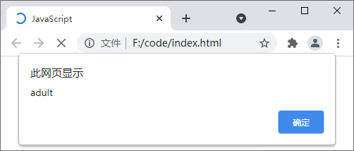
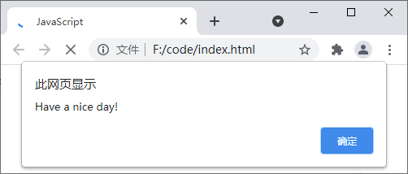
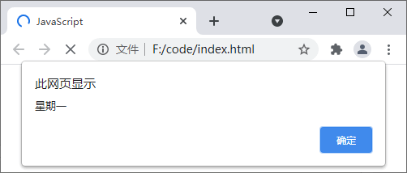

## 一、JS的条件判断语句

[Java](http://c.biancheng.net/java/)Script 中支持以下几种不同形式的条件判断语句：

- if 语句；
- if else 语句；
- if else if else 语句；
- switc case 语句。

## 二、if 语句

if 语句是 JavaScript 中最简单的条件判断语句，语法格式如下：

```
if(条件表达式){
    // 要执行的代码;
}
```

当条件表达式成立，即结果为布尔值 true 时，就会执行` { } `中的代码。

```html
<!DOCTYPE html>
<html lang="en">
    <head>
        <meta charset="UTF-8">
        <title>JavaScript</title>
    </head>
    <body>
        <script type="text/javascript">
            var age = 20;
            if(age >= 18){      // 如果 age >= 18 的结果为 true，则执行下面 { } 中的代码
                alert("adult");
            }
        </script>
    </body>
</html>
```

运行结果如下图所示：



## 三、if else 语句

if else 语句是 if 语句的升级版，它不仅可以指定当表达式成立时要执行的代码，还可以指定当表达式不成立时要执行的代码，语法格式如下：

```html
if(条件表达式){
    // 当表达式成立时要执行的代码
}else{
    // 当表达式不成立时要执行的代码
}
```

```html
<!DOCTYPE html>
<html lang="en">
    <head>
        <meta charset="UTF-8">
        <title>JavaScript</title>
    </head>
    <body>
        <script type="text/javascript">
            var now = new Date();           // 获取当前的完整日期
            var dayOfWeek = now.getDay();   // 获取一个 0-6 之间的数字，用来表示当前是星期几，0 表示星期日、1 表示星期一、以此类推
            if (dayOfWeek > 0 && dayOfWeek < 6) {       // 判断：如果当前是星期一到星期五中的一天，则输出“Have a nice day!”，若不是则输出“Have a nice weekend!”
                alert("Have a nice day!");
            } else {
                alert("Have a nice weekend!");
            }
        </script>
    </body>
</html>
```

运行结果如下图所示：



## 四、if - else if - else 语句

if 和 if else 语句都只有一个条件表达式，而 if else if else 语句是它们更高级的形式，在 if else if else 语句中允许您定义多个条件表达式，并根据表达式的结果执行相应的代码，语法格式如下：

```js
if (条件表达式 1) {
    // 条件表达式 1 为真时执行的代码
} else if (条件表达式 2) {
    // 条件表达式 2 为真时执行的代码
}
...
  else if (条件表达式N) {
    // 条件表达式 N 为真时执行的代码
} else {
    // 所有条件表达式都为假时要执行的代码
}
```

```html
<!DOCTYPE html>
<html lang="en">
    <head>
        <meta charset="UTF-8">
        <title>JavaScript</title>
    </head>
    <body>
        <script type="text/javascript">
            var now = new Date();           // 获取当前的完整日期
            var dayOfWeek = now.getDay();   // 获取一个 0-6 之间的数字，用来表示当前是星期几，0 表示星期日、1 表示星期一、以此类推
            if(dayOfWeek == 0) {            // 判断当前是星期几
                alert("星期日")
            } else if(dayOfWeek == 1) {
                alert("星期一")
            } else if(dayOfWeek == 2) {
                alert("星期二")
            } else if(dayOfWeek == 3) {
                alert("星期三")
            } else if(dayOfWeek == 4) {
                alert("星期四")
            } else if(dayOfWeek == 5) {
                alert("星期五")
            } else {
                alert("星期六")
            }
        </script>
    </body>
</html>
```

运行结果如下图所示：



## 五、switch case语句

switch case 语句的语法格式如下：

```js
switch (表达式){
    case value1:
        statements1  // 当表达式的结果等于 value1 时，则执行该代码
        break;
    case value2:
        statements2  // 当表达式的结果等于 value2 时，则执行该代码
        break;
        ......
    case valueN:
        statementsN  // 当表达式的结果等于 valueN 时，则执行该代码
        break;
    default :
        statements  // 如果没有与表达式相同的值，则执行该代码
}
```

