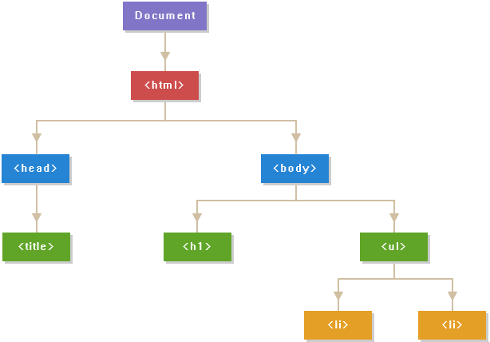

## 一、DOM是什么

文档对象模型（Document Object Model，简称 DOM），是一种与平台和语言无关的模型，用来表示 HTML 或 XML 文档。文档对象模型中定义了文档的逻辑结构，以及程序访问和操作文档的方式。

 **当网页加载时，浏览器就会自动创建当前页面的文档对象模型（DOM）**。在 DOM 中，**文档的所有部分（例如元素、属性、文本等）都会被组织成一个逻辑树结构（类似于族谱）**，树中每一个分支的终点称为一个节点，**每个节点都是一个对象**，如下图所示：



借助 DOM 您可以使用 JavaScript 来访问、修改、删除或添加 HTML 文档中的任何内容。

## 二、Document 对象

当浏览器加载一个 HTML 文档时，会创建一个 Document 对象，**Document 对象是 DOM 树中所有节点的根节点**。**通过 Document 对象我们可以访问 HTML 文档中的所有元素。**

> 提示：Document 对象是 Window 对象的一部分，所以您**可以通过 window.document 来访问 Document 对象。**

## 三、Document 对象中的属性

下表中列举了 Document 对象中提供的属性及其描述：

| 属性                         | 描述                                                         |
| ---------------------------- | ------------------------------------------------------------ |
| document.activeElement       | 返回当前获取焦点的元素                                       |
| document.anchors             | 返回对文档中所有 Anchor 对象的引用                           |
| document.applets             | 返回对文档中所有 Applet 对象的引用。注意: HTML5 已不支持 <applet> 元素 |
| document.baseURI             | 返回文档的基础 URI                                           |
| document.body                | 返回文档的 body 元素                                         |
| document.cookie              | 设置或返回与当前文档有关的所有 cookie                        |
| document.doctype             | 返回与文档相关的文档类型声明 (DTD)                           |
| document.documentElement     | 返回文档的根节点                                             |
| document.documentMode        | 返回浏览器渲染文档的模式                                     |
| document.documentURI         | 设置或返回文档的位置                                         |
| document.domain              | 返回当前文档的域名                                           |
| document.domConfig           | 已废弃，返回 normalizeDocument() 被调用时所使用的配置        |
| document.embeds              | 返回文档中所有嵌入内容（embed）的集合                        |
| document.forms               | 返回文档中所有 Form 对象的引用                               |
| document.images              | 返回文档中所有 Image 对象的引用                              |
| document.implementation      | 返回处理该文档的 DOMImplementation 对象                      |
| document.inputEncoding       | 返回文档的编码方式                                           |
| document.lastModified        | 返回文档的最后修改日期                                       |
| document.links               | 返回对文档中所有 Area 和 Link 对象的引用                     |
| document.readyState          | 返回文档状态（载入中）                                       |
| document.referrer            | 返回载入当前文档的 URL                                       |
| document.scripts             | 返回页面中所有脚本的集合                                     |
| document.strictErrorChecking | 设置或返回是否强制进行错误检查                               |
| document.title               | 返回当前文档的标题                                           |
| document.URL                 | 返回文档的完整 URL                                           |

## 四、Document 对象中的方法

下表中列举了 Document 对象中提供的方法及其描述：

| 方法                              | 描述                                                         |
| --------------------------------- | ------------------------------------------------------------ |
| document.addEventListener()       | 向文档中添加事件                                             |
| document.adoptNode(node)          | 从另外一个文档返回 adapded 节点到当前文档                    |
| document.close()                  | 关闭使用 document.open() 方法打开的输出流，并显示选定的数据  |
| document.createAttribute()        | 为指定标签添加一个属性节点                                   |
| document.createComment()          | 创建一个注释节点                                             |
| document.createDocumentFragment() | 创建空的 DocumentFragment 对象，并返回此对象                 |
| document.createElement()          | 创建一个元素节点                                             |
| document.createTextNode()         | 创建一个文本节点                                             |
| document.getElementsByClassName() | 返回文档中所有具有指定类名的元素集合                         |
| document.getElementById()         | 返回文档中具有指定 id 属性的元素                             |
| document.getElementsByName()      | 返回具有指定 name 属性的对象集合                             |
| document.getElementsByTagName()   | 返回具有指定标签名的对象集合                                 |
| document.importNode()             | 把一个节点从另一个文档复制到该文档以便应用                   |
| document.normalize()              | 删除空文本节点，并合并相邻的文本节点                         |
| document.normalizeDocument()      | 删除空文本节点，并合并相邻的节点                             |
| document.open()                   | 打开一个流，以收集来自 document.write() 或 document.writeln() 方法的输出 |
| document.querySelector()          | 返回文档中具有指定 CSS 选择器的第一个元素                    |
| document.querySelectorAll()       | 返回文档中具有指定 CSS 选择器的所有元素                      |
| document.removeEventListener()    | 移除文档中的事件句柄                                         |
| document.renameNode()             | 重命名元素或者属性节点                                       |
| document.write()                  | 向文档中写入某些内容                                         |
| document.writeln()                | 等同于 write() 方法，不同的是 writeln() 方法会在末尾输出一个换行符 |

示例代码如下：

```js
document.addEventListener("click", function(){
    document.body.innerHTML = document.activeElement;
    var box = document.createElement('div');
    document.body.appendChild(box);
    var att = document.createAttribute('id');
    att.value = "myDiv";
    document.getElementsByTagName('div')[0].setAttributeNode(att);
    document.getElementById("myDiv").innerHTML = Math.random();
    var btn = document.createElement("button");
    var t = document.createTextNode("按钮");
    btn.appendChild(t);
    document.body.appendChild(btn);
    var att = document.createAttribute('onclick');
    att.value = "myfunction()";
    document.getElementsByTagName('button')[0].setAttributeNode(att);
});
function myfunction(){
    alert(document.title);
}
```

运行上面的代码，点击页面的空白区域，即可输出如下图所示的内容：

