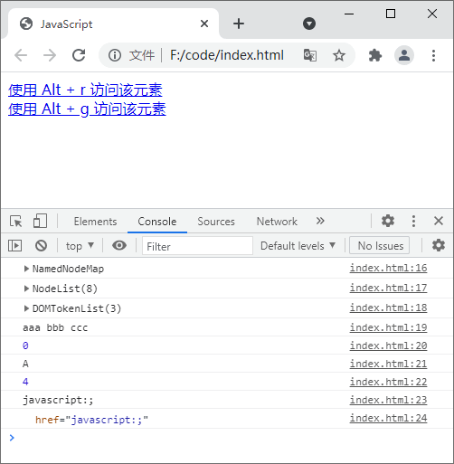

当网页加载时，浏览器就会自动创建当前页面的文档对象模型（DOM），并将文档的所有部分（例如元素、属性、文本等）组织成一个逻辑树结构（类似于族谱），**逻辑树的每一个分支的终点称为一个节点，每个节点都包含一个对象，这个对象就是我们本节要介绍的 Element 对象。**

使用 Document 对象中提供的方法（例如  getElementsByTagName()、getElementById()、getElementsByClassName() 等）可以得到  Element 对象，在 Element 对象中同样也提供了一系列方法和属性，来操作文档中的元素或者元素中的属性。

## 一、Element 对象中的属性

下表中列举了 JavaScript Element 对象中提供的属性及其描述：

| 属性                           | 描述                                                         |
| ------------------------------ | ------------------------------------------------------------ |
| element.accessKey              | 设置或返回一个访问单选按钮的快捷键                           |
| element.attributes             | 返回一个元素的属性数组                                       |
| element.childNodes             | 返回元素的一个子节点的数组                                   |
| element.children               | 返回元素中子元素的集合                                       |
| element.classList              | 返回元素中类名组成的对象                                     |
| element.className              | 设置或返回元素的 class 属性                                  |
| element.clientHeight           | 返回内容的可视高度（不包括边框，边距或滚动条）               |
| element.clientWidth            | 返回内容的可视宽度（不包括边框，边距或滚动条）               |
| element.contentEditable        | 设置或返回元素的内容是否可编辑                               |
| element.dir                    | 设置或返回一个元素中的文本方向                               |
| element.firstChild             | 返回元素中的第一个子元素                                     |
| element.id                     | 设置或者返回元素的 id                                        |
| element.innerHTML              | 设置或者返回元素的内容                                       |
| element.isContentEditable      | 返回元素内容是否可编辑，如果可编辑则返回 true，否则返回 false |
| element.lang                   | 设置或者返回一个元素的语言                                   |
| element.lastChild              | 返回元素的最后一个子元素                                     |
| element.namespaceURI           | 返回命名空间的 URI                                           |
| element.nextSibling            | 返回指定元素之后的兄弟元素，两个元素在 DOM 树中位于同一层级（包括文本节点、注释节点） |
| element.nextElementSibling     | 返回指定元素之后的兄弟元素，两个元素在 DOM 树中位于同一层级（不包括文本节点、注释节点） |
| element.nodeName               | 返回元素名称（大写）                                         |
| element.nodeType               | 返回元素的节点类型                                           |
| element.nodeValue              | 返回元素的节点值                                             |
| element.offsetHeight           | 返回元素的高度，包括边框和内边距，但不包括外边距             |
| element.offsetWidth            | 返回元素的宽度，包括边框和内边距，但不包括外边距             |
| element.offsetLeft             | 返回元素在水平方向的偏移量                                   |
| element.offsetParent           | 返回距离该元素最近的进行过定位的父元素                       |
| element.offsetTop              | 返回元素在垂直方向的偏移量                                   |
| element.ownerDocument          | 返回元素的根元素（文档对象）                                 |
| element.parentNode             | 返回元素的父节点                                             |
| element.previousSibling        | 返回元素之前的兄弟元素，两个元素在 DOM 树中位于同一层级（包括文本节点、注释节点） |
| element.previousElementSibling | 返回元素之前的兄弟元素，两个元素在 DOM 树中位于同一层级（不包括文本节点、注释节点） |
| element.scrollHeight           | 返回元素的完整高度（包括被滚动条隐蔽的部分）                 |
| element.scrollLeft             | 设置或返回元素滚动条距离元素左侧的距离                       |
| element.scrollTop              | 设置或返回元素滚动条距离元素上方的距离                       |
| element.scrollWidth            | 返回元素的完整宽度（包括被滚动条隐蔽的部分）                 |
| element.style                  | 设置或返回元素的样式属性                                     |
| element.tabIndex               | 设置或返回元素的标签顺序                                     |
| element.tagName                | 以字符的形式返回元素的名称（大写）                           |
| element.textContent            | 设置或返回某个元素以及其中的文本内容                         |
| element.title                  | 设置或返回元素的 title 属性                                  |
| element.length                 | 返回对象的长度                                               |

## 二、Element 对象中的方法

下表中列举了 JavaScript Element 对象中提供的方法及其描述：

| 方法                              | 描述                                                         |
| --------------------------------- | ------------------------------------------------------------ |
| element.addEventListener()        | 为指定元素定义事件                                           |
| element.appendChild()             | 为元素添加一个新的子元素                                     |
| element.cloneNode()               | 克隆某个元素                                                 |
| element.compareDocumentPosition() | 比较当前元素与指定元素在文档中的位置，返回值如下：  1：表示两个元素没有关系，不属于同一文档； 2：表示当前元素在指定元素之后； 4：当前元素在指定元素之前； 8：当前元素在指定元素之内； 16：指定元素在当前元素之内； 32：两个元素没有关系，或者它们是同一元素的两个属性。 |
| element.focus()                   | 使元素获得焦点                                               |
| element.getAttribute()            | 通过属性名称获取指定元素的属性值                             |
| element.getAttributeNode()        | 通过属性名称获取指定元素得属性节点                           |
| element.getElementsByTagName()    | 通过标签名获取当前元素下的所有子元素的集合                   |
| element.getElementsByClassName()  | 通过类名获取当前元素下的子元素的集合                         |
| element.hasAttribute()            | 判断元素是否具有指定的属性，若存在则返回 true，不存在则返回 false |
| element.hasAttributes()           | 判断元素是否存在任何属性，若存在则返回 true，不存在则返回 false |
| element.hasChildNodes()           | 判断一个元素是否具有子元素，有则返回 true，没有则返回 false  |
| element.hasFocus()                | 判断元素是否获得了焦点                                       |
| element.insertBefore()            | 在已有子元素之前插入一个新的子元素                           |
| element.isDefaultNamespace()      | 如果指定 namespaceURI 是默认的则返回 true，否则返回 false。  |
| element.isEqualNode()             | 检查两个元素是否相等                                         |
| element.isSameNode()              | 检查当前元素与指定元素是否为同一元素                         |
| element.isSupported()             | 判断当前元素是否支持某个特性                                 |
| element.normalize()               | 合并相邻的文本节点，并删除空的文本节点                       |
| element.querySelector()           | 根据 CSS 选择器，返回第一个匹配的元素                        |
| document.querySelectorAll()       | 根据 CSS 选择器，返回所有匹配的元素                          |
| element.removeAttribute()         | 从元素中删除指定的属性                                       |
| element.removeAttributeNode()     | 从元素中删除指定的属性节点                                   |
| element.removeChild()             | 删除一个子元素                                               |
| element.removeEventListener()     | 移除由 addEventListener() 方法添加的事件                     |
| element.replaceChild()            | 替换一个子元素                                               |
| element.setAttribute()            | 设置或者修改指定属性的值                                     |
| element.setAttributeNode()        | 设置或者修改指定的属性节点                                   |
| element.setUserData()             | 在元素中为指定键值关联对象                                   |
| element.toString()                | 将元素转换成字符串                                           |
| nodelist.item()                   | 返回某个元素基于文档树的索引                                 |

示例代码如下：

```html
<!DOCTYPE html>
<html lang="en">
    <head>
        <meta charset="UTF-8">
        <title>JavaScript</title>
    </head>
    <body onload="accesskey()">
        <a id="r" class="aaa bbb ccc" href="javascript:;">使用 Alt + r 访问该元素</a><br>
        <a id="g" href="javascript:;">使用 Alt + g 访问该元素</a>
        <script type="text/javascript">
            function accesskey(){
                document.getElementById('r').accessKey="r"
                document.getElementById('g').accessKey="g"
            }
            var ele = document.getElementById('r');
            console.log(ele.attributes);                            // 输出：NamedNodeMap {0: id, 1: href, id: id, href: href, length: 2}
            console.log(document.body.childNodes);                  // 输出：NodeList(7) [text, a#r, br, text, a#g, text, script]
            console.log(ele.classList);                             // 输出：DOMTokenList(3) ["aaa", "bbb", "ccc", value: "aaa bbb ccc"]
            console.log(ele.className);                             // 输出：aaa bbb ccc
            console.log(ele.clientHeight);                          // 输出：DOMTokenList(3) ["aaa", "bbb", "ccc", value: "aaa bbb ccc"]
            console.log(ele.tagName);                               // 输出：A
            console.log(ele.compareDocumentPosition(document.getElementById('g')));     // 输出：4
            console.log(ele.getAttribute('href'));                  // 输出：javascript:;
            console.log(ele.getAttributeNode('href'));              // 输出：href="javascript:;"
        </script>
    </body>
</html>
```

运行结果如下图所示：

