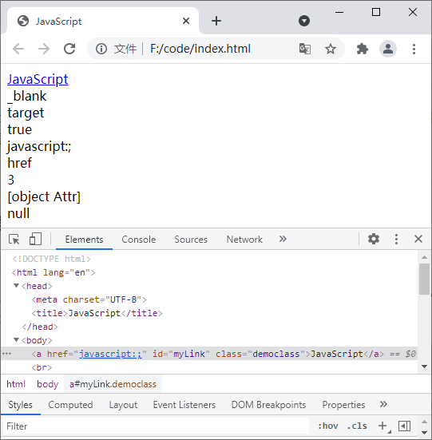

元素属性是指在 HTML 元素的开始标签中用来控制标签行为或提供标签信息的特殊词语。

 在 HTML DOM 中，**通过 attributes 对象来表示 HTML 属性**，**在 attributes 对象中提供了多种添加、修改和删除 HTML 属性的方法**，如下表所示：

| 属性 / 方法               | 描述                                            |
| ------------------------- | ----------------------------------------------- |
| attributes.isId           | 如果属性是 ID 类型，则返回 true，否则返回 false |
| attributes.name           | 返回属性名称                                    |
| attributes.value          | 设置或者返回属性的值                            |
| attributes.specified      | 如果定义了指定属性，则返回 true，否则返回 false |
| nodemap.getNamedItem()    | 从节点列表中返回的指定属性节点                  |
| nodemap.item()            | 返回节点列表中处于指定索引号的节点              |
| nodemap.length            | 返回节点列表的节点数目                          |
| nodemap.removeNamedItem() | 删除指定属性节点                                |
| nodemap.setNamedItem()    | 设置指定属性节点（通过名称）                    |

示例代码如下：

```html
<!DOCTYPE html>
<html lang="en">
    <head>
        <meta charset="UTF-8">
        <title>JavaScript</title>
    </head>
    <body>
        <a href="javascript:;" target="_blank" id="myLink">JavaScript</a><br>
        <script type="text/javascript">
            var atag = document.getElementById('myLink');
            var attr = atag.attributes;
            document.write(attr.target.value + "<br>");                 // 输出：_blank
            document.write(attr.target.name + "<br>");                  // 输出：target
            document.write(attr.target.specified + "<br>");             // 输出：true
            document.write(attr.getNamedItem('href').textContent + "<br>");  // 输出：javascript:;
            document.write(attr.item(0).name + "<br>");                 // 输出：href
            document.write(attr.length + "<br>");                       // 输出：3
            document.write(attr.removeNamedItem('target') + "<br>");    // 输出：[object Attr]
            var cla = document.createAttribute('class');
            cla.value = 'democlass';
            document.write(attr.setNamedItem(cla) + "<br>");            // 输出：null
        </script>
    </body>
</html>
```

运行结果如下图所示：

