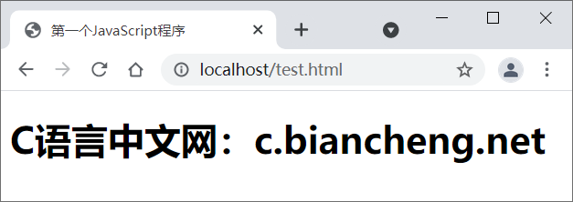
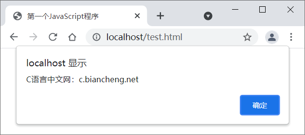

[JavaScript](http://c.biancheng.net/js/) 程序不能够独立运行，只能在宿主环境中执行。一般情况下可以把 [Java](http://c.biancheng.net/java/)Script 代码放在网页中，借助浏览器环境来运行。

## 一、在 HTML 文档中嵌入 JavaScript 代码

在 HTML 页面中嵌入 JavaScript 脚本需要使用 `<script>` 标签，用户可以在 `<script>` 标签中直接编写 JavaScript 代码，具体步骤如下。

 第1步，新建 HTML 文档，保存为 test.html。

 第2步，在 `<head>` 标签内插入一个 `<script>` 标签。

 第3步，为 `<script>` 标签设置`type="text/javascript"`属性。

**现代浏览器默认 `<script>` 标签的脚本类型为 JavaScript，因此可以省略 type 属性；如果考虑到兼容早期版本浏览器，则需要设置 type 属性。**

第4步，在 `<script>` 标签内输入 JavaScript 代码`document.write("<h1>C语言中文网：c.biancheng.net</h1>");`。

```html
<!DOCTYPE html>
<html>
    <head>
        <meta charset="UTF-8">
        <title>第一个JavaScript程序</title>
        <script type="text/javascript">
            document.write("<h1>C语言中文网：c.biancheng.net</h1>");
        </script>
    </head>
    <body></body>
</html>
```

在 JavaScript 脚本中，**document 表示网页文档对象**；**document.write() 表示调用 Document 对象的 write() 方法，在当前网页源代码中写入 HTML 字符串`"<h1>C语言中文网：c.biancheng.net</h1>"`。**



## 二、在脚本文件中编写 JavaScript 代码

JavaScript 程序不仅可以直接放在 HTML 文档中，也可以放在 JavaScript 脚本文件中。**JavaScript 脚本文件是文本文件，扩展名为`.js`，使用任何文本编辑器都可以编辑。**


 新建 JavaScript 文件的步骤如下。

-  第1步，新建文本文件，保存为 test.js。注意，扩展名为`.js`，它表示该文本文件是 JavaScript 类型的文件。

-  第2步，打开 test.js 文件，在其中编写如下 JavaScript 代码。

```javascript
alert("C语言中文网：c.biancheng.net");
```

在上面代码中，**alert() 表示 Window 对象的方法，调用该方法将弹出一个提示对话框，显示参数字符串 "C语言中文网：c.biancheng.net"。**

-  第3步，保存 JavaScript 文件。在此**建议把 JavaScript 文件和网页文件放在同一个目录下**。**JavaScript 文件不能够独立运行，需要导入到网页中，通过浏览器来执行。使用 <script> 标签可以导入 JavaScript 文件。**

-  第4步，新建 HTML 文档，保存为 test.html。

-  第5步，在 <head> 标签内插入一个 <script> 标签。**定义 src 属性，设置属性值为指向外部 JavaScript 文件的 URL 字符串**。代码如下：

```
<script type="text/javascript" src="test.js"></script>
```

注意：**使用＜script＞标签包含外部 JavaScript 文件时，默认文件类型为 Javascript**。因此，**不管加载的文件扩展名是不是 .js，浏览器都会按 JavaScript 脚本来解析。**

-  第6步，保存网页文档，在浏览器中预览，显示效果如图所示。



**定义 src 属性的 <script> 标签不应再包含 JavaScript 代码。如果嵌入了代码，则只会下载并执行外部 JavaScript 文件，嵌入代码将被忽略。**

## 三、JavaScript 代码执行顺序

浏览器在**解析 HTML 文档时，将根据文档流从上到下逐行解析和显示**。JavaScript 代码也是 HTML 文档的组成部分，因此 **JavaScript 脚本的执行顺序也是根据 <script> 标签的位置来确定的。**

**实例**

使用浏览器测试下面示例，会看到 JavaScript 代码从上到下逐步被解析的过程。

```html
<!DOCTYPE html>
<script>
    alert("顶部脚本");
</script>
<html>
    <head>
        <meta charset="UTF-8">
        <title>test</title>
        <script>
            alert("头部脚本");
        </script>
    </head>
    <body>
        <h1>网页标题</h1>
        <script>
            alert("页面脚本");
        </script>
        <p>正文内容</p>
    </body>
    <script>
        alert("底部脚本");
    </script>
</html>
```

在浏览器中浏览上面示例网页，**首先弹出提示文本“顶部脚本”，然后显示网页标题“test”，接着弹出提示文本“头部脚本”，下面才显示一级标题文本“网页标题”，继续弹出提示文本“页面脚本”， 接着显示段落文本“正文内容”，最后弹出提示文本“底部脚本”。**

 你看，**对于导入的 JavaScript 文件，也将按照 ＜script> 标签在文档中出现的顺序来执行**，而且执行过程是文档解析的一部分，不会单独解析或者延期执行。

 **如果想改变 JavaScript 文件的执行顺序，可以给 `<script>` 标签增加 defer 或者 async 属性.**