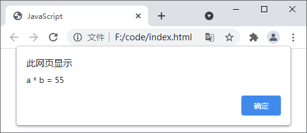

## 一、JS如何输出结果

某些情况下，我们可能需要**将程序的运行结果输出到浏览器中**，JavaScript 中为我们提供了多种不同的输出语句来向浏览器中输出内容：

1. 使用 alert() 函数来弹出提示框；
2. 使用 confirm() 函数来弹出一个对话框；
3. 使用 document.write() 方法将内容写入到 HTML 文档中；
4. 使用 innerHTML 将内容写入到 HTML 标签中；
5. 使用 console.log() 在浏览器的控制台输出内容。

## 二、alert() 函数

使用alert() 函数可以**在浏览器中弹出一个提示框**，**在提示框中我们可以定义要输出的内容**，语法格式如下：

```js
alert(message);
```

其中 message 为要在提示框中输出的内容，需要注意的是，**alert() 中只能输出文本内容**。

**alert() 函数是 window 对象下的一个函数，所以有时为了代码更严谨，我们也可以使用 window.alert() 的形式来调用 alert() 函数。**

示例代码如下：

```html
<!DOCTYPE html>
<html lang="en">
    <head>
        <meta charset="UTF-8">
        <title>JavaScript</title>
    </head>
    <body>
        <script type="text/javascript">
            var a = 11,
                b = 5;
            window.alert("a * b = " + a * b);
        </script>
    </body>
</html>
```

运行结果如下图所示：



## 三、confirm() 函数

confirm() 函数与 alert() 函数相似，它们**都是 window  对象下的函数，同样可以在浏览器窗口弹出一个提示框**，不同的是，使用 **confirm()  函数创建的提示框中，除了包含一个“确定”按钮外，还有一个“取消”按钮**。如果**点击“确定”按钮，那么 confirm() 函数会返回一个布尔值  true**，如果**点击“取消”按钮，那么 confirm() 函数会返回一个布尔值 false**。

```html
<!DOCTYPE html>
<html lang="en">
    <head>
        <meta charset="UTF-8">
        <title>JavaScript</title>
    </head>
    <body>
        <script type="text/javascript">
            var res = window.confirm("这里是要显示的内容");
            if(res == true){
                alert("你点击了“确定”按钮");
            }else{
                alert("你点击了“取消”按钮");
            }
        </script>
    </body>
</html>
```

运行结果如下图所示：


## 四、console.log()

使用 console.log() 可以**在浏览器的控制台输出信息**，我们**通常使用 console.log() 来调试程序**，其语法格式如下：

```js
console.log(message);
```

其中 **message 为要输出的内容**，**可以是字符串或者对象类型**。与 window.alert() 和 window.confirm() 可以分别简写成 alert() 和 confirm() 不同，**console.log() 不能简写**。

要看到 console.log() 的输出内容需要先打开浏览器的控制台。以 Chrome 浏览器为例，要**打开控制台您只需要在浏览器窗口按 F12 快捷键**，或者**点击鼠标右键，并在弹出的菜单中选择“检查”选项**即可。最后，在打开的控制台中选择“Console”选项，如下图所示：


```html
<!DOCTYPE html>
<html lang="en">
    <head>
        <meta charset="UTF-8">
        <title>JavaScript</title>
    </head>
    <body>
        <script type="text/javascript">
            var myArr = ["Chrome","Firefox","Edge","Safari","Opera"];
            console.log(myArr);
        </script>
    </body>
</html>
```

运行结果如下图所示：


## 五、document.write()

使用 document.write() 可以**向 HTML 文档中写入 HTML 或者 JavaScript 代码**，语法格式如下：

```html
document.write(exp1, exp2, exp3, ...);
```

其中 **exp1、exp2、exp3 为要向文档中写入的内容**，document.write() **可以接收多个参数**，即我们可以一次向文档中写入多个内容，**内容之间使用逗号进行分隔**。

```html
<!DOCTYPE html>
<html lang="en">
    <head>
        <meta charset="UTF-8">
        <title>JavaScript</title>
    </head>
    <body>
        <script type="text/javascript">
            document.write("<p>现在的时间是：</p>");
            document.write(Date());
        </script>
    </body>
</html>
```

运行结果如下图所示：


## 六、innerHTML

与前面介绍的几个函数不同，innerHTML **是一个属性而不是一个函数**，通过它**可以设置或者获取指定 HTML 标签中的内容**，示例代码如下：

```html
<!DOCTYPE html>
<html lang="en">
    <head>
        <meta charset="UTF-8">
        <title>JavaScript</title>
    </head>
    <body>
        <div id="demo">JavaScript 输出</div>
        <script type="text/javascript">
            var demo = document.getElementById("demo");
            console.log(demo.innerHTML);
            demo.innerHTML = "<h2>innerHTML</h2>"
        </script>
    </body>
</html>
```

运行结果如下图所示：

