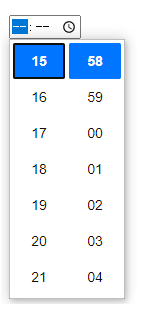
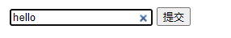
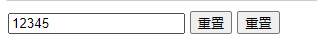
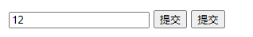

## 一、语法和属性

```html
<input type="" name="" id="" value="" placeholder=""/>
```

- `type`：判断输入信息的类别，此属性值必须写，不写默认是text文本信息（text、password、radio、checkbox...）
- `name`：标明该input名称，可用于设置radio单选操作
- `size：`输入框的长度大小
- `maxlength`：输入框中允许输入字符的最大数
- `readonly` ：表示该框中只能显示，不能添加修改
- `autocomplete` ：是否保存用户输入值，值为on(默认)或off
- `autofocus` ：获取文本框焦点
- `required` ：设置文本框为必填内容
- `pattern` ：设置正则校验
- `value`：给input输入框设置默认值
- `placeholder：`文本提示信息，用来标注该input是干啥的

## 二、type属性

### 2.1 文本域（type="text"）

```html
<form action="" method="" target="">
    <!-- 默认type值为text文本输入框 -->
    <input type="text"/>
</form>
```


**注意:**表单本身并不可见。同时，在大多数浏览器中，文本域的默认宽度是 20 个字符。

### 2.2 密码字段（type="password"）

```html
<form action="" method="" target="">
    <!-- 通过设置type值为password定义密码输入框 -->
    <input type="password"/>
</form>
```


**注意:**密码字段字符不会明文显示，而是以星号或圆点替代。

### 2.3 单选按钮（type="radio"）

```html
<form action="" method="" target="">
    <!-- 通过设置type值为radio定义单选框 -->
    <input type="radio" name="sex" value="male">男
    <input type="radio" name="sex" value="female">女
</form>
```


**注意:**需要设置radio并将**name属性的值写成一致实现单选**

### 2.4 复选框（type="checkbox"）

```html
<form action="" method="" target="">
    <!-- 通过设置type值为checkbox定义复选框 -->
    <input type="checkbox"/>路飞
    <!-- 设置checked属性可以默认勾选 -->
    <input type="checkbox" checked/>索隆
    <input type="checkbox"/>娜美
</form>
```


**注意:**设置checked属性表示默认选中

### 2.5 时分（type="time"）

```html
<form action="" method="" target="">
    <!-- 通过设置type值为time定义时间选择器 -->
    <input type="time"/>
</form>
```



### 2.6 年周（type="week"）

```html
<form action="" method="" target="">
    <!-- 通过设置type值为week定义周选择器-->
    <input type="week"/>
</form>
```


### 2.7 年月（type="month"）

```html
<form action="" method="" target="">
    <!-- 通过设置type值为month定义月份选择器-->
    <input type="month"/>
</form>
```


### 2.8 年月日（type="date"）

```html
<form action="" method="" target="">
    <!-- 通过设置type值为date定义日期选择器-->
    <!-- 通过value可以设置默认时间 -->
    <input type="date" value="2022-01-10">
    <input type="date"/>
</form>
```


### 2.9 年月日时分（type="datetime-local"）

```html
<form action="" method="" target="">
    <!-- 通过设置type值为datetime-local选择日期信息-->
    <input type="datetime-local"/>
</form>
```


### 2.10 文件上传（type="file"）

```html
<form action="" method="" target="">
    <!-- 通过设置type值为file可以上传本地文件-->
    <input type="file"/>
</form>
```


**注意：**设置multiple -- 可以选择多个文件，然后提示用户选中了几个文件

### 2.11 电子邮箱（type="email"）

```html
<form action="" method="" target="">
    <!-- 通过设置type值为email-->
    <input type="email"/>
    <input type="submit" value="提交">
</form>
```


**注意：**输入不是邮箱时，无法提交，并自动给予提示

### 2.12 选择颜色（type="color"）

```vhtml
<form action="" method="" target="">
    <!-- 通过设置type值为color，可以选择颜色-->
    <input type="color"/>
    <input type="submit" value="提交">
</form>
```


### 2.13 网址输入框（type="url"）

```html
<form action="" method="" target="">
    <!-- 通过设置type值为url输入网址-->
    <input type="url"/>
    <input type="submit" value="提交">
</form>
```


注意：输入不是网址时，无法提交，并自动给予提示

### 2.14 可清除输入框（type="search"）

```html
<form action="" method="" target="">
    <!-- 通过设置type值为search-->
    <input type="search"/>
    <input type="submit" value="提交">
</form>
```



**注意：**设置type类型为search，仍是文本框，只是右边多了一个x，点击可以直接清空文本框内容

### 2.15 数字输入框（type="number"）

```html
<form action="" method="" target="">
    <!-- 通过设置type值为number,定义只能输入数字的文本框-->
    <input type="number"/>
</form>
```


**注意**：设置type类型为number，文本框只能输入数字，其他字符一律不能输入，并且右侧可以对数字进行增减

### 2.16 隐藏文本框（type="hidden"）

```html
<form action="" method="" target="" name="f">
    <!-- 通过设置type值为hidden,隐藏文本框-->
    <input type="hidden" value="hello" name="hiddenInfo"/>
</form>
<script type="text/javascript">
    alert("隐藏域的值为："+document.f.hiddenInfo.value)
</script>
```

**注意：**设置type类型为hidden，通常称为隐藏域，在页面无法查看输入框在哪儿

### 2.17 进度条（type="range"）

```html
<form action="" method="" target="" name="f">
    <!-- 通过设置type值为range,定义进度条-->
    <input type="range" step="1" min="0" max="10"  value="5"/>
</form>
```


- min：最小值
- max：最大值
- step：步数
- value：当前步数

这里解释下step属性，以上面例子为例：

　设置了最大致为10，step为1，则需要10步才能填满

　max不变，如果将step设置为2，则需要5步才能填满

　max不变，如果将step设置为3，因为最大为10，所以只能用3步到9的位置，还余1，则不能填满

### 2.18 普通按钮（type="button"）

```html
<form action="" method="" target="" name="f">
    <!-- 通过设置type值为button为普通按钮-->
    <input type="button" value="普通按钮"/>
    <!-- 也可以通过button控件设置 -->
    <button type="button">按钮</button>
</form>
```


### 2.19 重置按钮（type="reset"）

```html
<form action="" method="" target="" name="f">
    <input type="text"/>
    <!-- 通过设置type值为reset定义重置按钮-->
    <input type="reset" value="重置"/>
    <!-- 也可以通过button控件设置 -->
    <button type="reset">重置</button>
</form>
```



**注意：**输入内容后，点击重置按钮会清空form表单，所有内容都将被清空

### 2.20 提交按钮（type="submit"）

```html
<form action="" method="" target="" name="f">
    <input type="text"/>
    <!-- 通过设置type值为submit定义提交按钮-->
    <input type="submit" value="提交"/>
    <!-- 也可以通过button控件设置 -->
    <button type="submit">提交</button>
</form>
```



**注意：**输入内容后，点击提交按钮会提交到form表单指定的地址中

### 2.21 图片（type="image"）

```html
<form action="xxx.php" method="" target="" name="f">
    <input type="image"/>
</form>
```

## 三、其他属性

### 3.1 size

size可以设置输入框的长度大小

```html
<form action="">
    <!-- size属性设置输入框的长度 -->
    <input type="text" size="0" value="默认值0"/>
    <input type="text" size="5" value="长度5"/>
    <input type="text" size="10" value="长度10"/>
</form>
```


### 3.2 maxlength

maxlength允许输入框中输入字符的最大长度

```html
<form action="">
    <!-- maxlength属性设置输入框允许输入字符最大长度 -->
    <input type="text" value="" maxlength="10"/>最大长度为10
</form>
```


### 3.3 readonly

表示该框中只能显示，不能添加修改

```html
<form action="">
    <!-- readonly属性设置输入框内容不可修改 -->
    <input type="text" value="只能显示内容，不允许修改" readonly/>
    <!-- or -->
    <input type="text" value="只能显示内容，不允许修改" readonly="readonly"/>
</form>
```


### 3.4 placeholder

输入框提示信息

```html
<form action="">
    <!-- placeholder指定输入框提示信息 -->
    账号：<input type="text" placeholder="请输入账号"/><br>
    密码：<input type="password" placeholder="请输入密码"/>
<script type="text/javascript">
```


### 3.5 autocomplete

是否保存用户输入值，值为on(默认)或off，on是保存，off是不保存

```html
<!-- autocomplete:是否保存输入值,on是保存，off是不保存 -->
<form action="demo-form.php" autocomplete="on">
  First name:<input type="text" name="fname">
  Last name: <input type="text" name="lname" autocomplete="off">
  <input type="submit">
</form>
```


填写并提交表单，然后重新刷新页面获取焦点就可自动填充内容，这里关闭了第二个输入框的autocomplete功能，所以不会保存用户之前输入的值

### 3.6 autofocus

获取文本框焦点，当文本框有这个属性时，打开网页自动获取这个文本框的焦点

```html
<form action="demo-form.php" autocomplete="on">
    <!-- autofocus:页面加载完毕，输入框自动获取焦点 -->
    <input type="text" autofocus="autofocus"/>自动获取焦点
    <!-- 以下写法不能正确获取焦点 -->
    <input type="text" autofocus>
</form>
```


**注意：**autofocus不能向readonly属性一样简写，必须写全：autofocus="autofocus"

### 3.7 required

填写这个属性使文本框为必填内容，否则无法提交

```html
<form action="demo-form.php" autocomplete="on">
    <!-- required:设置输入框必填内容-->
    <input type="text" required="required"/>此输入框必填
    <!-- 以下写法错误 -->
    <input type="text" required">
    <input type="submit">
</form>
```


**注意：**设置了 required="required" 属性后，当前输入框必须输入内容，否则会给出提示警告，并且不能简写 required。

### 3.8 pattern

设置正则验证，使输入内容必须符合正则要求才能提交

```html
<form action="demo-form.php">
    <!-- pattern:正则验证，使输入内容必须符合正则要求才能提交-->
    Country code: <input type="text" name="country_code" pattern="[A-Za-z]{3}" title="三个英文字母">
    <input type="submit">
</form>
```


### 3.9 value

设置输入框默认值

```html
<form action="demo-form.php" autocomplete="on">
    <!-- value：设置输入框默认值 -->
    <input type="text" value="输入框中默认值"/>
    <input type="text" value="123"/>
    <input type="text" value="壹贰叁"/>
    <input type="submit">
</form>
```

