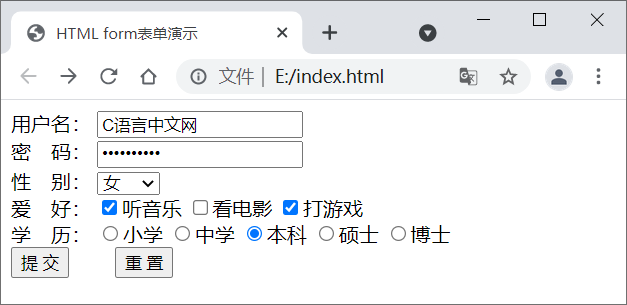

### 1. `<form>`标签

当您想要**通过网页来收集一些用户的信息**（例如用户名、电话、邮箱地址等）时，**就需要用到 HTML  表单**。**表单可以接收用户输入的信息，然后将其发送到后端应用程序**，例如 PHP、Java、Python  等，后端应用程序将根据定义好的业务逻辑对表单传递来的数据进行处理。

**表单属于 HTML 文档的一部分，其中包含了如输入框、复选框、单选按钮、提交按钮等不同的表单控件**，用户通过修改表单中的元素（例如输入文本，选择某个选项等）来完成表单，**通过表单中的提交按钮将表单数据提交给后端程序**。

在 HTML 中创建表单**需要用到` <form> `标签**，具体语法如下所示：

```html
<form action="URL" method="GET|POST">
    表单中的其它标签
</form>
```

对属性的说明：

- action 属性用来指明将表单提交到哪个页面；
- method 属性表示使用哪个方式提交数据，包括 GET 和 POST 两种方式，它们两者的区别如下：
  - GET：用户点击提交按钮后，提交的信息会被显示在页面的地址栏中。一般情况下，**GET 提交方式中不建议包含密码，因为密码被提交到地址栏，不安全。**
  - POST：**如果表单包含密码这种敏感信息，建议使用 POST 方式进行提交**，这样数据会传送到后台，不显示在地址栏中，相对安全。

### 2. 表单属性

HTML 为`<form>`标签提供了一些专用的属性，如下表所示：

| 属性           | 可选值                                                       | 描述                                                         |
| -------------- | ------------------------------------------------------------ | ------------------------------------------------------------ |
| accept         | MIME_type                                                    | HTML5 中不再支持，设置服务器要接收的文件类型                 |
| accept-charset | character_set                                                | 设置表单数据的字符集（默认为 HTML 文档字符集）               |
| action         | URL                                                          | 设置要将表单提交到何处（默认为当前页面）                     |
| autocomplete   | on、off                                                      | 设置是否启用表单的自动完成功能（默认开启）                   |
| enctype        | application/x-www-form-urlencoded、  multipart/form-data、  text/plain | 设置在提交表单数据之前如何对数据进行编码（适用于 method="post" 的情况） |
| method         | get、post                                                    | 设置使用哪种 HTTP 方法来提交表单数据（默认为 get）           |
| name           | text                                                         | 设置表单的名称                                               |
| novalidate     | novalidate                                                   | 如果使用该属性，则提交表单时不进行验证                       |
| target         | `_blank`、`_self`、`_parent`、`_top`                         | 设置在何处打开 action 属性设定的链接（默认为 _self）         |

**action 和 method 是最常用的两个属性。**

### 3. 表单控件

**表单用来收集用户数据，这些数据需要填写在各种控件中**。**HTML 控件也通过标签来实现**，只是它们会呈现一些特殊的外观，并具有一些交互功能。

HTML 表单中可以包含如下表所示的控件：

| 控件/标签    | 描述                                       |
| ------------ | ------------------------------------------ |
| `<input>`    | 定义输入框                                 |
| `<textarea>` | 定义文本域（一个可以输入多行文本的控件）   |
| `<label>`    | 为表单中的各个控件定义标题                 |
| `<fieldset>` | 定义一组相关的表单元素，并使用边框包裹起来 |
| `<legend>`   | 定义 <fieldset> 元素的标题                 |
| `<select>`   | 定义下拉列表                               |
| `<optgroup>` | 定义选项组                                 |
| `<option>`   | 定义下拉列表中的选项                       |
| `<button>`   | 定义一个可以点击的按钮                     |
| `<datalist>` | 指定一个预先定义的输入控件选项列表         |
| `<keygen>`   | 定义表单的密钥对生成器字段                 |
| `<output>`   | 定义一个计算结果                           |

这里我们不再一一列举各种控件的用法，下面我们通过一个完整的示例来演示一下：

```html
    <!DOCTYPE html>
    <html lang="en">
    <head>
        <meta charset="gbk">
        <title>HTML form表单演示</title>
    </head>
    <body>
        <form action="./userinfo.php" method="POST">
            <!-- 文本输入框控件 -->
            <label>用户名： </label><input name="username" type="text"><br>
            <!-- 密码框控件 -->
            <label>密&emsp;码： </label><input name="password" type="password"><br>
            <!-- 下拉菜单控件 -->
            <label>性&emsp;别：</label>
            <select name="sex">
                <option value="1">男</option>
                <option value="2">女</option>
                <option value="3">未知</option>
            </select>
            <br>
            <!-- 复选框控件 -->
            <label>爱&emsp;好：</label>
            <input type="checkbox" name="hobby" value="1">听音乐
            <input type="checkbox" name="hobby" value="2">看电影
            <input type="checkbox" name="hobby" value="3">打游戏
            <br>
            <!-- 单选按钮控件 -->
            <label>学&emsp;历：</label>
            <input type="radio" name="education" value="1">小学
            <input type="radio" name="education" value="2">中学
            <input type="radio" name="education" value="3">本科
            <input type="radio" name="education" value="4">硕士
            <input type="radio" name="education" value="5">博士
            <br>
            <!-- 按钮 -->
            <input type="submit" value="提 交">&emsp;&emsp;
            <input type="reset" value="重 置">
        </form>
    </body>
    </html>
```

运行结果如下图所示：



填写好用户数据，**点击“提交”按钮，即可使用 POST 方式将数据提交到当前目录下的 userinfo.php 页面，在服务器端通过 PHP 代码可以接收提交的数据。**