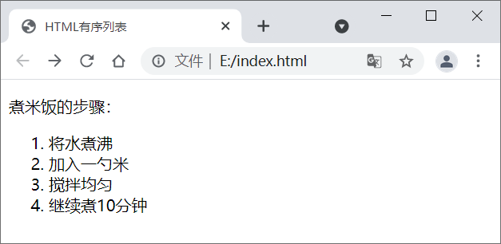
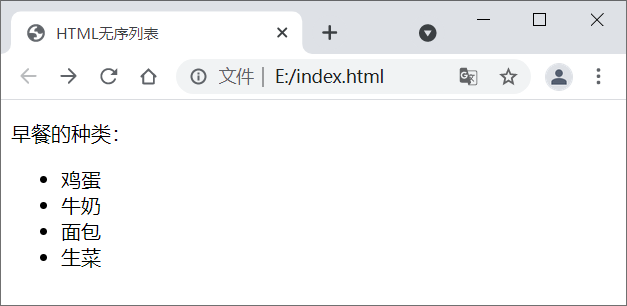
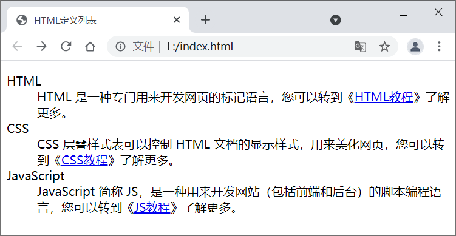
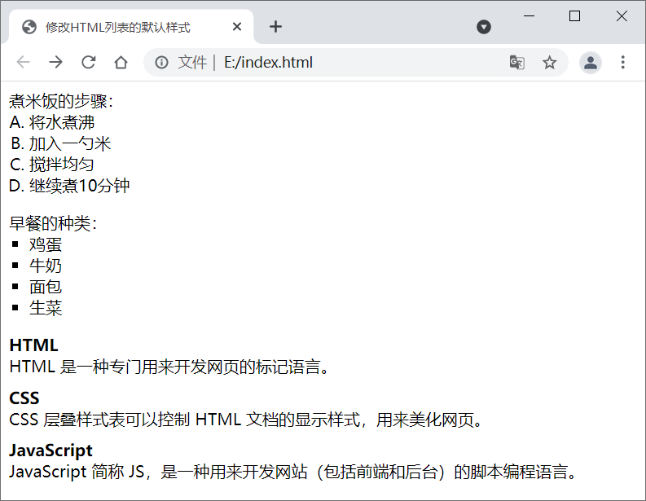

### 1.标签：`<ul>` `<ol>` `<dl>`

HTML 列表（List）可以将若干条相关的内容整理起来，让内容看起来更加有条理。在列表内您可以放置文本、图像、链接等，也可以在一个列表中定义另一个列表（列表嵌套）。

 HTML 为我们提供了三种不同形式的列表：

- 有序列表，使用` <ol>` + `<li>` 标签
- 无序列表，使用 `<ul>` + `<li> `标签
- 定义列表，使用 `<dl>` + `<dt>` + `<dd>` 标签

### 2. 有序列表

在 HTML 中， `<ol>` 标签用来表示有序列表。有序列表之间的内容有先后顺序之分，例如菜谱中的一系列步骤，这些步骤需要按顺序完成，这时就可以使用有序列表。

我们来看一个简单的实例：

```html
    <!DOCTYPE html>
    <html lang="en">
    <head>
        <meta charset="UTF-8">
        <title>HTML有序列表</title>
    </head>
    <body>
        <p>煮米饭的步骤：</p>
        <ol>
            <li>将水煮沸</li>
            <li>加入一勺米</li>
            <li>搅拌均匀</li>
            <li>继续煮10分钟</li>
        </ol>
    </body>
    </html>
```

在浏览器中运行效果如图所示：



有序列表需要使用 `<ol>` 和 `<li>` 标签：

- `<ol>` 是 order list 的简称，表示有序列表，它可以为列表的每一项进行编号，默认从数字 1 开始。
- `<li>` 是 list item 的简称，表示列表的每一项，**`<ol>` 中有多少个` <li> `就表示有多少条内容**。列表项中可以包含文本、图片、链接等，甚至还可以是另外一个列表。


 注意，**`<ol>` 一般和 `<li>` 配合使用，不会单独出现，而且不建议在` <ol>` 中直接使用除 `<li>` 之外的其他标签。**

### 3. 无序列表

HTML 使用 **`<ul> `标签来表示无序列表**。无序列表和有序列表类似，都是使用 `<li>` 标签来表示列表的每一项，但是**无序列表之间的内容没有顺序**。例如，早饭的种类不需要表明顺序，这时就可以使用无序列表。

我们来看一个简单的例子：

```html
    <!DOCTYPE html>
    <html lang="en">
    <head>
        <meta charset="UTF-8">
        <title>HTML无序列表</title>
    </head>
    <body>
        <p>早餐的种类：</p>
        <ul>
            <li>鸡蛋</li>
            <li>牛奶</li>
            <li>面包</li>
            <li>生菜</li>
        </ul>
    </body>
    </html>
```

浏览器运行结果如图所示：



无序列表需要使用` <ul>` 和` <li>` 标签：

- `<ul>` 是 unordered list 的简称，表示无序列表。
- `<ul>` 和` <ol>` 中的 `<li>` 一样，都表示列表中的每一项。默认情况下，无序列表的每一项都使用`●`符号表示。


 注意，`<ul>` 一般和` <li>` 配合使用，不会单独出现，而且不建议在 `<ul>` 中直接使用除 `<li>` 之外的其他标签。

### 4. 定义列表

在 HTML 中，**`<dl> `标签用于创建定义列表**。定义**列表由标题（术语）和描述两部分组成**，描述是对标题的解释和说明，标题是对描述的总结和提炼。

定义列表具体语法格式如下：

```html
<dl>
    <dt>标题1<dt>
    <dd>描述文本2<dd>
    <dt>标题2<dt>
    <dd>描述文本2<dd>
    <dt>标题3<dt>
    <dd>描述文本3<dd>
</dl>
```

定义列表需要使用 `<dl>`、`<dt>` 和 `<dd>` 标签：

- `<dl>` 是 definition list 的简称，表示定义列表。
- `<dt>` 是 definition term 的简称，表示定义术语，也就是我们说的标题。
- `<dd>` 是 definition description 的简称，表示定义描述 。

注意，**`<dt>` 和` <dd>` 是同级标签**，它们**都是` <dl>` 的子标签**。一般情况下，**每个  `<dt>` 搭配一个` <dd>`**，一个 `<dl>` 可以包含多对 `<dt>` 和 `<dd>`。

我们来看一个简单的例子：

```html
<!DOCTYPE html>
<html lang="en">
    <head>
        <meta charset="UTF-8">
        <title>HTML定义列表</title>
    </head>
    <body>
        <dl>
            <dt>HTML</dt>
            <dd>HTML 是一种专门用来开发网页的标记语言，您可以转到《<a href="http://c.biancheng.net/html/" target="_blank">HTML教程</a>》了解更多。</dd>
            <dt>CSS</dt>
            <dd>CSS 层叠样式表可以控制 HTML 文档的显示样式，用来美化网页，您可以转到《<a href="http://c.biancheng.net/css3/" target="_blank">CSS教程</a>》了解更多。</dd>
            <dt>JavaScript</dt>
            <dd>JavaScript 简称 JS，是一种用来开发网站（包括前端和后台）的脚本编程语言，您可以转到《<a href="http://c.biancheng.net/js/" target="_blank">JS教程</a>》了解更多。</dd>
        </dl>
    </body>
</html>
```

浏览器运行效果如下图：



`<dt>` 和 `<dd>` 虽然是同级标签，但是它们的默认样式不同，**`<dd> `带有一段缩进**，而 **`<dt> `顶格显示**，这样层次更加分明。

### 5. 列表的默认样式

浏览器会对列表设置一些默认样式，包括外边距、内边距和列表项标记，我们**可以通过 CSS 样式表的 [margin](http://c.biancheng.net/css3/margin.html)、[padding](http://c.biancheng.net/css3/padding.html) 和 [list-style](http://c.biancheng.net/css3/list-style.html) 属性来修改它们**，请看下面的例子：

```html
    <!DOCTYPE html>
    <html lang="en">
    <head>
        <meta charset="UTF-8">
        <title>修改HTML列表的默认样式</title>
    </head>
    <body>
        <p style="margin:0px auto;">煮米饭的步骤：</p>
        <ol style="margin:0px auto; padding-left:20px; list-style:upper-latin;">
            <li>将水煮沸</li>
            <li>加入一勺米</li>
            <li>搅拌均匀</li>
            <li>继续煮10分钟</li>
        </ol>
        <p style="margin-bottom:0px;">早餐的种类：</p>
        <ul style="margin:0px auto; padding-left:20px; list-style:square;">
            <li>鸡蛋</li>
            <li>牛奶</li>
            <li>面包</li>
            <li>生菜</li>
        </ul>
        <dl style="margin-bottom:0px;">
            <dt><b>HTML</b></dt>
            <dd style="margin:auto auto 10px 0px;">HTML 是一种专门用来开发网页的标记语言。</dd>
            <dt><b>CSS</b></dt>
            <dd style="margin:auto auto 10px 0px;">CSS 层叠样式表可以控制 HTML 文档的显示样式，用来美化网页。</dd>
            <dt><b>JavaScript</b></dt>
            <dd style="margin:auto auto 10px 0px;">JavaScript 简称 JS，是一种用来开发网站（包括前端和后台）的脚本编程语言。</dd>
        </dl>
    </body>
    </html>
```

对 CSS 样式的说明：

- `margin:0px auto;`将上下外边距设置为 0 像素，将左右外边距设置为自动。
- `margin-bottom:0px;`将下方外边距设置为 0 像素。
- `margin:auto auto 10px 0px;`将上方和右侧外边距设置为自动，将下方外边距设置为 10 像素，将左侧外边距设置为 0 像素。
- `padding-left:20px;`将左侧内边距设置为 20 像素。
- `list-style:upper-latin;`将列表项标记设置为大写拉丁字母。
- `list-style:square;`将列表项标记设置为实心方块。

上述代码在浏览器中的运行效果：

