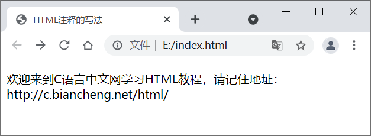
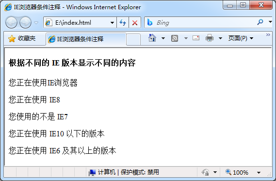
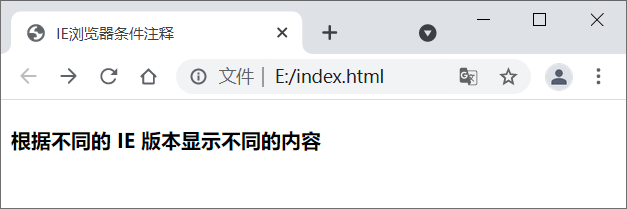

### 1. HTML注释

HTML 注释主要用来对文档中的代码进行解释说明，注释也是代码的一部分，但**浏览器会自动忽略注释的内容，所以用户在网页中是看不到注释的。**

我们在编写代码时应该善用注释，因为一个完整的 HTML  文档往往由成百上千行代码组成，当我们想要修改其中的某个部分时可能需要花费很长的时间才能找到想要修改的地方。有了注释就不一样了，我们可以根据功能或者其它条件将程序划分为若干个部分并通过注释进行标记，这样可以帮助您和他人阅读您的代码，提高代码的可读性。

### 2. 单行注释

在 HTML 中您可以使用` <!-- -->`在代码中添加注释，**`<!-- `和` -->`之间的所有内容都会被视为注释**。示例代码如下：

```html
<!DOCTYPE html>
<html lang="en">
    <!-- head 开始 -->
    <head>
        <meta charset="UTF-8">  <!-- 当前文档采用UTF-8编码 -->
        <title>HTML注释的写法</title>
    </head>
    <!-- head 结束 -->
    <!-- body 开始 -->
    <body>
        <!-- 一段文本 -->
        <p>欢迎来到C语言中文网学习HTML教程，请记住地址：http://c.biancheng.net/html/</p>
    </body>
    <!-- body 结束 -->
</html>
```

运行结果如下所示：



注释可以出现在 HTML 文档的任意位置，包括文档开头、文档末尾、文档中间、标签外部、标签内容中等。

### 3. 多行注释

前面我们主要演示的是单行注释，在 HTML 中同样支持多行注释。多行注释与单行注释的区别并不大，我们**只需要保证注释的内容在` <!-- `和` -->`之间即可**，如下所示：

```html
<!--
    多行注释
-->
```

使用注释除了可以对代码进行说明外，还可以用来注释程序中的代码，例如当不希望某段代码执行时，就可以先将它们注释掉，这样浏览器就不会执行这段代码了。

### 4. IE 条件注释

条件注释**仅对 Windows 系统上的 Internet Explorer（IE）浏览器中有效**，**其他的浏览器会忽略它们**。从 IE5 开始支持条件注释，您**可以使用条件注释为使用 IE 浏览器的用户提供一些说明**。如下所示：

```html
<!DOCTYPE html>
<html lang="en">
    <head>
        <meta charset="UTF-8">
        <title>IE浏览器条件注释</title>
    </head>
    <body>
        <h4>根据不同的 IE 版本显示不同的内容</h4>
        <!-- 如果使用 IE，则显示 -->
        <!--[if IE]>
        	<p>您正在使用IE浏览器</p>      <!-- 如果是IE浏览器，则会显示此行内容 -->
        <![endif]-->
         <!-- 如果使用 IE8，则显示 -->
        <!--[if IE 8]>
        	<p>您正在使用 IE8</p>		<!-- 如果是IE8浏览器，则会显示此行内容 -->
        <![endif]-->
        <!-- 如果不是使用 IE7，则显示 -->
        <!--[if !IE 7]>
        	<p>您使用的不是 IE7</p>   	<!-- 如果不是IE7浏览器，则会显示此行内容 -->
        <![endif]-->
        <!-- 如果版本小于 IE10，则显示 -->
        <!--[if lt IE 10]>
        	<p>您正在使用 IE10 以下的版本</p>  <!-- 如果是IE10版本以下浏览器，则会显示此行内容 -->
        <![endif]-->
        <!-- 如果版本大于等于 IE6，则显示 -->
        <!--[if gte IE 6]>
        	<p>您正在使用 IE6 及其以上的版本</p>   <!-- 如果是IE6以上浏览器，则会显示此行内容 -->
        <![endif]-->
    </body>
</html>
```

在 IE8 下的运行效果：



在 Chrome 浏览器下的运行效果：



**条件注释可以检测当前浏览器是否是 IE，以及 IE 版本，开发人员可以根据不同的 IE 浏览器加载不同的样式表或者 JS 脚本。**

比较 IE 版本将会**用到如下关键字：**

- lt：less than 的简写，也就是小于的意思。
- lte：less than or equal to 的简写，也就是小于或等于的意思。
- gt：greater than 的简写，也就是大于的意思。
- gte：greater than or equal to 简写，也就是大于或等于的意思。
- !：不等于

**IE 浏览器对 HTML5 支持不太友好，低版本的行为更是怪异，IE 已经逐渐退出市场，各大互联网巨头也不再兼容 IE，大家在开发过程中也不用重点考虑 IE。**