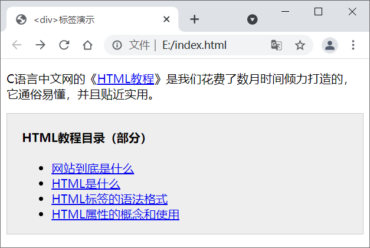
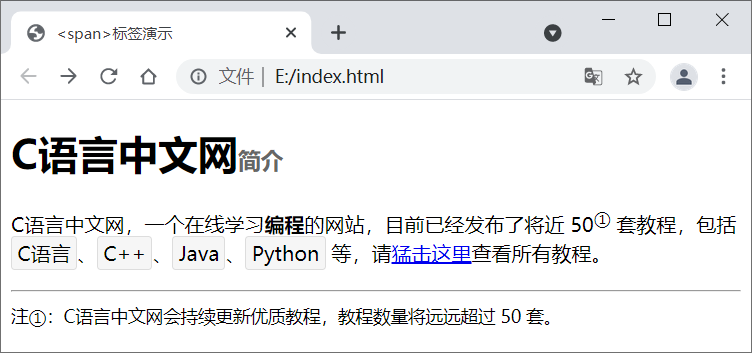
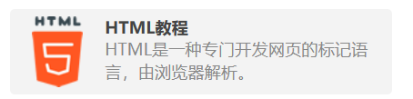

HTML 标签（元素）可以分为两个类别，分别是块级元素和内联元素（也叫行内元素）。

## 1. 块级元素

块级元素最主要的特点是它们自己独占一行，块级元素中最具代表性的就是` <div>`，此外还有` <p>`、`<nav>`、`<aside>`、`<header>`、`<footer>`、`<section>`、`<article>`、`<ul>`、`<address>`、`<h1>`~`<h6> `等。

 块级元素一般都具有特定的语义，可以使代码的可读性更强。

 块级元素的主要特征如下所示：

- 不管是否使用换行标签`<br>`，**块级元素总是在新行上开始**；
- 块级元素的宽度、高度以及外边距和内边距等都可以控制；
- 如果省略块级元素的宽度，那么它的**宽度默认为当前浏览器窗口的宽度**；
- 块级元素中可以包含其它的内联元素和块级元素。

## 2. 内联元素

内联元素也可以称为行内元素，行内元素中最常用的是` <span>`，此外还有`<b>`、`<i>`、`<u>`、`<em>`、`<strong>`、`<sup>`、`<sub>`、`<big>`、`<small>`、`<li>`、`<ins>`、`<del>`、`<code>`、`<cite>`、`<dfn>`、`<kbd>`和`<var>`等。

内联元素往往带有某种**特殊的显示效果**，**可以代替部分 CSS 样式**，非常实用，例如：

- `<b>`和`<i>`标签可以修饰字体；
- `<sub>`和`<sup>`两个标签分别用来定义下标文本和上标文本。

行内元素的主要特征如下所示：

- 行内元素和其他元素会在同一行上显示；
- 行内元素的宽、高以及外边距和内边距都不可以改变；
- 行内元素的宽度就是其中内容的宽度，且不可以改变；
- 内联元素中只能容纳文本或者其他内联元素。

对于行内元素的使用，需要注意如下几点：

- 设置宽度 width 无效；
- 设置高度 height 无效，但可以通过 line-height 来设置行高；
- 可以设置 margin 外边距，但只对左右外边距有效，上下无效；
- 设置 padding 内边距时，只有左右 padding 有效，上下则无效，需要注意的是元素范围是增大了，但是对元素周围的内容是没影响的；
- 可以通过 display 属性将元素在行内元素和块级元素之间进行切换。

## 3. 重点说明两个标签

**`<div>` 和 `<span>` 分别是最常用的块级元素和内联元素**，我们有必要重点说明一下。

### 3.1 `<div>` 标签

`<div>` 是非常重要的块级标记，在网页布局（Layout）方面发挥着重要的作用，**使用` <div> `我们可以定义页面的各个部分**，通过与 CSS 相结合可以实现各种各样的效果，下面通过一个示例演示 `<div>` 标签的使用。

```html
<!DOCTYPE html>
<html lang="en">
    <head>
        <meta charset="UTF-8">
        <title>&lt;div&gt;标签演示</title>
    </head>
    <body>
        <p>C语言中文网的《<a href="http://c.biancheng.net/html/" target="_blank">HTML教程</a>》是我们花费了数月时间倾力打造的，它通俗易懂，并且贴近实用。</p>
        <div style="padding:0px 20px;border:1px solid #ccc; background-color:#eee;">
            <h4>HTML教程目录（部分）</h4>
            <ul>
                <li><a href="/view/7410.html" target="_blank">网站到底是什么</a></li>
                <li><a href="/view/9381.html" target="_blank">HTML是什么</a></li>
                <li><a href="/view/9382.html" target="_blank">HTML标签的语法格式</a></li>
                <li><a href="/view/9383.html" target="_blank">HTML属性的概念和使用</a></li>
            </ul>
        </div>
    </body>
</html>
```

运行效果如下图所示：



`<div>` 标签及其包围的内容可以看做网页的一个板块，`<div>` 标签本身并没有什么特殊的显示效果，需要借助 CSS 样式对外边距、内边距、背景、边框等进行设置，从而达到对板块布局的目的。

### 3.2 `<span>` 标签

HTML 中的` <span>`标签是一个内联元素，可以对 HTML 文档中的内容进行修饰，**此标签不会为文档内容提供任何视觉效果，但可以与 CSS 结合使用来美化网页**。下面通过一个示例来演示` <span> `标签的使用：

```html
<!DOCTYPE html>
<html lang="en">
    <head>
        <meta charset="UTF-8">
        <style type="text/css">
            #profile span{
                display: inline-block;
                padding: 2px 4px;
                border: 1px solid #ddd;
                background-color: #f6f6f6;
                border-radius: 3px;
            }
        </style>
        <title>&lt;span&gt;标签演示</title>
    </head>
    <body>
        <h1>C语言中文网<span style="font-size:18px; color:#666;">简介</span></h1>
        <p id="profile">
            C语言中文网，一个在线学习<b>编程</b>的网站，目前已经发布了将近 50<sup>①</sup> 套教程，包括 <span>C语言</span>、<span>C++</span>、<span>Java</span>、<span>Python</span> 等，请<a href="http://c.biancheng.net/sitemap/" target="_blank">猛击这里</a>查看所有教程。
        <hr />
        <span style="font-size:14px;">注①：C语言中文网会持续更新优质教程，教程数量将远远超过 50 套。</span>
        </p>
    </body>
</html>
```

运行结果如下图所示：



<span> 标签本身并没有什么特殊效果，通常需要借助 CSS 来改变内容的样式，比如字体、颜色、大小、边框、背景等。

 那些不被推荐的 HTML 内联标签，比如 <font>、<small>、<big> 等，建议使用  <span> + CSS 样式来代替；但是那么具有明确语义的内联标签，比如  <strong>、<b>、<code>、<em>、<i>、<s>  等，还是应该坚持使用，这些标签比 <span> 更加具有语义，更有助于搜索引擎理解页面内容。

## 4. 元素的嵌套

大部分 HTML 元素都可以相互嵌套，并且嵌套深度也没有明确限制，这包括：

- 块级元素可以嵌套块级元素；
- 块级元素可以嵌套内联元素；
- 内联元素可以嵌套内联元素；
- 内联元素可以嵌套块级元素。

值得注意的是，**一般不建议在内联元素中嵌套块级元素**，这样不仅不符合开发规范，还会导致内联元素被撑开，独自占据一行。**但是有时候又不得不这样做**，比如[C语言中文网首页](http://c.biancheng.net/)的教程列表，一个板块链接到一套教程，为了让读者点击板块的任何一个地方都能跳转到教程页面，我们就在 <a> 标签中嵌套了 <div>、<h4> 和 <p> 标签，代码如下：



总之，这是一条建议，不是强制规定。

## 5. 块级元素和内联元素的转换

标签的很多默认行为都可以借助 CSS 改变，显示类型也不例外，我们**可以通过 [CSS display](http://c.biancheng.net/css3/display.html) 属性将块级元素修改为内联元素，或者将内联元素修改为块级元素**，**或者兼具两者优点，将标签设置为行内块级元素。**

 CSS 虽然可以改变标签的显示类型，但是不能改变标签的语义，读者还是应该根据语义去使用标签，例如：

- <div> 标签用来布局，而不用来显示文本；
- <p> 标签用来显示文本，而不用来布局；
- <strong> 标签用来强调文本，加粗只是附带效果；
- <b> 标签用来从视觉上加粗文本，引起读者注意。