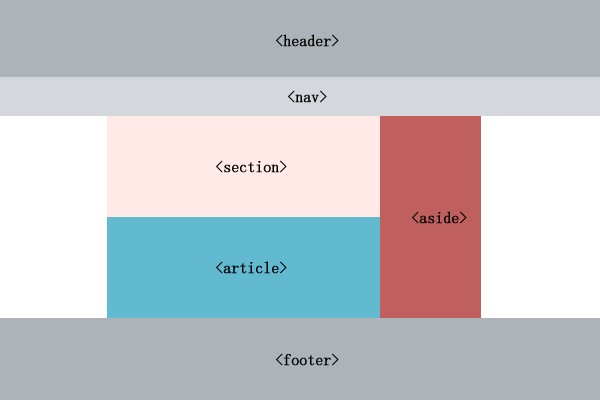
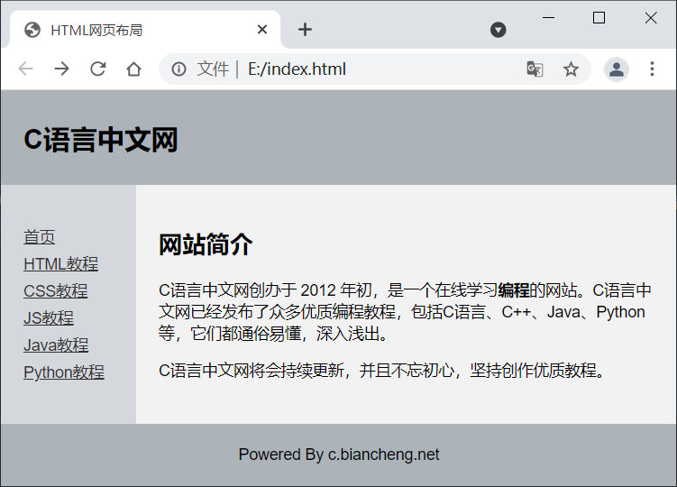

网页布局是创建一个网站时一个必不可少的过程，**通过布局可以改变网页中内容的排列方式**，让网页看起来更加合理、美观。**在布局的过程中您还可以使用 CSS 来修改 HTML 标签的样式或者使用 JavaScript 来为网页添加一些特殊效果**。

 前面在介绍《[HTML块级元素和内联元素](http://c.biancheng.net/view/9392.html)》时提到过 **`<div>` 标签，它是一个专门用来布局的标签**，HTML4 主要依赖 `<div>` 标签进行布局。但是，`<div>` 是一个包罗万象的标签，不具有明确的语义，不能指明当前板块的作用，也不利于搜索引擎理解页面内容。

 为了改进传统布局模式，**HTML5 提出了多个专门用于布局的标签，它们用来定义网页的不同部分，语义更加明确**。HTML5 布局标签如下：

| 标签        | 说明                                                         |
| ----------- | ------------------------------------------------------------ |
| `<header>`  | 用于定义网页的头部，头部中一般包含一些介绍性的内容，例如网站名称、logo 或者作者的信息。 |
| `<nav>`     | 用于定义网页中的导航栏。                                     |
| `<section>` | 用于在网页中定义一个单独的部分，其中可以包含文本、图像、表格等等。    `<section>` 代表 HTML 文档中的“节”或“段”，“段”可以理解为一篇文章里按照主题的分段，“节”则可以理解为一个页面里的分组。其主要作用就是对页面的内容进行分块或者对文章的内容进行分段。 |
| `<article>` | 用于定义文章或者其它独立的信息，代表一个页面中自成一体的内容，例如论坛的帖子、博客上的文章、一篇用户的评论等。 |
| `<aside>`   | 用于定义网页内容以外的部分，例如网页的侧边栏。               |
| `<footer>`  | 用于定义网页的底部，例如作者、版权等信息。                   |
| `<details>` | 用于定义一些详细信息，并且可以根据需要隐藏或显示这些详细信息。 |
| `<summary>` | 用于为`<details>`标签定义标题。                              |

各个标签适用的板块如下图所示：



下面通过一个示例来演示如何使用上面介绍的标签来为网页布局：

```html
<!DOCTYPE html>
<html lang="en">
    <head>
        <meta charset="utf-8">
        <title>HTML网页布局</title>
        <style>
            body {
                font: 14px Arial,sans-serif;
                margin: 0px;
            }
            header {
                padding: 10px 20px;
                background: #acb3b9;
            }
            header h1 {
                font-size: 24px;
            }
            .container {
                width: 100%;
                background: #f2f2f2;
            }
            nav, section {
                float: left;
                padding: 20px;
                min-height: 170px;
                box-sizing: border-box;
            }
            section {
                width: 80%;
            }
            nav {
                width: 20%;           
                background: #d4d7dc;
            }  
            nav ul {
                list-style: none;
                line-height: 24px;
                padding: 0px;
            }
            nav ul li a {
                color: #333;
            }
            .clearfix:after {
                content: ".";
                display: block;
                height: 0;
                clear: both;
                visibility: hidden;
            }
            footer {
                background: #acb3b9;          
                text-align: center;
                padding: 5px;
            }
        </style>
    </head>
    <body>
        <div class="container">
            <header>
                <h1>C语言中文网</h1>
            </header>
            <div class="wrapper clearfix">
                <nav>
                    <ul>
                        <li><a href="http://c.biancheng.net/">首页</a></li>
                        <li><a href="http://c.biancheng.net/html/">HTML教程</a></li>
                        <li><a href="http://c.biancheng.net/css3/">CSS教程</a></li>
                        <li><a href="http://c.biancheng.net/js/">JS教程</a></li>
                        <li><a href="http://c.biancheng.net/java/">Java教程</a></li>
                        <li><a href="http://c.biancheng.net/python/">Python教程</a></li>
                    </ul>
                </nav>
                <section>
                    <h2>网站简介</h2>
                    <p>C语言中文网创办于 2012 年初，是一个在线学习<b>编程</b>的网站。C语言中文网已经发布了众多优质编程教程，包括C语言、C++、Java、Python 等，它们都通俗易懂，深入浅出。</p>
                    <p>C语言中文网将会持续更新，并且不忘初心，坚持创作优质教程。</p>
                </section>
            </div>
            <footer>
                <p>www.biancheng.net</p>
            </footer>
        </div>
    </body>
</html>
```

运行结果如下：

