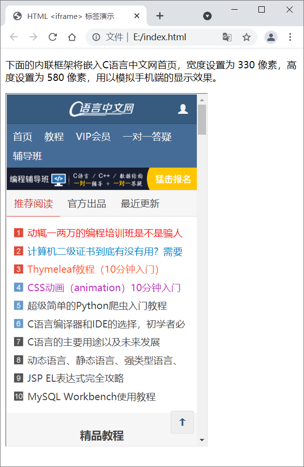
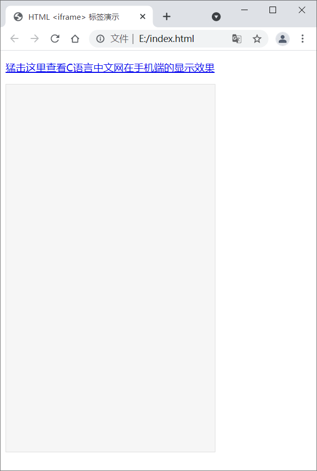
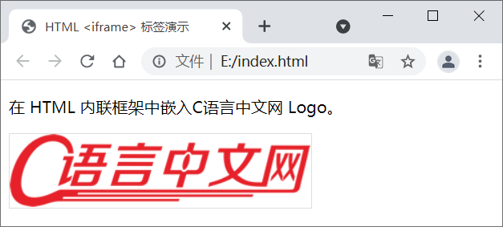

## 一、`<iframe> `标签

HTMl `<iframe>` 标签用来定义一个内联框架，使用它**可以将另一个网页嵌入到当前网页中**。`<iframe>` 标签**会在网页中定义一个矩形区域，浏览器可以在这个区域内显示另一个页面的内容。**

`<iframe>` 标签的语法格式如下：

```html
<iframe src="url" width="m" height="n"></iframe>
```

src 属性用来指定要嵌入的网页的地址；width 和 height 属性用来指定框架的宽度和高度，默认单位是像素，当然您也可以使用百分比。

```
HTML <iframe> 标签不利于搜索引擎抓取页面内容，对 SEO 具有负面效果，在现代 Web 设计中不建议使用。
```

下表列举了 `<iframe> `标签的所有属性：

| 属性         | 值                                                           | 描述                                                         |
| ------------ | ------------------------------------------------------------ | ------------------------------------------------------------ |
| align        | left、right、top、middle、bottom                             | HTML5 不支持，HTML 4.01 已废弃。设置如何来对齐 <iframe>。    |
| frameborder  | 1、0                                                         | HTML5 不支持。设置是否显示 <iframe> 周围的边框。             |
| height       | 像素                                                         | 设置 <iframe> 的高度。                                       |
| longdesc     | URL                                                          | HTML5 不支持。设置一个页面，该页面中包含了有关 <iframe> 的描述。 |
| marginheight | 像素                                                         | HTML5 不支持。设置 <iframe> 的顶部和底部的边距。             |
| marginwidth  | 像素                                                         | HTML5 不支持。设置 <iframe> 的左侧和右侧的边距。             |
| name         | text                                                         | 设置 <iframe> 的名称。                                       |
| sandbox      | ""、allow-forms、allow-same-origin、allow-scripts、allow-top-navigation | 对 <iframe> 的内容定义一系列额外的限制。                     |
| scrolling    | yes、no、auto                                                | HTML5 不支持。设置是否在 <iframe> 中显示滚动条。             |
| seamless     | seamless                                                     | 让 <iframe> 看起来像是父文档中的一部分（即没有边框和滚动条）。 |
| src          | URL                                                          | 设置要在 <iframe> 中显示的文档地址（URL）。                  |
| srcdoc       | HTML 代码                                                    | 设置 <iframe> 中要显示的内容，该属性会覆盖 src 属性。        |
| width        | 像素                                                         | 设置 <iframe> 的宽度。                                       |

## 二、HTML `<iframe>` 示例

### 2.1 示例1

为内联框架设置高度和宽度。

```html
<!DOCTYPE html>
<html lang="en">
    <head>
        <meta charset="utf-8">
        <title>HTML &lt;iframe&gt; 标签演示</title>
    </head>
    <body>
        <p>下面的内联框架将嵌入C语言中文网首页，宽度设置为 330 像素，高度设置为 580 像素，用以模拟手机端的显示效果。</p>
        <iframe src="http://c.biancheng.net/" width="330" height="580"></iframe>
    </body>
</html>
```

显示效果：



### 2.2 示例2

在 `<iframe>` 中打开指定页面。

```html
<!DOCTYPE html>
<html lang="en">
    <head>
        <meta charset="utf-8">
        <title>HTML &lt;iframe&gt; 标签演示</title>
        <style type="text/css">
            #myframe{
                border: 1px solid #ddd;
                background-color: #f6f6f6;
            }
        </style>
    </head>
    <body>
        <p><a href="http://c.biancheng.net/" target="myframe">猛击这里查看C语言中文网在手机端的显示效果</a></p>
        <iframe id="myframe" name="myframe" width="330" height="580"></iframe>
    </body>
</html>
```

显示效果：



点击链接，即可在灰色板块中打开C语言中文网首页。

 注意，要想实现上述效果，**需要为` <iframe>` 标签设置 name 属性，并将 `<a>` 标签中 target 属性的值设置为 name 属性的值**。

### 2.3 示例3

`<iframe>` 标签除了可以嵌入网页，**还可以嵌入图片、视频等其它资源**，嵌入的图片可以直接在当前页面上显示，嵌入的视频可以直接在当前页面上播放。请看下面的代码：

```html
<!DOCTYPE html>
<html lang="en">
    <head>
        <meta charset="utf-8">
        <title>HTML &lt;iframe&gt; 标签演示</title>
    </head>
    <body>
        <p>在 HTML 内联框架中嵌入C语言中文网 Logo。</p>
        <iframe src="./logo.png" width="300" height="73" scrolling="no" style="border:1px solid #ddd;"></iframe>
    </body>
</html>
```

运行效果：



嵌入其它资源时，需要将 `<iframe>` 标签的 src 属性设置为资源地址。