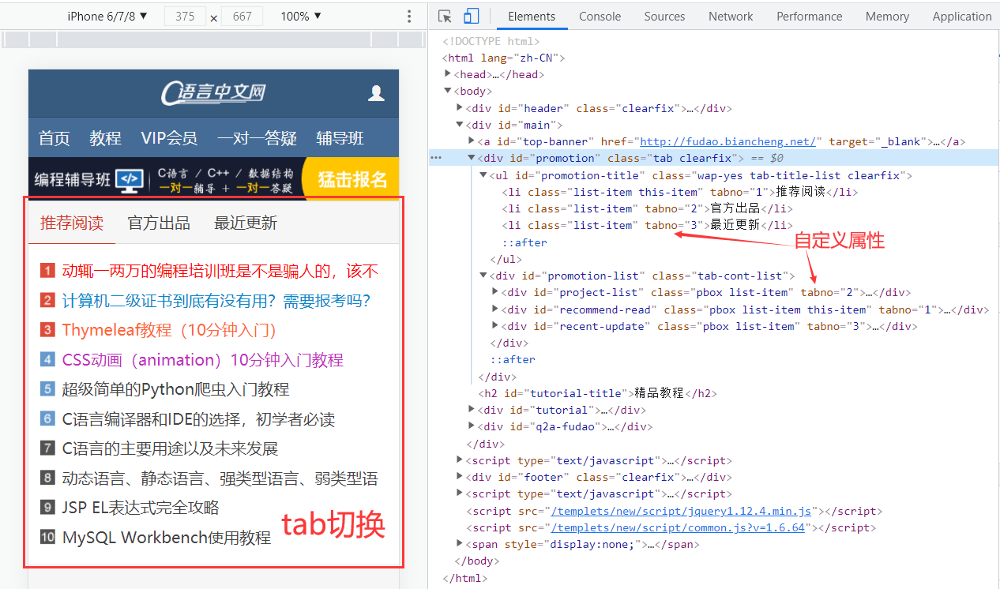

通过前面的学习，我们已经对 [HTML 标签](http://c.biancheng.net/view/9382.html)有了简单的认识，知道**可以在标签中可以添加一些属性，这些属性包含了标签的额外信息**，例如：

- href 属性可以为 <a> 标签提供链接地址；
- src 属性可以为  标签提供图像的路径；
- style 属性可以为几乎所有标签定义 CSS 样式。

### 1. 什么是属性

属性可以为 HTML 标签提供一些额外信息，或者对 HTML 标签进行修饰。**属性**需要添加在**开始标签**中，语法格式为：

```
attr="value"
```

**attr 表示属性名，value 表示属性值**。**属性值必须使用双引号`" "`或者单引号`' '`包围。**但是为了规范和专业，请**尽量使用双引号。**

一个标签可以没有属性，也**可以有一个或者多个属性**。

使用 HTML 属性的例子：

```html
    <p id="user-info" class="color-red">欢迎 <font color="red" size="3">Tom</font> 来到C语言中文网，您已经使用本站 3 年了，这是您第 12 次登录。<p>
    <div class="clearfloat">
        <p class="left">这里显示 Tom 的账号信息</p>
        <p class="right">这里显示 Tom 的个性签名</p>
    </div>
```

#### 1.1 专用属性

HTML 属性有很多，大体可以分为两类：

- 有些属性**适用于大部分或者所有 HTML 标签**，我们将这些属性称为**通用属性**；
- 有些属性**只适用于一个或者几个特定的 HTML 标签**，我们将这些属性称为**专用属性**。

HTML 中的  标签就有 src 和 alt 两个专用属性，<a> 标签也有 href 和 target 两个专用属性，如下例所示：

```html
       <!-- --> 图像
    <a href="http://c.biancheng.net/" target="_blank">C语言中文网</a>    <!-- --> 超链接
```

对代码的说明：

-  标签中的 **src 属性用来定义图像的路径**，**alt 属性用来定义图像的描述信息**，当图像出现异常无法正常显示时就会显示 alt 中的信息。
- <a> 标签的 **href 属性用来定义链接的地址**，**target 属性用来定义新页面在浏览器中的打开方式**。

#### 1.2 自定义属性

​	除了自带的属性，HTML 也允许我们自定义属性，这些属性虽然可以被浏览器识别，但是并不会添加什么特殊效果，我们**需要借助 CSS 和 JavaScript 处理自定义属性，为 HTML 标签添加指定样式或者行为。**

​	例如，[C语言中文网首页](http://c.biancheng.net/)的顶部板块为了在手机端实现标签切换（tab 切换）效果，就为 <li> 和<div> 标签添加了一个自定义属性`tabno`，用以指明当前 tab 的编号，请看下图：

<li>标签可以用来定义列表项

<div>标签可以用来把文档分割为独立的、不同的部分。



#### 1.3 通用属性介绍

HTML 标签中有一些通用的属性，如 id、title、class、style 等，这些通用属性可以在大多数 HTML 标签中使用，下面来简单介绍一下它们的用法。

#### 1) id

id 属性用来**赋予某个标签唯一的名称**（标识符），当我们使用 CSS 或者 JavaScript 来操作这个标签时，就可以通过 id 属性来找到这个标签。
 为标签定义 id 属性可以给我们提供很多便利，比如：

- **如果标签中带有 id 属性作为唯一标识符，通过 id 属性可以很方便的定位到该标签**；
- 如果 HTML 文档中包含多个同名的标签，利用 id 属性的唯一性，可以很方便的区分它们。

> 注意：在一个 HTML 文档中 **id 属性的值必须是唯一的。**

示例代码如下所示：

```html
    <input type="text" id="username" />
    <div id="content">C语言中文网</div>
    <p id="url">http://c.biancheng.net/</p>
```

#### 2) class

与 id 属性类似，**class 属性也可以为标签定义名称**（标识符），不同的是 class 属性在整个 HTML 文档中**不必是唯一的**，我们**可以为多个标签定义相同的 class 属性值**。另外，还**可以为一个 HTML 标签定义多个 class 属性值**，如下所示：

```html
    <div class="className1 className2 className3"></div>
    <p class="content">C语言中文网</p>
    <div class="content">http://c.biancheng.net/</div>
```

当使用 CSS 或者 JavaScript 来操作 HTML 标签时，同样**可以使用 class 属性来找到对应的 HTML 标签**。由于  class 属性不是唯一的，所以通过 CSS 或 JavaScript 对 HTML 标签的**操作会应用于所有具有同名 class 属性的标签中**。

#### 3) title

title 属性用来对标签内容进行描述说明，**当鼠标移动到该标签上方时会显示出 title 属性的值**，如下例所示：

```html
    <!DOCTYPE html>
    <html lang="en">
    <head>
        <meta charset="UTF-8">
        <title>演示文档</title>
    </head>
    <body>
        <a href="http://c.biancheng.net/html/" title="HTML教程">HTML教程</a>
    </body>
    </html>
```

运行结果如下图所示：


#### 4) style

**使用 style 属性我们可以在 HTML 标签内部为标签定义 CSS 样式**，例如设置文本的颜色、字体等，如下例所示：

```html
    <!DOCTYPE html>
    <html lang="en">
    <head>
        <meta charset="UTF-8">
        <title>演示文档</title>
    </head>
    <body>
        <p style="color:red;">http://c.biancheng.net/html/</p>
        
        <div style="padding:10px;border:2px solid #999;text-align:center;">C语言中文网</div>
    </body>
    </html>
```

运行结果如下图所示：

