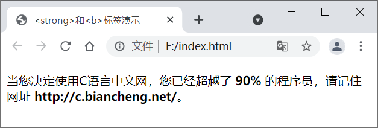
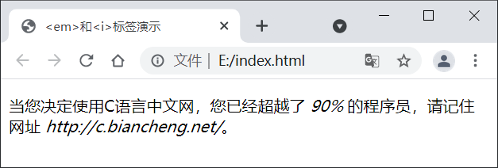

### 1. 格式化标签

一些 HTML 标签除了具有一定的语义（含义）外，还有默认的样式，例如**` <b>`（加粗）、`<em>`（倾斜）等，通过这些标签我们无需借助 CSS 就可以为网页中的内容定义样式**。在这些具有语义和默认样式的标签中，有**许多是针对文本的，通过这些标签我们可以格式化文本（为文本添加样式），例如使文本加粗、倾斜或者添加下划线等**。

HTML 中有许多用来格式化文本的标签，如下表所示：

| 标签                           | 描述                                                         |
| ------------------------------ | ------------------------------------------------------------ |
| `<b>...</b>`                   | 加粗标签中的字体                                             |
| `<em>...</em>`                 | 强调标签中的内容，并使标签中的字体倾斜                       |
| `<i>...</i>`                   | 定义标签中的字体为斜体                                       |
| `<small>...</small>`           | 定义标签中的字体为小号字体                                   |
| `<strong>...</strong>`         | 强调标签中的内容，并将字体加粗                               |
| `<sub>...</sub>`               | 定义下标文本                                                 |
| `<sup>...</sup>`               | 定义上标文本                                                 |
| `<ins>...</ins>`               | 定义文档的其余部分之外的插入文本                             |
| `<del>...</del>`               | 在文本内容上添加删除线                                       |
| `<code>...</code>`             | 定义一段代码                                                 |
| `<kbd>...</kbd>`               | 用来表示文本是通过键盘输入的                                 |
| `<samp>...</samp>`             | 定义程序的样本                                               |
| `<var>...</var>`               | 定义变量                                                     |
| `<pre>...</pre>`               | 定义预格式化的文本，被该标签包裹的文本会保留所有的空格和换行符，字体也会呈现为等宽字体 |
| `<abbr>...</abbr>`             | 用来表示标签中的内容为缩写形式                               |
| `<address>...</address>`       | 用来定义文档作者的联系信息，被该标签包裹的文本通常会以斜体呈现，并在文本前面换行 |
| `<bdo>...</bdo>`               | 定义标签中的文字方向                                         |
| `<blockquote>...</blockquote>` | 定义一段引用的文本，例如名人名言，文本会换行输出，并在左右两边进行缩进 |
| `<q>...</q>`                   | 定义一段短的引用，浏览器会将引用的内容使用双引号包裹起来     |
| `<cite>...</cite>`             | 表示对某个文献的引用，例如书籍或杂志的名称，文本会以斜体显示 |
| `<dfn>...</dfn>`               | 用来定义一个术语，标签中的文本会以斜体呈现                   |

按照作用的不同，可以将这些用来格式化文本的标签分为两类：

- 物理标签：这类标签用来为设置文本的外观；
- 逻辑标签：这类标签用来赋予文本一些逻辑或语义值。

通过上表可以看出，**有些标签的呈现效果虽然相同，但语义却不同**，例如` <strong> `和` <b> `标签、`<em> `和` <i> `标签，下面就来详细介绍一下。

### 2.`<strong>`和`<b>`标签之间的区别

默认情况下，`<strong> `和` <b> `标签都可以使文本以粗体展示标签中的文本，但是**` <strong> `标签的语义是标签中的内容具有很高的重要性**，而**` <b> `标签的语义仅仅是加粗文本以引起读者的注意**，并没有特殊的意思。

示例代码如下所示：

```html
    <!DOCTYPE html>
    <html lang="en">
    <head>
        <meta charset="UTF-8">
        <title>&lt;strong&gt;和&lt;b&gt;标签演示</title>
    </head>
    <body>
        <p>当您决定使用C语言中文网，您已经超越了 <strong>90%</strong> 的程序员，请记住网址 <b>http://c.biancheng.net/</b>。</p>
    </body>
    </html>
```

此处给`90%`添加 <strong> 标签是为了强调C语言中文网的重要性，以及它带来的震撼效果；而给网址添加 <b> 标签仅仅是为了视觉上的加粗效果，这样能引起读者的注意。

运行结果如下图所示：



### 3.`<em>`和`<i>`标记之间的区别

同样，`<em> `和` <i> `标签默认情况下**均以斜体显示标签中的文本**，但是**` <em> `标签具有强调的语义**，用来表示标签中的内容很重要，而**` <i> `标签仅仅用于定义斜体文本**。

示例代码如下：

```html
    <!DOCTYPE html>
    <html lang="en">
    <head>
        <meta charset="UTF-8">
        <title>&lt;em&gt;和&lt;i&gt;标签演示</title>
    </head>
    <body>
        <p>当您决定使用C语言中文网，您已经超越了 <em>90%</em> 的程序员，请记住网址 <i>http://c.biancheng.net/</i>。</p>
    </body>
    </html>
```

运行结果如下图所示：



根据 HTML5 的规范，**标题应该用` <h1> `~` <h6> `标签定义**，被**强调的文本应该用` <em> `标签定义**，**重要的文本应该用` <strong> `标签定义**，**被标记的或者高亮显示的文本应该用` <mark> `标签定义**等等，类似这样的规范还有很多，后面我们会一一介绍。