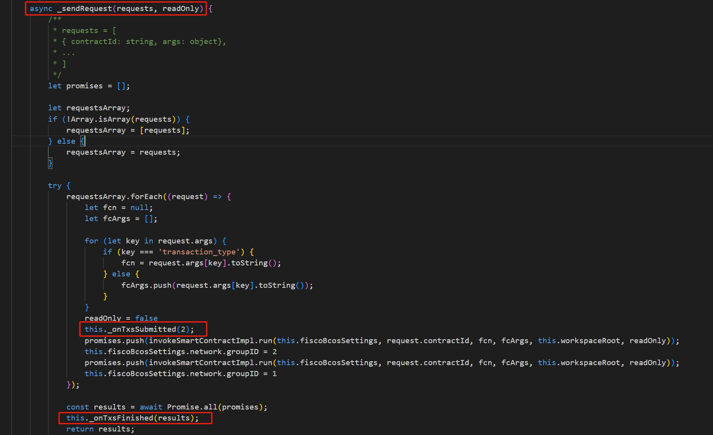
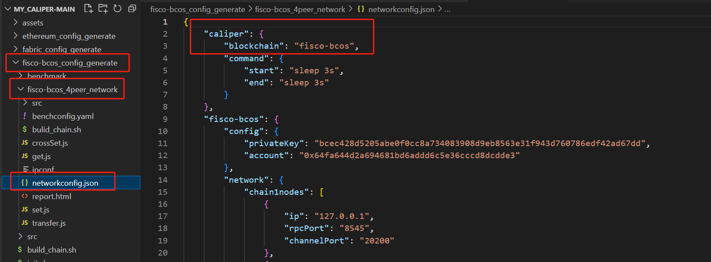
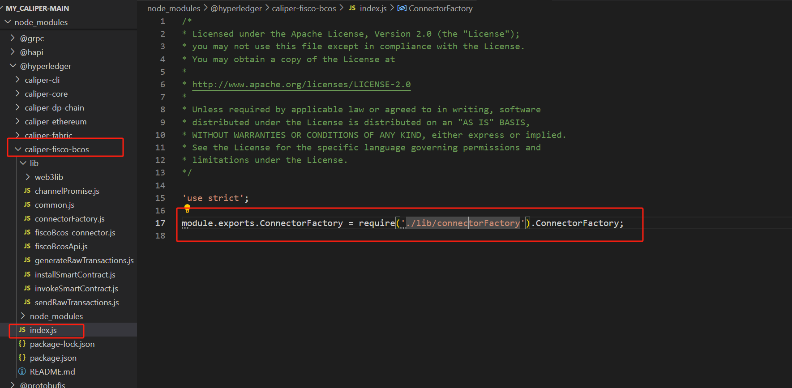

# 一、概述

连接器可能是 Caliper 中最重要的模块。它们在被测系统 (SUT) 和不同的 Caliper 组件（例如，管理器和工作进程，或工作负载模块）之间提供了一个抽象层。

我们可以通过对这个抽象层（接口）进行实现，完成 SUT 与 Caliper 的通信。

# 二、实现连接器

1. 实现连接器接口（可选择使用可用的实用程序基类）。
2. 实现一个工厂方法来实例化连接器。
3. 定义网络配置文件的模式。
4. 为您的连接器提供绑定配置。

## 2.1 连接器接口

一旦您将`@hyperledger/caliper-core`包（或其特定版本之一）添加为项目依赖项，您将可以访问其导出的`ConnectorInterface`类，该类声明以下[接口](https://github.com/hyperledger/caliper/blob/v0.5.0/packages/caliper-core/lib/common/core/connector-interface.js)：

```js
class ConnectorInterface extends EventEmitter {
    getType() {}
    getWorkerIndex() {}
    async init(workerInit) {}
    async installSmartContract() {}
    async prepareWorkerArguments(number) {}
    async getContext(roundIndex, args) {}
    async releaseContext() {}
    async sendRequests(requests) {}
}

module.exports = ConnectorInterface;
```

### `getType`

- **描述**检索连接器类型的简称，通常表示 SUT，例如`fast-ledger`。该名称可供能够针对多种类型的 SUT 的工作负载模块使用。
- **返回类型** *字符串*
- **返回**连接器的名称。

### `getWorkerIndex`

- **描述**检索实例化连接器的从零开始的工作进程索引。
- **返回类型** *编号*
- **返回**工作进程索引。

### `init`

- 描述

  该方法由管理器和（可选）工作进程调用，以初始化连接器实例，并可能初始化 SUT 的某些方面。初始化任务是特定于连接器的，但通常可以划分为以下进程：

  - 管理*器*进程实例执行需要与 SUT 交互的一次性初始化任务。这些任务可以包括创建数字身份，或与 SUT 有关的其他管理操作。
  - *工作*进程实例通常只执行本地管理任务，例如创建稍后发送请求时所需的必要数据结构或缓存。此步骤是可选的，可以在创建连接器实例后通过工厂方法执行。如果工作进程需要在此阶段访问 SUT，则它们应该仅使用幂等操作（例如配置查询）来执行此操作，以确保任意数量的并行工作进程都能正确执行。

- 参数

  - *workerInit* (*布尔值*) 表示该方法是由工作进程调用还是由管理进程调用。

- **返回类型** *Promise*

- **返回**方法完成时将解决的承诺。

### `installSmartContract`

- **描述**如果远程允许，则管理器进程调用该方法在 SUT 上执行合同部署。
- **返回类型** *Promise*
- **返回**方法完成时将解决的承诺。

### `prepareWorkerArguments`

- **描述**此方法由管理器进程调用，确保管理器进程中的连接器实例能够将数据分发给工作进程中的连接器实例。此方法是将新创建的数字身份等返回给管理器进程的最佳位置，管理器进程又会将这些身份分发给工作进程实例以供进一步使用。
- **返回类型** *Promise<object[]>*
- **返回**每个工作者的特定连接器对象的承诺，这些对象将在方法完成时解析。

### `getContext`

- **描述**该方法由工作进程在每轮之前调用，可用于组装将与当前轮次的工作负载模块共享的连接器特定对象。该方法也是索取下一轮所需资源的最佳位置，例如建立与远程节点的连接。
- 参数
  - *roundIndex*（*数字*） 即将进行的轮次的从零开始的索引。
  - *args* (*对象*`prepareWorkerArguments`) 在管理器实例的方法中为此工作实例组装的对象。
- **返回类型** *Promise<object>*
- **返回**方法完成时将解析的连接器特定对象的承诺。

### `releaseContext`

- **描述**该方法由工作进程在每一轮之后调用，可用于释放`getContext`方法中声明的资源。
- **返回类型** *Promise*
- **返回**方法完成时将解决的承诺。

### `sendRequests`

- **描述**此方法是连接器的热路径，由轮次的工作负载模块在工作进程中调用。该方法必须接受一个或多个与必须发送到 SUT 的请求相关的设置对象。连接器不必保留请求的执行顺序，除非目标 SUT 类型支持此类请求批处理。连接器必须通过[TxStatus](https://github.com/hyperledger/caliper/blob/v0.5.0/packages/caliper-core/lib/common/core/transaction-status.js)实例收集每个请求的至少开始时间、结束时间和最终状态（成功或失败）。
- 参数
  - *请求*（*对象|对象[]*）一个或多个针对请求的连接器特定设置对象。
- **返回类型** *Promise<TxStatus|TxStatus[]>*
- **返回**方法完成时将解析的一个或多个请求执行结果的承诺。

## 2.2 暴露事件

连接器必须公开以下事件，其名称必须与定义的[常量](https://github.com/hyperledger/caliper/blob/v0.5.0/packages/caliper-core/lib/common/utils/constants.js)相匹配。如果没有这些事件，Caliper 调度机制将无法正常运行，其他组件也可能依赖它们（如 TX 监视器）。

### `txsSubmitted`

- **描述**当一个或多个请求提交给 SUT 执行时，必须引发此事件。通常，应该为每个单独的请求引发此事件。
- 参数
  - *count*（*数字*） 已提交的请求数量。

### `txsFinished`

- **描述**当一个或多个请求被 SUT 完全处理（即连接器收到结果）时必须引发事件。
- 参数
  - *结果*（*TxStatus|TxStatus[]*）连接器收集的一个或多个请求执行结果。



## 2.3 可选基类

该`@hyperledger/caliper-core`包还导出一个`ConnectorBase`类，为以下`ConnectorInterface`方法**提供合理的默认实现**：

- `prepareWorkerArguments`：默认每个worker都返回一个空对象，即**不与worker进程实例共享任何内容**。
- `sendRequests`：处理工作负载模块提交一个或多个请求的情况。还会在请求前后引发必要的事件。**该方法将单个请求的执行委托给该`_sendSingleRequest`方法**（见下文）。
- `constructor`：声明一个需要工作者索引和 SUT/连接器类型作为参数的构造函数。
- `getType`：为相应的构造函数参数提供一个简单的 getter。
- `getWorkerIndex`：为相应的构造函数参数提供一个简单的 getter。

如果您选择将此基类用于连接器，那么您**必须实现该`_sendSingleRequest`方法**。

### `_sendSingleRequest`

- **描述**该方法只需处理**单个请求**的发送和处理。
- 参数
  - *请求*（*对象*） 请求的连接器特定设置对象。
- **返回类型** *Promise<TxStatus>*
- **返回**方法完成时将解析的请求执行结果的承诺。

## 2.4 工厂方法

连接器实现的入口点将是一个工厂方法。**管理器**和**工作进程**将调用此导出的工厂方法来**实例化连接器**（注意大小写）。

##### `ConnectorFactory`

- **描述实例**化连接器并可选地初始化它。当从**管理器进程**（用工作索引表示`-1`）**调用时**，管理器**将处理调用`init`和`installSmartContracts`方法**。此初始化**在工作进程中是可选的**，因此如果需要，工厂方法必须处理它。
- 参数
  - *workerIndex*（*数字*`-1`） 工作进程或管理器进程的从零开始的索引。
- **返回类型** *Promise<ConnectorInterface>*
- **返回**`ConnectorInterface`方法完成时将解析的实例的承诺。

以下是我们的`fast-ledger`连接器工厂方法的可能实现：

```js
    'use strict';

    const FastLedgerConnector = require('./fast-ledger-connector');

    async function ConnectorFactory(workerIndex) {
        const connector = new FastLedgerConnector(workerIndex, 'fast-ledger');

        // initialize the connector for the worker processes
        if (workerIndex >= 0) {
            await connector.init(true);
        }

        return connector;
    }

    module.exports.ConnectorFactory = ConnectorFactory;
```

# 三、网络配置文件

[网络配置文件](https://hyperledger-caliper.github.io/caliper/v0.5.0/architecture/#network-configuration-file)可以包含连接器与 SUT 通信并满足连接器[质量要求](https://hyperledger-caliper.github.io/caliper/v0.5.0/writing-connectors/#requirements-for-quality-connectors)所需的任何信息。配置文件可以是 JSON 或 YAML 文件。YAML 因其可读性和注释支持而受到青睐。

网络配置模式**必须包含一个强制性的顶级字段**，其结构如下：

```
# mandatory
caliper:
  # mandatory
  blockchain: fast-ledger
  # optional
  commands:
    start: startLedger.sh
    end: stopLedger.sh
```

该`caliper.blockchain`属性告诉 Caliper 为测试加载哪个连接器。该属性的值取决于您希望如何将[连接器与 Caliper 集成](https://hyperledger-caliper.github.io/caliper/v0.5.0/writing-connectors/#integration-with-caliper)。




# 四、与 Caliper 集成

实现连接器后，您可以通过两种方式将其与 Caliper 集成：

1. 将其用作第三方可插入组件，它是基准项目的一部分。
2. 将您的连接器贡献给官方 Caliper 代码库，以便它始终与 Caliper 一起安装。

## 4.1 第三方连接器

您可以轻松地动态插入连接器，而无需将其作为 Caliper 代码库的一部分。流程如下：

1. 在您的项目中创建一个

   ```plaintext
   index.js
   ```

   将导出连接器工厂的文件。该文件为您的连接器提供了一个干净的入口点：

   ```
   'use strict';
   module.exports.ConnectorFactory = require('./lib/connectorFactory').ConnectorFactory;
   ```



2. 在网络配置文件中设置属性`./fast-ledger/index.js`的路径`caliper.blockchain`。该路径应相对于 Caliper 工作区目录，或为绝对路径（出于可移植性原因不推荐）。Caliper 将从此路径加载模块和工厂方法。

3. 如果您支持不同的绑定，请为您的连接器准备一个绑定配置文件。

4. 当您启动 Caliper 时，您的**连接器实现将通过您的网络配置文件被选取**。

5. 例如，您**可以使用`--caliper-bind-file ./fast-ledger-binding.yaml`指向自定义文件的命令行参数来指定自定义绑定配置**。不要忘记使用 来指定绑定本身`--caliper-bind-sut fast-ledger:1.0`。