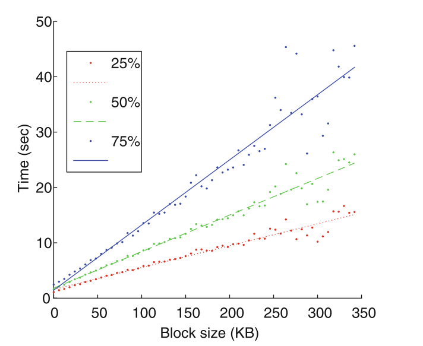
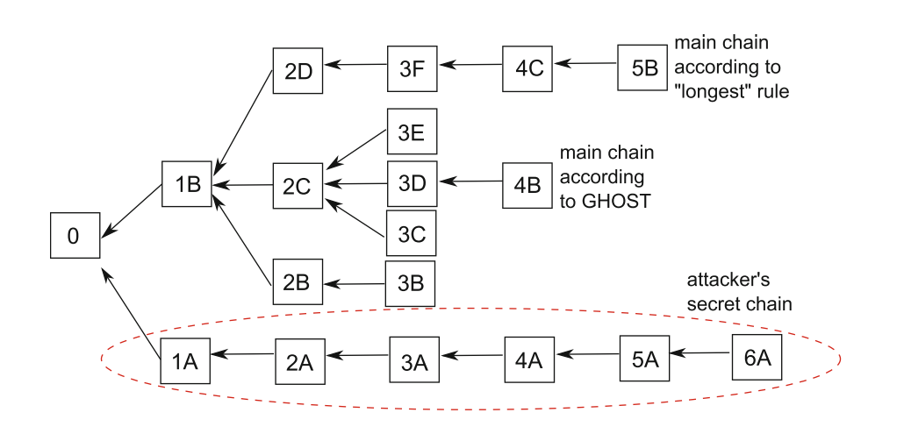

### 一、提出目的

Ghost协议是为了解决比特币在交易高吞吐量情况下，一些比较弱的节点也能够撤销他们已经支付的款项，即使在这些交易被认为被收款人接受之后。

具体来说，在比特币白皮书中，中本聪的原始分析表明，只要任何攻击者拥有少于 50% 的网络计算能力，双花攻击成功的概率就会随时间呈指数下降。这基本上允许付款在一段时间后被认为是可接受且不可逆转的。但是此分析结果需要建立在区块在网络中传播的速度要远远小于区块生成的速度的假设基础上。因此比特币不适合网络处理许多交易的场景(这需要频繁创建更大的块，需要更长的时间来传输)

从计算机科学的角度来看，比特币面对的主要挑战是扩展到更高交易率的能力以及快速处理单个交易的能力。

> 据统计，截止2014.12 比特币的处理能力大概是1TPS(每秒处理一笔交易), 而2010年的数据表明：以太坊的处理能力大概是2000 TPS 。

文章调查了当每秒处理更多交易时比特币对双花攻击的敏感程度。结果表明：更大的块大小或更频繁的块创建事件（这是增加交易吞吐量所必需的）会导致块之间的更多冲突，从而严重降低攻击的安全级别。

论文的主要工作：一是提出用Ghost协议来替代最长链原则，将允许以更低的成本进行更多的交易；二是综合考虑安全性与时间成本，合理调整出块时间。

### 二、Ghost尚存在的问题

在该交易率的场景下，除了双花攻击的难度降低之外，还有一些其它的问题(也是Ghost和最长链原则都未解决的)：第一，更好地连接到网络的矿工获得的奖励略高于他们在哈希算力中的份额；第二，Eyal 和 Sirer [8] 探索的自私挖矿策略可以被较弱的矿工采用。

### 三、最长链原则

#### 1.网络延迟导致分叉

网络中两个相距很远的节点可能同时创建了自己的区块，在这种情况下，这两个节点的区块都不会把对方的区块作为自己的父区块，由此导致了分叉

#### 2.最长链原则内涵

当面对多个（内部一致的）区块链时，网络中的每个节点只需要采用一个作为主链。选取的规则就是：选取最长的一条链。最长链选择规则的一个重要特性是，随着时间的推移，网络中的所有节点都将采用相同的主链。

事实上，为了让区块树中的分叉持续下去，网络的两个部分需要在大约相同的时间连续创建新区块，随着时间的推移，这种事件的可能性变得越来越小。

#### 3.恶意节点故意进行分叉

由于节点恶意偏离协议，也可能发生分叉。攻击者可以选择扩展任意块，并生成分叉。如果攻击者设法呈现更长的区块链，则该链将被网络中的其他节点接受，并且先前的主链将被放弃。

### 四、双花攻击

攻击者可以使用上述覆盖主链的方法来反转交易，这种方案称为“双花攻击”。攻击者可能会向某些商家付款，然后在没有这笔付款的情况下秘密创建一个比网络更长的区块链。通过这种攻击，他可以触发账本中的替换，从而有效地删除交易，或将支付重定向到其他地方。

发动双花攻击的必要基础是占有整个网络中50%的算力。

### 五、比特币TPS建模

1.将整个比特币网络用一个有向图G =(V,E)表示(V表示节点，E表示P2P网络)。每一个节点v拥有的算力用pv(pv≥ 0) 表示,所有节点的总算力为
$$
\sum_{v\epsilon V}^{}p_{v} = 1
$$
2.网络中每个节点v根据泊松过程以pv · λ的速率生成区块，因此整个网络以泊松过程以速率 λ 组合生成块（协议的当前值 λ = 600，由 中本聪 在比特币诞生时选择）。我们还假设有向图的每一条边e都有一个与之相匹配的延迟时间de(这个延迟时间表示两个节点之间区块传输所需要的时间)。

3.在网络受到攻击的情况下，我们使用 λ = λh 作为诚实网络的区块生成率，而攻击节点的生成率表示为q·λh > 0

4.对于每一个区块B，用time(B)标记它的创建时间，所有的区块基本上形成了一个按照时间发展的树结构，该结构植根于创世区块；用tree(t)表示在t时刻的树形结构状态；用subtree(B)表示以区块B为根节点的子树；用depth(B)表示区块B在整个树中的区块深度

5.用longest(t)表示tree(t)中最深的叶子区块

6.用τn表示主链从长度n-1到长度n所需的时间(产生一个区块的时间),用τ表示均值：
$$
\tau = \displaystyle \lim_{n \to \infty }\frac{1}{n}\sum_{n}^{i=1}\tau _{n}
$$
而 β = E[τ] (β是主链的区块添加率，上述的λ是整个区块树的区块添加率)

7.用 b 来表示一个区块的最大容积(KB)(整篇论文中都假设对交易处理的需求很高，并且每个区块总是满的。)

经过最终的计算,主链的 TPS 为(K表示区块中平均KB包含的交易数量)：
$$
TPS(\lambda ,b)=\beta (\lambda ,b)\ast b\ast K
$$

### 六、高吞吐量下引发的安全性降低

在本节中，解释为什么比特币协议在吞吐量增加时更容易受到双花攻击。

1.假设攻击节点以q · λh的速率创建区块，如果这个速率大于主链增长速率β，那么攻击总是会成功的(在给定的时间内)，无论攻击者想要绕过还是替换的区块有多长。相反的，如果 q < β/ λh ,那么攻击者的链绕过主链的概率随着主链长度的增长呈指数下降。因此，**我们将 β/ λh 作为整个区块链系统的"安全阈值"**

2.协议的吞吐量TPS受两个基本参数的影响：一个是区块生成率λ ，另一个就是区块大小b 。可以通过增加这两个参数来增加吞吐量(前者可以通过降低创建有效块所需的计算问题的难度，以加速块创建过程；后者可以通过增加块的大小实现)

3.尽管修改区块生成率 λ 和区块大小 b 可以提高整个区块链系统的TPS，但是也会导致块树中分叉数量的增加，进而导致系统安全阈值( β/ λh )的降低。即是说，一旦吞吐量增加，攻击者可以用更少的计算能力执行有效的攻击。

#### 采用更大的区块(提高参量b)

虽然一个尚未获取到主链最新添加区块的节点所提交的区块不会被添加到主链中，但是会有助于更新较少的替代分支。因此，随着块大小的增加，块自然需要更长的时间在网络中传播，因此会出现更多的分叉。

下述图是根据文献[7]的数据描绘而得的，描绘了区块大小与其传播时间之间的清晰线性关系。

可以明显的看到，区块越大传播所需要的时间就越多。

#### 加速区块的创建(提高参量 λ)

如果块创建速度加快，诚实网络将创建更多区块（更大的 λh），同时也会更快的传播主链中的最新块。大多数的区块通常由未完全更新且不会扩展最长链的节点创建。另一方面，攻击者也可以更快地创建区块（以 q · λh 的速率），但不会受到效率损失的影响。

#### 降低安全性(降低安全阈值β/ λh )

在上述两种情况下，创建的区块并不总是有助于延长主链，这使得攻击者更容易替换它。下图说明了由诚实网络创建高度分叉的块树的场景。

​									**图2    最长链与 GHOST 选择的链不同的块树。攻击者的链能够切换最长的链，但不能切换 GHOST 选择的链**

攻击者秘密创建了一个由 6 个块组成的链（表示为 1A、2A、...、6A），该链明显比网络最长的链（以块 5B 结尾）更长。

### 七、GHOST协议

**GHOST协议的优点是：在网络处于极端延迟且攻击节点没有延迟的情况下，也能将50%算力攻击下的安全阈值保持在1(β/ λh == 1始终成立)**

以上优点允许共识协议设计者设置高区块创建率和大区块，而不必担心接近 50% 攻击的边缘，这反过来意味着可以安全地保持高交易吞吐量。

GHOST协议的规则是：**主链之外的块仍然可以增加其权重。**仍以上述图2为例，块 1B 由直接扩展它的块 2B、2C 和 2D 支持，并将1B包含在它们的链中。类似地，块 3C、3D 和 3E 支持 1B 和 2C 作为其链的一部分。

GHOST协议使用的最重子树协议利用了上述规则，同时为区块增加了额外的权重，有助于确保它们成为主链的一部分。下面我们将介绍GHOST协议的最重子树协议：

对于位于区块树T中的区块B,用subtree(B)表示以B为root的子树，用ChildrenT(B)表示直接引用 B 作为父区块的区块集合，用GHOST(T)表示父区块选择策略(算法)，其算法流程如下：

***Input: Block tree T***

1. $$
   set\ B \leftarrow  Genesis\ Block
   $$

   

2. $$
   if\ ChildrenT(B)= \phi \ then \ return(B)\ and \ exit
   $$

   

3. $$
   else\quad update B \leftarrow \mathop{argmax}\limits_{C\epsilon Children_{T}(B)}|subtree_{T}(C)|
   $$

4. $$
   goto \ line \ 2
   $$

   

该算法遵循从树根（创世区块）开始的路径，并在每个分叉处选择通向最重子树的块。以上述图2为例，以1B为根的子树共包含12个区块；而以1A为根的子树只包含了6个区块。因此算法最终会选择1B作为主链，并继续解决 subtree(1B) 内的分叉问题，这将导致选择块 0、1B、2C、3D、4B 作为树的主链（而不是最长的链，即以块 5B 结束的链）。

这使得以 1B 为根的子树内部的分叉对块 1B 本身的权重没有影响，相反每次向子树（1B）添加一个块都使得从主链中删除它变得更加困难。特别是，当攻击者发布其 6 块长的秘密链时，与之前相同的块仍保留在主链中(而不是将新发布的秘密链作为新的主链)。

### 八、GHOST的基本属性

用ψB表示区块B被所有网络节点接收的最早时刻，或者是被所有节点抛弃的最早时刻。将所有节点采用同一个区块称为分叉的崩溃(collapse)

#### 1. The Convergence of History

​	Pr(ψB < ∞)=1 。换句话说，每个区块最终要么被所有节点接受，要么被所有节点抛弃。同时可得 E[ψB] < ∞

<u>证明：</u>(证明过程不严谨，有待讨论)

​	<u>令D表示为网络的延迟直径。假设在时刻 t > time(B) 区块B既没有被所有节点接受，也没被抛弃。用εt表示事件：在时刻 t + D 和 t + 2D 范围内系统创建下一个区块，然后直到 t + 3D 才产生其他区块。一旦发生该事件，区块B要么被被所有节点接受，要么被抛弃。</u>

​	<u>在时间 t 和 t +D 之间，所有节点都获取所有现有块（因为没有制造新块），因此区块树上具有公共祖先的权重子树上的每对叶子节点所属的节点都会积极尝试扩展它们的树，当出现一个区块并在另一个D时间段内传播到所有节点，所有节点的子树将会汇聚到此区块上，切换到“single shared history”。因此，对于先前的事件εt，它的预期等待时间是有限的。最后可得ψB 是有上限的，意味着E[ψB] < ∞</u>

​	该特性展示了 GHOST 链选择规则的主要优势，即它可以抵御 50% 攻击，即使是在网络中存在显着延迟的情况下：通过在区块创建后等待足够长的时间 τ，它的状态从“接受”变为“放弃”的概率也可以达到任意小。

#### 2.Resilience to 50% Attacks

​	假设攻击者的区块生成率为q · λh(0 ≤ q< 1)，区块B在时刻time(B)+τ时仍然留在主链上的概率随着τ趋于无穷而趋于无穷。我们知道，整个使用最长链原则的区块链系统抵御50%攻击的安全阈值是 β/ λh(超过安全阈值，攻击者就可以修改整条区块链)，但是在GHOST中区块链系统的安全阈值是1(不受变量控制)

<u>证明过程不严谨，有待讨论</u>

### 九、GHOST协议与最长链原则下的主链增长率

​	由于主链增长率高度依赖于网络具体的拓扑结构，这往往是未知且难以测量的。因此在论文中采用了双重方法：一是根据分析分别计算主链增长率的上限和下限；其次，使用随机采样的覆盖拓扑模拟网络并测量生成的区块树。

#### 1.下限

假设一个连接良好的节点集群（延迟直径为 D）的计算能力占整个网络的 α （ 0 ≤ α ≤ 1） 。在这种情况下，在这个子网络中创建的区块在内部传播相对较快(越容易分叉)，我们可以获取主链的增长率下限。

1）最长链原则(引理5)

​	整个子网络以λ‘= α · λ的速率生成区块且节点间的传播时延为D,可以求出主链的增量率为：
$$
\beta\left ( \lambda  \right )\geq \frac{\lambda ^{\prime}}{1 + \lambda ^{\prime}D}
$$
2）GHOST协议(引理6)

​		整个子网络以λ‘= α · λ的速率生成区块且节点间的传播时延为D,可以求出主链的增量率为：
$$
\beta\left ( \lambda  \right )\geq \frac{\lambda ^{\prime}}{1 + 2\lambda ^{\prime}D}
$$
当节点的个数n →∞(也就是为一个完整图时)可以获取主链增长率的下界，其中所有的边上的延迟都恰好为D,且每一个节点的计算力都是相等的(平均分配)。因此，这个下限可以被认为是理想的去中心化网络的近似值，其计算能力很好地分布在许多等距节点之间。

**引理5的计算**

假设一个深度为n的区块U被创建且已经被传播给其他节点，创建下一个区块U'又需要耗费 1/λ 秒，区块U'的创造者自然知道区块U已经被创建，因此它的区块深度至少是n+1，因此区块U'从创建到被其他节点获知的时间为  1/λ +D ,据此可得主链增长率的下界为 1/( 1/λ ' + D)

**引理6的计算**

由于 GHOST 没有选择最长链，因此可以预期其主链的增长率会比最长链规则中的低一些。事实也确实如此，假设区块B位于网络中区块树T上，无论先前的历史情况如何，创建出区块B的下一个子区块的最长等待时间为 2D + 1/λ ' 