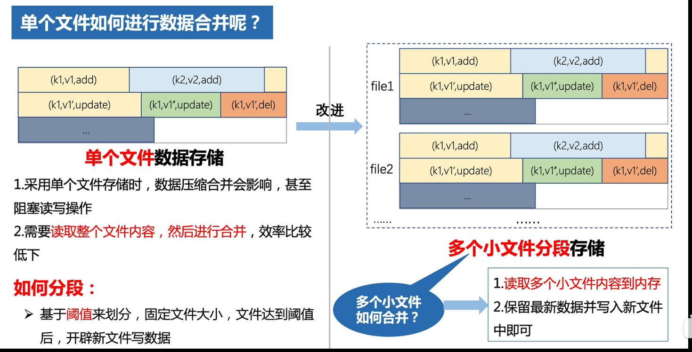

## 一、存储结构分类

第一种就地更新结构，更新数据的时候直接对旧的记录进行修改，采用的是随机写，因此效率较低

第二种异位更新结构，更新数据的时候直接创建一条新的记录，采用的是顺序写，因此效率高，但是因为有多条记录因此读取的时候要扫描多个位置，因此读的效率低

## 二、存储结构发展历程

SSD 在修改数据的时候不能像机械磁盘一样，直接覆写旧的数据，必须要先将旧的数据擦除再重新写入，因此B树不太适合固态硬盘，而LSM树因为不需要在原位置上进行修改，因此更加适合于固态硬盘。

结论：B树适合在机械硬盘上存储；LSM树更加适合在SSD上存储。

## 三、存储结构的共性特点

能够作为存储结构，其必须满足以下两个特点：

不适合做存储结构的，就是不能同时满足以上两个特点的：

1. 对于大文件和数据，它们占据着一大块连续的物理空间，满足条件①，但是并发时需要锁住整个文件和数组，并发性能差，不满足条件②
2. 对于链表、哈希表、BST等，它们的数据操作粒度小，修改操作只需要锁住很少的一部分，满足条件②，但是存储是离散的，需要很多次随机IO，不满足条件①

适合做存储结构的，必须要同时满足上述两个特点：

1. B树

每个页都是顺序IO访问，一个页大小为16K，满足条件①

对于条件②，大多数情况下访问记录只需要锁住记录所在的页即可；但在特殊情况下，也就是在造成“页分裂”的情况下，需要同时锁住多个页，导致B树勉强满足条件②

SMO的存在使得B树的并发性能并不高。

2. LSM树

LSM树所有的插入操作都是顺序IO的，而且区别于B树在修改前需要先找到数据的原位置再修改，LSM树不需要找到原数据而是直接将数据插入到顶层的level0树中。因此LSM树的写操作极快。

LSM中，因为存在多层结构，查询数据的时候可能需要进行多层查询，这就导致数据的查询速度比较慢。（为了优化读取的性能，每层都引入一个布隆过滤器，依次来判断数据是否存在于当前层的树中）

LSM树存在一种合并操作，在合并操作期间，进行合并的两个level 层是需要加锁的，此时不能进行并发操作。

## 四、LSM树

### 4.1 简介

LSM分为两部分，一部分在内存中，一部分在硬盘中。

LSM中数据存在一个不断向下合并的过程：

当C0中数据量达到存储上限的时候，他就会与其下一层的C1进行合并，如果遇到重复的数据则保留最新的（C0相比C1有最新的数据）；合并完成后，C0中被合并的数据就被清空了，全部移动到了下层树中（C1）；如果合并完之后，C1也到达存储阈值，他也会继续向下合并。

上述的过程，假设有一个“a = 5” 的 k-v 从最初的C0最终被合并到了CK。接着我们又从C0中插入了新的“a = 100”，此时我们去查找"a = ?"，返回的结果只会是 a 最新的值，也就是"a = 100"（查找过程是从上往下，依次查询每个level的树）。随着后续的合并操作，C0中的 "a=100"会覆盖掉CK中的“a=5”

当C0树大小达到存储阈值时，就会拿出一部分与C1树进行合并，合并后的结果存在到C1中。

LSM树有两种合并策略：

- 策略一：每一层只有一个组件，合并的时候也是不同层的组件进行合并，上层的合并到下层中
- 策略二：每一层有多个组件，合并的时候是同一层的不同组件进行合并，合并后的新组件追加到下一层中

### 4.2 LSM的写操作

- LSM树中的数据分为三类

- LSM树采用追加写这种顺序IO完成写操作
- 为了避免同一条数据占据多份空间，LSM会对数据进行压缩合并

- 如果全部的数据都存在在同一个文件中，那么进行合并的时候需要读取整个文件，合并时间也很长。因此 `LSM` 将数据分散的记录在若干个小文件中，合并的时候将小文件之间进行合并即可，合并的结果就是保留合并数据的最新结果
- 小文件需要进行分类，LSM中按照文件的大小阈值划分为不同等级的文件，等级越高文件大小阈值越大。
- 当小文件达到自身的阈值后，需要与其下一级的文件进行合并，将合并后的结果存放到下一级文件。

- 为了保证小文件合并的效率，小文件内部数据也需要是有序
- 为了保证用户写操作的持久性，LSM采用WAL技术，将所有的写操作记录到redo log 中
- 合并的时机：当文件大小达到阈值；合并方式：相邻不同层级的文件进行合并

### 4.3 LSM读操作

### 4.4 LSM总结

- 在进行写操作的时候，数据先被写入到 `Memtable` 中，当 `Memtable` 大小达到阈值的时候，就会生成一个`Immutable Memtable`，这个是不可写的，然后这个`Immutable Memtable`会被持久化到硬盘中的 `Level 0` 级别的 `SSTable`