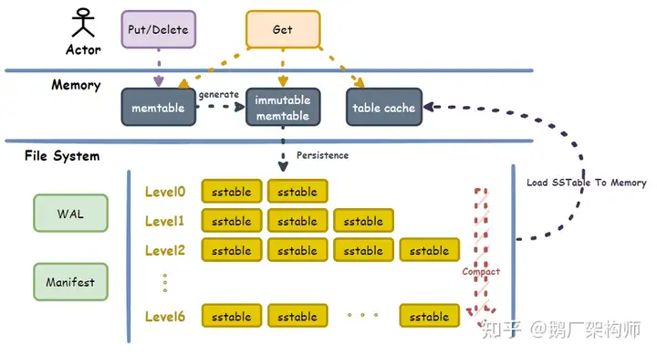
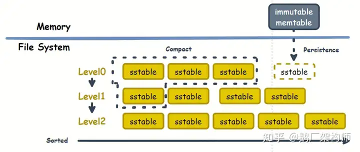
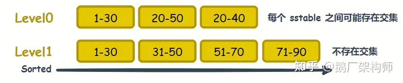
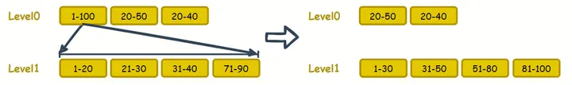
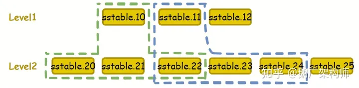
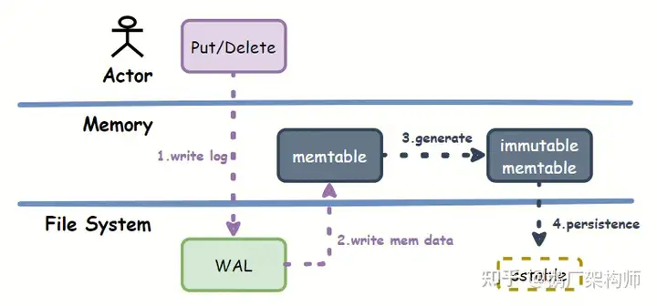
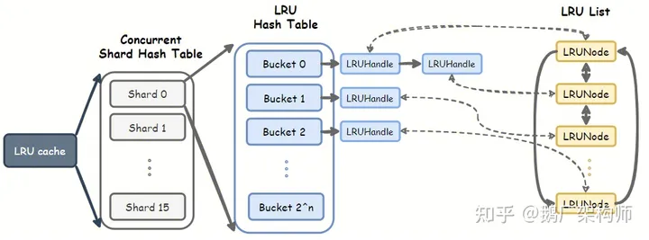
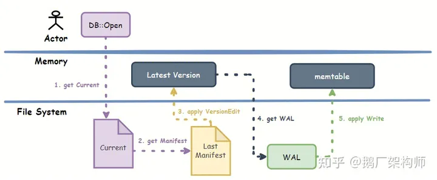
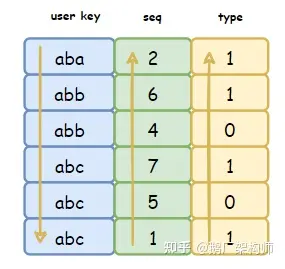
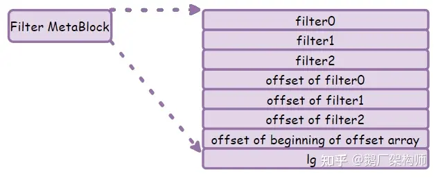

## 一、基本架构

架构图如下：



它的架构主要分为两层：Memory 和 File System，通过对这两部分的极致设计来尽可能的提高 IO。

### 1.1 Memory 层

Memory 层有 `memtable`、`immutable memtable` 和 `table cache` 三大模块组成：

- `memtable`：用户的写操作并不会直接写入磁盘，而是记录在内存的 `memtable` 中，该结构**由 `SkipList` 实现**，这提供了 `O(logn)` 的读写能力；
- `immutable memtable`：这是一个典型的无锁双 `Buffer` 理念设计，`memtable` 负责用户的写操作，而 `immutable memtable`  负责**将内存的数据落地到磁盘**，每次 `memtable` **存储的数据达到阈值**时（默认是 `4MB`）就会生成一个新的 `memtable` 同时将**旧的  `memtable` 转成 `immutable memtable`**，接着**启动异步线程开始将内存数据进行落地；**
- `table cache`：实现上是 `LRU Cache`，负责**从磁盘中读取数据缓存**到内存中来**提供高效读能力**。

Memory 层主要是给用户提供一个良好的读写能力，但是不管是 immutable  memtable 还是 table cache 都依赖磁盘 IO 的能力，所以磁盘文件结构的设计也至关重要。

### 1.2 File System 

`File System` 由  `WAL`、`Manifest`、`SSTable` 三种文件组成：

- `WAL`：全称 `Write-Ahead Log` 预写式日志，属于数据库中的常青树技术，通过**先写日志再写数据**来保证**可靠性和一致性**，几乎没有不使用该技术的数据库；
- `Manifest`：`LevelDB` **元数据日志**，用于保存当前数据库版本、拥有哪些数据文件等信息；
- `SSTable`：存储了**落地的数据**，这是一个**只读文件**，只能做**读取**和**删除**两个动作，**不能修改**，其文件内容按照**数据有序的存储**，可以快速的进行定位和获取。

## 二、组件介绍

### 2.1 `LSMT`

了解到磁盘性能顺序写和随机写的差异。不管是在传统的硬件磁盘上还是在高速`SSD` 上，**顺序写比随机写一直有着很大的性能优势**。

为了能够尽可能的**提高数据库的写能力**，**`LSMT` 被设计而出**，其全称叫 `Log Structed-Merge Tree`，最开始出现在 `BigTable`。

**以往的数据库**里面，我们**更新一条记录时必然有一个读取然后再更新的过程**，也就是**记录是覆盖更新而非增量更新**，比如 MySQL，虽然 MySQL 的 Change Buffer 的存在一定程度上缓解了这种情况，但是适用场景有限。这种**覆盖更新会涉及两次  IO，读一次和写一次**，**写操作大概率会触发随机写**。

而 **`LSMT`** 不走寻常路，**采用增量更新**，当用户**更新一条记录时，只会增加一条新纪录，而不会直接删除旧记录或者更新旧记录**，同时这条新纪录是**以一种追加写的方式落地到磁盘文件的**，这充分的利用了**顺序写**。

`LevelDB` 实现上由于 **`immutable memtable` 会在内存中存储 `4MB` 的数据才会落地**，也就是说**一次性写了 `4MB`  的内容**，这何止是追加写，这直接咔咔创建新文件。**然后通过多路归并的方式不断的进行本地数据的合并**，我们可以通过看下图来进一步了解 `LevelDB`  是如何去实现 `LSMT` 的：



#### 2.1.1 内存数据的落地： 

在上图中我们从上往下看，首先是 **`immutable memtable` 持久化落地一个 `sstable` 到磁盘中**，这里是**直接落到了 `Level_0` 层**，**这一层有一个特点**，**每个 `sstable` 文件虽然文件内 key 有序，但是文件之间并不保证有序**，所以 **key 会有重叠**，如下图 `Level_0` 三个文件 key 的范围都有重叠：



这样设计的好处是 **`immutable memtable` 落地时，不需要考虑当前内存里面新写入的记录的 `key` 是否已经和存在于 `Level_0`的 `sstable` 有冲突**。不过这**会造成一些读性能的损失**，由于 **`Level_0`每个 `sstable` 可能都会存在某一个 key**，在**做读取操作时，需要遍历`Level_0`层的所有文件**，如果发现**查询的 key 位于这个文件的最小 key 和最大 key 之间**，就**需要进一步读取文件内容去做判断**。再**加上快照读的操作，即使找到了相同 key，版本不合适还得继续往下找**。

#### 2.1.2  合并压缩： 

从落地逻辑可以看出来，如果 **`Level_0` 不断的增加文件，那么每次磁盘查询时会遍历所有文件，读性能会不断的降低**，最终不堪一用。为了解决这种情况，就需要**尽可能减少 `Level_0` 的文件个数**，`LSMT` 的**方法是新增了一个 `level1` 层**，该层的**每个 `sstable` 文件内 `key` 单调递增，且每个文件之间也单调递增**，即 A 文件所有 key 一定小于 B 文件所有 key，这保证了**该层的每个文件 key 不会重叠**。

当需要**查询某个 `key`** 时，会**先处理 `Level_0` 每个文件**，然后对于 **`level1` 层则可以直接通过判断文件 `key` 的范围来快速定位**，由于 `Level_1` 层单调递增特性，最终**只检索一个文件内容即可**。这种情况下，**只要将 `Level_0` 维持在一定数量内，那么整体的读性能就不会太差**，`LevelDB` 尽量会将 `Level_0` 层文件个数**维持在 4 个以内**。

如何生成 `Level_1` 层的文件呢？**当 `Level_0` 层的文件超过阈值时，就会将 `Level_0` 层的文件与 `Level_1` 层中有 key 重叠的文件进行合并，将其中无效的 key 给丢弃掉后，生成新的单调递增的文件放到 `Level_1` 层中**，这种过程被称为**合并压缩**，`LevelDB` 中规定除去 `Level_0` 层外，其他层新生成的文件大小均为 `2MB`（并不是真的所有文件都是 `2MB`，只是阈值为 `2MB`）。

但是仅新增一个 `Level_1` 层会无上限的**放大合并压缩时的写操作**，比如下图：



上图中，`Level_0` 层在压缩第一个 `sstable` 文件时，发现 **`Level_1` 层所有的文件都与它内部的 key 有重叠**，为了保证 `sstable` 文件合并压缩后，`Level_1` 层保证单调有序且每个文件之间也有序，**必须读取所有 `Level_1` 层的文件，然后通过归并排序的方式，重新生成 `Level_1` 层的文件**。

很明显，**一次合并压缩相当于重写整个 `Level_1` 层**，这个量级就是指数级的，随着存储大小增长，这种情况会越来越糟糕。

`LevelDB` 会像处理 `Level_0` 层一样，处理 `Level_1` 层，**控制其存储大小阈值为 `10MB`**，通过**限制 `Level_1` 的总文件大小**， 从 `Level_0` 向 `Level_1` 合并压缩时**总体的读写消耗是可控的**。因为 `Level_1` 层撑死也就 `10MB` 文件，如果在 `100M/s` 顺序读写能力的磁盘上操作的话，合并 `Level_1` 层所有文件，读 `10MB` 加上写 `10MB` 也就是花费 `20ms` 的时间，如果再平摊到每次用户请求花费 `1ms` 去压缩一下，20 个请求差不多就能很好的分摊这次合并压缩的代价。

当我们**限制 `Level_1` 层的大小**时，就**不得不将多余的存储往更高层进行压缩合并**，然后我们就**需要新增一个 `Level_2` 层**，同样的 `Level_2` 也会面临像 `Level_1` 层的问题，不同的是，`Level_0` 往 `Level_1` 压缩时，由于用户行为不可控，`Level_0` 某一个文件与 `Level_1` 层所有的文件存在 key 重叠情况就不可控，同理读写消耗也是不可控的，所以才不得不限制 `Level_1` 层的文件大小。

但是**对于新增的 `Level_2` 层**却没有这个问题，由于 **`Level_1` 保证了每个 `sstable` 文件内有序，同时文件之间有序**，所以每次将 `Level_1` 层一个文件（文件大小为 `2MB`）合并压缩到 `Level_2` 层时，因为 `Level_2` 也同样遵循 `Level_1` 的 `sstable` 特性，那么 **`Level_2` 层的一个文件有且最多与 `Level_1` 层中的两个文件重叠**。如下图：



上图中的 `sstable.22` 左半部分与 `sstable.10` 重叠，右半部分与 `sstable.11` 重叠，而这种情况有且仅发生在边界，除了边界外，其他情况 `Level_2`的文件只会与 `Level_1` 重叠一个文件，正如图中的 `sstable.21` 就只会与 `sstable.10` 重叠，`sstable.23` 只会与 `sstable.11` 重叠。

所以 `Level_2` 层因为 key 重叠需要处理的文件数平均最坏情况为 `size(Level_2) / size(Level_1) + 2` 个文件，其中的 `2` 说的就是 `sstable.22` 这种正好处于边界的情况。 而 `size(Level_2) / size(Level_1)` 则说的是 `sstable.21` 这种情况。

**`Level_2` 的出现，让压缩的量级从指数级，降到了 `size(Level_2) / size(Level_1)`的线性级**，接着就会遇到另外一个问题，**怎么去遏制这种线性级读写消耗的增长呢？**

**`LevelDB` 中通过划分更多层来缓解这种线性增长**，`LevelDB` 中**除去 `Level_0` 外，还会划分出从 `Level_1` 到 `Level_6` 层**，`Level_1` 层阈值为 `10MB`，`Level_2` 为 `100MB`，依此类推，**每层的总大小阈值为 `10^n MB`**，也就是说 `size(Level_N+1) / size(Level_N) = 10`，当合并压缩 `Level_N` 层的一个文件时，`Level_N+1` 层会取 12 个文件，所以总共 26MB 读 + 26MB 写，在 `100M/s` 的磁盘中就是 0.5s 左右的消耗，这是每一层最差的合并压缩消耗。

**LevelDB 的最高 `Level_6` 层存储大概 1TB 左右的内容，超过 1TB 后，由于 `Level_6` 不能再往更高层合并压缩数据，合并压缩消耗就会不限控制的线性增长。**得益于现在硬件的发展，实际上很多硬件的IO能力已经有了很高的提升，比如 SSD 顺序读写可达 3000 MB/s，按照每次 0.5s 的压缩损耗，`Level_N+1`可以是 `Level_N` 的 375 倍，`Level_6` 就能存储 64 EP，也就是说即便到了未来， LevelDB 依旧顶得住。

### 2.2 `SSTable`

`SSTable` 全称又叫 `Sorted String Table`，从字面上就能看出来该文件存储的数据按照字符串有序排列，在 `LevelDB` 中一个 `SSTable` 文件里面的内容大致可以分为两类：

1. **用户数据**：真正存储着**用户的 key-value pair** 信息；
2. **辅助数据**：存储着**数据的偏移量**或者**其他元数据**，可以帮助 `LevelDB` 更好的处理数据。

其文件结构图如下：


上图中 `SSTable` 从上往下，结构依次为：

- **`DataBlock`**：存储着用户的 key-value pair 数据；
- **`MetaBlock`**：存储着一些元数据，比如布隆过滤信息，`SSTable` 的存储记录数等；
- **`MetaIndexBlock`**：存储着 `MetaBlock` 的偏移位置，用于快速定位读取 `MetaBlock`；
- **`IndexBlock`**：存储着 `DataBlock` 的偏移位置，用于快速定位读取 `DataBlock`；
- **`Foot`**：存储着 `MetaIndexBlock`、`IndexBlock` 的偏移位置，该类型块的大小固定为 48 个字节。

### 2.3 `WAL` 日志

`WAL` 是数据库系统中常见的一种手段，用于保证数据操作的**原子性和持久性**。在使用 `WAL` 的系统中，**所有的修改在提交之前都要先写入 log 文件中**。在 `LevelDB` 中也不例外，看下图：



上图中，用户做任何写操作时，都会先将操作写入 `WAL` 中，落地到磁盘，然后才会将记录写入 `memtable` 中，这样在进程异常、系统掉电等异常情况发生时，也可以从 `WAL` 中恢复数据。

**每一个 `memtable` 都对应一个 `WAL`**，直到这个 **`memtable` 落地到 `sstable` 后，该 `WAL` 才会被删除**。

`WAL` 使用的 `log` 文件格式如下图：


`LevelDB` 的线程模型是**单线程写，多线程读**。写操作只会有一个线程在处理，所以**每次处理时会处理多条 Write 操作**，因此在 Record  中的 Data 并非只存储一条 Write 操作，而是**某一时刻滞留在写队列中的多条 Write 操作合并成一个 Batch 结构，序列化后存到了 Data 中**。同时**上述文件格式是一个通用的结构**，在后续的 Manifest 文件中也会用到。

### 2.4 压缩策略

通过 `LSMT` 的合并压缩内容，我们了解到 `LevelDB` 需要通过合并压缩来提高读性能，那采用什么样的压缩策略可以尽可能减少对用户的影响，同时充分的利用磁盘的 IO 性能呢。`LevelDB` 中的**压缩按照规模可以分为两类**：

- **Minor Compaction**：将 `immutable memtable` 落地到一个 `sstable` 的操作；(内存 ---> 硬盘)
- **Major Compaction**，将每一层的 `SSTable` 向更高层做合并压缩的操作。（硬盘 ---> 硬盘）

上述的划分只是两种不同的压缩方式，我们**更关心什么时机去触发压缩操作**，这是一个值得思考的问题，在 `LevelDB` 中如果**按照压缩时机的话也可以分为两类**：

**被动时机**：

- 是否存在 immutable memtable，存在则将 immutable table 落地到 SSTable；

- **记分牌算法**根据 level total size **为每一层打分**，**分数大于 0 且分数越大，该层越先被触发合并触发**，其算法具体为

```
if level == 0:
  score = (Level_0 file num) / 4  // 控制 Level 0 层的文件数量
else :
  score = size(Level_N) / 10^N  // 此时该层的总大小已经超过了 10^N 的上限，必须做合并压缩

if score > 0:
  compact
```

在**被动时机的记分牌算法**中，对于 `Level_0` 层做了特殊处理，**并非用该层的总大小来打分的，而是文件个数**，这是出于以下情况的考虑：

1. `Level_0` 层的文件是直接从 immutable memtable 生成的，所以会受 `options_.write_buffer_size` 配置的影响，使用总大小来打分并不合适；
2. 由于 `Level_0` 文件数据重叠的特殊性，每次 `Level_0` 层向 `Level_1` 合并压缩时都有**可能需要读取 `Level_1` 所有的文件**，所以**非常有必要控制 `Level_0` 层的文件数量**来减少不必要的磁盘性能消耗。

**主动时机：**

如果一个 `SStable` 文件**被反复的访问了 n 次**，则**该文件会被触发一次压缩**，这个 n 的计算规则为

```
n = (file size) / 16KB
```

在压缩过程中，`LevelDB` 还会通过**降低用户体验，来保证数据库的基础体验**：

- 如果 `Level_0` 的数量不少于 8 个，则当前写操作会让出 `1ms CPU` 给到压缩线程去压缩；
- 如果 `memtable` **已经超过** `options.write_buffer_size`，但是 **`immutable memtable` 还没有落地到 `SSTable`**，则当前**写操作直接休眠**，必须**等到 `immutable memtable` 写入 `SSTable` 后才能接着执行**；
- 如果 **`Level_0` 的文件数量不少于 12 个**，则**当前写操作直接休眠**，必须等到 `Level_0` 的数量**小于 12 个才往下执行**。

### 2.5 缓存机制

先看 `LevelDB` 用于实现缓存类：



整个缓存类分为三个模块：

- **`Concurrent Shared Hash Table`**：将 key 通过 hash 划分成多个桶，固定为 16 个桶，**每个桶都对应着一个 `LRU List`**，**每个桶都可以并发读写操作**；
- **`LRU Hash Table`**：使用 hash 表指向 LRU List 节点，同时该表会动态调整大小；
- **`LRU List`**：根据 LRU 算法维护着双向链表。

## 三、文件元数据管理

`LevelDB` 的用户数据由 `SSTable` 落地存储，又由 `WAL` 保证在系统断电等异常的情况保证可以恢复数据。同理 `SSTable` 和 `WAL` 这些**文件的元数据也需要得到保证**，否则当**系统重启之后无法判断某个 `SSTable` 属于哪些层级**，**是否存在 `SSTable` 文件缺失等信息**。

`LevelDB` 解决上面的问题的方式是**通过 `Version` 和 `Manifest` 的协同，构建起了文件元数据管理模型**。

### 3.1 Version & Manifest

首先看 Version 和 Manifest 的协同图：


上图中的各个部件：

- **`VersionEdit`**：存储着增量变化的内容，**每次文件变动时会生成一个当前文件变动的 `VersionEdit`**：

- - `new files`：当前新增了哪些文件，比如 immutable memtable 落地到 sstable，就会导致 `Level_0` 层新增一个文件；
  - `delete files`：当前废弃了哪些文件，比如`Level_N`向`Level_N+1`合并压缩，`Level_N`就会废弃掉被合并压缩的文件；
  - `log number`：当前 WAL 的日志文件 ID， 用于找到具体的 WAL 文件；
  - `last seq`：当前最新的操作序号，每次写操作都会导致 seq + 1；
  - `next file number`：下一个新文件的文件 ID。

- **`Version`**：记录文件元数据的类，**每一次文件变动**都会通过**上一次的 `Version` 对象**和**当前的 `VersionEdit`** 生成**新的 `Version` 对象**；

- **`Manifest`**：每次 `DB::Open` **打开一个新的 `LevelDB` 实例**时，都会**生成一个全新的 Manifest 文件**，该**文件存储着 `VersionEdit` 的序列化数据**，当**系统奔溃或者断电后，可以通过一步一步的回溯，得到数据库异常前的状态**；

- **`Current`**：指向最新的 Manifest。

其中 **Manifest 文件存储数据的方式与 `WAL` 是一样的**，`WAL` 中 `Record Data` 部分存储的是写操作记录，而 **`Manifest` 存储的则是每次的 `VersionEdit`**。

### 3.2 Recover

系统奔溃了，如何**通过文件元数据和 `WAL` 来恢复数据**，`LevelDB Recover` 的流程如下：



具体步骤如下：

1. 当系统奔溃后，不需要额外操作，我们直接**通过 `DB::Open` 打开当前的 `LevelDB` 实例**；
2. 获取 `Current` 文件，**拿到最新的 `Manifest`** 是哪个文件；
3. 通过**加载 `Manifest` 文件**，**依次应用所有的 VersionEdit 将 Version 恢复到最新**；
4. 接着**通过 Version 中的 log number 读取相应的 WAL 文件**；
5. **应用 WAL 中的写操作**，通过相同的写流程**写入到 memtable 中**，这个过程**可能会触发生成 immutable memtable 以及写 SSTable 动作**。

在一些极端情况下，恢复操作允许 Manifest 丢失，Manifset 的作用是帮我们维护文件层级、最新操作序号、最新文件号等信息，**当 Manifest 丢失后，我们也可以通过将所有的 SSTable 当做 0 层**，**重新进行合并压缩来构建新的层级关系以及最新文件号和操作序号等信息**。

### 3.3 `MVCC` & 快照

讲解 `LevelDB` 中的 `MVCC` 之前，首先需要深入了解 `LevelDB` 中 `key` 的构成，`LevelDB` 的有序性是通过 `key` 来维持的，相邻的两个 `key` 是有序的，非 `Level_0` 层的 `SSTable` 文件之间是有序的，大家直观的感觉，维护这个有序性的 key 就是用户执行 Write 操作时写入的 key，其实不然，`LevelDB` 中 `memtable` 以及 `SSTable` 中存储的 key 的结构如下：

```
|       InternalKey      |
+-----------+-----+------+
| user key  | seq | type |
+-----------+-----+------+
```

`LevelDB` 将这个 key 叫做 **`InternalKey`**，其分为三部分：

- user key：用户传进来的 key；
- seq：当前写操作的序号；
- type：当前是一次删除操作，还是普通的写操作。

InternalKey 的**有序性**可以通过 `option.comparator` 来**控制**的，如果用户不传递自定义的排序函数，**默认情况下采取如下排序策略**：

1. 先按照 user key 升序；
2. 然后按照 seq 降序；
3. 最后按照 type 降序。

`LevelDB` 每次写数据都是增量记录，然后落地到存储中，相同的 user key **不会覆写**，也就是说**会同时存在多个相同 user key 的记录**，所以 `SSTable` 中的数据排列是这样的：



从上图中可以看出，LevelDB 存储结构就**保留着同一个 user key 的多个数据版本**，**天然实现了 MVCC**，所以问题就只剩下**如何解决我们的可见性问题**。

在 MySQL 中有一个 ReadView 结构来构建用户的可见数据范围，在 LevelDB 中则是一个叫做 **Snapsphot** 的**快照结构体**，该结构很简单，**仅有一个 number 字段，存储着当前的操作序号。**

当我们**进行查询时**， LevelDB 会生成一个 **LookUpKey**，**该 Key 由 `user key`、`snapshot.seq` 和 `type` 组成**，然后去查找，**查找的方案是找到一个小于等于当前 LookUpKey 的第一条记录**。

比如我们**拿到 `snapshot.seq = 4`，然后我们去查找 `abc`，生成的 LookUpKey 为 `user key=abc, seq=4, type=1`**，根据 comparator 判断，我们**就会查找到 `user key=abc, seq=1, type=1` 这条记录。**

对于**没有传 Snapshot 的查找操作**，会**直接取当前最大的 seq 当做 LookUpKey 中的 seq**，然后进行查找，这样我们**就能查找到最新的 user key** 更新记录。

LevelDB 存储**多个数据版本会造成大量的数据冗余**，**需要适当进行丢弃**，丢弃 user key 低于最新版本的其他数据版本的前提是：该数据版本不再被引用。**判断时机是在合并压缩(包含 minor和 major 两个时机)的时候。**

## 四、优化措施

### 4.1 布隆过滤器

为了**提高查询效率**，LevelDB 内置了一个 Filter MetaBlock 的数据结构，跟 DataBlock 存储到一起，这是一个可选项，默认情况下 LevelDB 并不会写该结构，如果你设置了 `options.filter_policy` 选项，才会起作用。

LevelDB 在存储 Filter MetaBlock 时结构如下：



上图中的各个部件：

- **filter 块**：按照 `lg` （该值为2KB）划分 DataBlock 中的数据来生成 filter，比如 DataBlock 为 4KB，所以此时会生成 2 个 filter 块，第一个 filter 块对应 0-2KB，第二个 filter 块对应2KB-4KB；
- **offset of filter**：存储着 filter 块的偏移量；
- **offset of offset array**：存储着第一个 offset of filter 的偏移量；
- **lg**：将 DataBlock 按照 lg 大小划分多个 filter。

LevelDB 默认提供了**布隆过滤器**，用户可以直接将其填写到 `options.filter_policy` 来使用它。filter 块存储的内容就是布隆过滤器的结果。**通过布隆过滤器能够做到不在 filter 块中的数据就一定不存在于 DataBlock**，以此**减少查询次数，提高查询效率**。