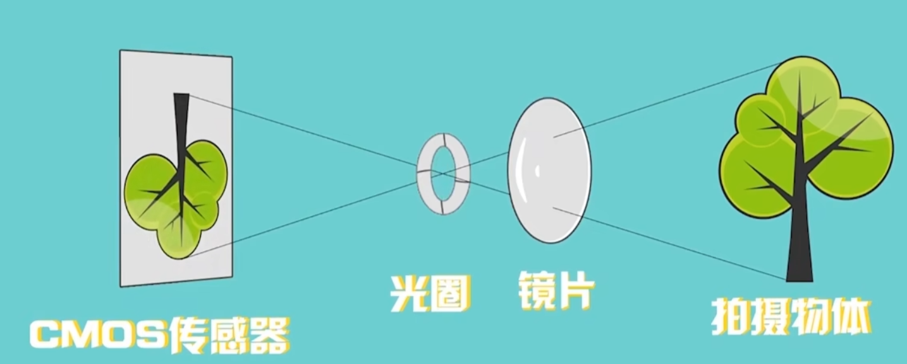
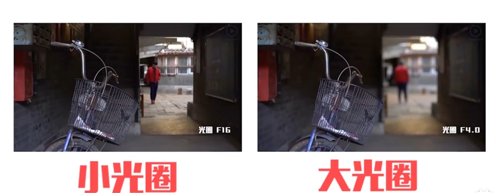

# 一、摄像机的基本组成

类别人眼：

- CMOS传感器（以前的胶卷） --- 视网膜

- 光圈 --- 瞳孔 （可伸缩）  ---  控制进入摄像机的光线的强度

- 镜片 -- 晶状体  ---  通过不同的镜片组合，进行对焦

  

- 快门 ---  眼皮 --- 按快门相当于睁眼让光进入相机，控制快门持续的时间就是控制进入相机的光的时间

# 二、光圈-快门-传感器

## 2.1 光圈（F）

当外界光线非常强的时候，就需要缩小光圈（瞳孔），减少进入相机的光线量

> 可以认为光圈控制了单位时间内进入光圈的光线量

光圈的大小通常用F值（F-number）来表示，**F值越小，光圈开口越大**，**允许更多的光线进入相机**；F值越大，光圈开口越小，进入的光线越少。

光圈的大小会影响照片的景深。**大光圈（小F值）会产生浅景深，使背景模糊，突出主体**；小光圈（大F值）会产生深景深，使前景和背景都保持清晰。

> 在人像摄影中，摄影师可能会选择大光圈来模糊背景，从而突出人物；而在风景摄影中，可能会选择小光圈来确保整个场景都清晰可见。

## 2.2 快门

快门控制的是一次摄像中光进入的时间。

当光圈不变时，光线越暗（单位时间内进入光圈的光线量变小了），快门打开的时间就需要延长

快门速度通常**以秒或分数秒来表示**。例如，1/60秒、1/250秒、1/1000秒等。**分母越大，快门开启的时间越短**，进入相机的光线越少，曝光时间越短；分母越小，快门开启的时间越长，进入相机的光线越多，曝光时间越长。

**控制运动模糊**：快门速度决定了照片中运动物体的清晰度。**快速快门**可以**冻结快速移动的物体**，如运动员、飞鸟等；**慢速快门**则可以创造出**运动模糊效果**，如流水、车灯轨迹等。

不同快门速度的应用：

- **高速快门**（如1/1000秒或更快）：适合捕捉快速运动的物体，如体育赛事、动物等，可以冻结动作，减少运动模糊。
- **中速快门**（如1/60秒至1/250秒）：适合日常摄影，如人像、风景等，可以避免手抖引起的模糊，同时保持足够的曝光。
- **慢速快门**（如1/30秒或更慢）：适合创造特殊的视觉效果，如流水的丝绸效果、星轨、光绘等。使用慢速快门时，通常需要使用三脚架来稳定相机，以避免因手抖导致的模糊。

## 2.3 传感器(ISO)

传感器的最重要参数是**感光度**，也就是对光线的敏感程度，控制了画面亮度。

如果光圈已经最大，快门也已经最长时间，依旧很暗，那么就需要提高传感器的感光度

感光度的单位是ISO，这个数值通常**以指数形式表示**，如ISO 100、ISO 400、ISO 800等。ISO值越高，表示相机的感光度越高，对光线的敏感度越强。

感光度还会影响到**噪点程度**：

**提高ISO值虽然可以增加曝光，但同时也会增加照片中的噪点（图像噪声）**，尤其是在高ISO值下，噪点会更加明显。噪点会降低照片的清晰度和质量。

**感光度的应用**

- **低ISO值（如ISO 100或ISO 200）**：在光线充足的环境下使用，可以获取噪点少、清晰度高的照片。
- **中等ISO值（如ISO 400至ISO 800）**：适用于大多数日常拍摄环境，可以在保持相对较低噪点的同时，提供足够的曝光。
- **高ISO值（如ISO 1600以上）**：在光线非常暗的环境下使用，可以捕捉到更多的光线，但代价是增加噪点。**高ISO值常用于夜间摄影、室内低光环境或快速移动物体（在需要使用快速快门冻结动作的情况下，提高ISO值可以补偿因快门速度提高而减少的曝光）的拍摄。**

低光照情况下，如何降低因 ISO 过大导致的噪点问题？

1. 人为补充光线，采用补光灯和闪光灯
2. 使用三脚架，解决手抖问题，这样就可以增大快门的曝光时间（针对低速物体）来降低ISO

## 2.4 关系

简单的用加法理解：

res = 光圈大小 + 曝光时间 + 感光度（ISO）

# 三、对焦

光圈、曝光时间、ISO都调整到了合适的值，也不一定能保证拍摄的照片清晰，此时还需要进行**对焦**。

对焦就是把焦点放在拍摄主体上。

# 四、过曝与欠曝

### 过曝（Overexposure）

过曝是指照片的亮度超过了理想曝光水平，导致**照片看起来太亮，细节丢失**，特别是**高光部分**的细节。过曝的照片通常表现为：

- 高光区域（亮部）细节丢失，变成纯白色，没有渐变或纹理。
- 整体画面看起来过于明亮，缺乏对比度。
- 色彩饱和度降低，因为过亮的区域可能会使颜色看起来褪色。

过曝的照片**很难通过后期处理恢复丢失的细节**，尤其是高光部分的细节。

### 欠曝（Underexposure）

欠曝是指照片的亮度低于理想曝光水平，导致**照片看起来太暗，细节不够清晰**，特别是**阴影部分**的细节。欠曝的照片通常表现为：

- 阴影区域（暗部）细节丢失，变成纯黑色，没有渐变或纹理。
- 整体画面看起来过于暗淡，缺乏亮度和对比度。
- 色彩可能看起来较暗，不够鲜艳。

与过曝相比，欠曝的照片通常**更容易通过后期处理来提升亮度和恢复一些细节**，尤其是现代相机的RAW格式照片，它们提供了更大的后期调整空间。

# 五、手机如何调整曝光时间的？

手机摄影通过点击既可以根据点击的物体的亮度调节曝光时间，物体越亮曝光时间就会缩短，导致整体画面变暗。这个过程叫做测光。

手机有时不太智能，选择暗的地方容易过曝，选择亮的地方容易欠曝，仍需要人工介入。

这个过程叫做测光。

> 通常情况下，在手机上测光和对焦都是一起完成的。

## 5.1 HDR

HDR是高动态范围（High Dynamic Range）的缩写

在摄影中，HDR通常通过以下步骤实现：

1. 拍摄**一系列不同曝光水平的照片**，通常包括**正常曝光**、**曝光不足**和**曝光过度**的图像。
2. 使用软件将这些**不同曝光**的照片**合成为一张**，以在最终图像中**保留高光和阴影部分的细节**。
3. 通过色调映射（Tone Mapping）技术，将HDR图像的数据压缩到普通显示设备能够显示的范围内，同时尽可能保留细节和对比度。

HDR技术在摄影中的应用尤其适合处理那些**明暗对比强烈的场景**，如风景摄影、建筑摄影、日落日出和夜景等。这些场景中天空和地面的明暗反差很大，数码相机的动态范围可能无法满足如此大的动态范围，而HDR技术可以很好地**展现一般摄影无法记录下的天空微弱光线与地面光源所产生的对比效果**

HDR技术也分为**静态HDR**和**动态HDR**。静态HDR是通过合成多个曝光不同的照片来获得更高动态范围的方法，适用于**场景相对静止的情况**。而动态HDR则涉及到**实时的图像处理和显示**，适用于**不断变化的场景，如视频播放**。

## 5.2 曝光补偿

曝光补偿是一种摄影技术，用于调整相机自动曝光系统所设定的曝光水平。它允许摄影师在特定的拍摄条件下，通过手动增加或减少曝光量来获得更理想的曝光效果**。曝光补偿通常以EV（曝光值）来表示，每增加或减少1EV，相当于曝光量翻倍或减半。**

调整位置体现在手机摄影选中框附近的小太阳上。