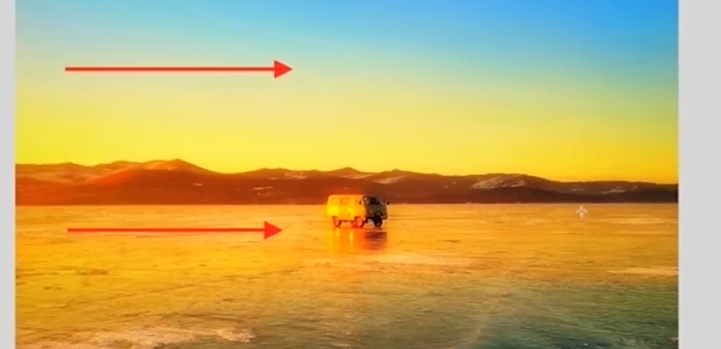
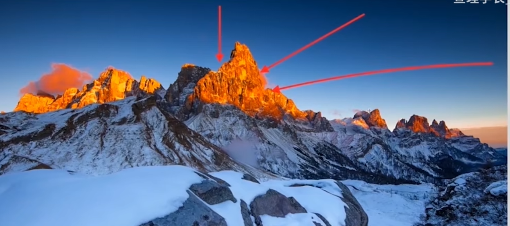
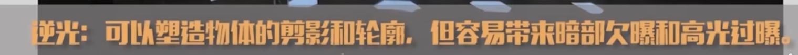
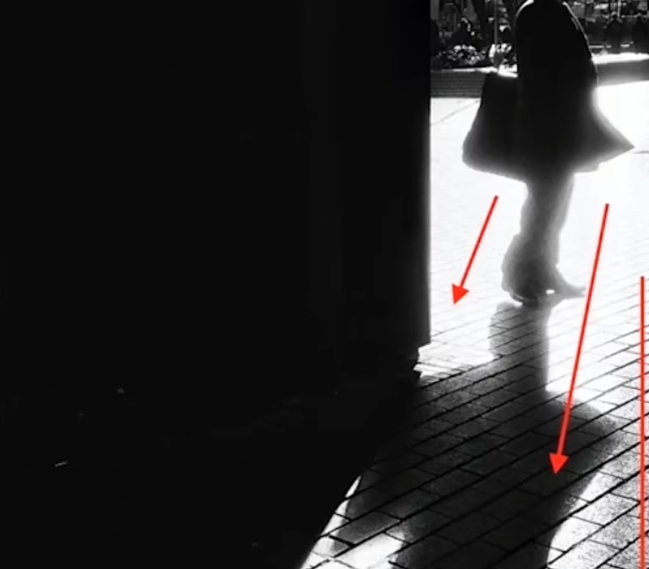
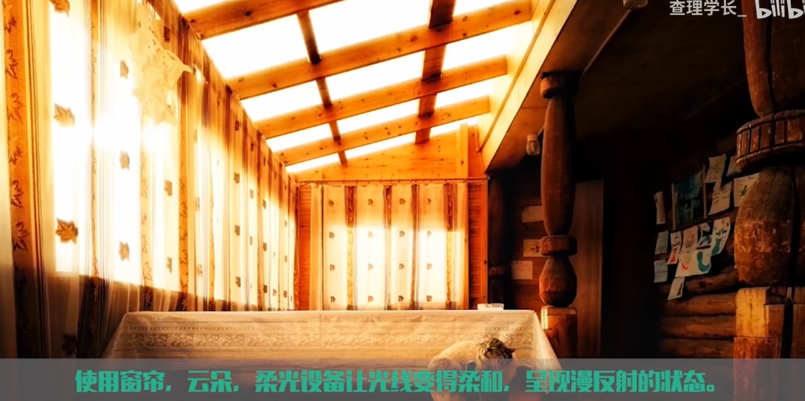

# 一、顺/逆/侧光

侧光：可以塑造物体的立体感，立体感主要靠物体表面的阴影和高光来体现。

顺光：光线顺着视线的方向，更容易展现出拍摄物体的细节，但是会让物体失去立体感（没有阴影部分

）。

逆光：光线与视线方向相反，很强的光线照射容易导致过曝，需要HDR

# 二、直射和散射

直射光容易让拍摄物体显得更加锐利和粗糙，散射光则可以让物体更加柔和温和

# 三、冷暖光线

使用冷暖对比可以使拍摄场景更加有意境