# 一、黄金分割点趣味构图

在构图时，可以将画面分为两个部分，使**画面的主要元素**位于这两个部分的**交点**之一。这些交点通常位于画面的三分之一处，形成了所谓的“三分法”构图，这是黄金分割的一个简化版本。

上下左右共四条分割线，汇聚成四个黄金分割点。

通过将主要元素放置在黄金分割点上，可以在画面中创造平衡，避免元素过于集中或分散。

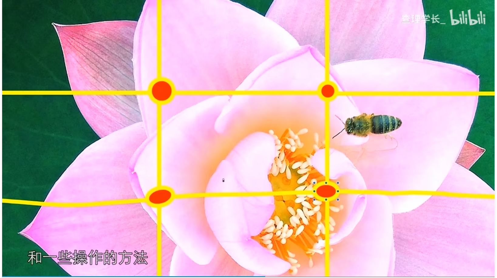

# 二、三分法沟通

如果元素比较多，可以采用常规的三分法。体现出一种活跃的气氛

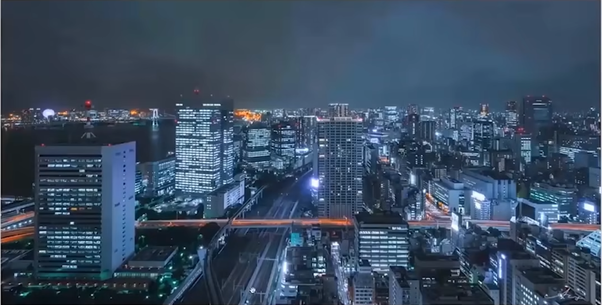

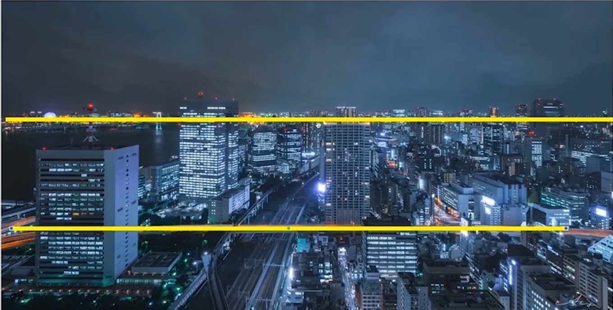

# 三、对称法构图

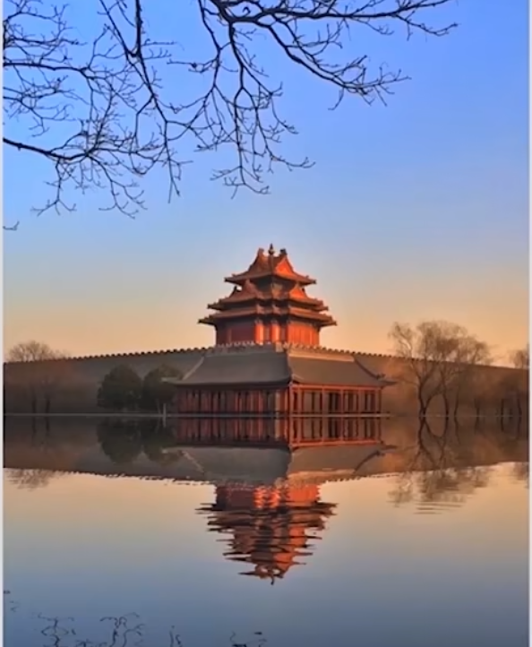

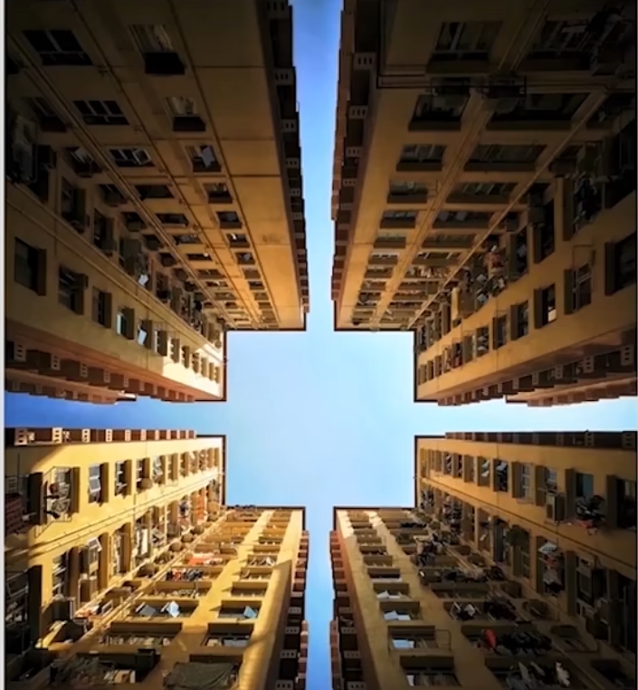

当需要体现稳定、严肃、庄严、沉闷的气氛的时候，使用二分法

# 四、三角形构图

拍摄物体存在主次的时候，为了凸显主体，会使用三角形构图

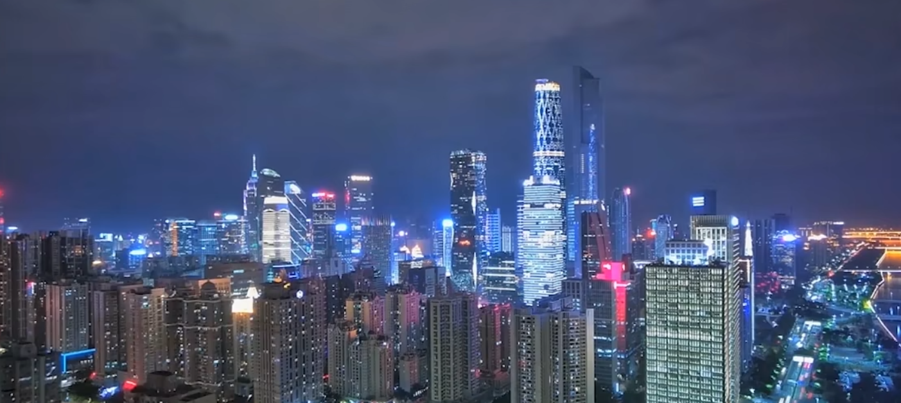

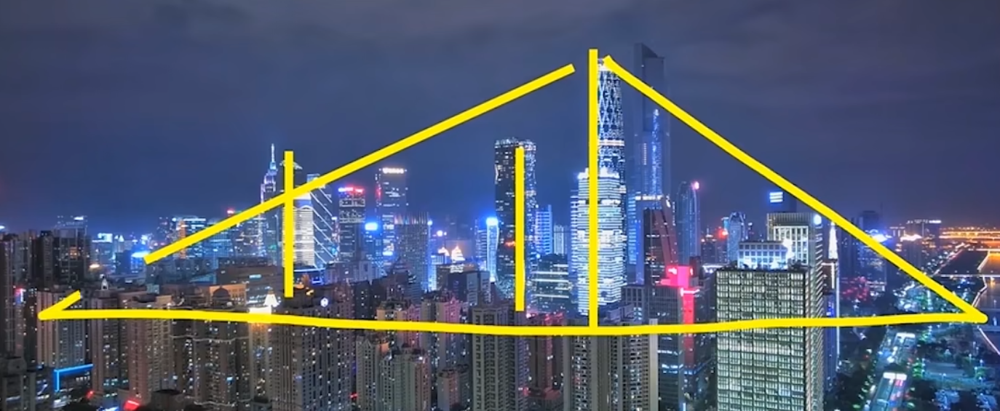

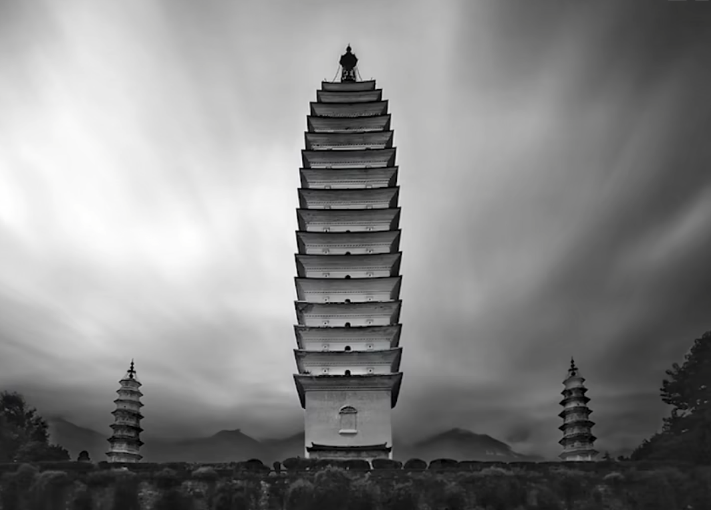

# 五、如何增加图像的纵深感

## 5.1 使用引导线

为了体现一种立体感，需要增加图像的纵深。此时需要“引导线”。

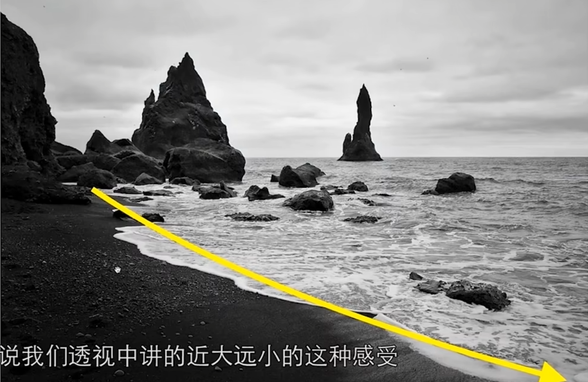

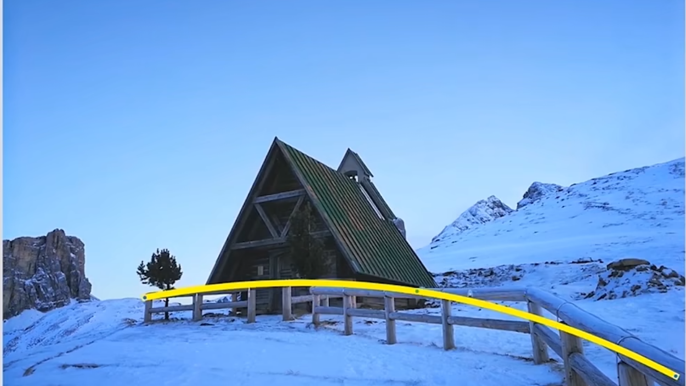

## 5.2 前中后景

在图像的前、中、后分别有不同的物体，体现出层次立体感。

乱石 --- 小林子 -- 山林 -- 天空

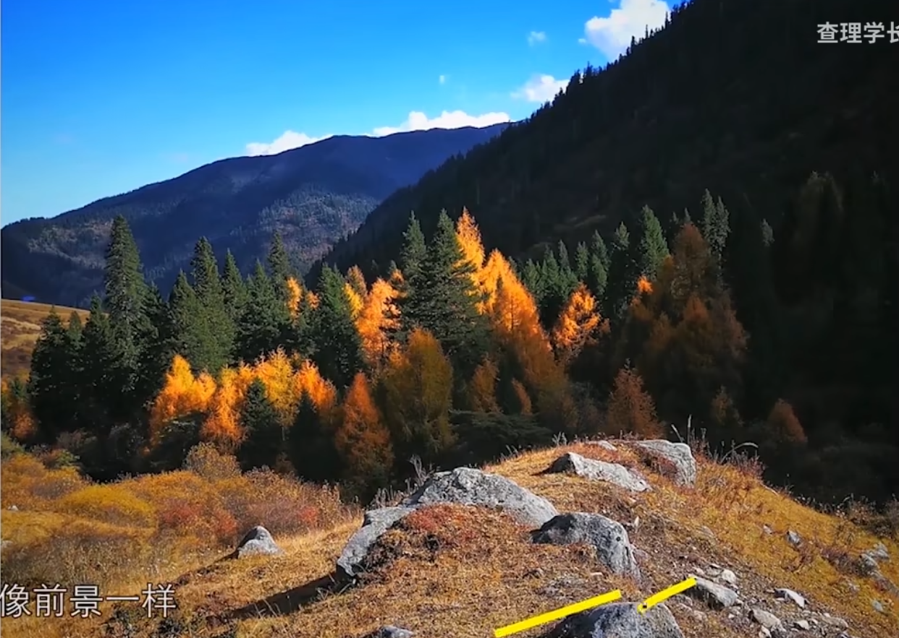

# 六、节奏和规律感

相同的东西以比较规律的形式出现，会有一种节奏感

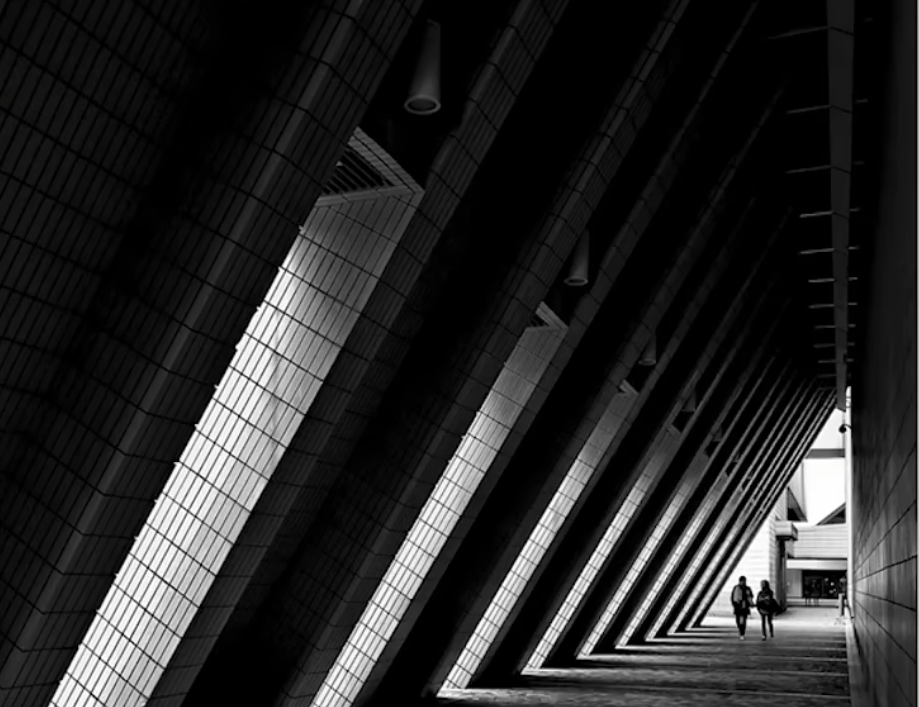

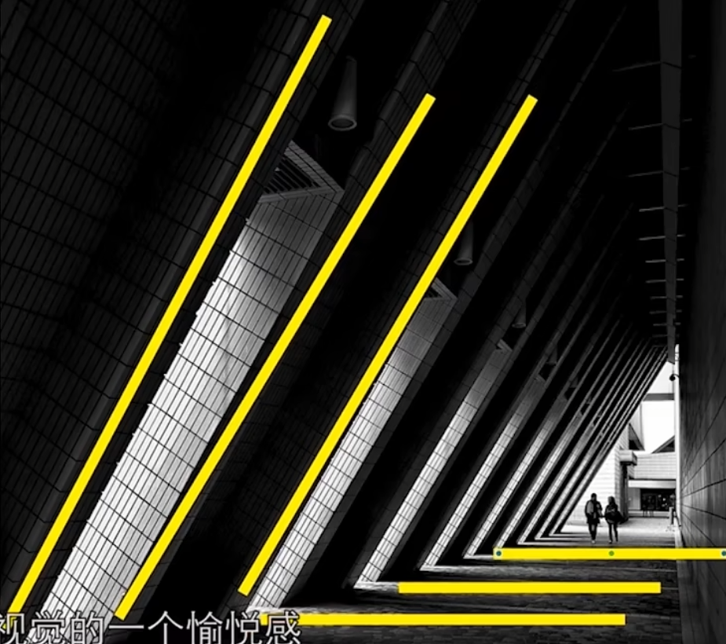

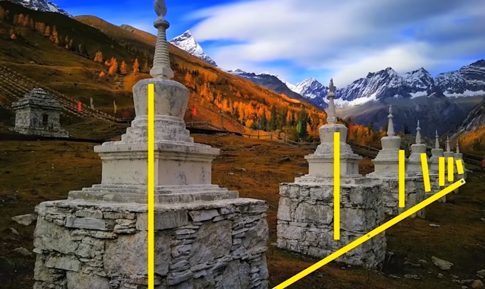