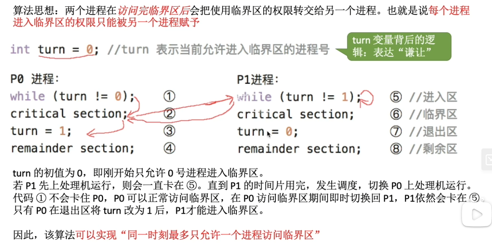
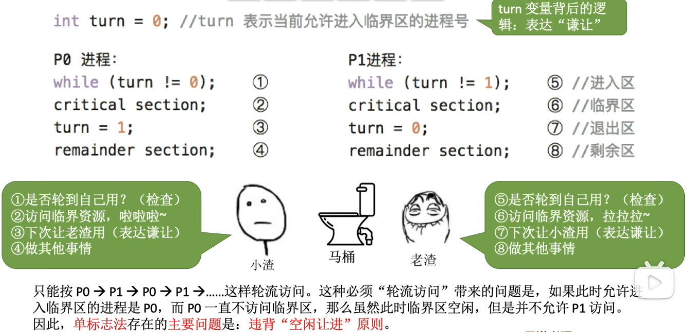
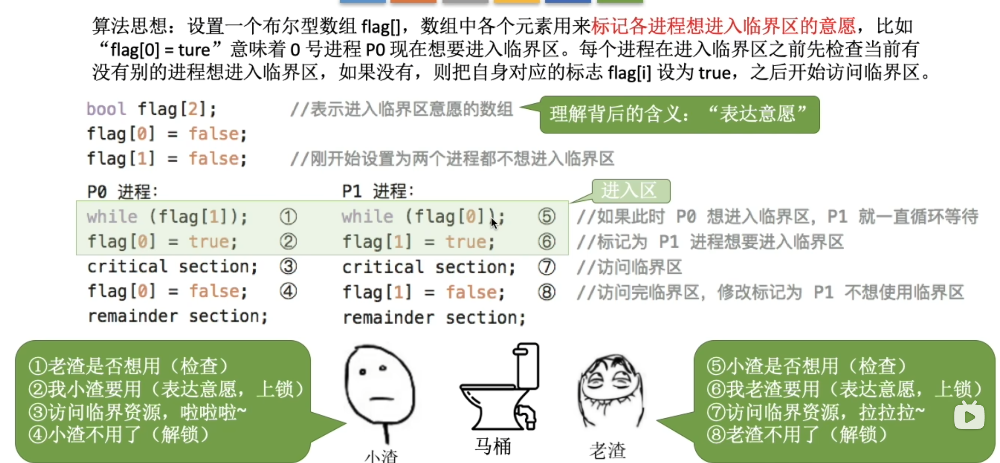
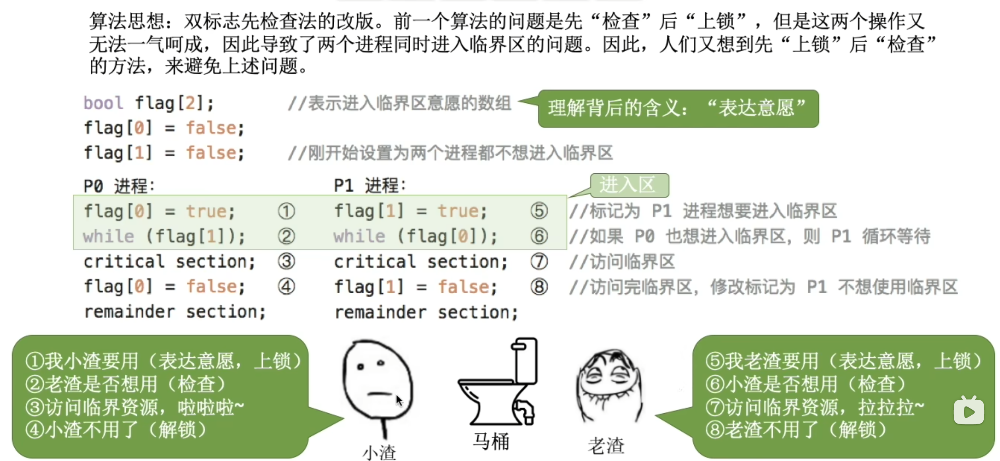
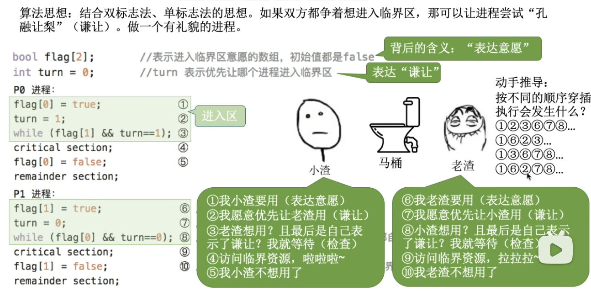
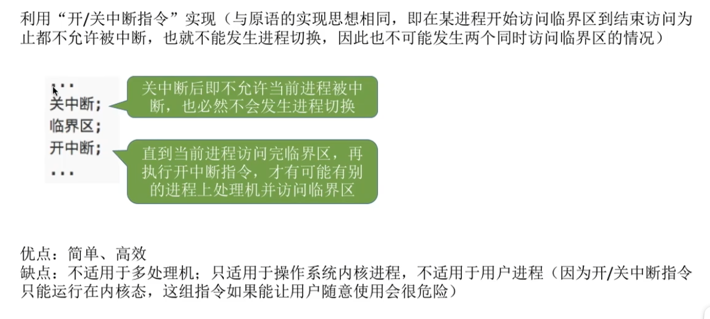
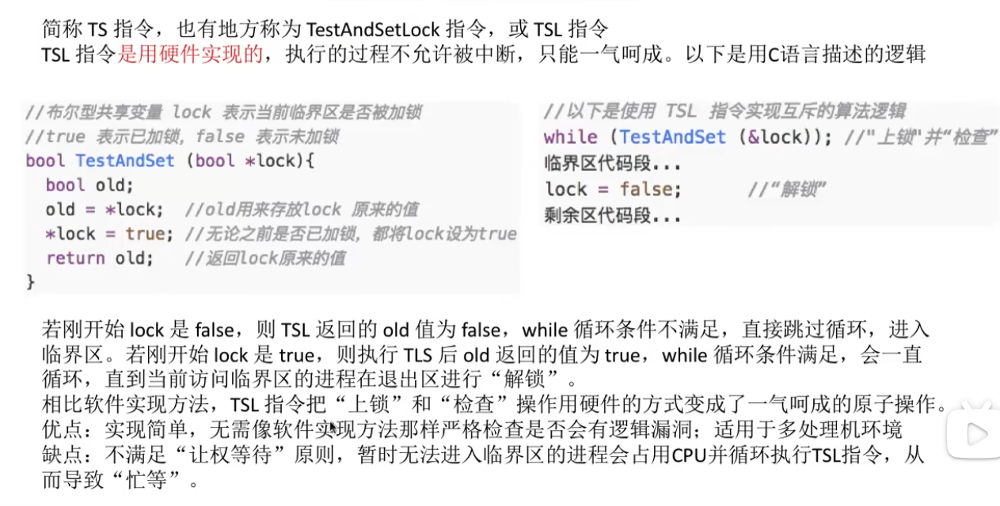
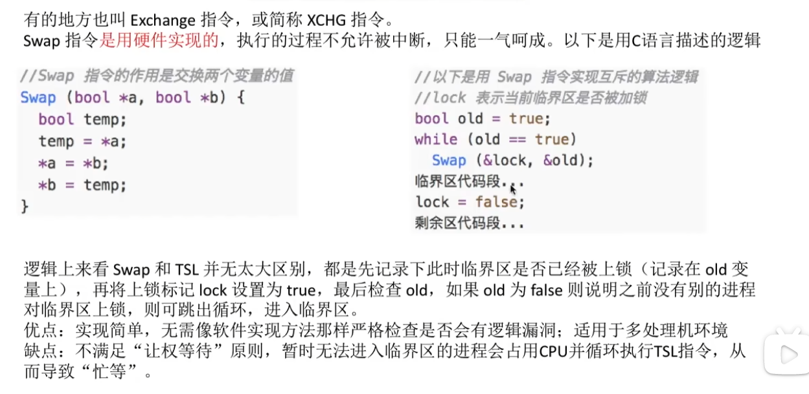
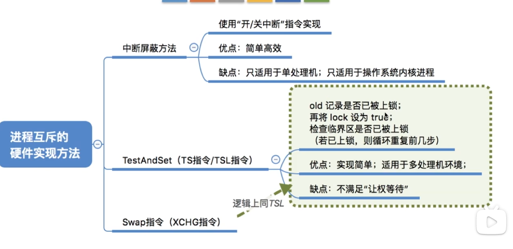

# 一、进程互斥的软件实现方法

## 1.1  单标志法

## 1.2  双标志先检查

> 后续我们通过硬件的支持，可以实现 “检查” 和 “上锁” 成为一个原子操作。这样就可以解决“忙则等待”问题。

## 1.3  双标志后检查

## 1.4  Peterson 算法

最后一个进行“谦让”的进程失去了行动的主动权。

也就是存在自旋问题。

## 1.5 总结

# 二、进程互斥的硬件实现方法

## 2.1  中断屏蔽方法

## 2.2  `TestAndSet` 指令

利用 `TS` 指令，结合双标志先检查的思路，可以实现一种可用的自旋锁。

## 2.3  `Swap` 指令

利用 `Swap` 指令，结合双标志先检查的思路，也可以实现一种可用的自旋锁。

## 2.4  总结

