# 一、文件存储空间管理

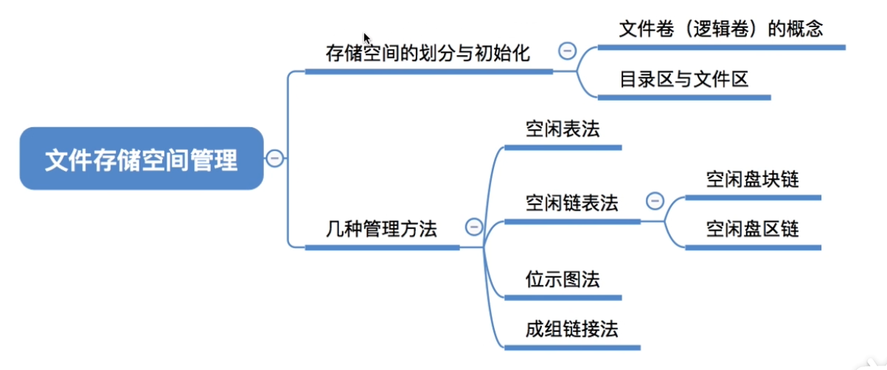

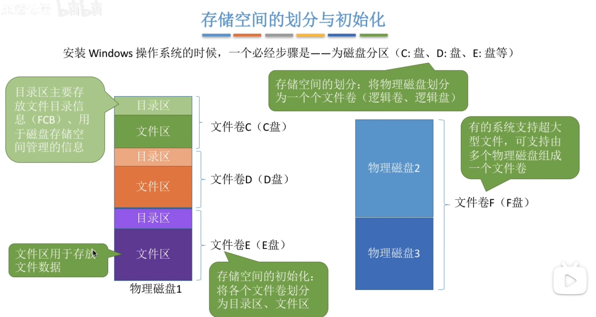

# 二、空闲表法

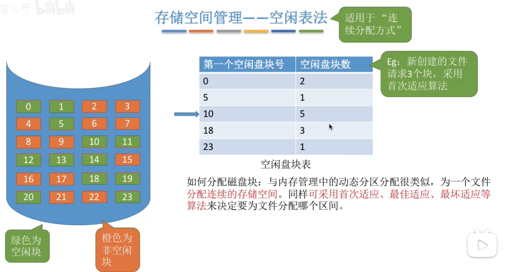

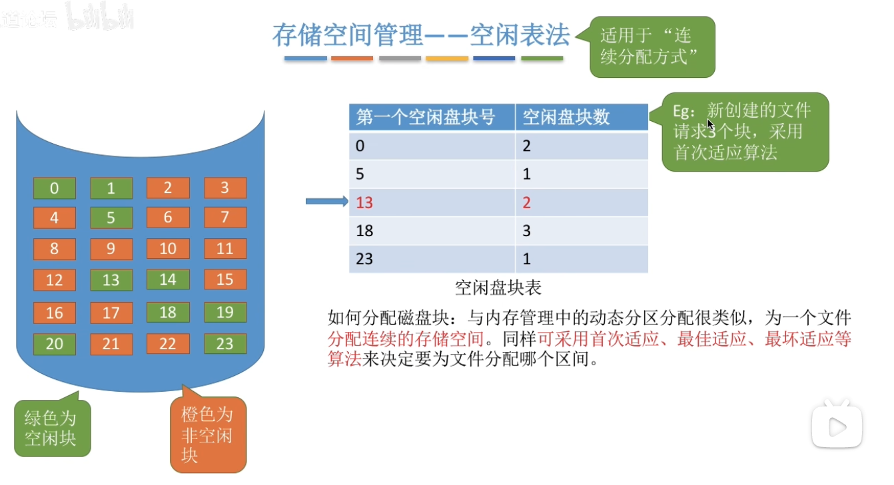

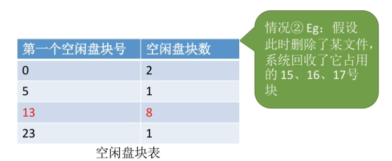

# 三、空闲链表法

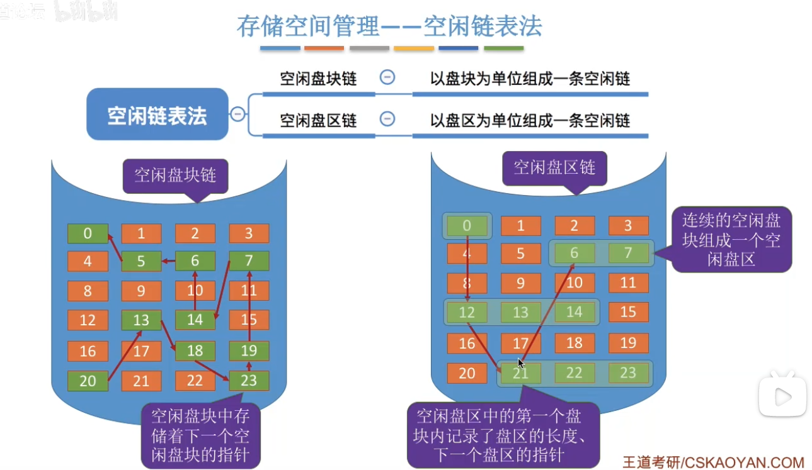

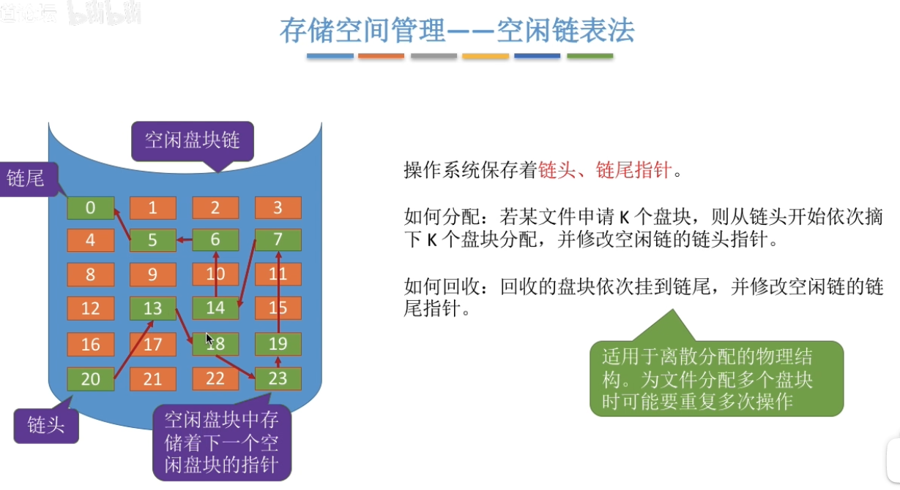

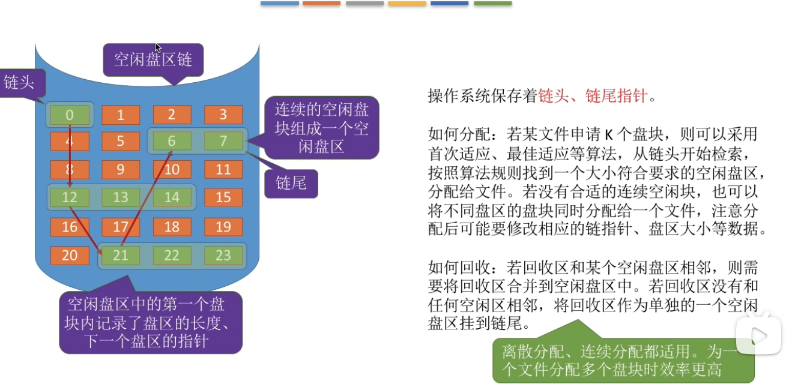

# 四、位示图法

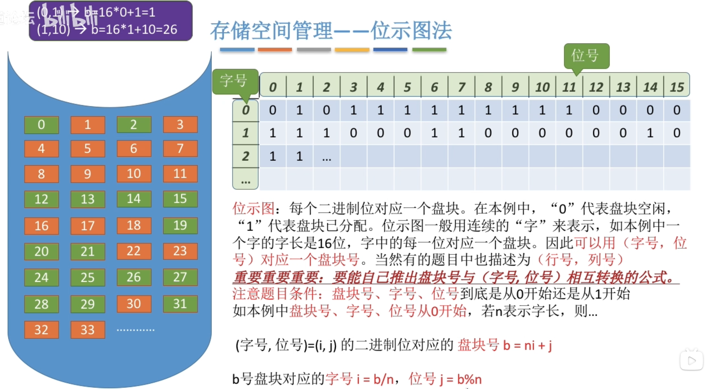

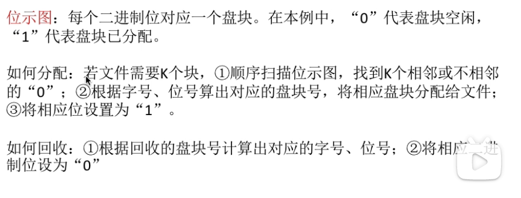

# 五、成组链表法

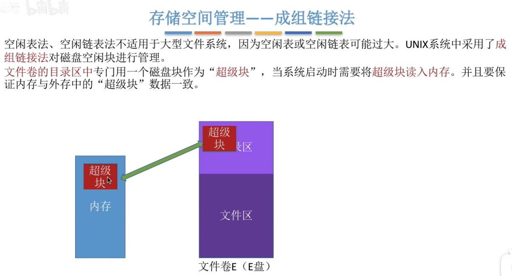

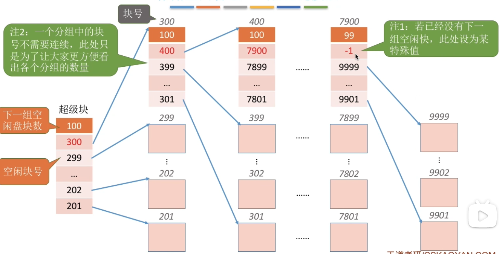

每一组有100个块。每一组的第一个是一个索引块，指向下一组的位置；一组内的剩余块都是数据块。

## 5.1  分配

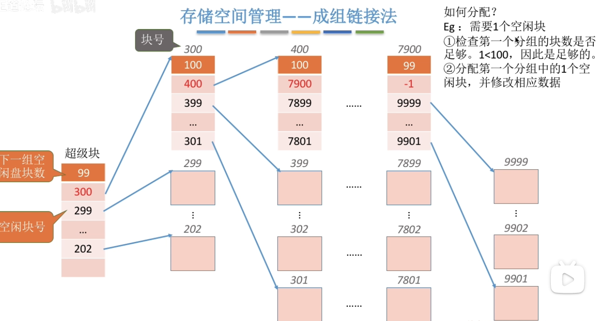

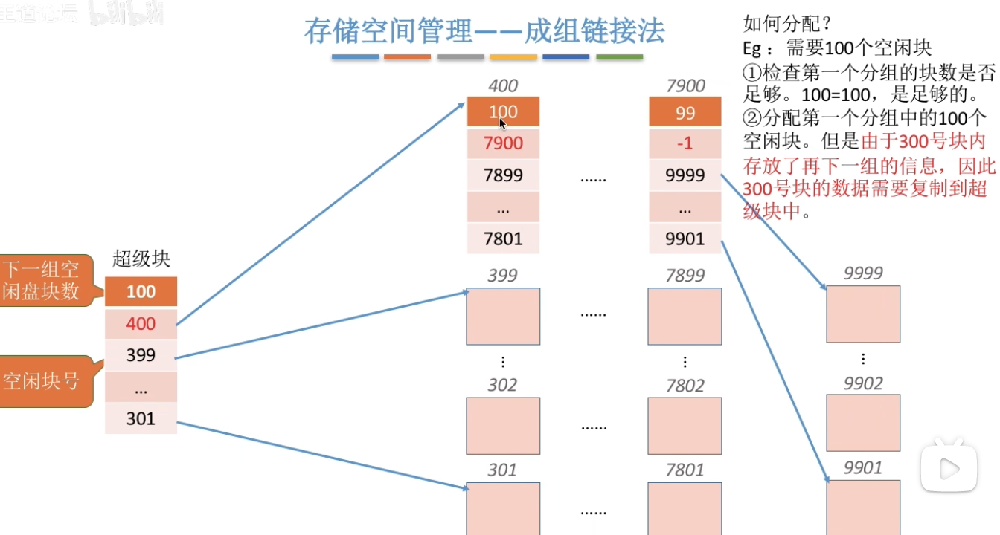

## 5.2 回收

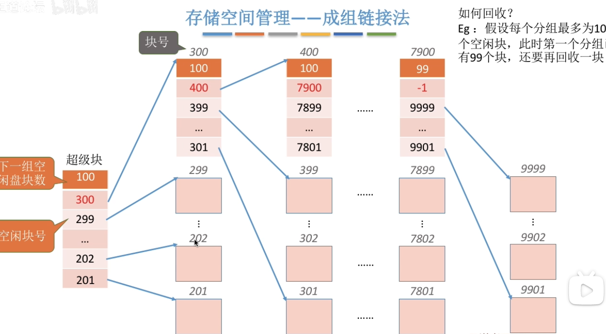

直接将回收的一块加入到超级块中。

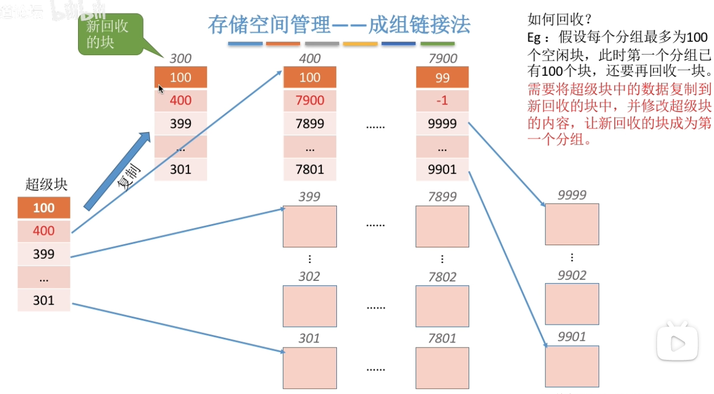

假设回收的一块地址是300，那么让300记录原超级块的位置，然后将超级块移出，让300存入超级块，其余位置空闲（即超级块内现在只有1个可用块）

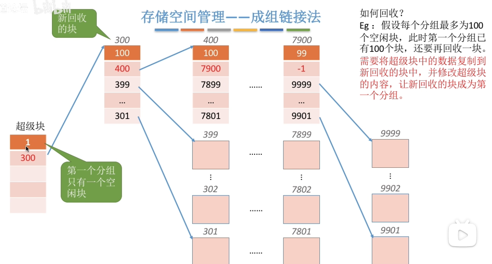