# 一、IO核心子系统

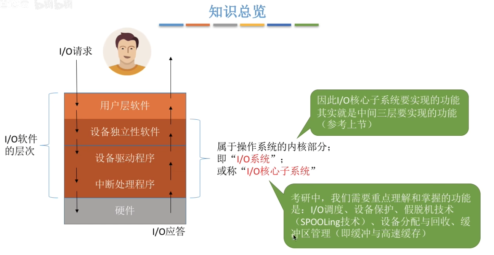

## 1.1  IO调度

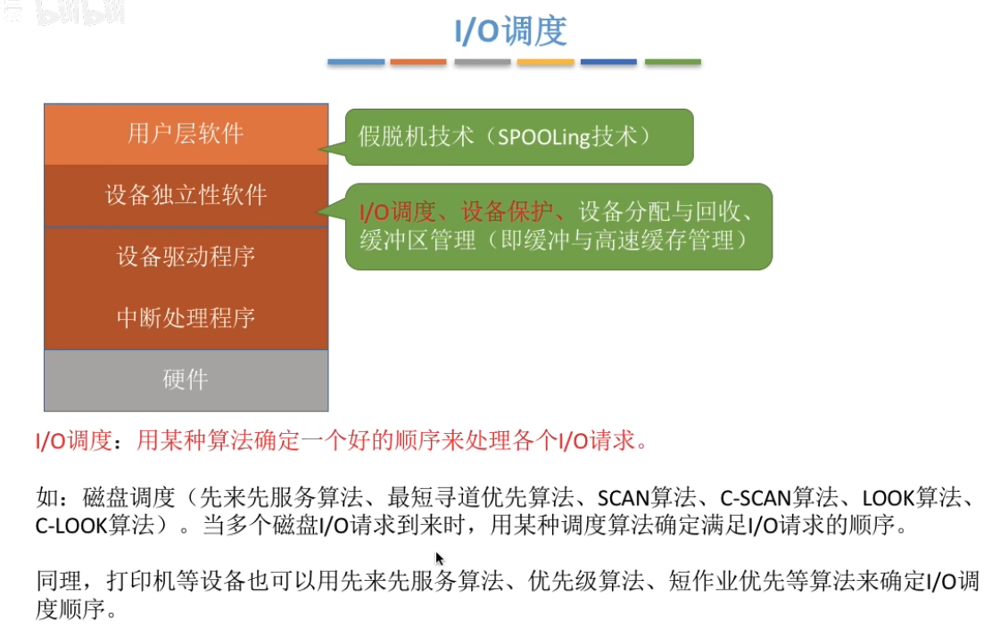

## 1.2  设备保护

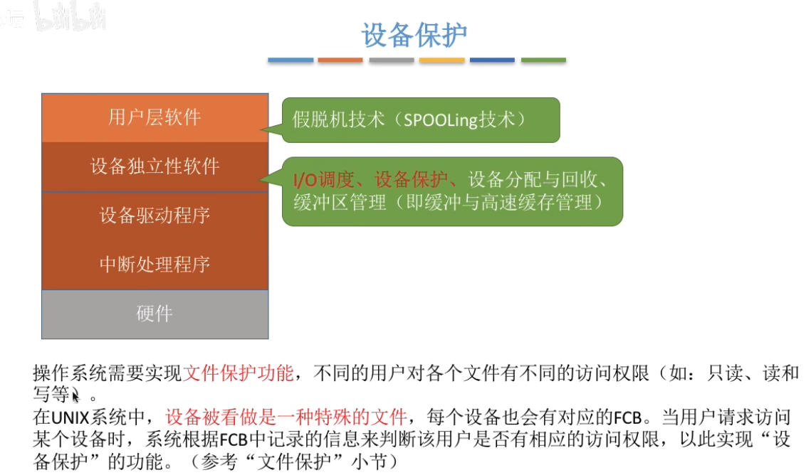

# 二、假脱机技术

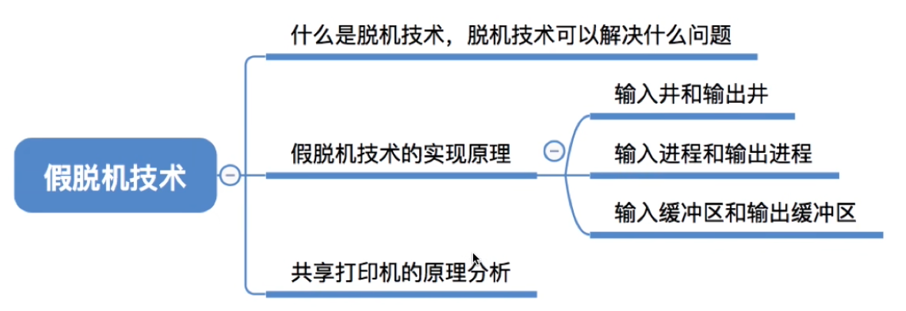

## 2.1  脱机技术

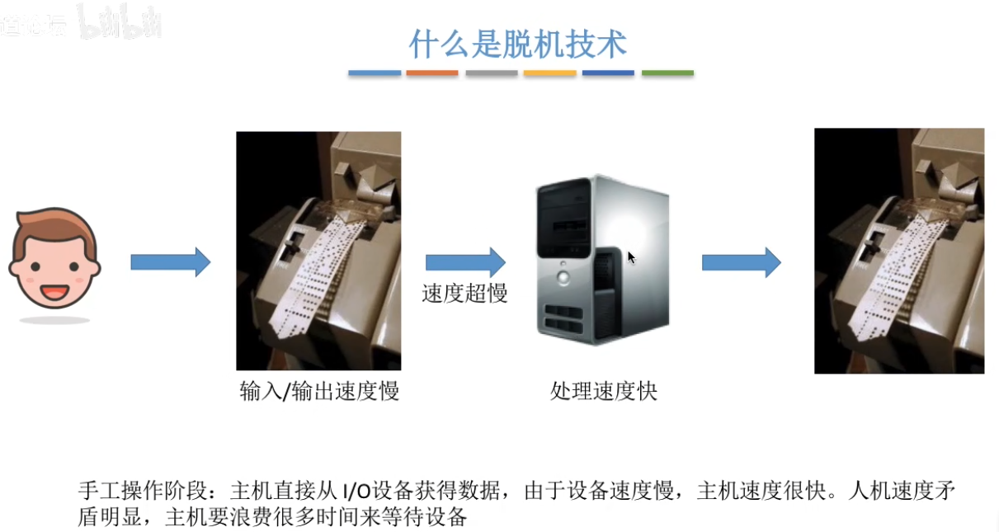

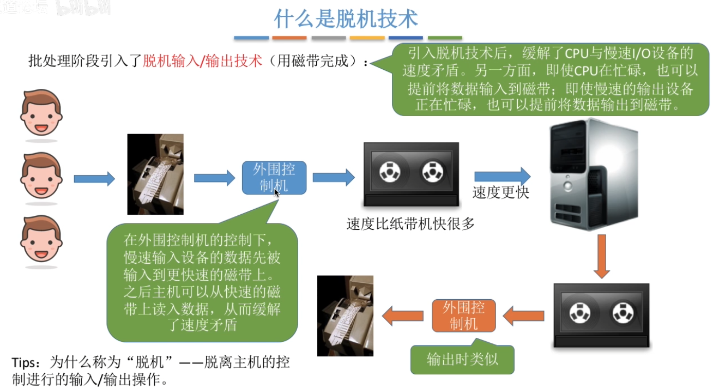

## 2.2  假脱机技术

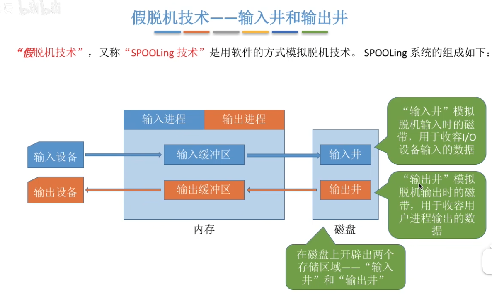

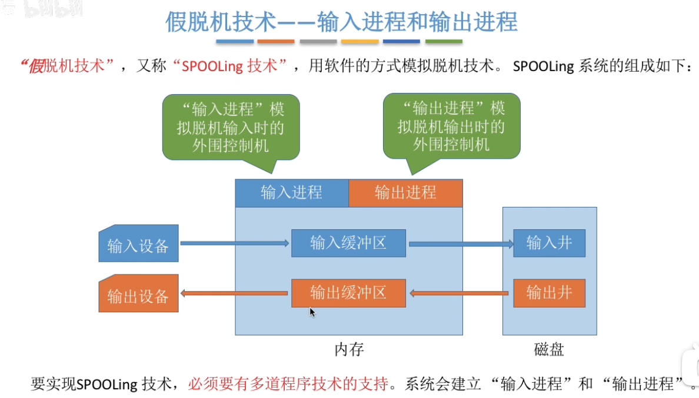

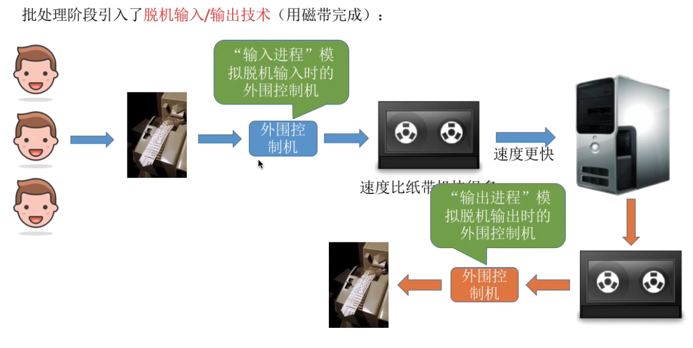

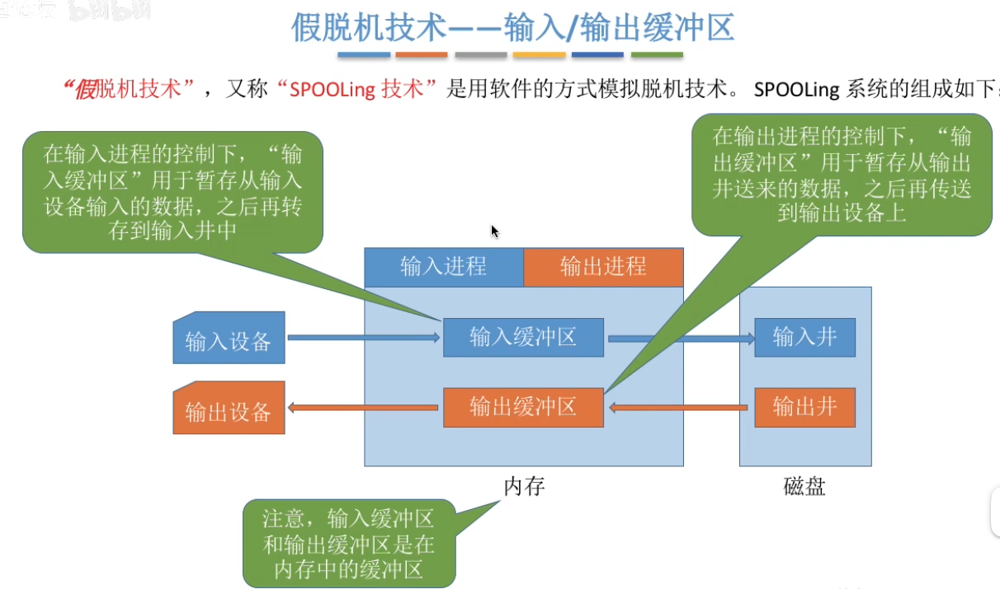

在这个打印机的例子中，假脱机技术主要的目的是：**通过将磁盘作为中间设备，避免慢速的IO设备直接与CPU进行交互。**

## 2.3  共享打印机

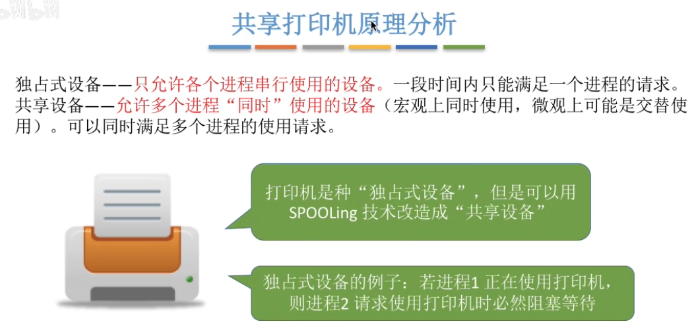

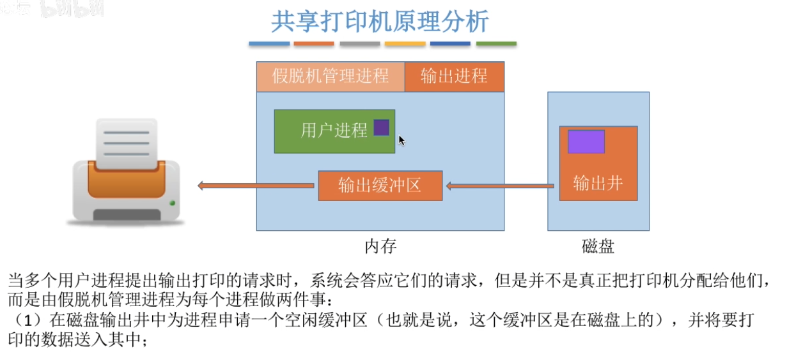

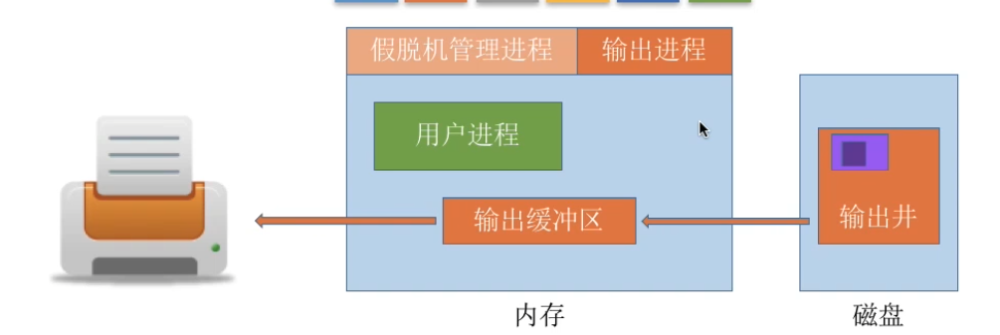

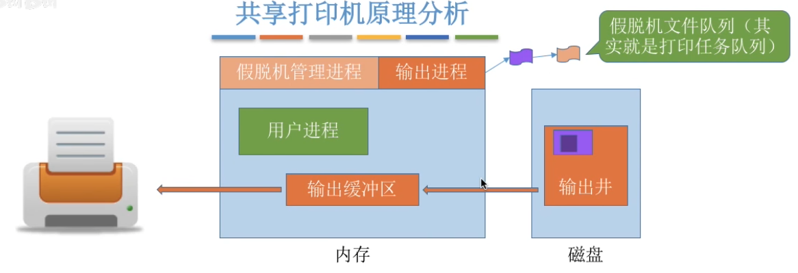

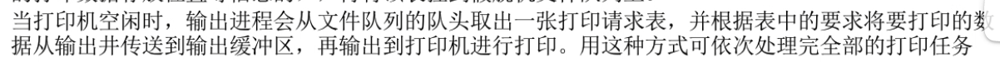

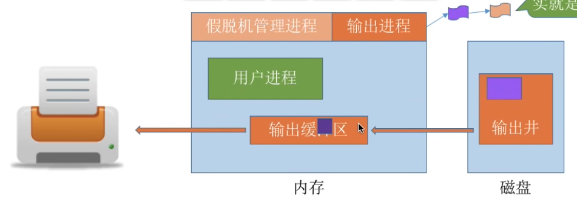

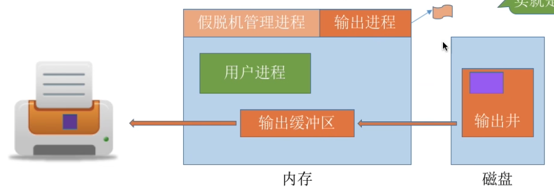

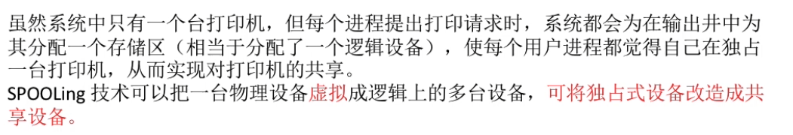

## 2.4  小结

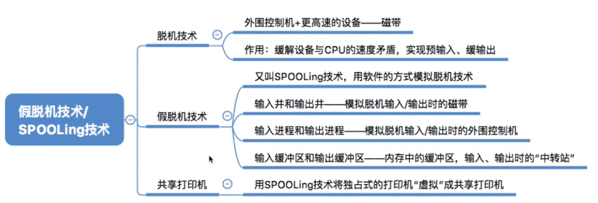