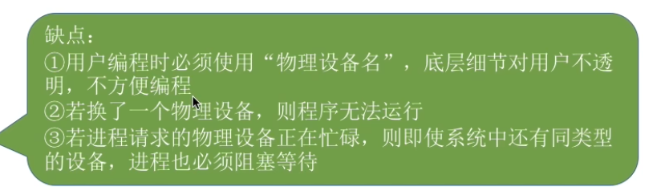

# 一、设备的分配与回收

# 二、设备分配时应考虑的因素

## 2.1  设备的固有属性

## 2.2  设备分配算法

## 2.3  设备分配中的安全性

# 三、静态分配与动态分配

# 四、设备分配管理中的数据结构

## 4.1  设备控制表 `DCT`

## 4.2  控制器控制表 `COCT`

## 4.3  通道控制表 `CHCT`

## 4.4  系统设备表 `SDT`

# 五、设备分配的步骤

# 六、设备分配步骤的改进

