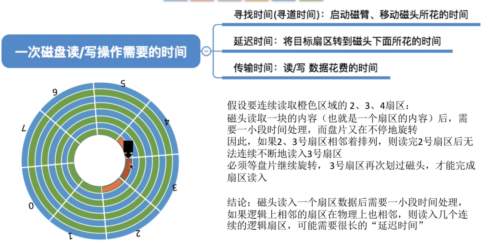
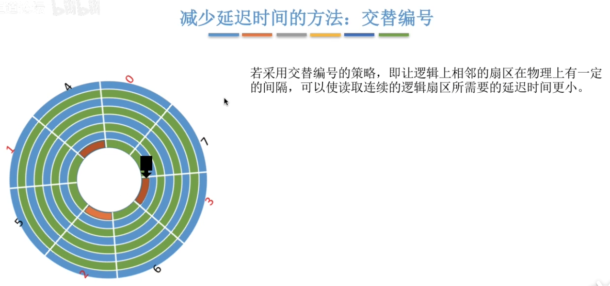
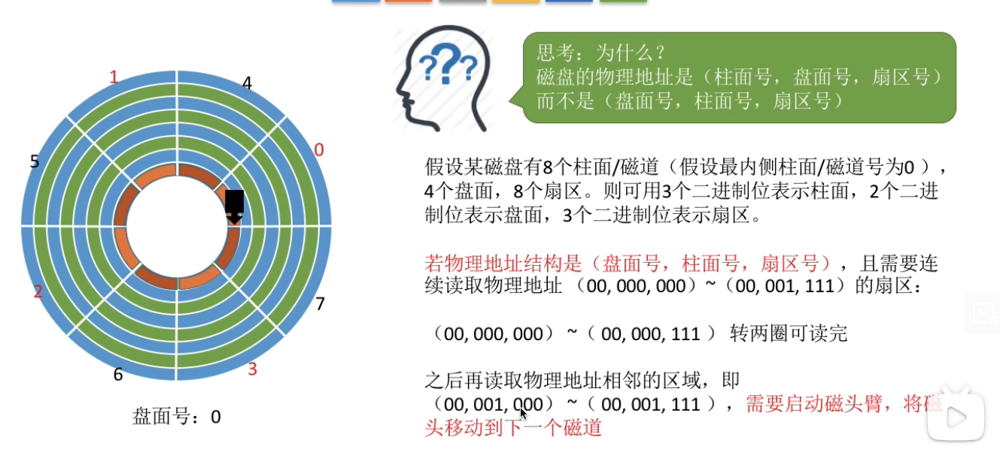
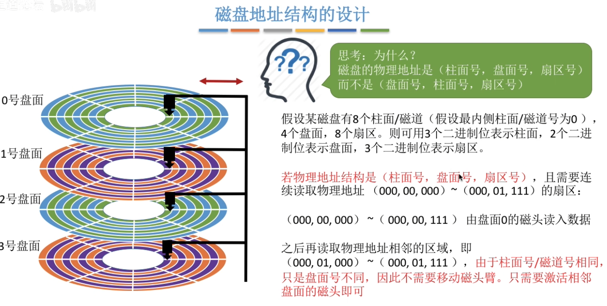
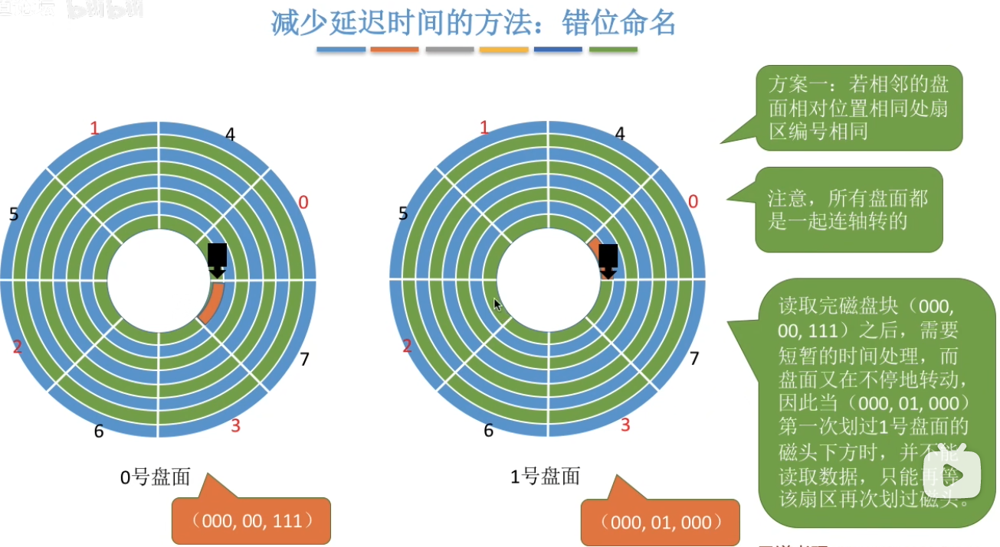
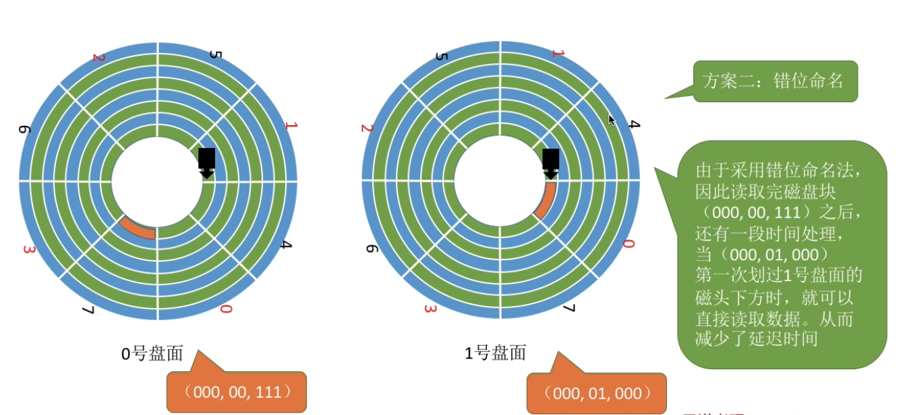
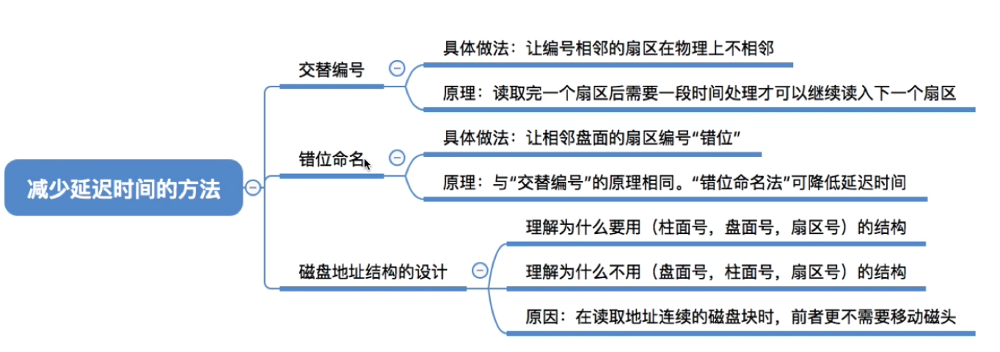

# 一、部分延迟时间的现象

# 二、交替编号策略

让同一磁道的相邻扇区进行交替编号，编号相邻的扇区在物理上不能直接相邻

# 三、磁盘地址结构的设计

# 四、错位命名策略

磁盘地址结构采用上述的（柱面号，盘面号，扇区号）的方式，那么上下两个盘面的同一磁道的地址是连续的。

因为是连续的，如果上下两个盘面采取相同的扇区分区方式，会导致延迟时间的出现。

为了解决上下盘面连续地址读写时存在的延迟时间，采用错位命名策略。如下，0号盘面的0号扇区的正下方是1号盘面的7号扇区，而不是1号盘面的0号扇区。

# 五、总结

