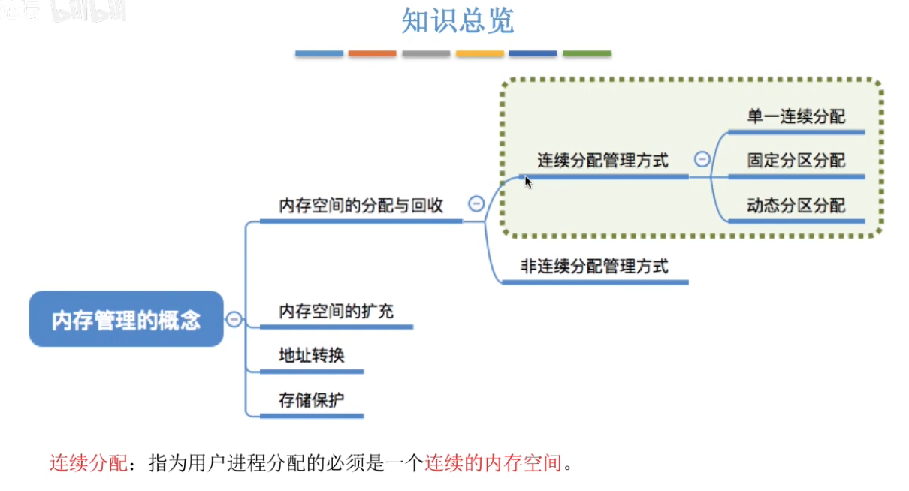

# 一、单一连续分配

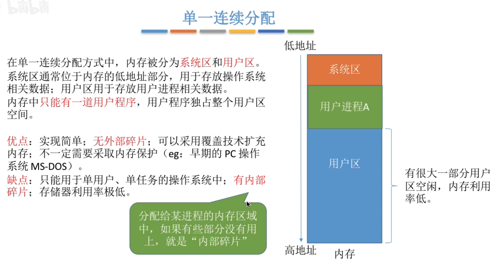

# 二、固定分区分配

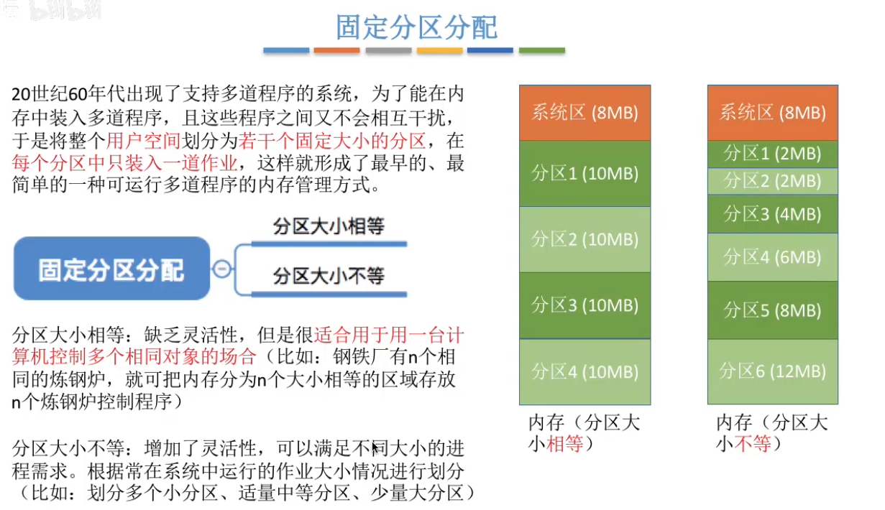

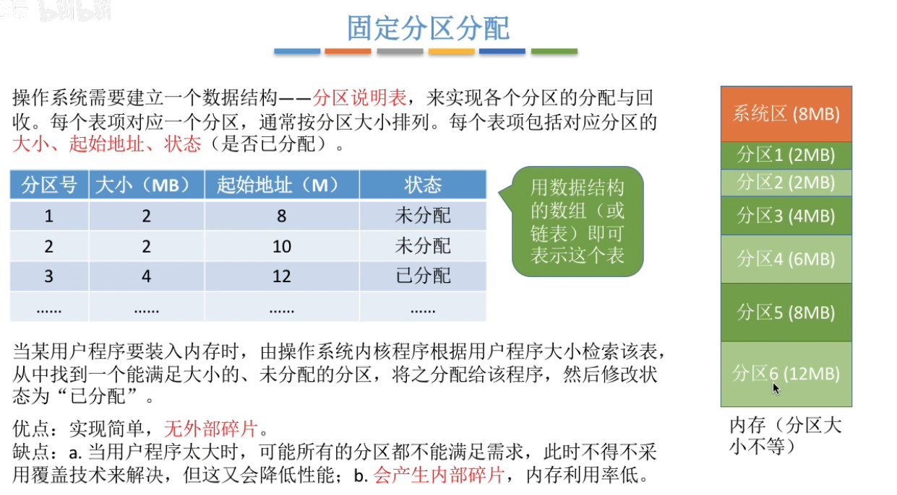

# 三、动态分区分配

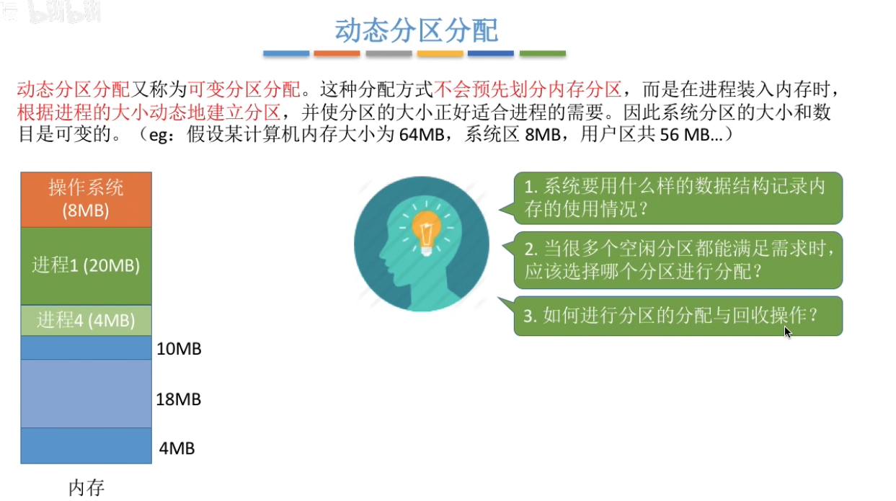

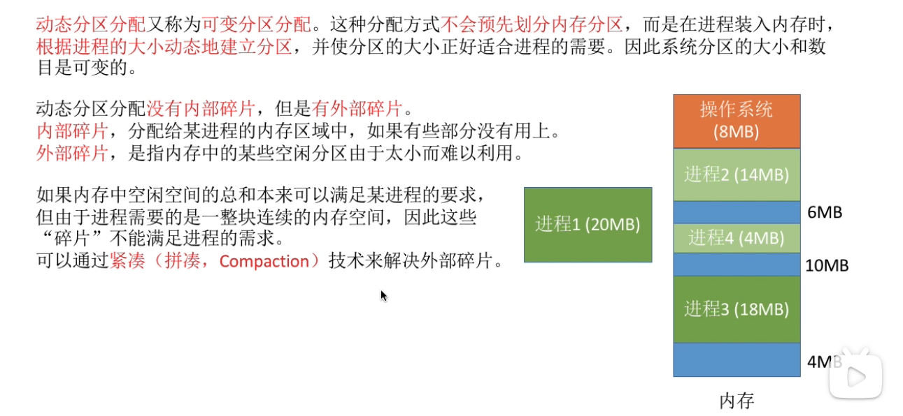

## 3.1  记录内存的使用情况

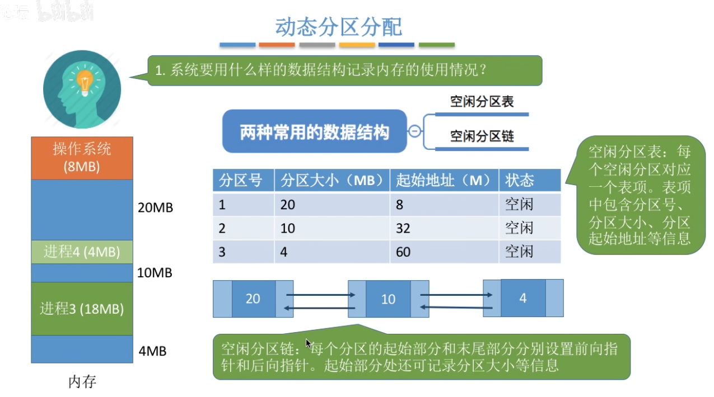

## 3.2  动态分区分配算法

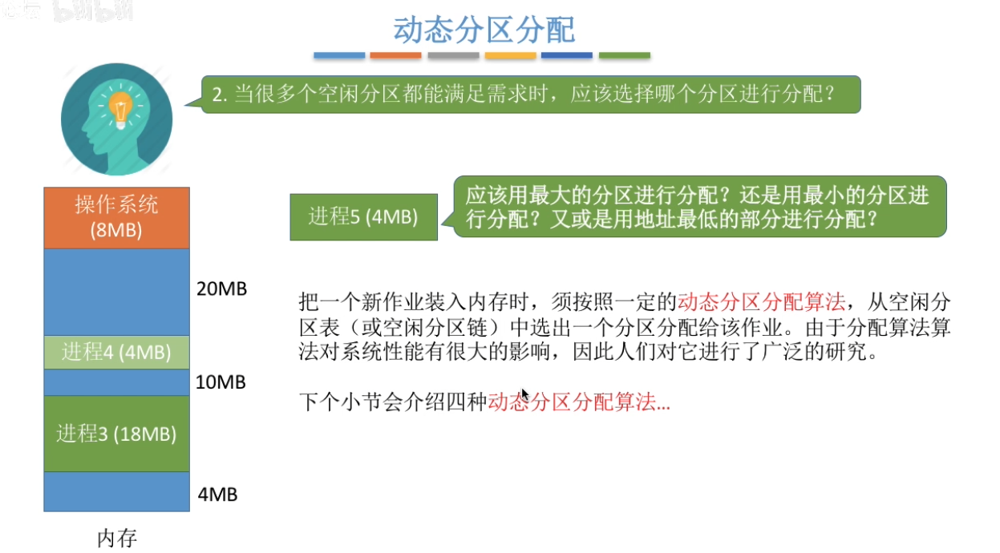

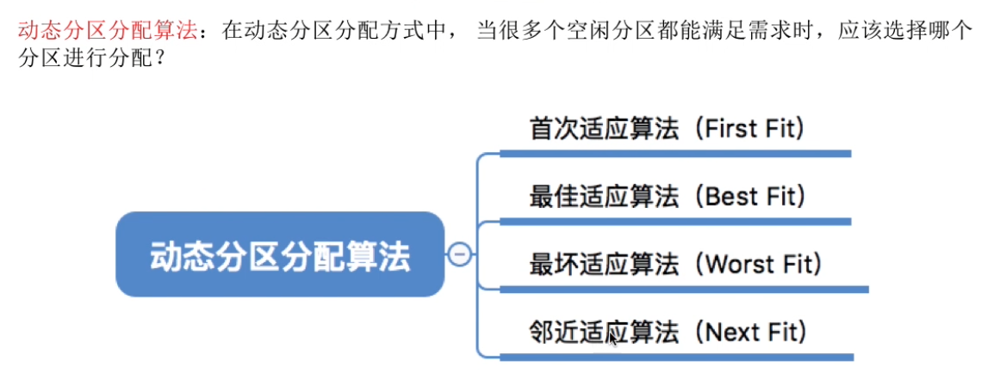

### 3.2.1  首次适应算法

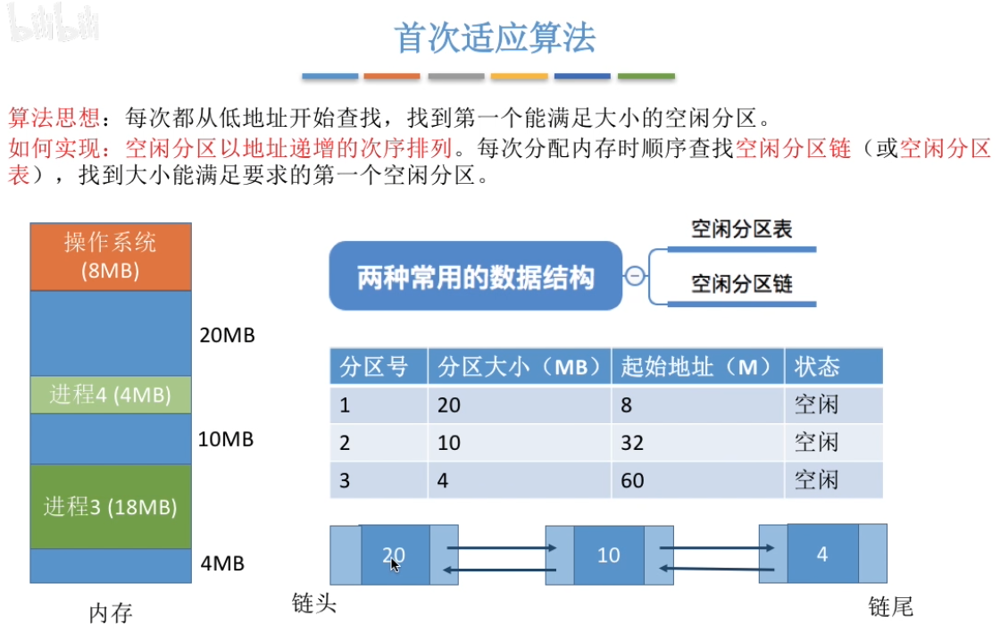

### 3.2.2  最佳适应算法

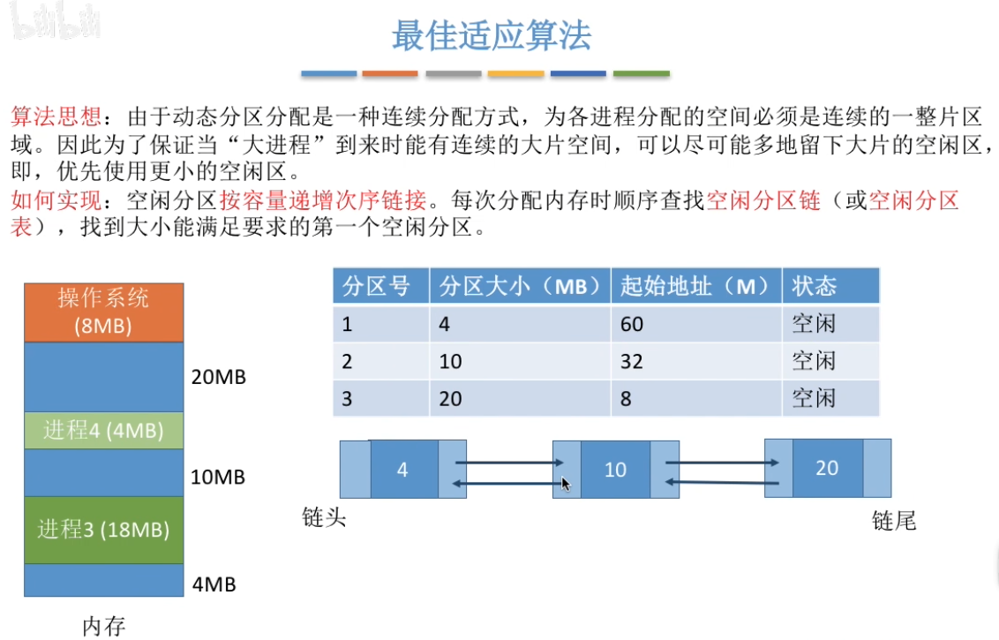

每次分配后，某一块分区的分区大小可能会发生变化，此时需要重新对空闲分区表（链）按照容量进行排序。

### 3.2.3 最坏适应算法

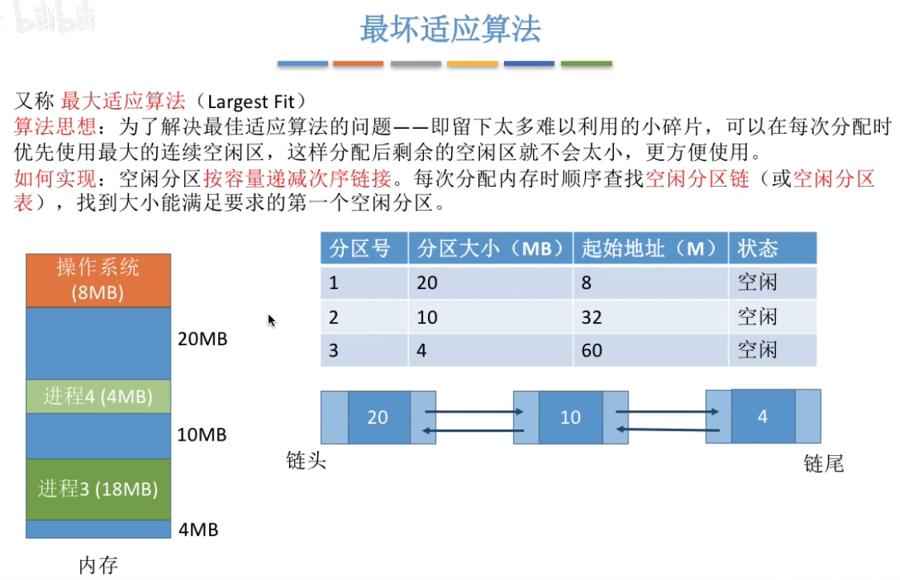

同样，在完成分配后，需要对空闲分区表（链）进行重新排序。

### 3.2.4 邻近适应算法

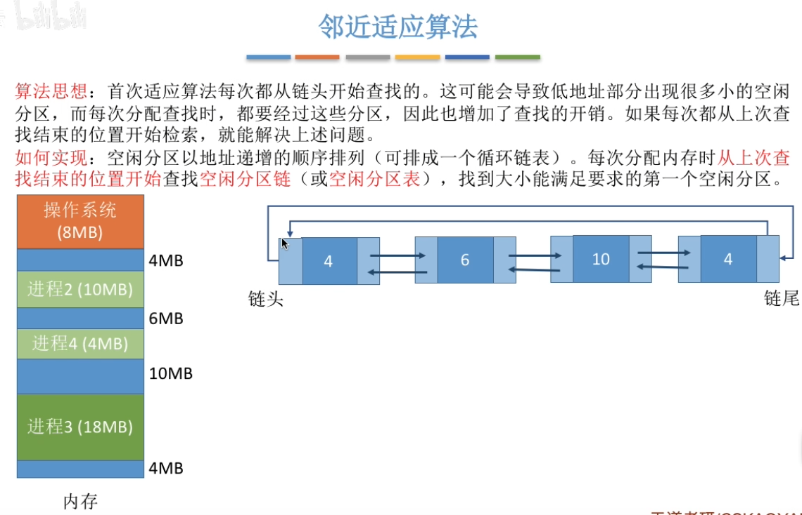

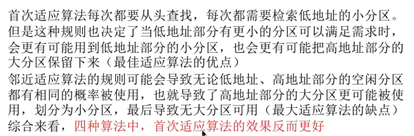

### 3.2.5  小结

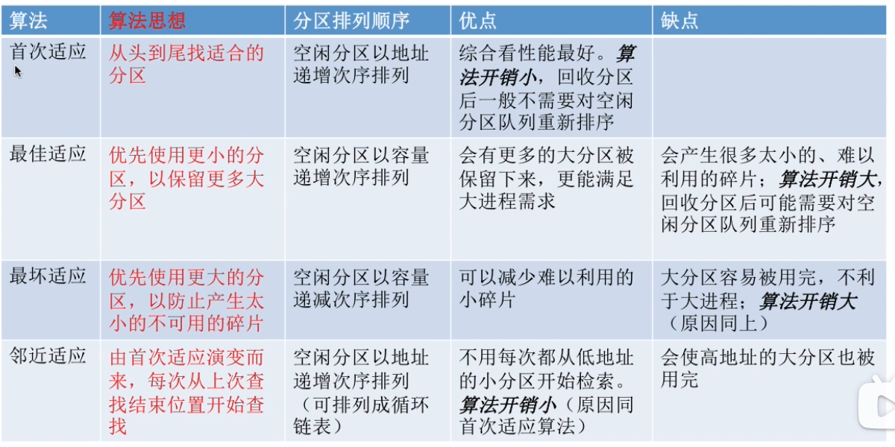

## 3.3  分区的回收

回收时需要注意合并：

1. 回收区前后都没有相邻空闲分区，不需要合并
2. 回收区前面/后面是空闲分区，进行合并
3. 回收区前后都是相邻的空闲分区，进行合并

# 四、总结

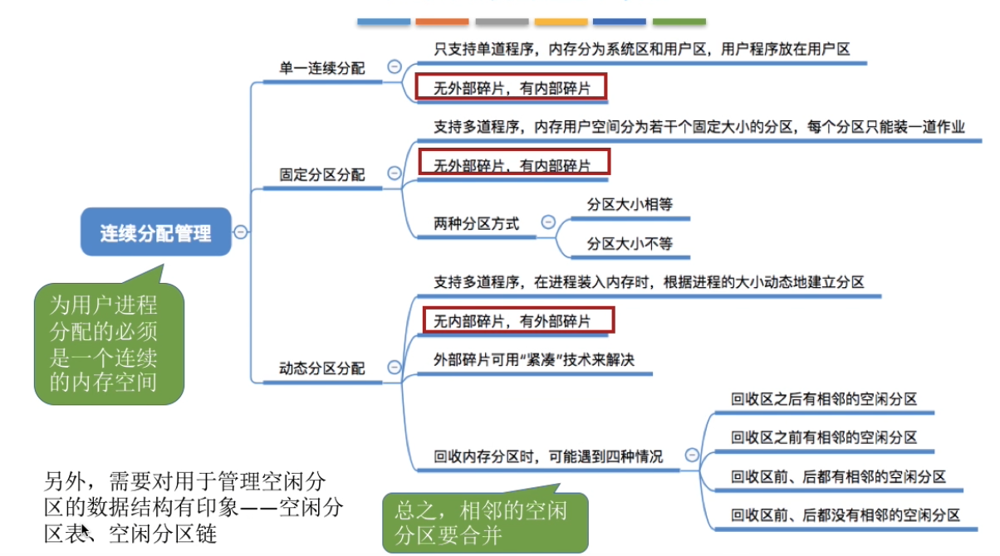