# 一、文件存储空间管理

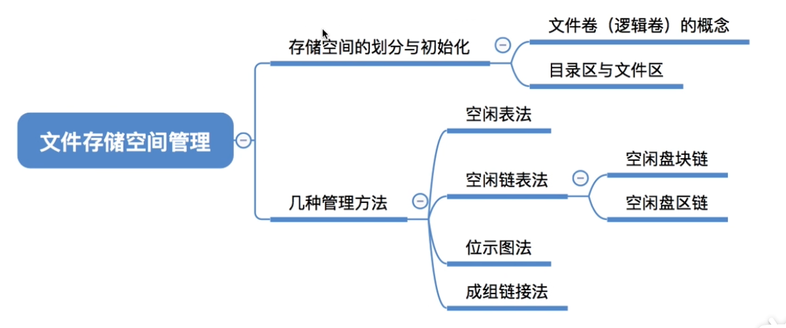

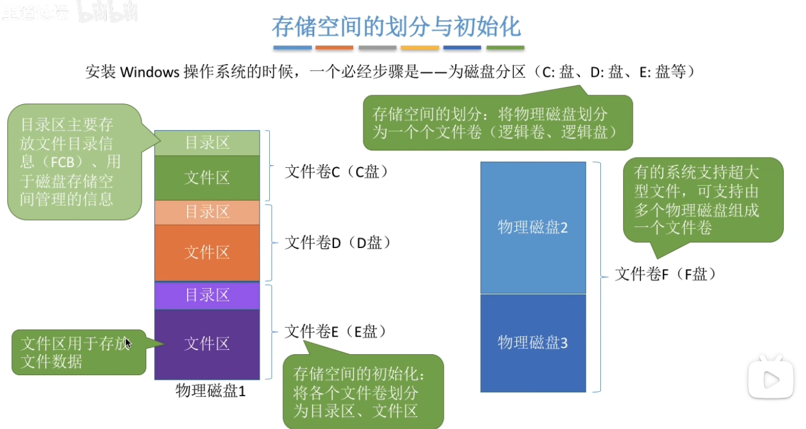

# 二、空闲表法

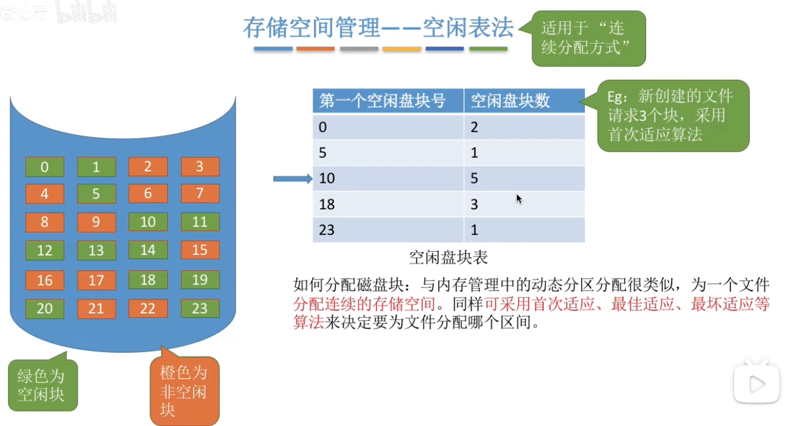

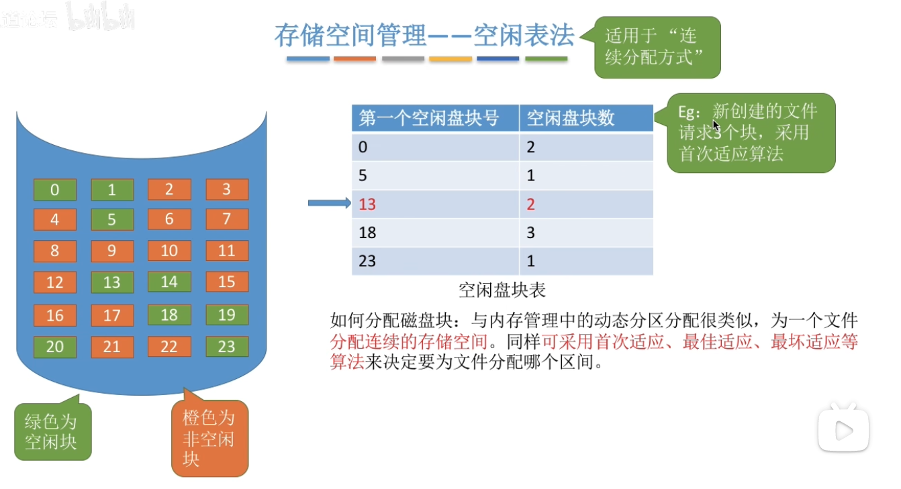

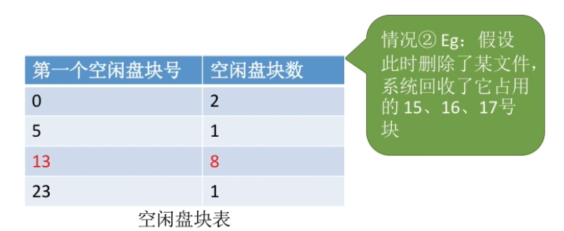

# 三、空闲链表法

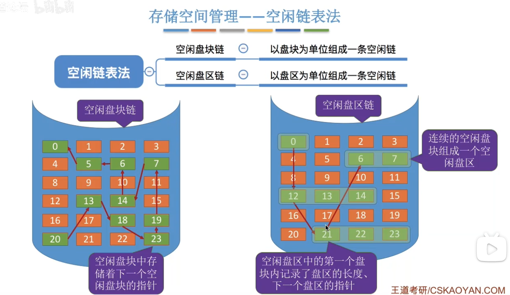

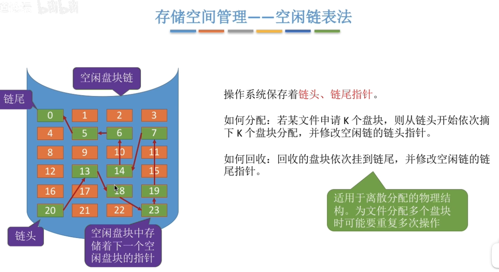

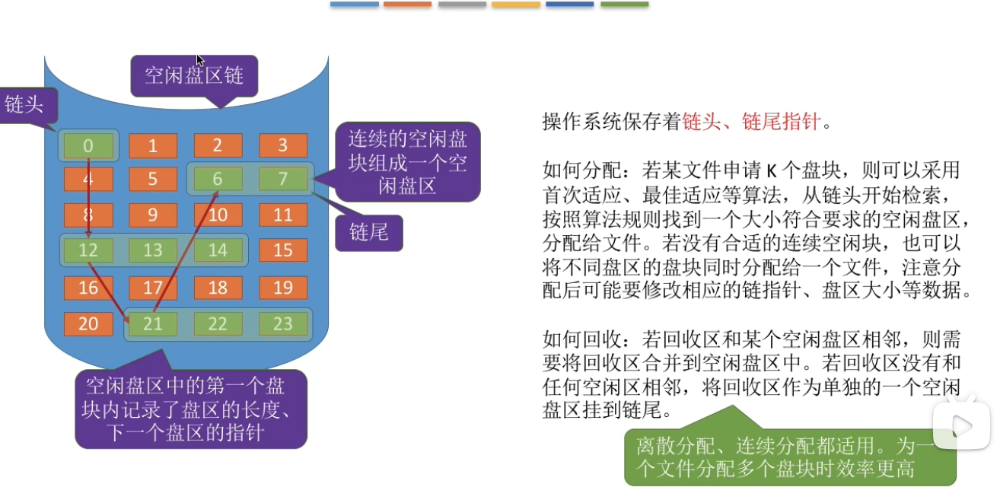

# 四、位示图法

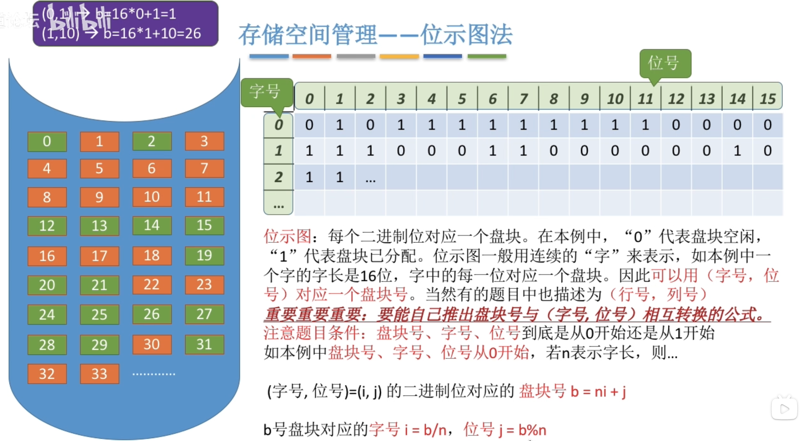

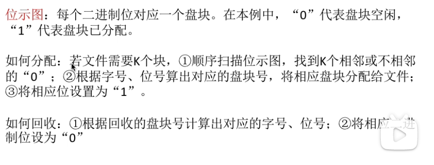

# 五、成组链表法

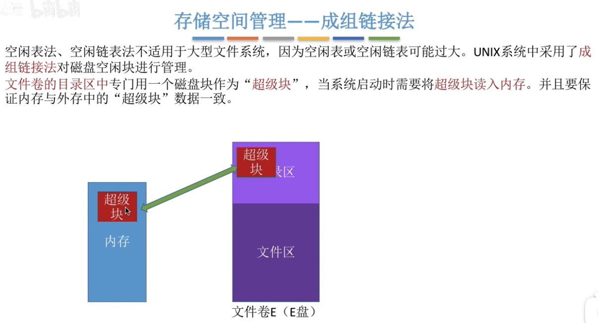

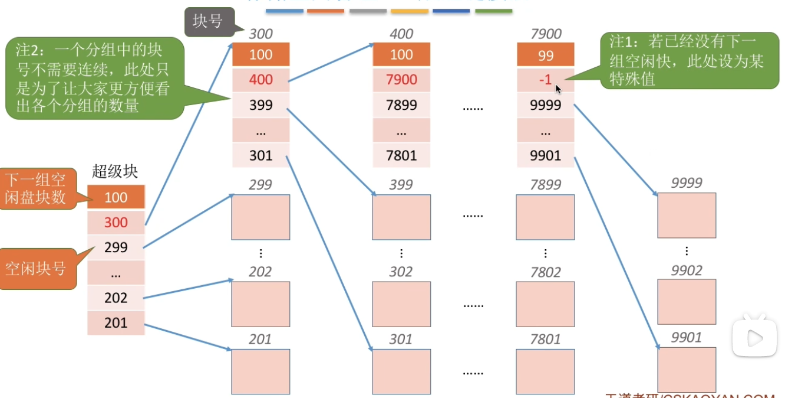

超级块本身是一个索引块，（每一组的索引块）里面存放着该组的所有空闲数据块的块号，以及下一组空闲块索引块的块号。

## 5.1  分配

分配的空闲块数目在超级块所在组的能力范围内，超级块作为本组的索引块，直接分配所需数目的空闲数据块给对方。

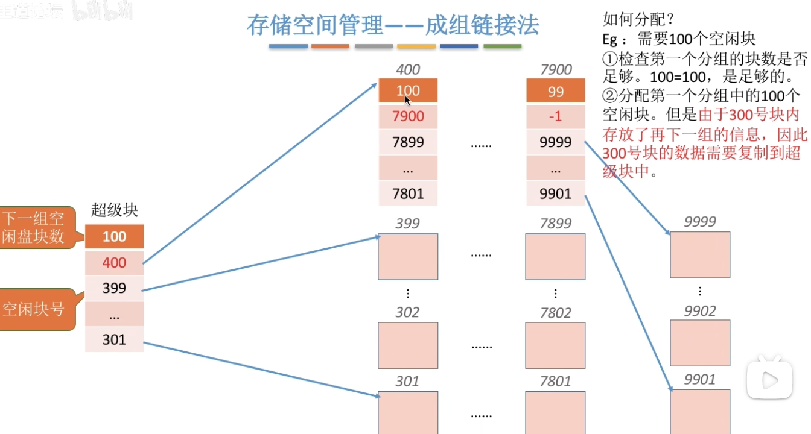

超级块将所在组的所有空闲数据块都分配完了，那么超级块必须将自己的下一组空闲区的索引块内容复制到自身，也就是说超级块成为了下一组空闲区新的索引块。

这样做的目的：不论何时，都保证除了超级块所在组可能将空闲数据块分配出去，其他所有空闲区都必须是“满满当当”的。

## 5.2 回收

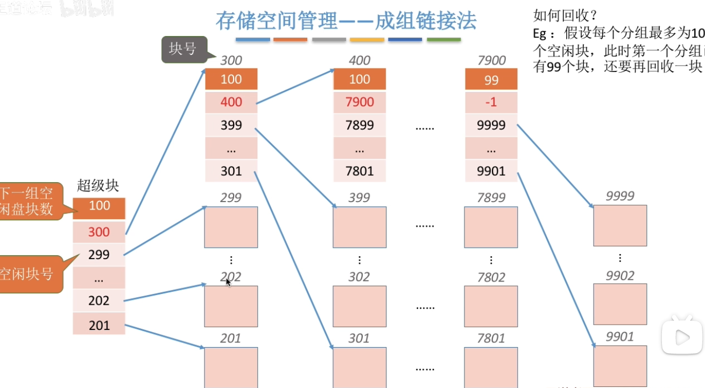

直接将回收的一块加入到超级块中。

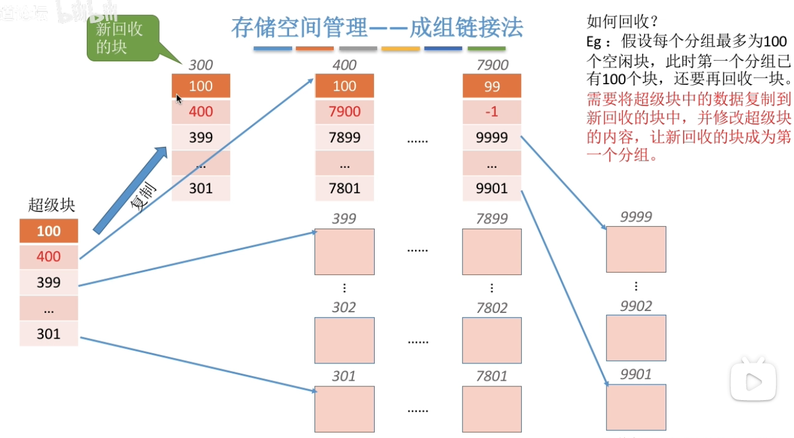

假设回收的一块地址是300，那么让300记录原超级块的位置，然后将超级块移出，让300存入超级块，其余位置空闲（即超级块内现在只有1个可用块）

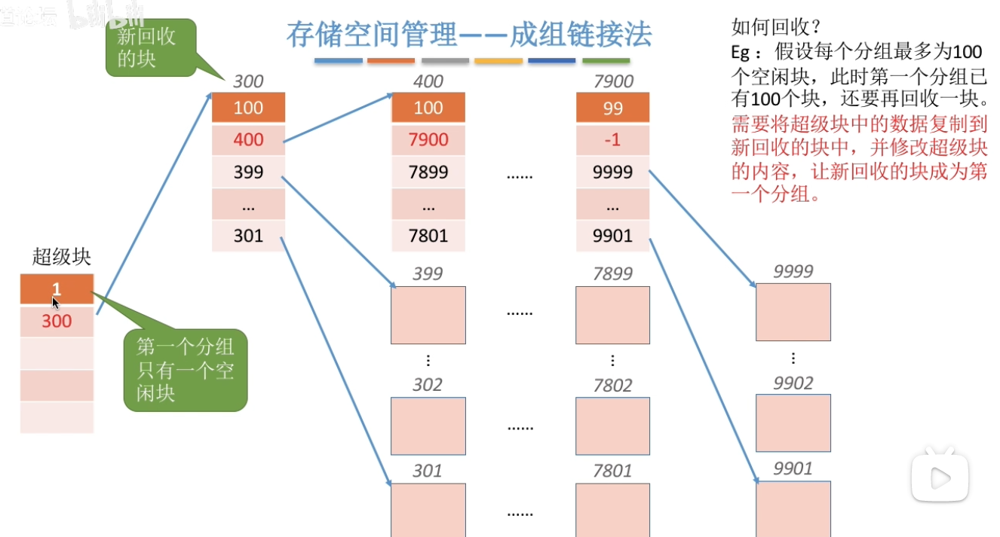