# 一、IO控制方式

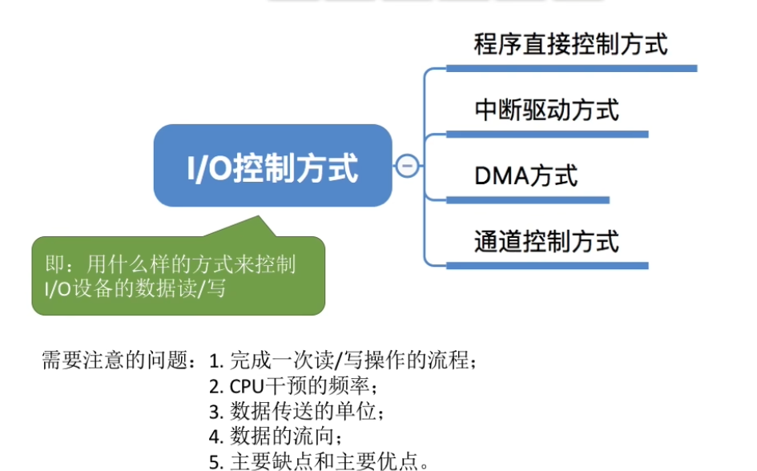

# 二、程序直接控制方式

CPU 直接下场干活，亲力亲为。

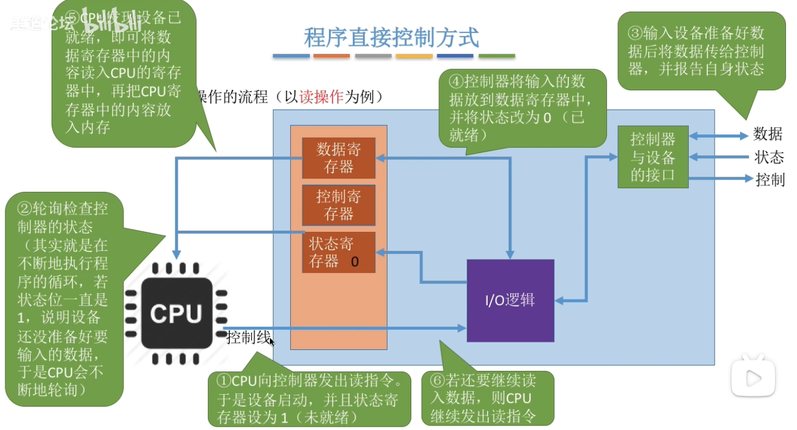

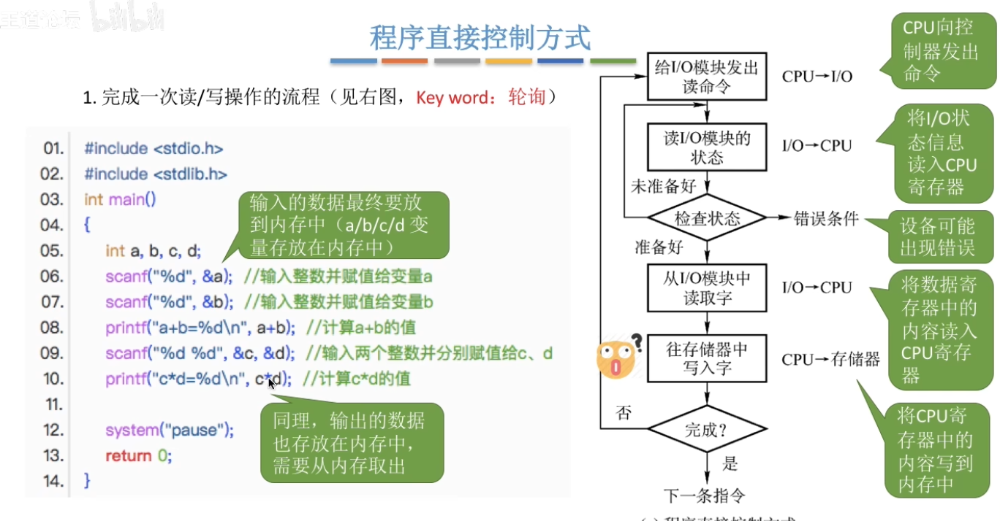

这里需要注意：从IO设备读到的数据会先被CPU寄存器获得，最终再被CPU寄存器存放到内存中。写入时也需要CPU寄存器先从内存中取出数据，再输出到IO设备。

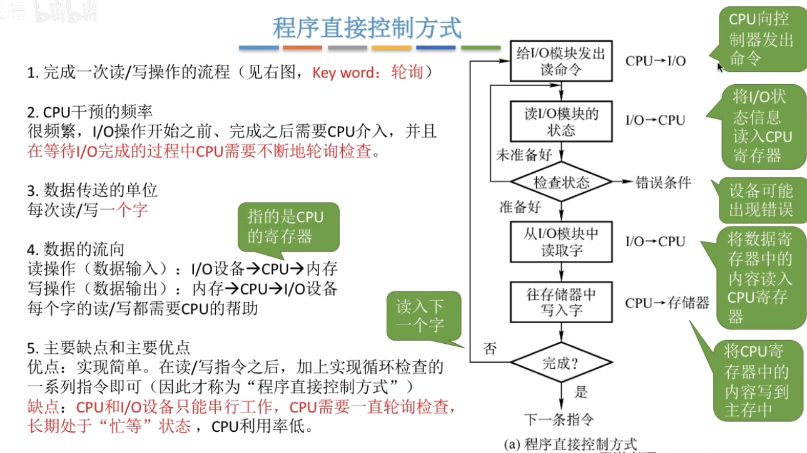

# 三、中断驱动方式

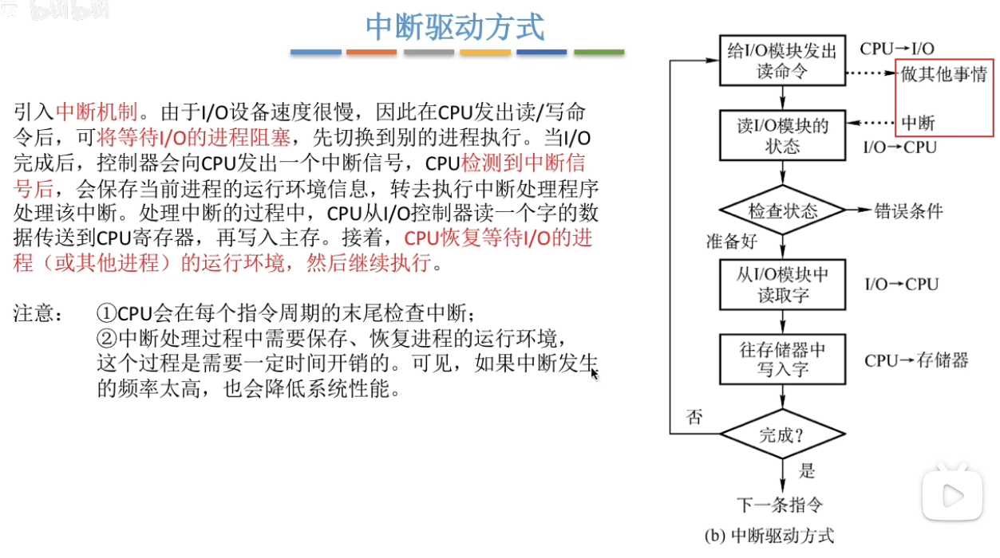

IO完成分为两种情况：1.正常结束； 2.出现了某些错误不得不结束。

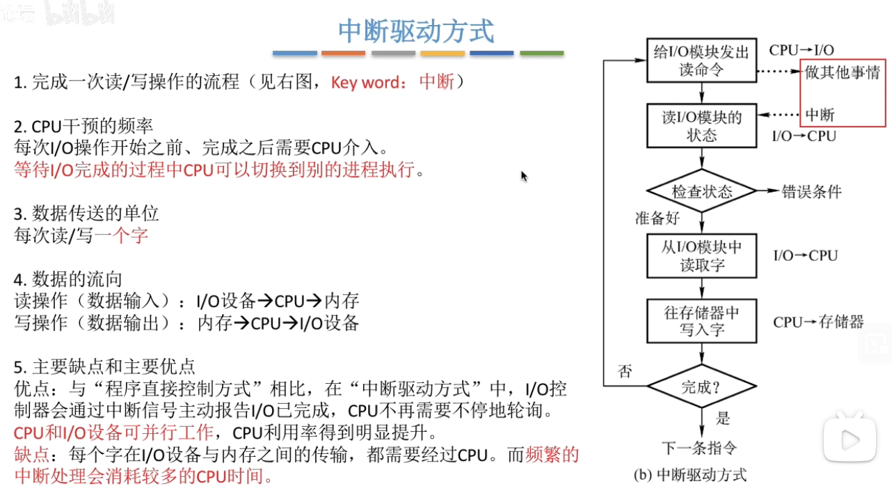

# 四、`DMA` 方式

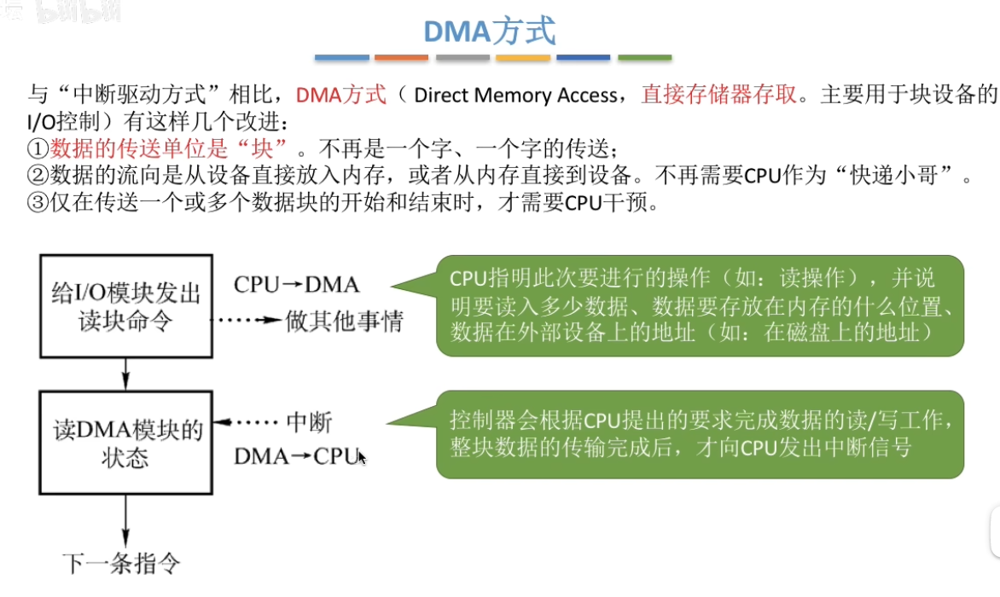

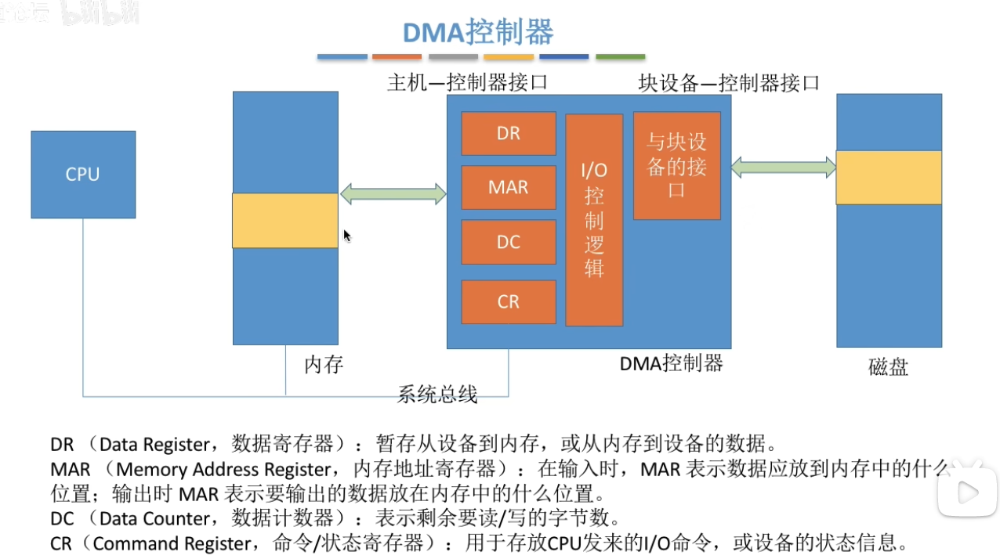

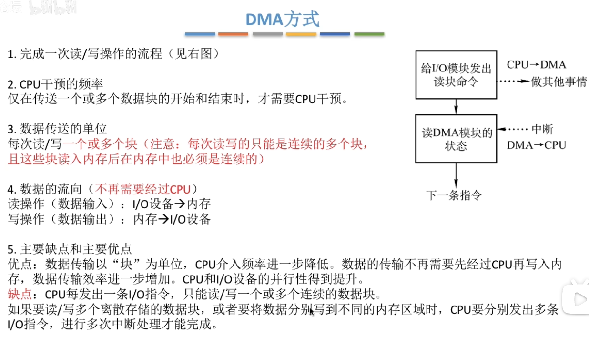

# 五、通道控制方式

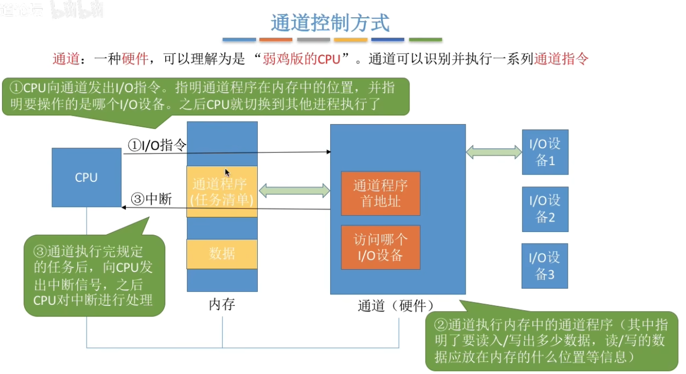

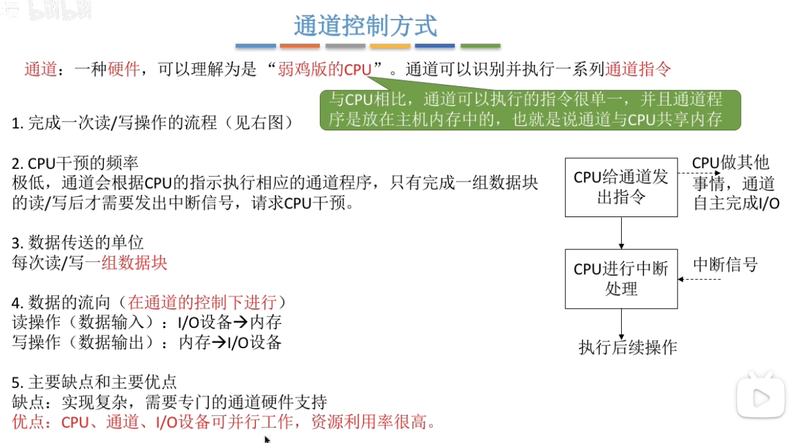

这里的一组数据块可以是离散的数据块。相比于DMA方式更加强大了。

# 六、总结

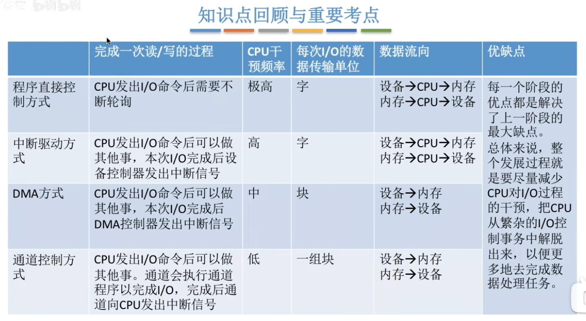