# 一、缓冲区的作用

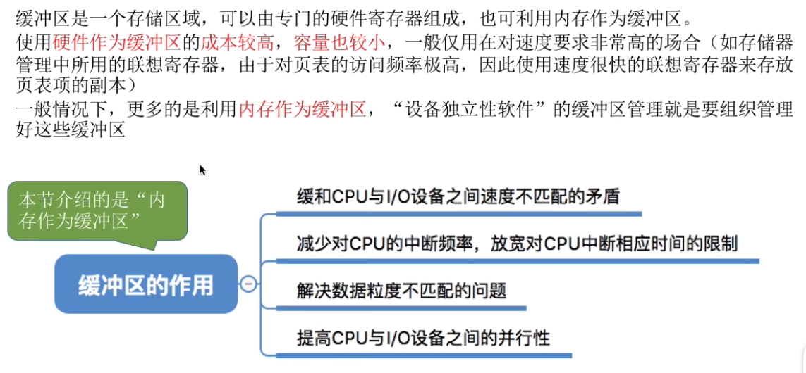

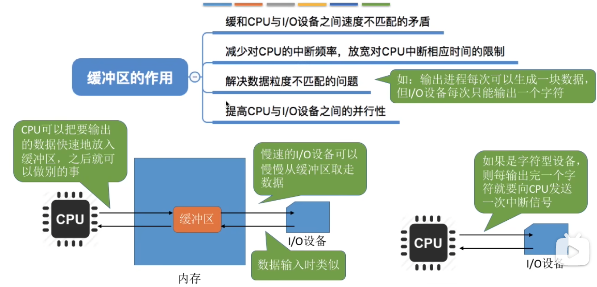

# 二、单缓冲

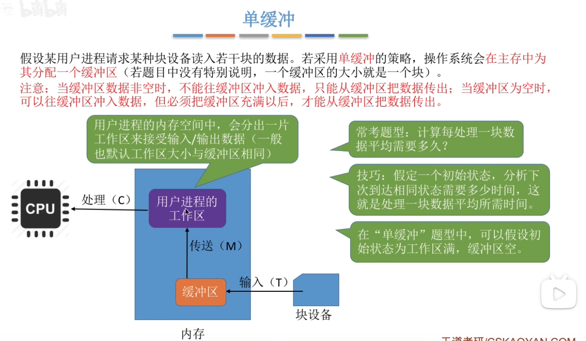

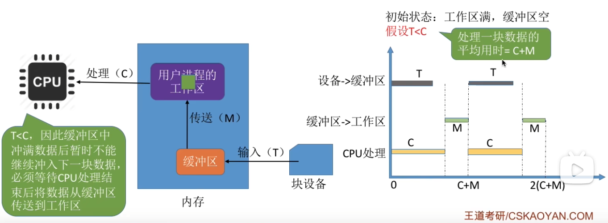

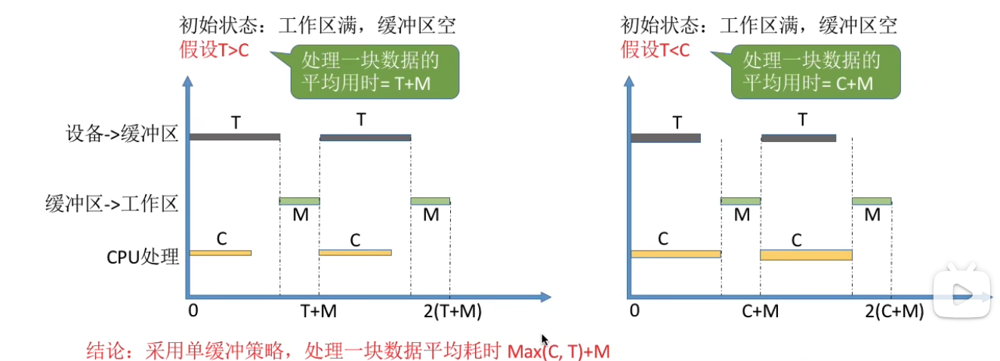

# 三、双缓冲

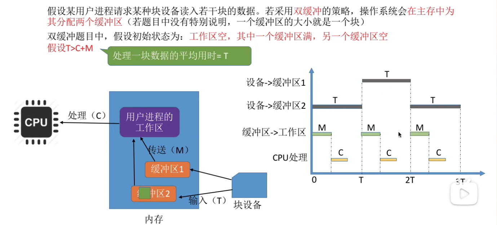

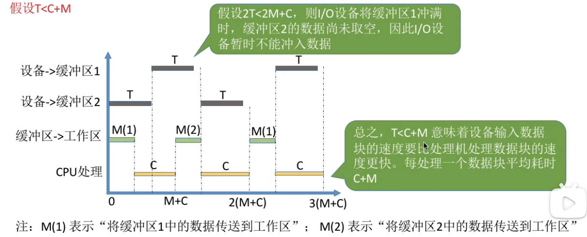

# 四、使用单/双缓冲在通信时的区别

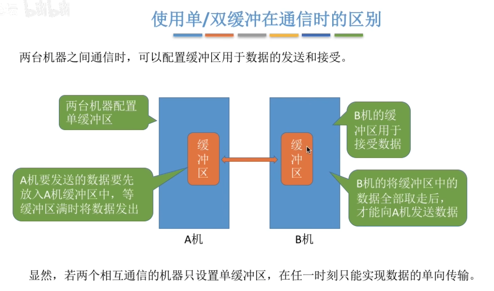

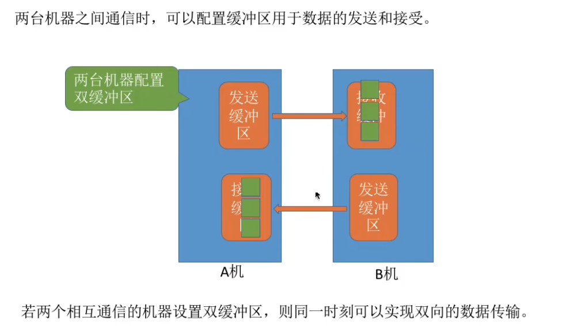

# 五、循环缓冲区

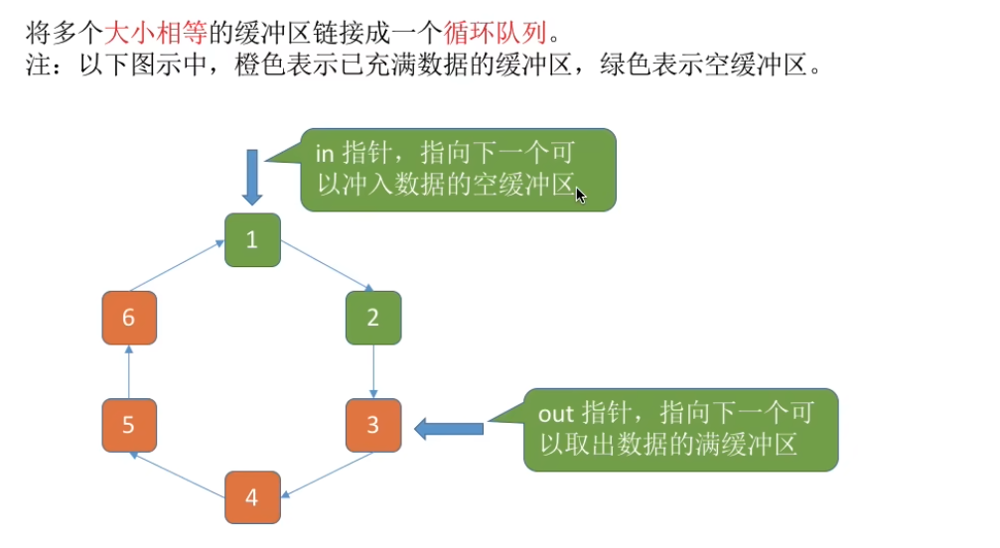

# 六、缓冲池

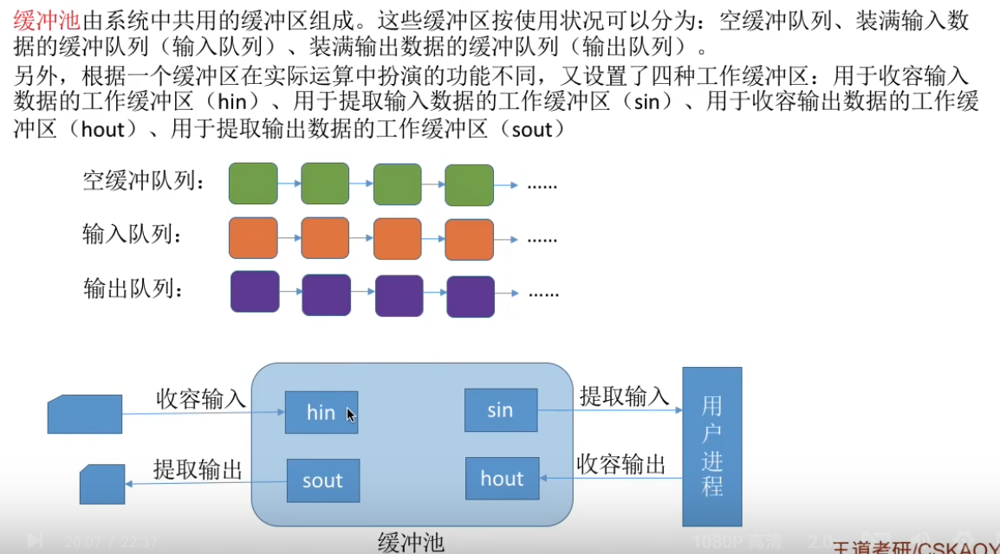

## 6.1  输入进程请求输入数据

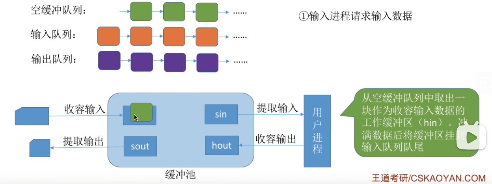

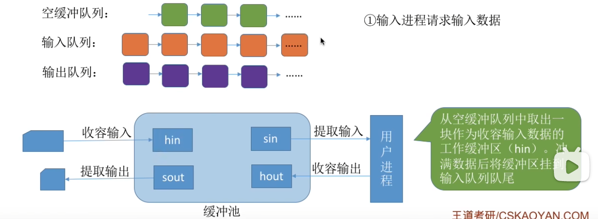

## 6.2  计算进程想要取得一块输入数据

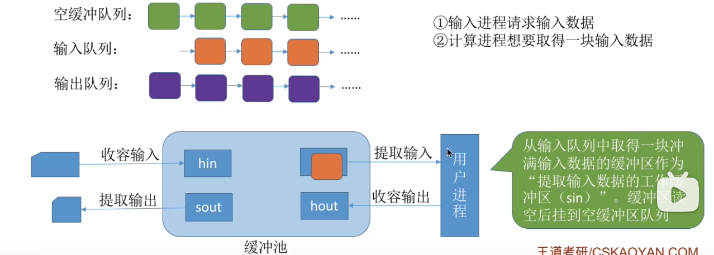

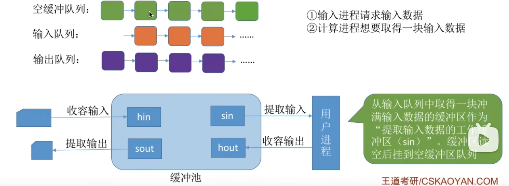

## 6.3  计算进程想要将准备好的数据冲入缓冲区

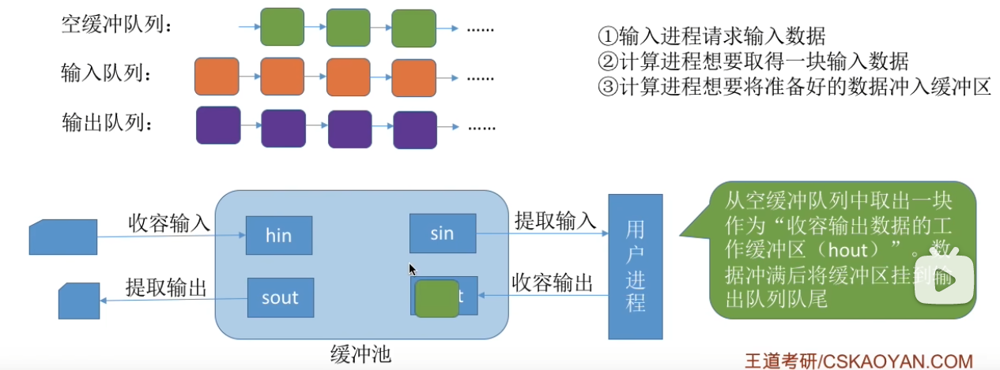

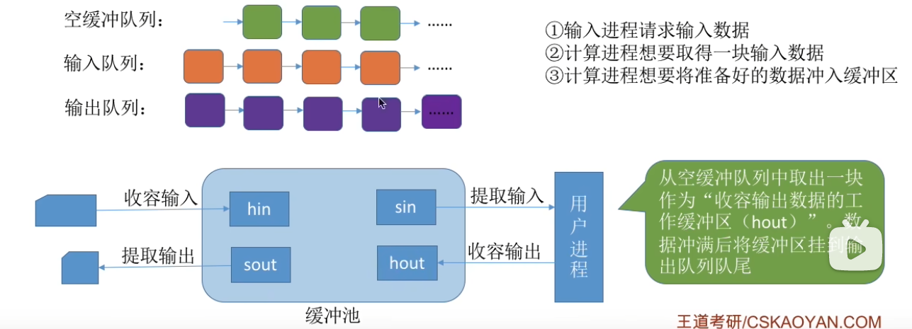

## 6.4  输出进程请求输出数据

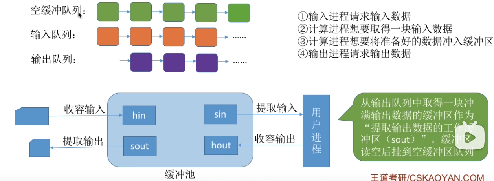

# 七、总结

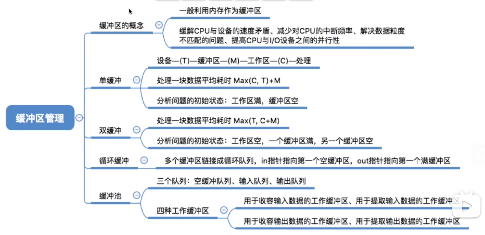