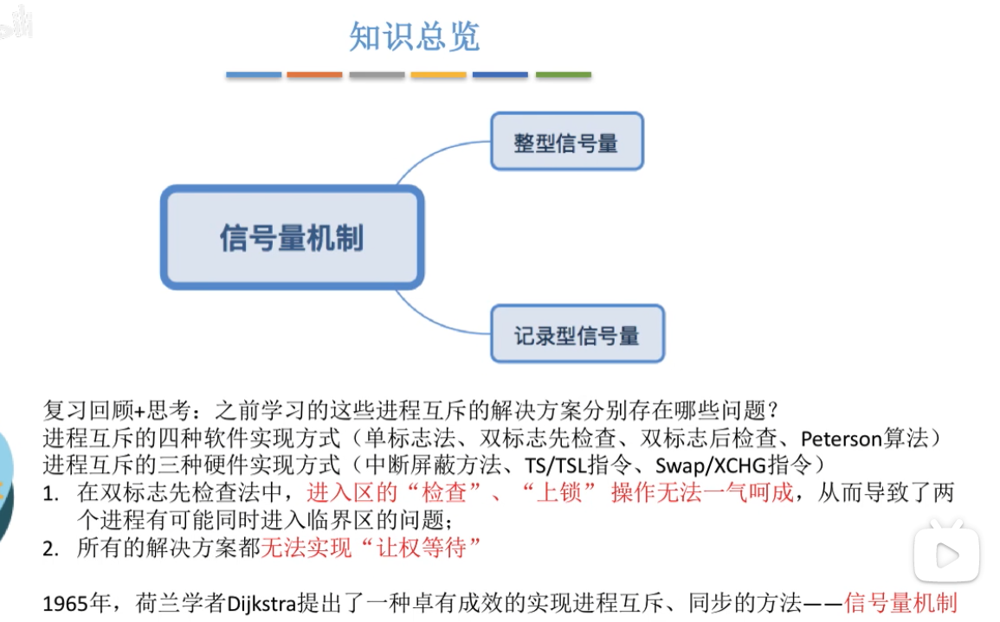

# 一、信号量机制

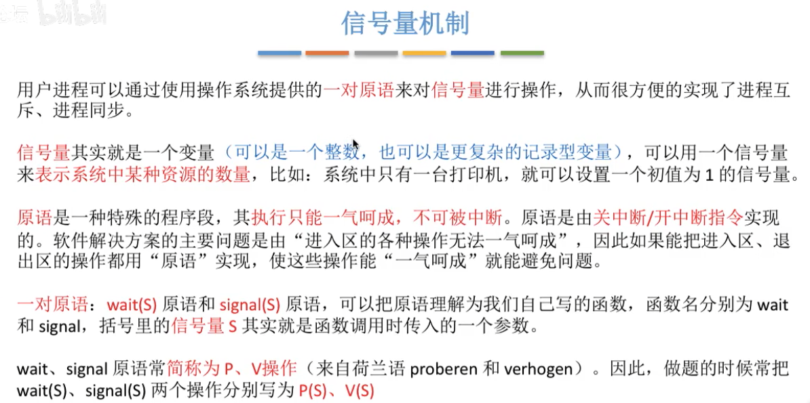

# 二、整型信号量

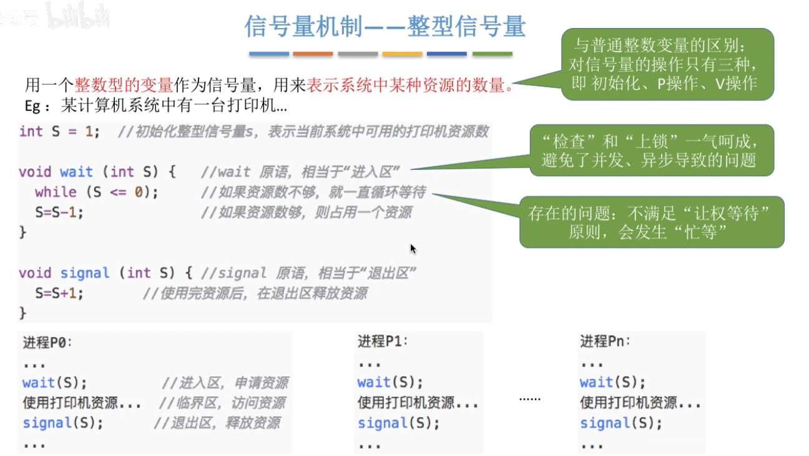

# 三、记录型信号量

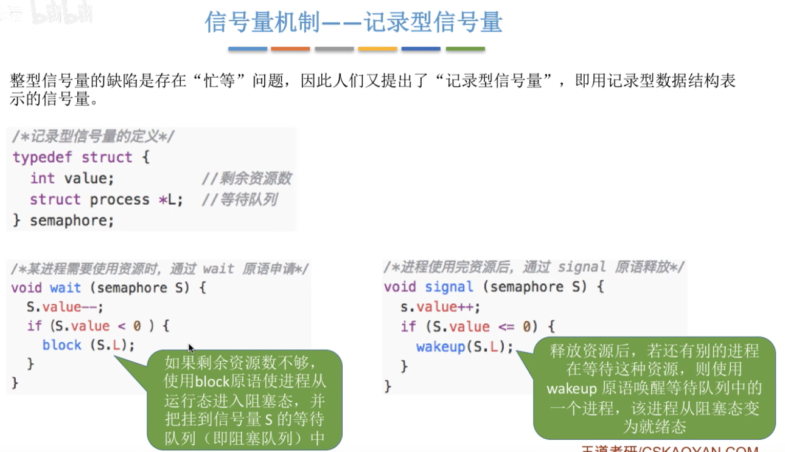

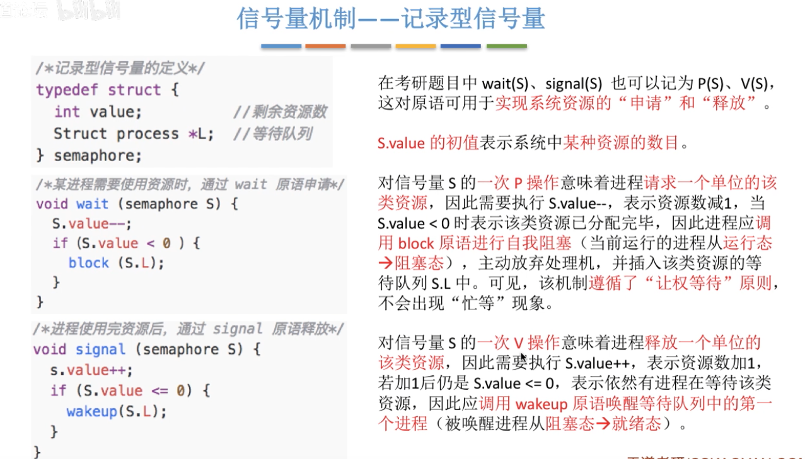

举例：

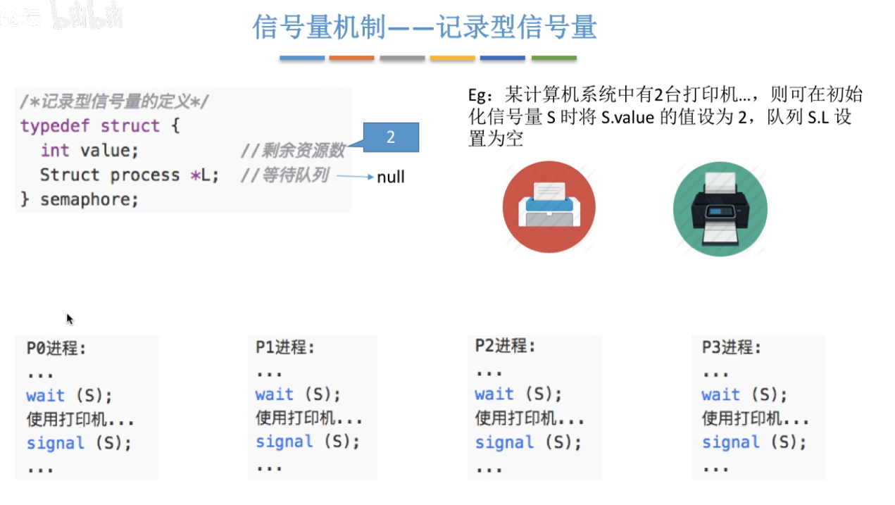

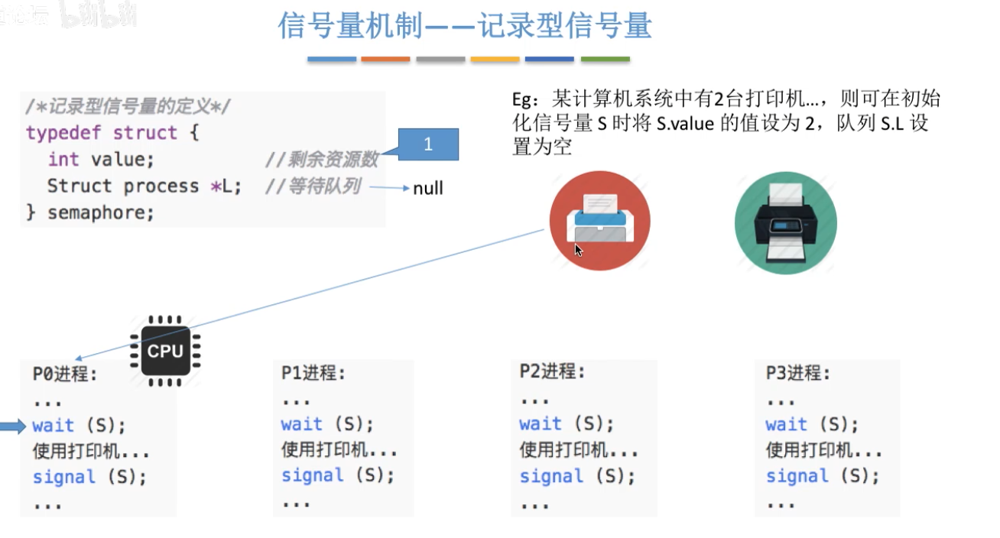

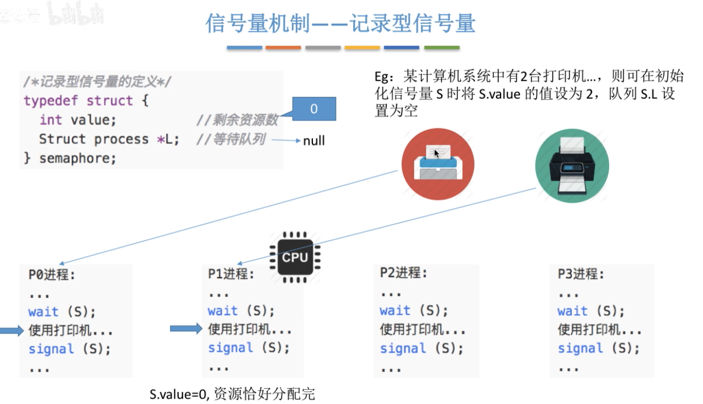

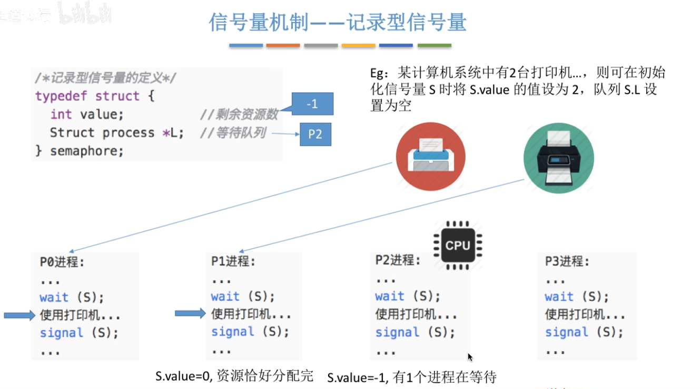

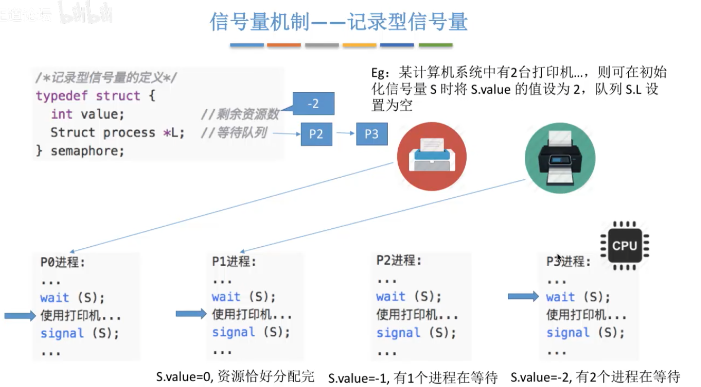

此时，CPU调度到P0进程对临界区的访问结束，发出signal

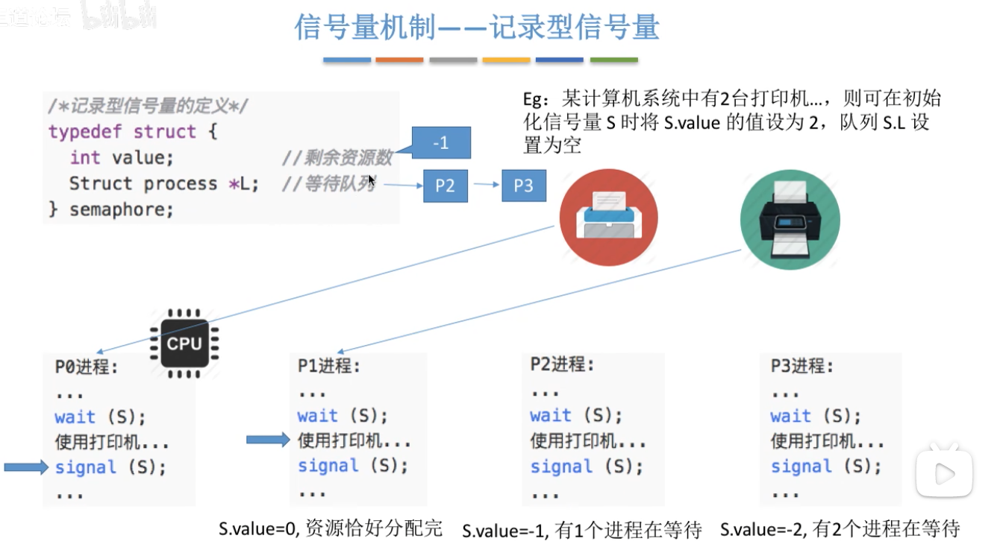

此时，就会从挂起队列中找到一个等待临界资源的进程中唤醒一个，这里是P2

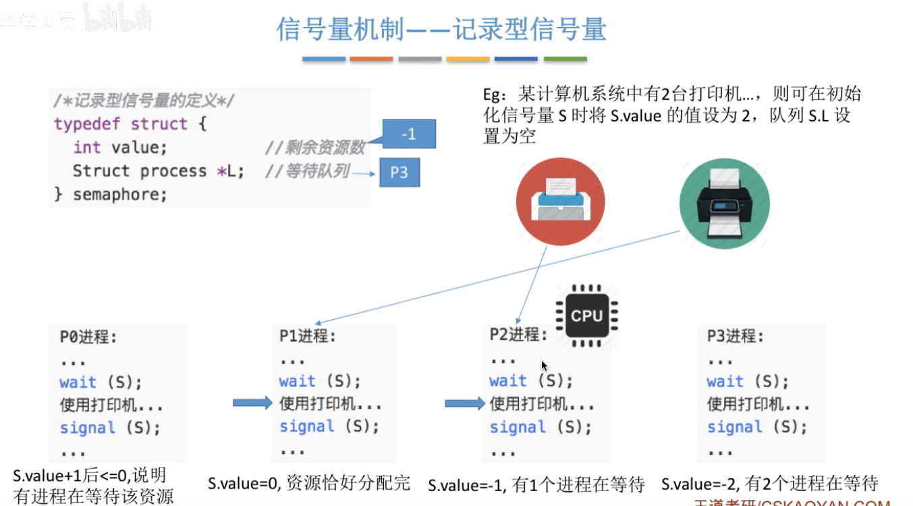

假设此时CPU调度到P2也执行完成，也会从等待队列中唤醒一个，这里是P3

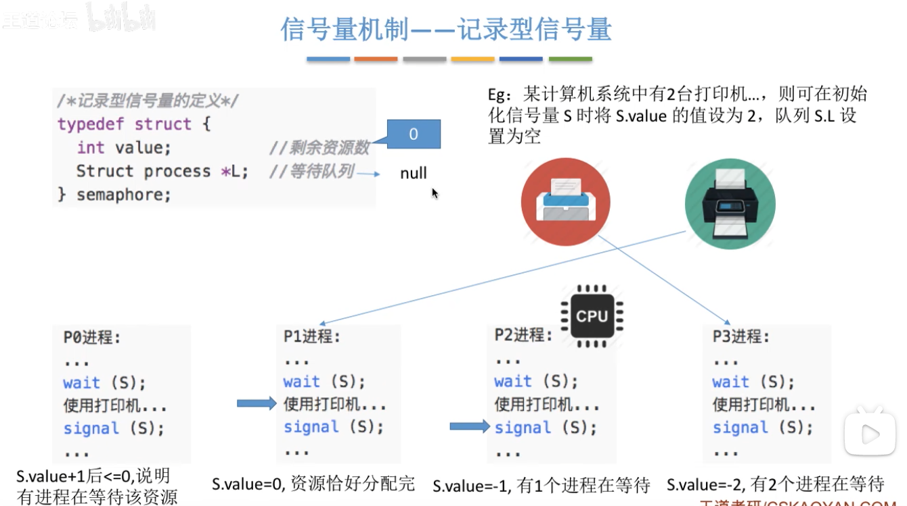

假设此时CPU调度到P1执行完成，等待队列没有其他等待任务，因此仅仅只是修改剩余资源数。

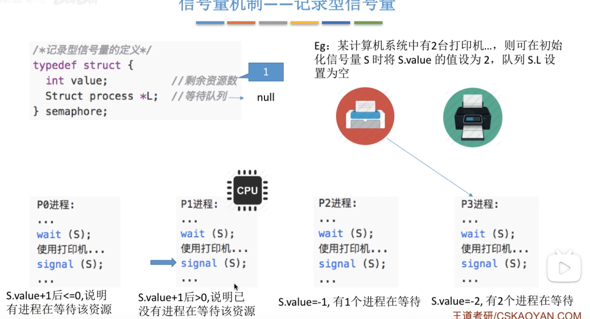

此时CPU又调度到P3，P3也完成，也是只修改剩余资源数。

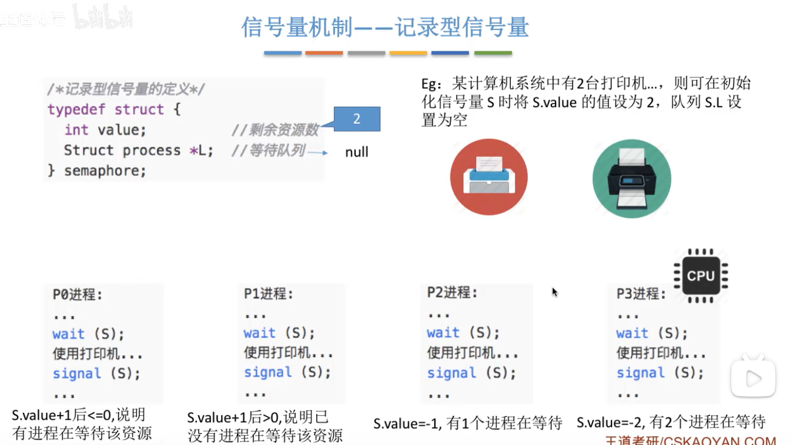

# 四、总结

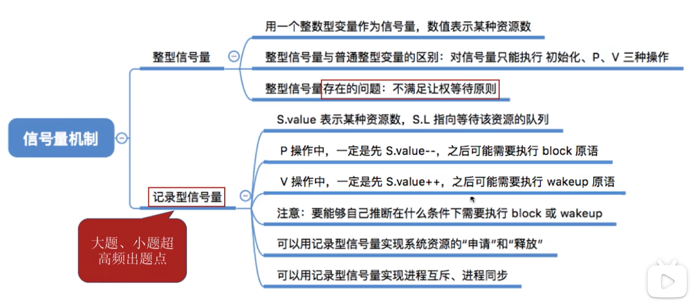