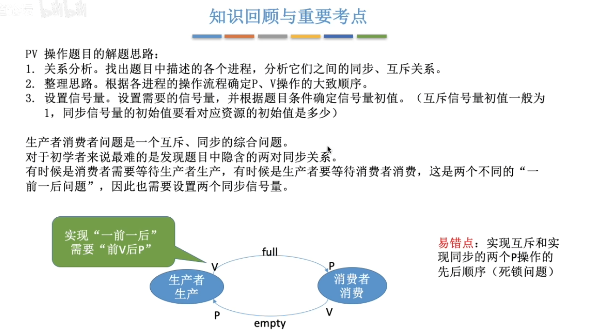

# 一、问题描述

# 二、问题分析

互斥关系：缓冲区作为临界资源，各进程必须互斥的访问。

同步关系：

1. 缓冲区非空时，消费者才能进行消费（消费者消费（后者）依赖于生产者生产（前者））
2. 缓冲区未满时，生产者才能进行生产（生产者生产（后者）依赖于消费者消费（前者））

设置信号量：

代码实现（同步关系中根据前V后P进行设置）：

# 三、互斥+同步问题中能否改变相邻P、V操作的顺序

最后一个问题：

消费者程序中的“使用产品”能否放到临界区中？答案是可以，这不会影响进程间的同步和互斥，但是不建议这样做，因为会导致临界区访问时间增大，导致程序并发性降低。

# 四、总结

