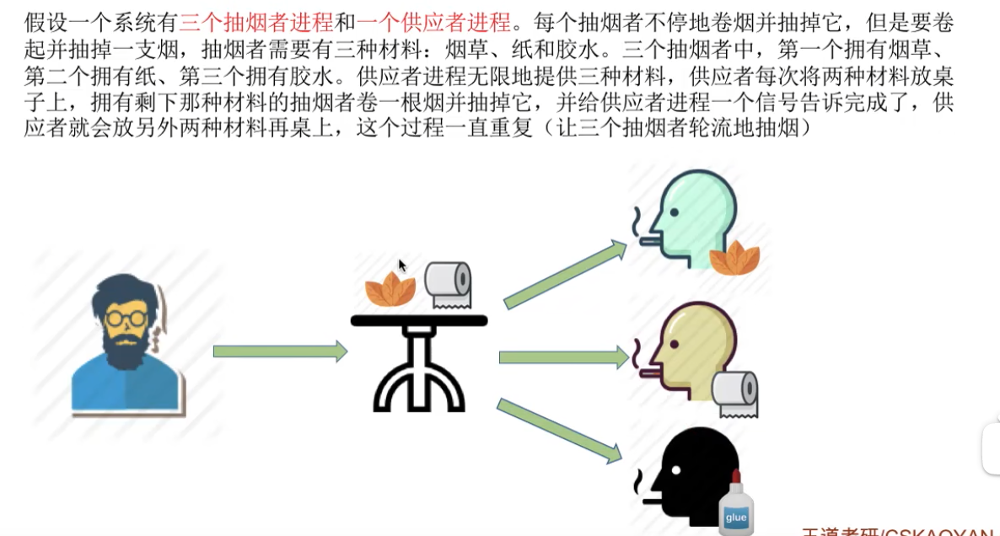
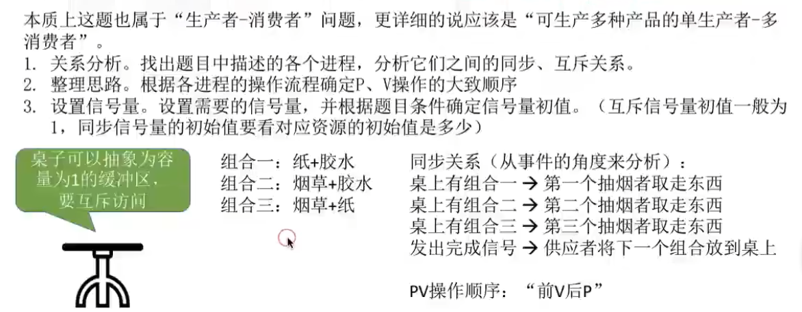
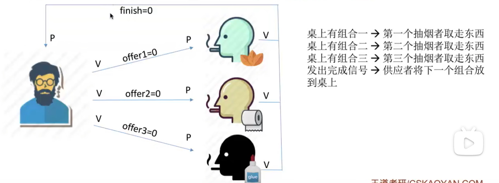
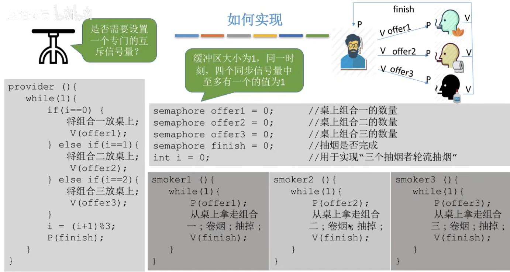
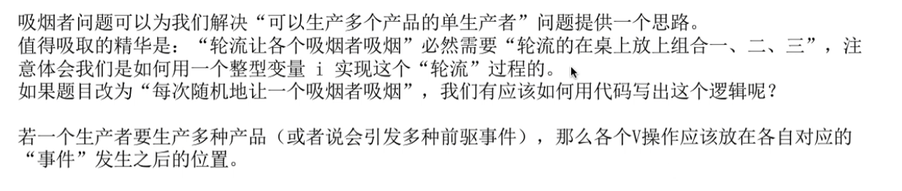

# 一、问题描述

# 二、问题分析

因为缓冲区大小为1，因此互斥信号量可以不设置。

# 三、信号量设置

也可以将`finish`设置为1，看作是缓冲区的剩余空间。只不过代码与设置为0相比，稍有不同。

# 四、代码实现

如果`finish`初始设置为了1，那么`P(finish)` 必须要放在`provider`的while(1)代码块的起始处。

# 五、总结

注意：若一个生产者要生产多种产品，那么各个V操作应该放在各自对应的事件发生之后的位置。