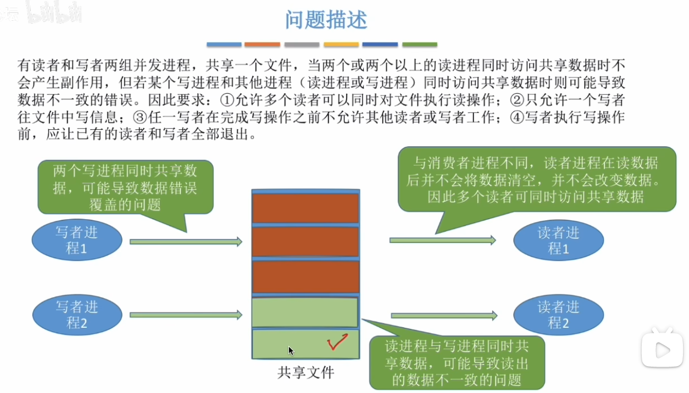
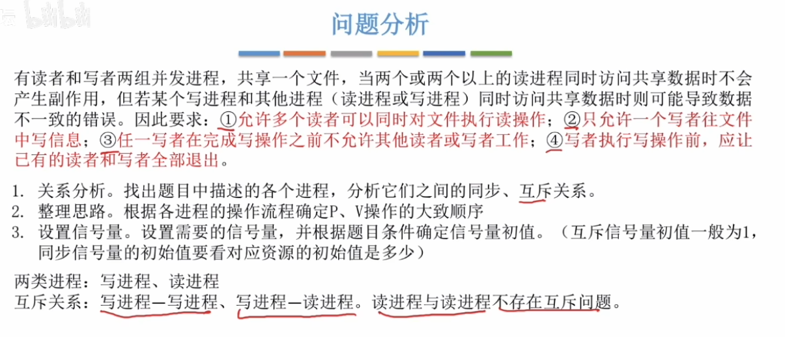
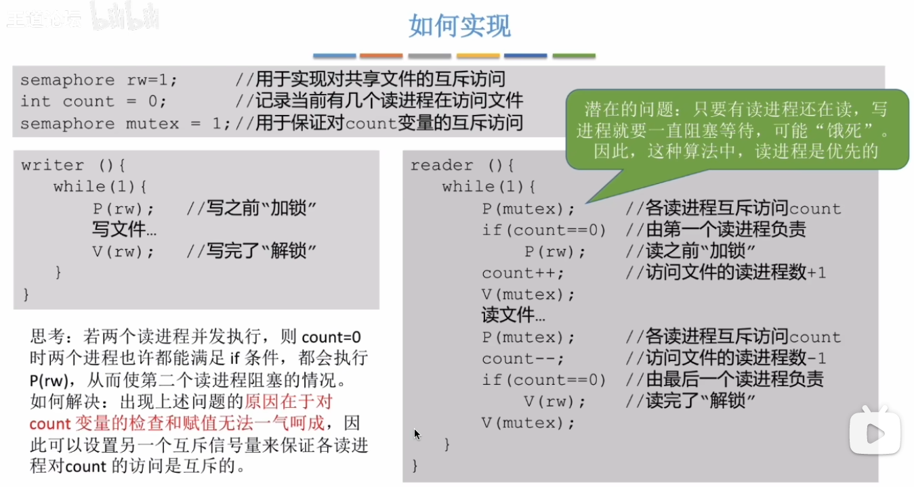
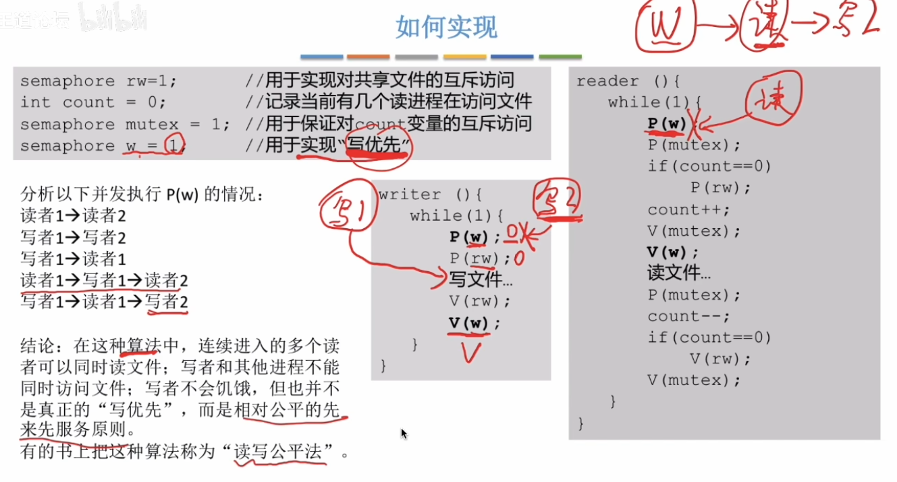

# 一、问题描述

# 二、问题分析

该问题只存在互斥关系，不存在同步关系

# 三、如何实现

问：如何做到同时允许多个读操作同时运行？

答：用一个 `count` 变量来记录当前有几个读进程在访问文件，且只有第一个读进程会进行加锁，在一批并行读进程中的其他读进程不会被阻塞。

问：如何保证在允许多个读操作并行的同时，禁止写操作？

答：只有最后一个读操作结束的时候才会进行解锁，因此在读操作们执行的过程中，写操作是不被允许进行的。

**如何实现读写公平？**

第一个读操作后的其他读操作在进行之前，也需要先获取一个额外的锁（与写操作竞争），这样就可以保证不会一直执行读操作导致写操作饿死。

读操作的V(w)为什么需要在“读文件”之前进行？而不是像写操作一样在循环结束的地方进行？

答：这样做是为了实现“读文件”的并行化，如果加在循环结束的位置，读操作之间就不能并行进行了。