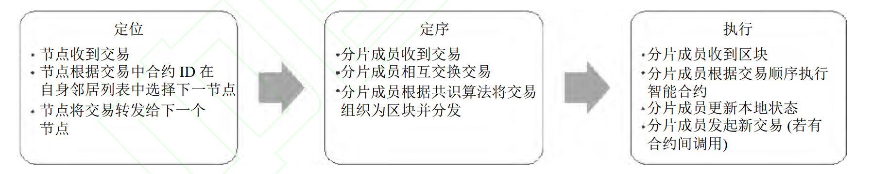
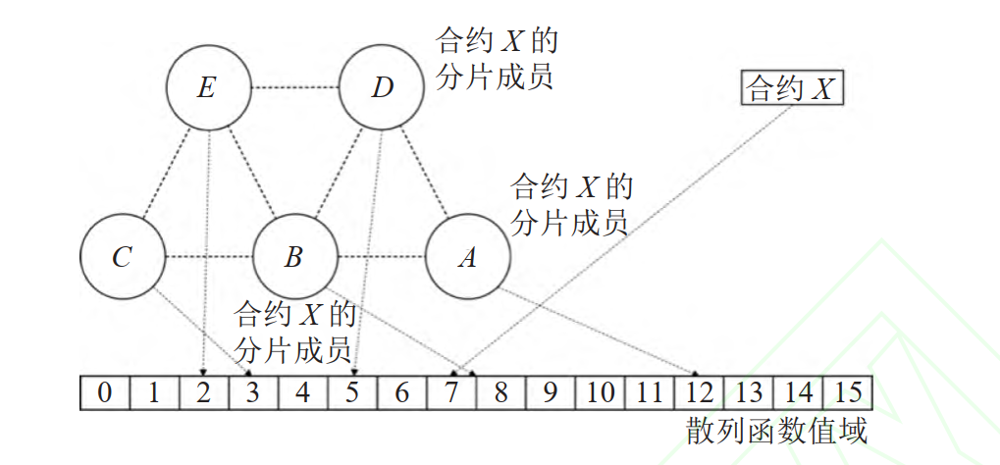

本文的主要贡献：

1. 以区块链分片技术为基础, 为**每个智能合约提供单独的分片作为独立的运行环境**, 以支持面向智能合约的
   分片, 并**通过节点虚拟化解决分片有重叠的智能合约之间的矛盾**.  

2. 基于**分布式散列表技术**, 提出能将智能合约执行环境分散在网络中的智能合约分片选择与定位算法, 并支
   持在网络发生变化时能**将交易稳定地路由给目标智能合约的分片成员节点.**  

3. **分离了智能合约执行过程中的定序和执行阶段**, 以支持模块化的共识协议, 并通过智能合约间的异步调用
   机制支持它们的通信和协同  


一个分区仅部署一个合约的可行性？

1. 截至 2022 年 2 月 24 日, 主流去中心化应用收集网站 State of the DApps 上登记有 1 192 个
   Ethereum 去中心化应用, 其中 71.31% 的应用只有 1 个智能合约, 94.80% 的应用智能合约数量不多于 10 个[9]. 这表明将智能合约部署于单独的分片中已可以支持大多数去中心化应用.  
2. Ethereum 的交易数据统计显示, 在北京时间 2022 年 2 月 1 日全天提交的 9 705 个区块 (高度 14 118 953–14 128 657) 中, 涉及智能合约间调用的交易仅占所有智能合约调用交易的10.66%, 其中 76% 的交易只有一次智能合约间调用, 82.26% 的交易调用了不超过 2 个智能合约. 这表明智能合约调用交易中涉及多个智能合约, 且进行多次智能合约间调用的情况是极少数的.   


### 一、区块链分片技术

​	区块链却常常遇到**可扩展性问题**, 其有限的交易吞吐量限制了所承载的去中心化应用的性能. 分片是一种有效解决区块链可扩展性问题的技术, 通过**将网络划分为不同运行单独共识协议的子集以处理不同的交易集合, 达到交易吞吐量随分片数量线性增长的效果**  

​	现行的分片式区块链主要面向交易进行分片, 可从并行化资源使用的角度分为两类  ：

1. 其一是**面向计算的分片** :代表为 ELASTICO[10]、 OmniLedger[11]和 DP-Hybrid[12]等. 这些区块链中**使用两层共识**, **顶层周期性地更新分片配置, 底层的分片内共识则负责处理划分后的交易集, 并将其保存在共享的账本中.**  
2. 其二是**面向存储的分片** :如RapidChain[13]和 Monoxide[14]等. 其中**每个分片具有单独的共识和存储**, **分片配置相对固定, 也因此需要通过复杂的机制处理跨分片交易**.   

### 二、分片技术存在的现有问题

​	现有的区块链分片技术并**不完全适用于以智能合约调用交易为主的去中心化应用** 。

- 问题一：交易分片不合理

大多分片技术**根据涉及交易的账户来划分交易集合**. 但若用于支持智能合约时, 因为智能合约调用交易的流量比转账交易更加**集中在少数个智能合约账户上, 则更容易出现流量失衡导致的拥塞**.  

- 问题二：跨分片交易执行困难

跨分片交易发生时, 首先需要确定的就是参与本次交易的分片. **转账交易**通常具有明确的输入和输出, **其涉及的分片在交易发起时即可指定**. 然而**智能合约的行为受到代码的控制, 其输入和输出只有在运行时才能通过计算得出**（简单来说就是：涉及智能合约的交易没法一开始就确定交易的参与方都有谁，必须得等到合约执行时才能知道）, 因此**需要更复杂的跨分片交易机制**来处理  

### 三、现有平台如何解决分片技术存在的问题

- 产业界的一些分片式区块链要么**禁止跨分片智能合约相互调用** (如 Harmony[15])。

- 要么**将交易涉及的智能合约移动到同一分片中来处理** (如 Elrond[16]和 Ethereum 2.0 方案[6,17])。

- 面向存储分片的智能合约平台Chainspace[18]则**改变了智能合约模型**, 使用类似于转账交易的数据结构表示智能合约调用交易, 以**通过“交易输入先确认, 交易输出后确认”的两阶段提交机制处理跨分片交易**.

但这些工作处理跨分片交易的效率都不高, 而且**会影响不跨分片的智能合约调用交易的执行过程**.  

​	总之, **区块链分片技术通过并行化资源使用, 能够达成区块链交易吞吐量的线性提高**. 但多数**现存区块链分片**
**技术只关注了用户和用户之间的转账交易.** 在支持智能合约时, 因为智能合约调用交易的流量集中, 且跨分片的智
能合约调用交易涉及**分片只能运行时得出**等特性, 智能合约容易因拥塞、跨分片交易处理而性能下降, 并不能因
区块链分片得到提升, 无法满足去中心化应用的需要.  

​	近年来还有一些工作提出了**多链架构**[19-22]. 多链架构与分片架构类似, 通过**维护一组并行的区块链**, 以提高整体的交易吞吐量. 在多链架构中, **每个节点都可以同时参与每条并行链, 更便于跨链交易的处理**. 多链架构可视为**对区块链系统的纵向扩展, 使整体的交易吞吐量能逐渐逼近节点性能 (主要指网络带宽) 所能支持的上限**.但在**联盟链环境中, 交易吞吐量主要就受限于节点的网络和存储资源, 采用多链架构反而会因为加剧资源竞争而导致性能下降**, 因此也并不满足联盟链中去中心化应用的需要  


### 四、系统介绍

​	BETASCO 采用了面向存储的分片设计, **部署在不同分片中的智能合约将代码和状态维护在不同的账本中（因为是不同的合约，使用不同的账本倒是也可以，没有同步的必要）**,因此具有了独立的执行环境. 在此基础上, BETASCO 使用可靠的智能合约定位机制来找到一个特定智能合约的所在分片, 从而保持智能合约对用户和其他智能合约的可见性.  

#### 4.1 交易执行

该系统的合约执行分为三阶段：定位-定序-执行

##### 4.1.1 定位

用户在使用去中心化应用的过程中涉及了对智能合约的调用, 于是发起了一个交易. 该交易记录了本次智能合约调用的必须信息, 如被调用智能合约的 ID、调用智能合约的方法名和参数, 以及用户或客户端的签名等, 而**无需事前指定在处理该交易时可能被调用的其他智能合约**. 在对等网络中, **该交易会被节点转发, 直到到达部署了智能合约的节点为止**, 这一步被称为定位.   

##### 4.1.2 定序

BETASCO 采用现存区块链广泛采用的定序-执行架构[23], 分片的成员先**通过共识算法对收到的交易进行定序**, 在相互连接的区块中持久化  

##### 4.1.3 执行

在最终的执行阶段, **分片成员按相同的顺序执行这些交易,** 并返回结果给客户端. 如果执行阶段**遇到了对其他智能合约的调用**, 则再发起一次由该智能合约向被调用智能合约发起的交易. 智能合约间调用的执行**也会经过定位-定序-执行 3 个阶段,** 并且持久化存储在被调用智能合约分片的账本中.  




#### 4.2 阶段角色划分

​	BETASCO 区块链构建于一组节点形成的对等网络中, **每个节点都属于某个组织或者机构, 通过证书来验证彼此的身份**. 除了组织或机构用于发放证书的网络管理与成员管理服务 (不属于 BETASCO 网络) 外, 网络中没有任何中心化的管理结构, 所有节点平等地承担相同的职能. 但是**在某个交易的执行流程中, 节点可能扮演以下角色** (如图 3 所示).  

- 客户端: 客户端是**智能合约执行流程的起点**, 用户或者智能合约发起交易后首先经过客户端的转发到达下一个节点. 因此, **客户端在网络拓扑结构中的位置直接决定了本次交易的执行响应延迟.** 若本次交易是**智能合约间调用,** 则**上一个交易执行流程中的分片成员节点即是本次交易中的客户端**.  

- 转发节点: 转发节点负责交易的转发, **根据交易中的智能合约 ID 与自身的邻居节点列表, 将交易转发给定**
  **位服务中更接近合约分片成员的节点**. 转发节点的交易转发策略是定位阶段的核心, 也是智能合约异步执行的重要支撑. 当交**易由用户发起时**, 转发路径上的第 1 个节点, 即**从客户端收到交易的转发节点, 会与所属组织/机构的成员管理服务进行交互, 以判断该交易是否来自一个合法的组织/机构成员用户. 如果不是, 则该节点会拒绝本次交易**  

- 分片成员节点: 分片成员节点是共同构成合约分片的节点. **每个分片成员节点都拥有一份智能合约的代码和**
  **状态副本**, 通过对等连接传递交易与区块, 并对智能合约进行执行. 用于分片的**共识采用了模块化设计, 只以交易为输入、以区块为输出, 而状态的维护与验证与之独立**, 简化了共识协议的替换  

**下面这一点可以进行考虑优化？**

BETASCO 中的账本由各个合约分片独立维持, 合约分片成员节点只需要**本智能合约相关的账本和状态数据（因为合约隔离的原因，其他分区其实也完全没办法执行别的合约的函数）**就可以参与智能合约执行流程, 因此**每个节点都无需持有所有智能合约的账本和状态**. 这降低了每个节点的存储压力, 并且因为交易顺序和状态的持久化的分离, 可以通过创建状态检查点以进一步压缩存储空间.  

以上的这种措施固然减小了每个节点的存储压力，但是将各分区完全独立，面对跨分区的交易明显就会变慢：

1. 跨分区交易中一些交易有时候错的很离谱，如果账本都是同步的，明显就能省去跨分区的必要。
2. 如果交易仅仅只是读取某些数据，全同步账本肯定运行的更快。而且通常来说，读取相对写入会更加频繁一些。

所以可不可以这样做：**各分片也可以安装其他合约（这样自然账本也需要是全网同步的），但是只会专精与其中一种合约，对于其它合约则是只会进行简单读取，不会进行写入操作。**这种做法其实是用空间换时间，也是当今数据库领域的主流做法。

#### 4.3 如何将DHT结合到合约定位

BETASCO 将节点 ID 和智能合约 ID 使用相同的散列函数映射到同一个地址空间中, 然后**选择节点 ID 散列值与智能合约 ID 散列值相近的节点作为智能合约的部署节点**, 为其建立对等连接, 形成合约分片.  

下图展示了智能合约 ID 与合约分片成员节点对应关系的一个例子:

1. BETASCO 构建于 **5 个节点构成的对等网络**之上, **节点 ID 分别为 A 到 E**。

2. 网络中部署有一个智能合约, ID 为 X。
3. 合约分片规模为 3. 
4. 将节点 ID 和智能合约 ID分别由一个值域为 0–15 的散列函数处理. 
5. X 的散列值为 7, 因此在散列值集合中寻找散列值接近 7 的节点 ID, 发现节点 B、 C、 D 的 ID 散列值分别为 8、 3、 5, 是 ID 散列值最接近 7 的 3 个节点, 因此 B、 C、 D 就是合约分片的 3 个成员节点.  



按照上述对应方法, **合约分片成员的选择仅与智能合约 ID、节点 ID、分片的规模以及散列函数相关**。

当**网络中的节点发生变化时, 某个智能合约对应的分片成员也可能随之变化. 但因为一个智能合约对应多个分片成员, 所以变化前后的分片成员节点仍然有重合部分**（这句话的意思是：**针对一个合约ID附近的节点变动的情况，因为一般情况下不会存在该合约附近所有的节点都下线换成了别的节点，因此不至于大规模节点的更换、安装合约**）。这能够在联盟链网络中保证智能合约服务的持久与稳定.  

```
以上的这种算法是经典一致性哈希分区算法，特征是：节点个数>>合约数量。与数据库相类比：共识节点就是存储项，合约就是存储服务器。

因此也存在明显的数据倾斜倾向：节点ID过于集中在某一个合约ID的附近。其他合约ID附近可能都没什么节点。
解决方法很简单，虚拟槽分区算法+一致性哈希分区算法 即可。每一个合约有多个虚拟ID，均匀分布。

如果每个合约虚拟化的ID个数相等，可以让每一个合约都能均匀分到节点。但如果某一个合约使用次数相对于其他合约更加频繁，就是需要更多的节点，那么可以增加该合约虚拟化ID的个数，这个就可以分配到更多的节点。
```

**每个转发节点都会将交易转发给散列值最接近的节点, 这样最终会到达一个所找到的节点 ID 与智能合约 ID散列值最接近的节点, 该节点即可能为分片成员节点**. 如果该节点不是分片成员节点, 则按照上述的对应关系继续查找那些 ID 散列值次接近的节点. 如果还未找到, 则系统会先为终端用户响应一条还未找到的返回信息, 然后通过洪泛方式继续尝试转发交易.

在部署流程中, **交易最终到达的节点会成为首个分片成员, 然后该成员会将交易再次转发, 目标为节点 ID 与智能合约 ID 散列值次接近的节点, 并附上自身的连接信息**. 以此类推, 最终部署智能合约的交易会到达一系列 ID散列值与智能合约 ID 相近的节点, 且这些节点有足够的信息建立彼此之间的对等连接. 在执行流程中, **若交易最终到达的节点并非分片成员节点 (当网络发生变化时), 该节点也可以通过这种再次转发机制找到一个原成员节点, 然后获得足够的信息继续进行执行流程.**  

#### 4.4 定序阶段

​	定序阶段是**智能合约执行流程中正式执行的前置**, 主要通过分片成员间的共识过程处理. 区块链的智能合约依赖于共识机制形成的共识存储, 正是**共识机制将收到的交易进行排序保存**, 区块链的**各节点才能通过按相同顺序执行智能合约来维持智能合约全网一致的状态**. BETASCO 部分遵循了这一原理. 因为 BETASCO 的智能合约部署在规模较小的分片中, BETASCO 可以使用轻量级小规模的共识来对交易进行排序与持久化, 以达成交易的快速处理与响应  

​	智能合约分片的共识协议以每个分片成员**收到的交易为输入**, **一个有序的交易序列为输出**, 并形成相互链接的区块形式的共识存储, 如下图所示. 区块结构内不包含智能合约的状态信息, 因此共识协议对区块的处理只需要验证顺序而不需要执行交易.  

```
	简而言之，就是让分片内的节点都能按照同样的顺序完成对交易的执行。因为每一个节点都是同样的状态机，同样的输入必然是同样的输出。

	这里就有一点优化之处？
	在仅仅完成同样的排序基础之上，共识算法能否做多更多的功能？比如：将有相互依赖关系的合约交易按照先后依赖关系进行排序，这样可以降低合约执行时的错误数。
	要达成这一点，应该可以结合：合约交易附加优先级 + 交易时间戳 共同实现。
```

任何发给某个智能合约的交易都会被定序存储, BETASCO 不会对这些交易进行过滤. 但是, BETASCO 提供了一些 API 供开发者获取交易发起者的相关信息, 以在执行阶段拒绝不符合要求的交易的执行.  

```
简单来说，就是共识阶段只排序，不会过滤某些不合法的交易，在执行阶段遇到不合法的交易不执行即可。

其实也可以简单的过滤，比如：过滤掉重复的交易(布隆过滤器)。不应该引入过于复杂的过滤策略，这样必然增加共识负担。
```

#### 4.5 执行阶段

​	定序结束后, 每个分片成员都会收到一些区块, 其中交易以相同的顺序排列. 每个分片成员都会按顺序执行这些交易, 然后更新所持有的智能合约状态的副本.  

​	如果在智能合约调用交易的执行过程中**调用了别的智能合约**, 此时分片成员会**创建新的交易以进行智能合约间的异步调用**. 智能合约分片成员创建的交易与客户端发起的交易类似, 但是**需要使用智能合约自身的密钥进行签名**. 同样的, 智能合约发起的交易也无需标注本次交易可能被调用的其他智能合约  

​	BETASCO 将在两个阶段保证智能合约间**异步调用的原子性**:  

1. 只有在智能合约调用交易成功执行 (没有触发任意程序异常) 时, 智能合约间异步调用才会被发起并且执行 （**当前成功，才会进行递归调用**，遇到错误立即终止，这样错误不会累积）
2. 智能合约分片在对收到的交易定序时会**优先对智能合约发起的交易排序并打包（而非来自于客户端的交易）**.   