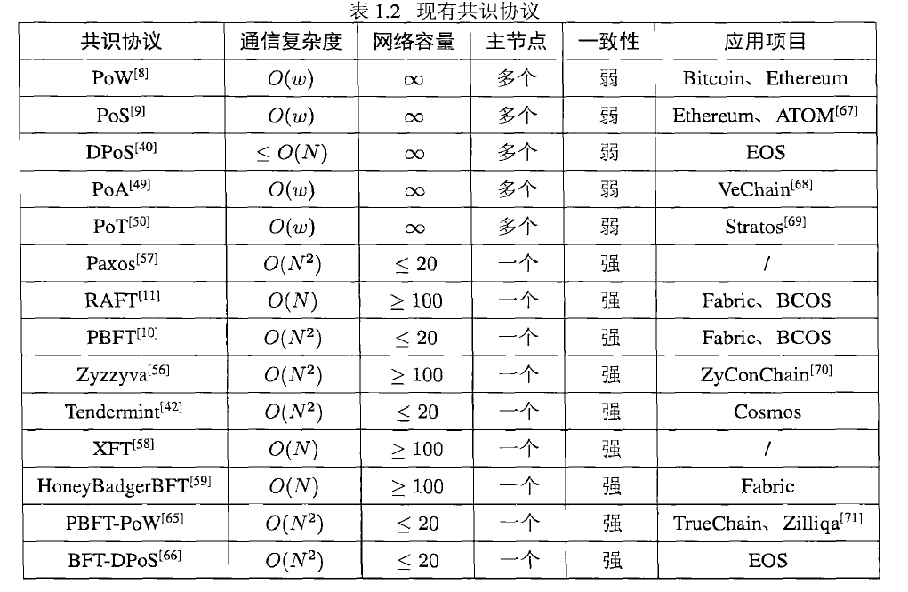

### 一、文章大方向

1. 联盟链系统网络可扩展性优化（网络容量扩容）
2. 性能可扩展性优化（交易吞吐量提升）
3. 系统横向可扩展性优化（一对多大规模跨链交互）

主要贡献：

1. 针对大规模节点接入及现有共识容错率低的问题，面向联盟链系统共识层提出可信拜占庭共识协议并设计节点**混合信誉计算模型**。通过选取混合信誉值高的节点作为共识参与者执行实用拜占庭容错共识协议的方式同时实现**网络容量扩容**和**共识协议容错性提升**。
2. 针对海量交易串行处理导致的交易吞吐量低的问题，面向联盟链系统网络层提出**分层分片协议**。根据联盟链节点身份属性特征将整个联盟链系统划分为**多个联盟链子系统（普通分片）**和一个**由高混合信誉值节点组成的主分片**，通过普**通分片独立并行地执行片内交易共识生成子区块**和**主分片执行最终子区块共识**以提高系统整体交易吞吐量。
3. 跨链协议的改进：1）通过在预言机节点部署和运行智能合约实现大规模跨链交易汇聚与交互；2）设计公平跨链数据交互机制，在两种交互模式下基于智能合约实现根据数据质量的激励与惩罚以促使理性利益相关者遵守协议，并且理论证明该机制的交易激励公平性。

### 二、联盟链的不可能三角

分布式领域CAP原理认为，分布式系统最多只能保证**一致性、可用性、分区容错**三项特性中的两项特性。

由于存在节点平等自治、数据多方维护、链间封闭隔离等特性，联盟链系统面临“不可能三角”问题。去中心化、安全性和可扩展性构成分布式联盟链系统“不可能三角”。

1. 去中心化指的是分布式系统中拥有大量**平等参与**系统操作和维护的联盟链节点，并且**节点数量越多去中心化程度越高**；
2. 安全性指的是维护分布式系统状态一致性所需要花费的成本，可以通过**参与系统状态维护的联盟链节点数量**来衡量，通常**节点数量越多安全性越高**；
3. 可扩展性指的是**网络可扩展性、性能可扩展性和系统横向可扩展性**。对于联盟链系统，**网络可扩展性**特指网络容量，即**允许接入网络的节点数量**；**性能可扩展性通常指交易吞吐量**，即每秒处理交易的数量；**系统横向可扩展性是指跨链交互**，即不同联盟链系统之间信任传递、数据交互和价值流转。

### 三、可扩展性存在的问题

#### 3.1 网络可扩展性优化问题（受限于通信复杂度）

体现在共识层共识协议参与者数量的限制。联盟链系统利用拜占庭容错类共识协议达成分布式网络下的状态一致性。**在共识过程中，网络中会传输大量消息，容易造成网络拥塞**。

以全球主流联盟链平台Fabric为例，该平台共识层使用`PBFT`协议，该协议通过联盟链节点之间多次投票通信来维护联盟链系统状态一致性，通信开销与节点数量呈关系。经测试，在百兆光纤网络下，Fabric网络容量不超过20个节点，难以满足大规模现代服务应用的需求。

#### 3.2 性能可扩展性优化问题

性能可扩展性优化问题体现在**共识层共识协议的限制**和**网络层节点执行共识协议的方式**。

以Fabric联盟链平台为例，该平台通过**全部节点**共同执行共识协议的方式来串行处理与存储交易。经测试，Fabric平台交易吞吐量不超过2000 tps，远小于VISA等现有电子支付系统的交易吞吐量，难以满足高性能现代服务应用的需求。

#### 3.3 系统横向可扩展性优化问题

系统横向可扩展性优化问题体现在**不同联盟链系统底层技术异构性带来的跨链交互困难**，对底层技术的屏蔽与**跨链交互的实现需要在智能合约层完成**。

Fabric联盟链平台和FISCO BCOS联盟链平台为例，两个平台之间相互不信任，而且两个平台的共识协议、加密机制等底层技术不同，因此两个平台难以直接进行跨链交互。

由于强内部安全保障机制和异构的底层技术，联盟链系统之间难以传递信任、交互数据或流转价值，难以满足多协同现代服务应用的需求。因此，对于内部安全且底层技术异构的联盟链系统，其跨链交互困难，系统横向可扩展性问题严重。

### 四、网络可扩展性分析

基于投票的共识协议可以细分为两类：崩溃容错（Ｃｒａｃｈ  Ｆａｕｌｔ  Ｔｏｌｅｒａｎｃｅ， ＣＦＴ）共识协议和拜占庭容错（Ｂｙｚａｎｔｉｎｅ  Ｆａｕｌｔ  Ｔｏｌｅｒａｎｃｅ，ＢＦＴ）共识协议。

崩溃容错共识协议能够**允许网络中存在一定数量的离线共识参与者**，这些节点可以不广播任何消息，也**不广播错误消息**；

拜占庭容错共识协议能够**允许网络中存在一定数量的拜占庭错误节点**，这些节点可以不广播任何消息，也**可以广播错误消息**，甚至**主动破坏其他节点的消息广播**。

其中`Paxos`和`Raft`是具有代表性的崩溃容错共识协议，`PBFT`、`ZyzzyvaMl`等是具有代表性的是拜占庭容错共识协议。

#### 4.1 混合共识协议

通常将 **基于投票的共识协议** 和 **基于证明的共识协议**相结合，原因如下：

1. 在相同网络环境下，基于证明的共识协议的**通信复杂度**显著低于基于投票的共识协议的，基于证明的共识协议的**网络容量**也显著高于基于投票的共识协议的。
2. 在共识执行过程中，基于证明的共识协议**允许多个获胜者存在，容易产生区块链分叉，状态一致性较弱**，不能满足行业级联盟链系统和多数重点行业应用的**强一致性**需求。
3. 在基于投票的共识协议中，崩溃容错共识协议**假设性过强**，在分布式**去信任**的联盟链系统中可用性难。
4. 拜占庭容错类共识协议具有**较高的通信复杂度**，只能允许**少量节点**接入联盟链系统。

### 五、性能可扩展性分析

高性能应用场景对区块链系统性能可扩展性也提出了更高的要求，尤其是**区块链交易吞吐量性能**。

限制区块链系统交易吞吐量提升的**本质原因是交易处理方式**，即**交易串行验证和存储**。

提高性能可扩展性有两个大方向：

- 通过**并行处理**区块链交易来提高其吞吐量，如DAG和分片技术。
- 将大量区块链交易**迁移到链下执行**，**只将最终执行结果存储上链**，从而提高其吞吐量。

#### 5.1 链上性能优化方法

链上优化方法通过**改变区块链本身在链上快速处理交易**，**区块扩容方案**、**有向无环图方案**和**区块链分片方案**都是链上优化方法的一种。

- 区块扩容方案

​	区块扩容方案只应用于比特币。经过一系列的探讨和尝试（BIP 100、BIP 101、BIP 102 、BIP 109），研究人员发现比特币区块大小不能无限制地增加，**过大的区块会产生大量分叉，对系统稳定性造成严峻的挑战**。总之，比特币区块大小为４ＭＢ时，交易吞吐量达到最优，其峰值约为 28 TPS.

- 有向无环图方案

​	有向无环图利用图论理论从数据结构上更改了区块链，将原来的链式存储结构改为了图式存储结构。该方案区块生成是并行的，这能够优化区块链系统性能可扩展性。

- 分片方案

1. Ｅｌａｓｔｉｃｏ将ＰｏＷ协议和ＰＢＦＴ协议结合，**利用ＰｏＷ协议来建立区块链分片网络，使各个分片的算力尽可能平均**，然后两次利用ＰＢＦＴ协议来处理交易和存储最终区块。在分片数量较小且区块大小无穷大的假设下，Ｅｌａｓｔｉｃｏ能够几乎线性地提高区块链交易吞吐量。然而，面向无许可链设计且利用**ＰｏＷ协议的Ｅｌａｓｔｉｃｏ存在严重的能源消耗问题**。

2. Ａｓｐｅｎ提出了一种面向服务的分片，适用于具有服务属性的应用场景。Ａｓｐｅｎ 全网节点维护一条区块链，并**为每一种服务构建了一个分片**。每个分片处理一种服务交易，并**通过二次共识机制将各个分片提交的交易再次打包到同一个最终区块**，然后将这个**最终区块存储上链**。Ａｓｐｅｎ**每个分片利用ＰｏＷ协议处理区块链交易**，存在能源消耗问题。
3. ＯｍｎｉＬｅｄｇｅｒ是一种基于分片的区块链架构，包括**一条身份链和多条分片子链**。**身份链由所有分片共同维护，分片子链由某一个分片维护**。对于**分片内交易，各个分片独立并行地处理**；对于**跨分片交易，ＯｍｎｉＬｅｄｇｅｒ利用时间锁来保证交易原子性**。ＯｍｎｉＬｅｄｇｅｒ在ＢｙｚＣｏｉｎ区块链上部署，每个分片都采用ＰＢＦＴ共识协议处理交易，其交易吞吐量随分片数量线性增加。在１６个分片时，ＯｍｎｉＬｅｄｇｅｒ的区块链交易吞吐量最高可达５，８５０ｔｐｓ。
4. Ｒａｐｉｄｃｈａｉｎ系统部署了完全分片协议。Ｒａｐｉｄｃｈａｉｎ系统**随机选举出参考委员会并随机划分区块链节点到每个分片，从而组成分片委员会**。这种**分片划分是周期性进行的**，每个分片划分周期都会执行多次区块链共识。Ｒａｐｉｄｃｈａｉｎ系统中，每个分片都采用ＰＢＦＴ共识协议处理交易。由于**实行完全分片，Ｒａｐｉｄｃｈａｉｎ系统也面临跨分片交易原子性问题**。在１６个分片时，Ｒａｐｉｄｃｈａｉｎ的区块链交易吞吐量最高可达７３００ｔｐｓ
5. Ｍｏｎｏｘｉｄｅ是一种异步共识分片协议，旨在解决算力削弱后的共识安全问题，同时提高区块链交易吞吐量。Ｍｏｎｏｘｉｄｅ**每个分片采用ＰｏＷ共识协议**。在２０４８个分片时，Ｍｏｎｏｘｉｄｅ的区块链交易吞吐量最高可达１１６９４ ｔｐｓ。

#### 5.2 链下优化方法

链下优化方法不改变区块链结构，只是为其附加一些功能从而将区块链交易迁移到链下快速处理。

#### 5.3 混合性能优化方法

​	混合优化方法是两种或多种现有优化方法的混合部署与使用，为充分发挥现有优化方法的优势，解决实际问题。

​	Ａｍｉｒｉ等人提出了一种高性能联盟链模型，利用**分片技术**和**有向无环图**结构来提高区块链交易吞吐量，提高节点资源利用率。该模型**不仅将节点网络进行切片，还将区块数据进行切片**，并利用拜占庭类共识协议完成数据链上存储。

#### 5.4 现有交易吞吐量优化方案总结 

1. 对于链上优化方法，区块扩容方案**只用于比特币公有链**，并且交易吞吐量存在上限；有向无环图方法**交易存储和查询复杂，导致交易验证时间过长（不是强一致性共识）**；分片方案能够随分片数量线性地提升交易吞吐量，**但这些方案都针对公有链提出**，具有较大的算力和时间成本，难以直接移植到联盟链系统中。
2. 对于链下优化方法，链下交易处理结果还需要通过额外的技术手段提供链上智能合约承认的证明，过程复杂且资源开销大，而且对交易类型和链类型具有特殊要求。

**分片方案**是最有希望能够实现高性能而不降低去中心化程度的性能可扩展性优化方法，此论文也选取其代表Ｅｌａｓｔｉｃｏ分片协议进行优化。

### 六、区块链系统横向可扩展性优化研究现状