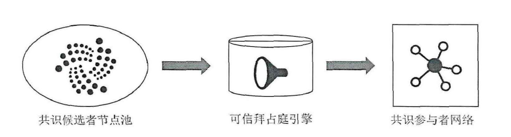

### 一、文章大方向

1. 联盟链系统网络可扩展性优化（网络容量扩容）
2. 性能可扩展性优化（交易吞吐量提升）
3. 系统横向可扩展性优化（一对多大规模跨链交互）

主要贡献：

1. 针对大规模节点接入及现有共识容错率低的问题，面向联盟链系统共识层提出可信拜占庭共识协议并设计节点**混合信誉计算模型**。通过选取混合信誉值高的节点作为共识参与者执行实用拜占庭容错共识协议的方式同时实现**网络容量扩容**和**共识协议容错性提升**。
2. 针对海量交易串行处理导致的交易吞吐量低的问题，面向联盟链系统网络层提出**分层分片协议**。根据联盟链节点身份属性特征将整个联盟链系统划分为**多个联盟链子系统（普通分片）**和一个**由高混合信誉值节点组成的主分片**，通过普**通分片独立并行地执行片内交易共识生成子区块**和**主分片执行最终子区块共识**以提高系统整体交易吞吐量。
3. 跨链协议的改进：1）通过在预言机节点部署和运行智能合约实现大规模跨链交易汇聚与交互；2）设计公平跨链数据交互机制，在两种交互模式下基于智能合约实现根据数据质量的激励与惩罚以促使理性利益相关者遵守协议，并且理论证明该机制的交易激励公平性。

### 二、联盟链的不可能三角

分布式领域CAP原理认为，分布式系统最多只能保证**一致性、可用性、分区容错**三项特性中的两项特性。

由于存在节点平等自治、数据多方维护、链间封闭隔离等特性，联盟链系统面临“不可能三角”问题。去中心化、安全性和可扩展性构成分布式联盟链系统“不可能三角”。

1. 去中心化指的是分布式系统中拥有大量**平等参与**系统操作和维护的联盟链节点，并且**节点数量越多去中心化程度越高**；
2. 安全性指的是维护分布式系统状态一致性所需要花费的成本，可以通过**参与系统状态维护的联盟链节点数量**来衡量，通常**节点数量越多安全性越高**；
3. 可扩展性指的是**网络可扩展性、性能可扩展性和系统横向可扩展性**。对于联盟链系统，**网络可扩展性**特指网络容量，即**允许接入网络的节点数量**；**性能可扩展性通常指交易吞吐量**，即每秒处理交易的数量；**系统横向可扩展性是指跨链交互**，即不同联盟链系统之间信任传递、数据交互和价值流转。

### 三、可扩展性存在的问题

#### 3.1 网络可扩展性优化问题（受限于通信复杂度）

体现在共识层共识协议参与者数量的限制。联盟链系统利用拜占庭容错类共识协议达成分布式网络下的状态一致性。**在共识过程中，网络中会传输大量消息，容易造成网络拥塞**。

以全球主流联盟链平台Fabric为例，该平台共识层使用`PBFT`协议，该协议通过联盟链节点之间多次投票通信来维护联盟链系统状态一致性，通信开销与节点数量呈关系。经测试，在百兆光纤网络下，Fabric网络容量不超过20个节点，难以满足大规模现代服务应用的需求。

#### 3.2 性能可扩展性优化问题

性能可扩展性优化问题体现在**共识层共识协议的限制**和**网络层节点执行共识协议的方式**。

以Fabric联盟链平台为例，该平台通过**全部节点**共同执行共识协议的方式来串行处理与存储交易。经测试，Fabric平台交易吞吐量不超过2000 tps，远小于VISA等现有电子支付系统的交易吞吐量，难以满足高性能现代服务应用的需求。

#### 3.3 系统横向可扩展性优化问题

系统横向可扩展性优化问题体现在**不同联盟链系统底层技术异构性带来的跨链交互困难**，对底层技术的屏蔽与**跨链交互的实现需要在智能合约层完成**。

Fabric联盟链平台和FISCO BCOS联盟链平台为例，两个平台之间相互不信任，而且两个平台的共识协议、加密机制等底层技术不同，因此两个平台难以直接进行跨链交互。

由于强内部安全保障机制和异构的底层技术，联盟链系统之间难以传递信任、交互数据或流转价值，难以满足多协同现代服务应用的需求。因此，对于内部安全且底层技术异构的联盟链系统，其跨链交互困难，系统横向可扩展性问题严重。

### 四、网络可扩展性研究现状分析

基于投票的共识协议可以细分为两类：崩溃容错（Ｃｒａｃｈ  Ｆａｕｌｔ  Ｔｏｌｅｒａｎｃｅ， ＣＦＴ）共识协议和拜占庭容错（Ｂｙｚａｎｔｉｎｅ  Ｆａｕｌｔ  Ｔｏｌｅｒａｎｃｅ，ＢＦＴ）共识协议。

崩溃容错共识协议能够**允许网络中存在一定数量的离线共识参与者**，这些节点可以不广播任何消息，也**不广播错误消息**；

拜占庭容错共识协议能够**允许网络中存在一定数量的拜占庭错误节点**，这些节点可以不广播任何消息，也**可以广播错误消息**，甚至**主动破坏其他节点的消息广播**。

其中`Paxos`和`Raft`是具有代表性的崩溃容错共识协议，`PBFT`、`ZyzzyvaMl`等是具有代表性的是拜占庭容错共识协议。

#### 4.1 混合共识协议

通常将 **基于投票的共识协议** 和 **基于证明的共识协议**相结合，原因如下：

1. 在相同网络环境下，基于证明的共识协议的**通信复杂度**显著低于基于投票的共识协议的，基于证明的共识协议的**网络容量**也显著高于基于投票的共识协议的。
2. 在共识执行过程中，基于证明的共识协议**允许多个获胜者存在，容易产生区块链分叉，状态一致性较弱**，不能满足行业级联盟链系统和多数重点行业应用的**强一致性**需求。
3. 在基于投票的共识协议中，崩溃容错共识协议**假设性过强**，在分布式**去信任**的联盟链系统中可用性难。
4. 拜占庭容错类共识协议具有**较高的通信复杂度**，只能允许**少量节点**接入联盟链系统。

### 五、性能可扩展性研究现状分析

高性能应用场景对区块链系统性能可扩展性也提出了更高的要求，尤其是**区块链交易吞吐量性能**。

限制区块链系统交易吞吐量提升的**本质原因是交易处理方式**，即**交易串行验证和存储**。

提高性能可扩展性有两个大方向：

- 通过**并行处理**区块链交易来提高其吞吐量，如DAG和分片技术。
- 将大量区块链交易**迁移到链下执行**，**只将最终执行结果存储上链**，从而提高其吞吐量。

#### 5.1 链上性能优化方法

链上优化方法通过**改变区块链本身在链上快速处理交易**，**区块扩容方案**、**有向无环图方案**和**区块链分片方案**都是链上优化方法的一种。

- 区块扩容方案

​	区块扩容方案只应用于比特币。经过一系列的探讨和尝试（BIP 100、BIP 101、BIP 102 、BIP 109），研究人员发现比特币区块大小不能无限制地增加，**过大的区块会产生大量分叉，对系统稳定性造成严峻的挑战**。总之，比特币区块大小为４ＭＢ时，交易吞吐量达到最优，其峰值约为 28 TPS.

- 有向无环图方案

​	有向无环图利用图论理论从数据结构上更改了区块链，将原来的链式存储结构改为了图式存储结构。该方案区块生成是并行的，这能够优化区块链系统性能可扩展性。

- 分片方案

1. Ｅｌａｓｔｉｃｏ将ＰｏＷ协议和ＰＢＦＴ协议结合，**利用ＰｏＷ协议来建立区块链分片网络，使各个分片的算力尽可能平均**，然后两次利用ＰＢＦＴ协议来处理交易和存储最终区块。在分片数量较小且区块大小无穷大的假设下，Ｅｌａｓｔｉｃｏ能够几乎线性地提高区块链交易吞吐量。然而，面向无许可链设计且利用**ＰｏＷ协议的Ｅｌａｓｔｉｃｏ存在严重的能源消耗问题**。

2. Ａｓｐｅｎ提出了一种面向服务的分片，适用于具有服务属性的应用场景。Ａｓｐｅｎ 全网节点维护一条区块链，并**为每一种服务构建了一个分片**。每个分片处理一种服务交易，并**通过二次共识机制将各个分片提交的交易再次打包到同一个最终区块**，然后将这个**最终区块存储上链**。Ａｓｐｅｎ**每个分片利用ＰｏＷ协议处理区块链交易**，存在能源消耗问题。
3. ＯｍｎｉＬｅｄｇｅｒ是一种基于分片的区块链架构，包括**一条身份链和多条分片子链**。**身份链由所有分片共同维护，分片子链由某一个分片维护**。对于**分片内交易，各个分片独立并行地处理**；对于**跨分片交易，ＯｍｎｉＬｅｄｇｅｒ利用时间锁来保证交易原子性**。ＯｍｎｉＬｅｄｇｅｒ在ＢｙｚＣｏｉｎ区块链上部署，每个分片都采用ＰＢＦＴ共识协议处理交易，其交易吞吐量随分片数量线性增加。在１６个分片时，ＯｍｎｉＬｅｄｇｅｒ的区块链交易吞吐量最高可达５，８５０ｔｐｓ。
4. Ｒａｐｉｄｃｈａｉｎ系统部署了完全分片协议。Ｒａｐｉｄｃｈａｉｎ系统**随机选举出参考委员会并随机划分区块链节点到每个分片，从而组成分片委员会**。这种**分片划分是周期性进行的**，每个分片划分周期都会执行多次区块链共识。Ｒａｐｉｄｃｈａｉｎ系统中，每个分片都采用ＰＢＦＴ共识协议处理交易。由于**实行完全分片，Ｒａｐｉｄｃｈａｉｎ系统也面临跨分片交易原子性问题**。在１６个分片时，Ｒａｐｉｄｃｈａｉｎ的区块链交易吞吐量最高可达７３００ｔｐｓ
5. Ｍｏｎｏｘｉｄｅ是一种异步共识分片协议，旨在解决算力削弱后的共识安全问题，同时提高区块链交易吞吐量。Ｍｏｎｏｘｉｄｅ**每个分片采用ＰｏＷ共识协议**。在２０４８个分片时，Ｍｏｎｏｘｉｄｅ的区块链交易吞吐量最高可达１１６９４ ｔｐｓ。

#### 5.2 链下优化方法

链下优化方法不改变区块链结构，只是为其附加一些功能从而将区块链交易迁移到链下快速处理。

#### 5.3 混合性能优化方法

​	混合优化方法是两种或多种现有优化方法的混合部署与使用，为充分发挥现有优化方法的优势，解决实际问题。

​	Ａｍｉｒｉ等人提出了一种高性能联盟链模型，利用**分片技术**和**有向无环图**结构来提高区块链交易吞吐量，提高节点资源利用率。该模型**不仅将节点网络进行切片，还将区块数据进行切片**，并利用拜占庭类共识协议完成数据链上存储。

#### 5.4 现有交易吞吐量优化方案总结 

1. 对于链上优化方法，区块扩容方案**只用于比特币公有链**，并且交易吞吐量存在上限；有向无环图方法**交易存储和查询复杂，导致交易验证时间过长（不是强一致性共识）**；分片方案能够随分片数量线性地提升交易吞吐量，**但这些方案都针对公有链提出**，具有较大的算力和时间成本，难以直接移植到联盟链系统中。
2. 对于链下优化方法，链下交易处理结果还需要通过额外的技术手段提供链上智能合约承认的证明，过程复杂且资源开销大，而且对交易类型和链类型具有特殊要求。

**分片方案**是最有希望能够实现高性能而不降低去中心化程度的性能可扩展性优化方法，此论文也选取其代表Ｅｌａｓｔｉｃｏ分片协议进行优化。

### 六、区块链系统横向可扩展性优化研究现状

研究跨链的，暂时不看。

### 七、网络容量可扩展性研究(引入信誉机制降低通信复杂度提高系统容错率)

1. 问题： 大量可能**执行拜占庭行为的去信任节点**接入联盟链系统后导致共识执行成功率低、共识协议可用性差等不利影响。

2. 路线：分析联盟链节点和链上数据，考虑如何设计**有效的、可信的共识参与者筛选模型**，利用筛选后的**可靠节点**执行共识协议以允许大规模节点的接入并确保共识过程的成功执行。
3. 具体做法：提出了一种**混合信誉计算模型**计算联盟链节点的**混合信誉值**，然后**选取信誉值高于信誉阈值的节点作为共识参与者**，并由共识参与者节点最终执行PBFT共识协议完成对联盟链交易的一致性验证和共识。**为降低联盟链节点计算混合信誉值的成本，设计了历史周期加权的调节公式**；进一步设计了可动态调整的信誉阈值，确保每次选取出来的公式**参与者节点数量适当且稳定**.
4. 值得一提的是：在本论文中，降低系统通信复杂度的方法不是直接降低O(N^2)，而是降低参与共识的节点数量。**只允许部分节点执行共识协议，从而避免所有节点执行带来的高通信复杂度和网络拥塞问题。**
5. 系统模型如下：包括共识候选者节点池、可信拜占庭引擎、共识参与者网络。其中**可信拜占庭引擎**是系统模型的核心，负责共识候选者节点混合信誉值的计算和存储，以及共识参与者的选取。

​	在这个模型中，联盟链节点主要分为两类：**普通联盟链节点**和**共识候选者节点**。其中，**共识候选者节点存储整条联盟链信息**，这些节点有能力验证新生成的交易；**普通联盟链节点**不需要存储整条联盟链信息，**只存储用于验证相关交易的区块头**。（像公链一样，分成全节点和轻节点）

​	**共识参与者**是**共识候选者节点**经过可信拜占庭引擎选取后得到的，其本身也是存储了整条链信息的联盟链节点。

​	为了支持节点混合信誉值计算和选取，该系统模型中**共识候选者节点必须具有更强大的计算和存储能力（个人觉得这一点不是特别好，人为的提高了联盟链的使用门槛）**。

6. 拜占庭系统中节点的角色划分：威胁模型根据BAR模型将共识候选者节点划分为**理性共识候选者节点**、**拜占庭共识候选者节点**和**无私共识候选者节点**三类。
   1. 理性共识候选者节点总会执行增加自己利益的行为，无论这个行为是否符合协议规定；
   2. 拜占庭共识候选者节点执行任意恶意行为，无论这个行为使自己获得更多的利益或失去利益
   3. 无私共识候选者节点总是忠诚地执行协议规定，无论这种忠诚行为是否会让自己获得更多的利益。

7. 在节点混合信誉计算过程中，不考虑**共识候选者节点的共谋攻击**？这个假设在许多文献中己经被广泛讨论，并己经提出了一些解决方案［１２８，１２９］。
8. 节点混合信誉值和临时信誉值定义如下：
   1. 混合信誉值：混合信誉指的是由**多个因素**以及**历史记录**计算得出的节点信誉数值，计算因子主要包括当前周期的临时信誉值和上一个周期的混合信誉值。混合信誉值被用作共识参与者节点选取的依据。
   2. 临时信誉值：临时信誉值指的是在当前周期中输入的多个因素（例如节点身份量化值和交易评价值）计算出的数值，**需要与历史混合信誉值一起计算得到上述混合信誉值**。临时信誉值是一个中间结果，用于计算最终的混合信誉值。

9. 共识协议分为三阶段执行，分别是：共识候选者节点混合信誉值计算、共识参与者节点选取和联盟链交易一致性验证达成。**每生成T个区块完成一周期。**
10. 每个共识候选者节点计算出的混合信誉值和**系统信誉阈值**的**动态调整是相关的**，因此可以保证：**每个周期将会选取出数量相近的节点作为共识参与者。**
11. 完成一次共识的流程如下：
    1. 在共识参与者节点选取之后，联盟链可信拜占庭共识协议执行Ｔ次`PBFT`协议，因此一共可以生成`T`个区块；
    2. 主节点的选取机制：在生成第１个区块期间，信誉值最高的共识参与者节点将被选为主节点，而在生成剩余的Ｔ－１个区块期间，**主节点由上一个主节点从其他共识参与者节点中随机指定**。（**类似于Raft的轮流机制**，但是**引入了"继承"的思想**，这样做可能会导致出现一种极端：过程中某一个恶意节点继承到了，那么之后那必然全是坏的，跟皇位继承类似啊。）
    3. 共识通信流程：标准的PBFT流程，四个阶段：`pre-prepare`,`prepare`,`commit`,`reply`

12. 混合信誉计算模型：
13. 共识参与者节点数量阈值设计：
14. 容错率的提高：

### 八、交易可扩展性的研究（分片机制，双层共识结果）

1. 存在问题：以Ｅｌａｓｔｉｃｏ分片协议为例，该协议分片划分是通过解Pow困难问题实现的，**需要高时间和算力成本**，而且**分片划分并没有考虑联盟链系统中组织机构与节点之间的关联关系**以及**片间数据交互与组织机构之间的关联关系**。

2. 设计思路：将整体联盟链网络和节点划分为多个联盟链子网络（普通分片）和一个联盟链主分片。在联盟链分层分片网络中，该协议**执行二次共识机制**，即首先**普通分片对交易执行片内共识生成子区块**，然后**主分片对子区块执行最终共识生成最终区块并存储上链**。普通分片通过独立并行地处理和共识联盟链交易来提高吞吐量，同时主分片的最终共识能够避免跨分片交易冲突和原子性问题。**设计基于智能合约的策略协商与访问控制方法，利用访问令牌实现链上数据可控性（？这是什么）**。

3. 优势：与经典的Ｅｌａｓｔｉｃｏ分片协议相比，联盟链分层分片协议在具有相似的吞吐量优化效果下，能够显著减少分片建立时间和算力成本。
4. 交易原子性的实现：联盟链分片方案需要考虑交易原子性问题，**这一问题主要存在于跨分片子链的交易**。部署分层分片协议的联盟链**系统维护且只维护一条联盟链**，所有交易都存储在这一条链上，**避免了跨分片子链的交易原子性问题**。**为实现上述单链存储模式，构建分层分片结构并设计二次共识机制**，通过分别在普通分片和主分片两层结构执行共识协议以**确保每个周期只产生一个记录在链上的最终区块，避免交易原子性问题。**
5. 系统模型：
   1. 多个普通分片、一个主分片和一条联盟链。
   2. 联盟链节点加入该系统模型时，需要**提交注册信息**，并被**分配到某一特定的物联网域中**。其中，**负责注册的中心机构并不参与联盟链交易处理**，只负责验证注册信息和分发唯一标识节点身份的公私钥对以及与之对应的身份证书。
   3. 普通分片：**每个普通分片由一个物联网域和一个联盟链节点委员会（也就是上层主分片中的一个共识节点）组成**。委员会由联盟链节点连接组成，负责处理物联网域提交的交易。如果一个普通分片中联盟链节点数量过多，那么采用第二章提出的方式选举当前周期混合信誉值高的节点参与交易处理和共识。**每个普通分片独立并行地处理联盟链交易，包括交易验证、交易片内共识、子区块生成、子区块流转等。普通分片处理联盟链交易后，将打包生成的子区块转发给主分片联盟链节点进行最终共识和链上存储。**
   4. 主分片：**主分片联盟链节点从各个普通分片选取**，采用第二章提出的方式**选举各个普通分片当前周期混合信誉值最高的一个或多个节点，并且定期重选**。主分片负责**处理普通分片提交的子区块，完成最终共识，并将子区块中交易重新打包生成能够链上存储的最终区块。**
   5. 联盟链：联盟链分层分片网络维护且只维护一条联盟链。联盟链负责存储主分片生成的最终区块，即**各个普通分片生成的交易通过二次共识机制处理后都记录在同一条联盟链上。**
6. 分层分片协议设计：
   1. 分片形成：普通分片和主分片都周期性更新，系统每生成Ｔ个最终区块，分片更新一次。
      - 在分片更新过程中，**根据物联网域属性划分（这里说的很模糊，不如说是根据合约进行划分）**，己注册的联盟链节点相互连接，根据节点与分片之间的关联关系自动组成普通分片委员会。
      - **己注册**的联盟链节点**可以随时**退出分片子网，**新注册**的联盟链节点**只能在下个周期分片形成过程中**加入分片子网。
      - 如果联盟链节点想要**更换分片**，该节点首**先退出原分片子网**，然后**向注册中心机构提交分片迁移请求**，被批准后在**下个周期分片**形成过程中加入新的分片子网。
      - **主分片联盟链节点**根据协议从当前**各个分片**中具有高混合信誉值的参与者节点中选取，选取数量不超过２０个。**主分片节点被设置成为普通分片锚节点**，普通分片锚节点能够相互通信。
   2. 片内共识：
      - 在片内共识阶段，各个普通分片独立并行地处理联盟链交易，互不干扰。
      - 参与者节点从大量联盟链节点中选举混合信誉值高的１０~１６个节点作为共识协议参与者。
      - **参与者节点选举周期**与**分片形成周期**相同，即每次分片更新后才选举新的参与者节点。
      - 只有当超过２／３参与者节点崩溃时，系统才会临时增加参与者选举轮次。
      - 在**第一周期**，系统根据**节点注册身份重要性量化出的信誉值**选举参与者节点。
   3. 最终共识：
      - 子区块生成后，主分片联盟链节点对收到的子区块执行第二次共识，生成能够被存储在联盟链上的最终区块。
      - 主分片联盟链节点执行`PBFT`共识协议，执行子区块验证与解析、交易重新打包和最终区块生成操作。
      - 不同分片产生的交易经过最终共识统一混合存储在一条联盟链。
      - 最终区块**首先在主分片联盟链节点之间同步**，再由**各个普通分片锚节点同步到其所在的普通分片联盟链节点**。
7. 跨分片数据交互及访问控制（其实就是一个智能合约，一个基于此系统的demo）

​	联盟链分层分片协议补充了**通过调用智能合约**实现**跨分片数据交互及访问控制**的方法。合约需要包括七个主要步骤。

1） 数据预请求生成：简单而言，就是数据(交易)的请求方需要实现向合约申请一个令牌，该令牌有使用时长限制，请求方后续可以使用该令牌向目标节点请求数据或进行交易。

2）访问令牌生成：在智能合约中生成一个令牌，并被转发给数据请求者。访问令牌涉及数据交互双方，其中源地址表示数据请求者的地址，目的地址表示数据所有者的地址，数据字段表示数据所有者生成的访问令牌信息，时间字段表示该访问令牌有效时间（单位：秒）

3）数据预请求和访问令牌存储上链：智能合约**以交易的形式将缓存的数据预请求和访问令牌存储在联盟链上**。链上存储后，**访问令牌将被所有分片同步和维护**，确保其分布式可控制。

4）数据请求生成：使用令牌向目标节点正式请求数据。**无论数据请求涉及单个分片内部还是不同分片之间，数据请求者只需要将请求提交给片内委员会处理即可。**

5）访问令牌验证：收到数据请求交易后，智能合约验证交易的合法性，包括验证数据请求者签名的正确性和访问令牌的有效性。当且仅当签名和令牌都合法时，数据请求才会被执行，否则将删除该请求。**如果数据请求涉及两个不同的普通分片，交易验证至少需要这两个分片共同执行。**

6）交易查询和获取：数据请求交易验证后，所需数据在联盟链上被查询和获取。

7）数据回复：最终，智能合约转发获取的数据给数据请求者，数据交互结束。

总结：基于智能合约的跨分片访问控制方法的**核心是访问令牌**。**数据所有者通过访问令牌来自主地控制自己数据的使用和流转**，**数据请求者通过访问令牌来访问链上存储的数据**。在访问令牌失效前，数据交换过程只需要重复上述步骤４至步骤７。